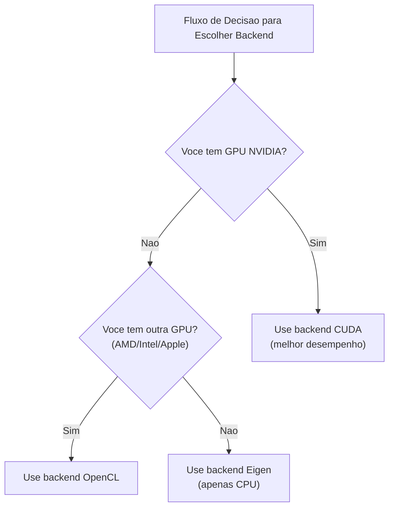

# Instalacao e Configuracao do KataGo

Este artigo apresentara detalhadamente como instalar KataGo em varias plataformas, incluindo requisitos de sistema, passos de instalacao, selecao de modelos e explicacao de arquivos de configuracao.

## Requisitos do Sistema

### Requisitos de Hardware

#### GPU (Recomendado)

| Tipo de GPU | Status de Suporte | Backend Sugerido |
|---------|---------|---------|
| NVIDIA (CUDA) | Melhor suporte | CUDA |
| NVIDIA (sem CUDA) | Bom suporte | OpenCL |
| AMD | Bom suporte | OpenCL |
| Intel integrada | Suporte basico | OpenCL |
| Apple Silicon | Bom suporte | Metal / OpenCL |

#### Modo CPU

Se nao tiver GPU adequada, pode usar backend Eigen apenas com CPU:
- Desempenho mais baixo (~10-30 playouts/seg)
- Adequado para aprendizado, teste e uso de baixa intensidade
- Requer suporte a instrucoes AVX2 (maioria das CPUs modernas suportam)

### Requisitos de Software

| Sistema Operacional | Requisito de Versao |
|---------|---------|
| **Linux** | Ubuntu 18.04+, CentOS 7+ ou outras distros modernas |
| **macOS** | 10.14+ (Mojave ou mais recente) |
| **Windows** | Windows 10 ou mais recente |

### Guia de Escolha de Backend



## Instalacao macOS

### Metodo 1: Homebrew (Recomendado)

Forma de instalacao mais simples, trata automaticamente todas as dependencias.

```bash
# Instalar KataGo
brew install katago

# Confirmar instalacao bem-sucedida
katago version
```

A versao Homebrew usa backend OpenCL por padrao, roda em Intel Mac e Apple Silicon.

### Metodo 2: Compilar do Codigo-fonte

Adequado para usuarios que precisam de opcoes personalizadas ou funcionalidades mais recentes.

#### Instalar Dependencias

```bash
# Instalar CMake e ferramentas de compilacao
brew install cmake

# Se usar OpenCL
# macOS tem suporte OpenCL integrado, nao precisa instalacao adicional
```

#### Passos de Compilacao

```bash
# Clonar codigo-fonte
git clone https://github.com/lightvector/KataGo.git
cd KataGo/cpp

# Criar diretorio de compilacao
mkdir build && cd build

# Configurar opcoes de compilacao (backend OpenCL)
cmake .. -DUSE_BACKEND=OPENCL

# Compilar
make -j$(sysctl -n hw.ncpu)

# Apos compilacao, executavel esta em build/katago
./katago version
```

#### Nota Especial para Apple Silicon

Em Mac M1/M2/M3, recomenda-se usar backend OpenCL ou Metal:

```bash
# Backend OpenCL (recomendado, melhor compatibilidade)
cmake .. -DUSE_BACKEND=OPENCL

# Backend Metal (experimental, pode ter melhor desempenho)
cmake .. -DUSE_BACKEND=METAL
```

## Instalacao Linux

### Metodo 1: Versao Pre-compilada (Recomendado)

Baixe versao pre-compilada dos GitHub Releases:

```bash
# Baixar versao OpenCL (adequada para maioria das situacoes)
wget https://github.com/lightvector/KataGo/releases/download/v1.15.3/katago-v1.15.3-opencl-linux-x64.zip

# Ou baixar versao CUDA (GPU NVIDIA)
wget https://github.com/lightvector/KataGo/releases/download/v1.15.3/katago-v1.15.3-cuda11.1-linux-x64.zip

# Descompactar
unzip katago-v1.15.3-*.zip

# Dar permissao de execucao
chmod +x katago

# Confirmar instalacao
./katago version
```

### Metodo 2: Compilar do Codigo-fonte

#### Backend CUDA (GPU NVIDIA)

```bash
# Instalar dependencias
sudo apt update
sudo apt install cmake g++ libzip-dev

# Instalar CUDA (se ainda nao instalado)
# Consulte guia oficial NVIDIA: https://developer.nvidia.com/cuda-downloads

# Clonar e compilar
git clone https://github.com/lightvector/KataGo.git
cd KataGo/cpp
mkdir build && cd build

# Configurar backend CUDA
cmake .. -DUSE_BACKEND=CUDA

# Compilar
make -j$(nproc)
```

#### Backend OpenCL (GPU Universal)

```bash
# Instalar dependencias
sudo apt update
sudo apt install cmake g++ libzip-dev ocl-icd-opencl-dev

# Instalar driver OpenCL
# NVIDIA: vem com instalacao CUDA
# AMD: sudo apt install mesa-opencl-icd
# Intel: sudo apt install intel-opencl-icd

# Clonar e compilar
git clone https://github.com/lightvector/KataGo.git
cd KataGo/cpp
mkdir build && cd build

cmake .. -DUSE_BACKEND=OPENCL
make -j$(nproc)
```

#### Backend Eigen (Apenas CPU)

```bash
# Instalar dependencias
sudo apt update
sudo apt install cmake g++ libzip-dev libeigen3-dev

# Clonar e compilar
git clone https://github.com/lightvector/KataGo.git
cd KataGo/cpp
mkdir build && cd build

cmake .. -DUSE_BACKEND=EIGEN
make -j$(nproc)
```

## Instalacao Windows

### Metodo 1: Versao Pre-compilada (Recomendado)

1. Va para [KataGo Releases](https://github.com/lightvector/KataGo/releases)
2. Baixe a versao adequada:
   - `katago-v1.15.3-cuda11.1-windows-x64.zip` (GPU NVIDIA + CUDA)
   - `katago-v1.15.3-opencl-windows-x64.zip` (Outras GPUs)
   - `katago-v1.15.3-eigen-windows-x64.zip` (Apenas CPU)
3. Descompacte no diretorio desejado
4. Teste no prompt de comando:

```cmd
cd C:\path\to\katago
katago.exe version
```

### Metodo 2: Compilar do Codigo-fonte

#### Preparar Ambiente

1. Instale [Visual Studio 2019/2022](https://visualstudio.microsoft.com/) (com ferramentas C++)
2. Instale [CMake](https://cmake.org/download/)
3. Se usar CUDA, instale [CUDA Toolkit](https://developer.nvidia.com/cuda-toolkit)

#### Passos de Compilacao

```cmd
# Execute no Developer Command Prompt

git clone https://github.com/lightvector/KataGo.git
cd KataGo\cpp
mkdir build
cd build

# Backend CUDA
cmake .. -G "Visual Studio 17 2022" -A x64 -DUSE_BACKEND=CUDA

# Ou backend OpenCL
cmake .. -G "Visual Studio 17 2022" -A x64 -DUSE_BACKEND=OPENCL

# Compilar
cmake --build . --config Release
```

## Download e Selecao de Modelos

KataGo precisa de arquivos de modelo de rede neural para rodar. A fonte oficial fornece modelos de varios tamanhos.

### Local de Download

Pagina oficial de download de modelos: https://katagotraining.org/

Ou baixe diretamente do servidor de treinamento:

```bash
# Modelo menor (adequado para teste e hardware fraco)
curl -L -o kata-b18c384.bin.gz \
  "https://media.katagotraining.org/uploaded/networks/models/kata1/kata1-b18c384nbt-s9996604416-d4316597426.bin.gz"

# Modelo medio (recomendado, equilibra desempenho e velocidade)
curl -L -o kata-b40c256.bin.gz \
  "https://media.katagotraining.org/uploaded/networks/models/kata1/kata1-b40c256-s11840935168-d2898845681.bin.gz"

# Modelo grande (forca mais alta, requer GPU potente)
curl -L -o kata-b60c320.bin.gz \
  "https://media.katagotraining.org/uploaded/networks/models/kata1/kata1-b60c320-s11318001920-d2792783831.bin.gz"
```

### Comparacao de Modelos

| Modelo | Tamanho da Rede | Tamanho do Arquivo | Forca | Cenario de Uso |
|------|---------|---------|------|---------|
| b10c128 | 10 blocos, 128 canais | ~20 MB | Amador alto dan | CPU, GPU fraca, teste rapido |
| b18c384 | 18 blocos, 384 canais | ~140 MB | Nivel profissional | GPU comum, analise diaria |
| b40c256 | 40 blocos, 256 canais | ~250 MB | Nivel super-humano | GPU intermediaria-alta, analise profunda |
| b60c320 | 60 blocos, 320 canais | ~500 MB | Topo super-humano | GPU topo, analise premium |

### Sugestoes de Escolha

```
Qual e sua GPU?
├─ RTX 3080/4080/4090 → b60c320 ou b40c256
├─ RTX 3060/3070 → b40c256 ou b18c384
├─ GTX 1660/2060 → b18c384
├─ GPU basica → b18c384 ou b10c128
└─ Apenas CPU → b10c128
```

## Explicacao do Arquivo de Configuracao Basico

KataGo usa arquivos de configuracao no formato `.cfg`. Exemplos de arquivos de configuracao oficiais estao no diretorio `cpp/configs/`.

### Arquivos de Configuracao Importantes

| Arquivo | Uso |
|------|------|
| `gtp_example.cfg` | Exemplo de configuracao para modo GTP |
| `analysis_example.cfg` | Exemplo de configuracao para Analysis Engine |
| `default_gtp.cfg` | Configuracao padrao para modo GTP |

### Itens de Configuracao Principais

```ini
# =============
# Configuracao de Rede Neural
# =============

# Caminho do arquivo de modelo de rede neural
# Pode usar caminho relativo ou absoluto
# model = /path/to/model.bin.gz

# =============
# Configuracao de Busca
# =============

# Numero maximo de visitas de busca por jogada
# Aumentar este valor melhora forca mas reduz velocidade
maxVisits = 500

# Tempo maximo de pensamento por jogada (segundos)
# 0 significa ilimitado (controlado por maxVisits)
maxTime = 0

# Numero de threads por movimento
numSearchThreads = 6

# =============
# Configuracao de Regras
# =============

# Regras de Go
# chinese = Regras chinesas
# japanese = Regras japonesas
# korean = Regras coreanas
# tromp-taylor = Regras Tromp-Taylor
# aga = Regras AGA
rules = chinese

# Komi
komi = 7.5

# =============
# Configuracao de GPU
# =============

# Numero da GPU a usar (comeca de 0)
# Para multiplas GPUs, separe por virgulas: 0,1,2
# -1 significa selecao automatica
nnDeviceIdxs = 0

# Tamanho do batch por thread de GPU
# Batch maior pode melhorar utilizacao de GPU
numNNServerThreadsPerModel = 1

# =============
# Configuracao Avancada
# =============

# Constante de exploracao MCTS
# Valor maior aumenta exploracao, menor aumenta exploitacao
cpuctExploration = 1.0

# Ruido Dirichlet no no raiz
# Usado para aumentar diversidade de exploracao
rootNoiseEnabled = true
rootDirichletNoisePruneFactor = 0.25
```

### Exemplo de Configuracao para Modo GTP

Crie `my_gtp_config.cfg`:

```ini
# Caminho do modelo
# model geralmente especificado na linha de comando, pode omitir aqui

# Configuracao de busca
maxVisits = 1000
numSearchThreads = 4

# Regras
rules = chinese
komi = 7.5

# Configuracao de GPU
nnDeviceIdxs = 0

# Log
logDir = ./logs
logToStderr = false
```

### Exemplo de Configuracao para Analysis Engine

Crie `my_analysis_config.cfg`:

```ini
# Configuracao de busca
maxVisits = 500
numSearchThreads = 8

# Configuracao de relatorio
# Numero maximo de variacoes por relatorio de analise
maxMoves = 10

# Regras (pode ser sobrescrito na chamada API)
rules = chinese
komi = 7.5

# Configuracao de GPU
nnDeviceIdxs = 0
numNNServerThreadsPerModel = 2

# Funcionalidade de analise
reportAnalysisWinratesAs = BLACK

# Mapa de ownership
# Quando habilitado, pode obter predicao de pertencimento de cada ponto
analysisOwnership = true
```

## Primeira Execucao

### Testar Modo GTP

```bash
# Executar modo GTP
katago gtp -model /path/to/model.bin.gz -config /path/to/config.cfg

# Se nao tiver config, KataGo usara valores padrao
katago gtp -model /path/to/model.bin.gz
```

Apos iniciar com sucesso, insira comandos GTP para testar:

```
name
= KataGo

version
= 1.15.3

boardsize 19
=

genmove black
= Q16

quit
=
```

### Testar Analysis Engine

```bash
# Executar Analysis Engine
katago analysis -model /path/to/model.bin.gz -config /path/to/config.cfg
```

Insira consulta JSON:

```json
{"id":"test1","initialStones":[],"moves":[],"rules":"chinese","komi":7.5,"boardXSize":19,"boardYSize":19,"analyzeTurns":[0]}
```

### Teste de Benchmark

Teste desempenho do seu hardware:

```bash
# Executar benchmark
katago benchmark -model /path/to/model.bin.gz

# Especificar arquivo de configuracao
katago benchmark -model /path/to/model.bin.gz -config /path/to/config.cfg
```

Benchmark mostrara:
- Visitas de busca por segundo (visits/seg)
- Velocidade de inferencia da rede neural
- Configuracao de threads sugerida

## Resolucao de Problemas Comuns

### Relacionados a GPU

**Problema: GPU nao encontrada**

```bash
# Verificar dispositivos OpenCL
clinfo

# Ou listar dispositivos que KataGo ve
katago gpuinfo
```

**Problema: Falha na inicializacao CUDA**

- Confirme que versao CUDA corresponde a versao de compilacao do KataGo
- Atualize drivers de GPU
- Verifique variavel de ambiente CUDA_PATH

### Relacionados a Memoria

**Problema: Memoria insuficiente**

```ini
# Reduzir uso de memoria GPU
nnMaxBatchSize = 8  # Padrao pode ser 16 ou maior
nnCacheSizePowerOfTwo = 20  # Reduzir tamanho de cache
```

### Relacionados a Desempenho

**Problema: Muito lento**

1. Confirme que esta usando GPU em vez de CPU
2. Reduza `numSearchThreads`
3. Use modelo menor
4. Verifique se outros programas estao ocupando GPU

## Proximos Passos

Apos completar a configuracao, continue lendo:
- [Comandos Comuns](./commands.md) - Aprenda como usar KataGo
- [Arquitetura do Codigo-fonte](./architecture.md) - Entenda implementacao interna

