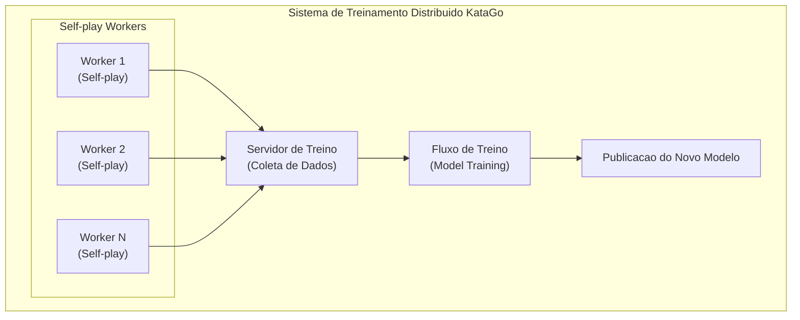

# Arquitetura de Treinamento Distribuído

Este artigo apresenta a arquitetura do sistema de treinamento distribuído do KataGo, explicando como melhorar continuamente os modelos através do poder computacional da comunidade global.

---

## Visão Geral da Arquitetura do Sistema



---

## Self-play Worker

### Fluxo de Trabalho

Cada Worker executa o seguinte ciclo:

```python
def self_play_worker():
    while True:
        # 1. Baixar modelo mais recente
        model = download_latest_model()

        # 2. Executar auto-jogo
        games = []
        for _ in range(batch_size):
            game = play_game(model)
            games.append(game)

        # 3. Enviar dados das partidas
        upload_games(games)

        # 4. Verificar novo modelo
        if new_model_available():
            model = download_latest_model()
```

### Geração de Partidas

```python
def play_game(model):
    """Executa uma partida de auto-jogo"""
    game = Game()
    positions = []

    while not game.is_terminal():
        # Busca MCTS
        mcts = MCTS(model, num_simulations=800)
        policy = mcts.get_policy(game.state)

        # Adicionar ruído de Dirichlet (aumenta exploração)
        if game.move_count < 30:
            policy = add_dirichlet_noise(policy)

        # Selecionar ação conforme policy
        if game.move_count < 30:
            # Primeiras 30 jogadas usam amostragem com temperatura
            action = sample_with_temperature(policy, temp=1.0)
        else:
            # Depois seleciona de forma gulosa
            action = np.argmax(policy)

        # Registrar dados de treinamento
        positions.append({
            'state': game.state.copy(),
            'policy': policy,
            'player': game.current_player
        })

        game.play(action)

    # Marcar vitória/derrota
    winner = game.get_winner()
    for pos in positions:
        pos['value'] = 1.0 if pos['player'] == winner else -1.0

    return positions
```

### Formato dos Dados

```json
{
  "version": 1,
  "rules": "chinese",
  "komi": 7.5,
  "board_size": 19,
  "positions": [
    {
      "move_number": 0,
      "board": "...",
      "policy": [0.01, 0.02, ...],
      "value": 1.0,
      "score": 2.5
    }
  ]
}
```

---

## Servidor de Coleta de Dados

### Funcionalidades

1. **Receber dados de partidas**: Coleta partidas dos Workers
2. **Validação de dados**: Verifica formato, filtra anomalias
3. **Armazenamento de dados**: Escreve no conjunto de dados de treinamento
4. **Monitoramento de estatísticas**: Acompanha quantidade de partidas, status dos Workers

### Validação de Dados

```python
def validate_game(game_data):
    """Valida dados da partida"""
    checks = [
        len(game_data['positions']) > 10,  # Mínimo de jogadas
        len(game_data['positions']) < 500,  # Máximo de jogadas
        all(is_valid_policy(p['policy']) for p in game_data['positions']),
        game_data['rules'] in SUPPORTED_RULES,
    ]
    return all(checks)
```

### Estrutura de Armazenamento de Dados

```
training_data/
├── run_001/
│   ├── games_00001.npz
│   ├── games_00002.npz
│   └── ...
├── run_002/
│   └── ...
└── current/
    └── latest_games.npz
```

---

## Fluxo de Treinamento

### Loop de Treinamento

```python
def training_loop():
    model = load_model()
    optimizer = Adam(model.parameters(), lr=1e-4)

    for epoch in range(num_epochs):
        # Carregar dados de partidas mais recentes
        dataset = load_recent_games(num_games=100000)
        dataloader = DataLoader(dataset, batch_size=256, shuffle=True)

        for batch in dataloader:
            states = batch['states']
            target_policies = batch['policies']
            target_values = batch['values']

            # Forward pass
            pred_policies, pred_values = model(states)

            # Calcular perda
            policy_loss = cross_entropy(pred_policies, target_policies)
            value_loss = mse_loss(pred_values, target_values)
            loss = policy_loss + value_loss

            # Backward pass
            optimizer.zero_grad()
            loss.backward()
            optimizer.step()

        # Avaliação periódica
        if epoch % 100 == 0:
            evaluate_model(model)
```

### Funções de Perda

O KataGo usa múltiplos termos de perda:

```python
def compute_loss(predictions, targets):
    # Perda de Policy (entropia cruzada)
    policy_loss = F.cross_entropy(
        predictions['policy'],
        targets['policy']
    )

    # Perda de Value (MSE)
    value_loss = F.mse_loss(
        predictions['value'],
        targets['value']
    )

    # Perda de Score (MSE)
    score_loss = F.mse_loss(
        predictions['score'],
        targets['score']
    )

    # Perda de Ownership (MSE)
    ownership_loss = F.mse_loss(
        predictions['ownership'],
        targets['ownership']
    )

    # Soma ponderada
    total_loss = (
        1.0 * policy_loss +
        1.0 * value_loss +
        0.5 * score_loss +
        0.5 * ownership_loss
    )

    return total_loss
```

---

## Avaliação e Publicação de Modelos

### Avaliação Elo

Novos modelos precisam jogar contra modelos antigos para avaliar a força:

```python
def evaluate_new_model(new_model, baseline_model, num_games=400):
    """Avalia o Elo do novo modelo"""
    wins = 0
    losses = 0
    draws = 0

    for _ in range(num_games // 2):
        # Novo modelo joga de Preto
        result = play_game(new_model, baseline_model)
        if result == 'black_wins':
            wins += 1
        elif result == 'white_wins':
            losses += 1
        else:
            draws += 1

        # Novo modelo joga de Branco
        result = play_game(baseline_model, new_model)
        if result == 'white_wins':
            wins += 1
        elif result == 'black_wins':
            losses += 1
        else:
            draws += 1

    # Calcular diferença de Elo
    win_rate = (wins + 0.5 * draws) / num_games
    elo_diff = 400 * math.log10(win_rate / (1 - win_rate))

    return elo_diff
```

### Condições de Publicação

```python
def should_release_model(new_model, current_best):
    """Decide se publica o novo modelo"""
    elo_diff = evaluate_new_model(new_model, current_best)

    # Condição: Aumento de Elo acima do limite
    if elo_diff > 20:
        return True

    # Ou: Atingiu certo número de passos de treinamento
    if training_steps % 10000 == 0:
        return True

    return False
```

### Convenção de Nomes de Versão de Modelos

```
kata1-b18c384nbt-s{steps}-d{data}.bin.gz

Exemplo:
kata1-b18c384nbt-s9996604416-d4316597426.bin.gz
├── kata1: Série de treinamento
├── b18c384nbt: Arquitetura (18 blocos residuais, 384 canais)
├── s9996604416: Passos de treinamento
└── d4316597426: Quantidade de dados de treinamento
```

---

## Guia de Participação no KataGo Training

### Requisitos do Sistema

| Item | Requisito Mínimo | Requisito Recomendado |
|------|-----------------|----------------------|
| GPU | GTX 1060 | RTX 3060+ |
| VRAM | 4 GB | 8 GB+ |
| Rede | 10 Mbps | 50 Mbps+ |
| Tempo de execução | Contínuo | 24/7 |

### Instalar Worker

```bash
# Baixar Worker
wget https://katagotraining.org/download/worker

# Configurar
./katago contribute -config contribute.cfg

# Iniciar contribuição
./katago contribute
```

### Arquivo de Configuração

```ini
# contribute.cfg

# Configuração do servidor
serverUrl = https://katagotraining.org/

# Nome de usuário (para estatísticas)
username = your_username

# Configuração da GPU
numNNServerThreadsPerModel = 1
nnMaxBatchSize = 16

# Configuração de partidas
gamesPerBatch = 25
```

### Monitorar Contribuição

```bash
# Ver estatísticas
https://katagotraining.org/contributions/

# Log local
tail -f katago_contribute.log
```

---

## Estatísticas de Treinamento

### Marcos de Treinamento do KataGo

| Data | Partidas | Elo |
|------|----------|-----|
| 2019.06 | 10M | Inicial |
| 2020.01 | 100M | +500 |
| 2021.01 | 500M | +800 |
| 2022.01 | 1B | +1000 |
| 2024.01 | 5B+ | +1200 |

### Contribuidores da Comunidade

- Centenas de contribuidores globais
- Milhares de GPU-anos de poder computacional acumulado
- Execução contínua 24/7

---

## Tópicos Avançados

### Curriculum Learning

Aumentar gradualmente a dificuldade do treinamento:

```python
def get_training_config(training_step):
    if training_step < 100000:
        return {'board_size': 9, 'visits': 200}
    elif training_step < 500000:
        return {'board_size': 13, 'visits': 400}
    else:
        return {'board_size': 19, 'visits': 800}
```

### Data Augmentation

Aproveitando a simetria do tabuleiro para aumentar dados:

```python
def augment_position(state, policy):
    """8 transformações de simetria"""
    augmented = []

    for rotation in [0, 90, 180, 270]:
        for flip in [False, True]:
            aug_state = transform(state, rotation, flip)
            aug_policy = transform_policy(policy, rotation, flip)
            augmented.append((aug_state, aug_policy))

    return augmented
```

---

## Leitura Adicional

- [Análise do Mecanismo de Treinamento do KataGo](../training) — Detalhes do fluxo de treinamento
- [Participando da Comunidade Open Source](../contributing) — Como contribuir com código
- [Avaliação e Benchmarks](../evaluation) — Métodos de avaliação de modelos
