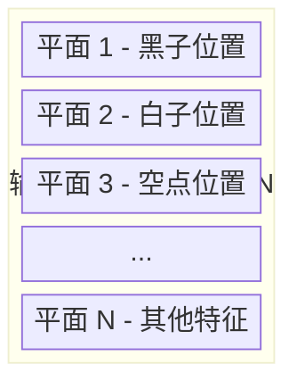

# 输入特征设计

神经网络只能处理数字。要让它理解围棋，我们需要一种方法把棋盘「翻译」成数字。

这个翻译过程，就是**输入特征设计**。

AlphaGo 使用了 48 个特征平面，AlphaGo Zero 简化为 17 个，KataGo 则优化为 22 个。这篇文章将详细解析这些设计选择背后的考量。

---

## 什么是特征平面？

### 基本概念

一个**特征平面**是一个 19×19 的矩阵，每个元素代表棋盘上对应位置的某种属性。

例如，「黑子位置」这个特征平面：

```
棋盘状态：               特征平面（黑子）：
  A B C D E               A B C D E
1 . . . . .            1  0 0 0 0 0
2 . ● . . .            2  0 1 0 0 0
3 . . ○ . .    →       3  0 0 0 0 0
4 . . . ● .            4  0 0 0 1 0
5 . . . . .            5  0 0 0 0 0
```

- 有黑子的位置 = 1
- 没有黑子的位置 = 0

### 多个特征平面

神经网络需要多种信息，所以我们堆叠多个特征平面：



每个平面的尺寸为 19x19。

这类似于彩色图片有 R、G、B 三个通道。围棋「图片」有 N 个通道。

---

## AlphaGo 的 48 个特征平面

### 完整列表

AlphaGo 使用 48 个特征平面，分为几大类：

#### 1. 棋子位置（3 个平面）

| 平面 | 名称 | 说明 |
|------|------|------|
| 1 | 黑子 | 有黑子 = 1，否则 = 0 |
| 2 | 白子 | 有白子 = 1，否则 = 0 |
| 3 | 空点 | 空点 = 1，否则 = 0 |

#### 2. 历史记录（16 个平面）

| 平面 | 名称 | 说明 |
|------|------|------|
| 4-11 | 黑子历史 | 黑子在 1-8 手前的位置 |
| 12-19 | 白子历史 | 白子在 1-8 手前的位置 |

为什么需要历史？
- **劫争判断**：需要知道是否可以立即提回
- **走棋意图**：最近几手棋透露了双方的计划
- **时序信息**：CNN 本身不处理时间，历史平面补足这一点

#### 3. 气数特征（8 个平面）

| 平面 | 名称 | 说明 |
|------|------|------|
| 20-23 | 1-4 气（我方） | 我方棋串有 1/2/3/4 气 = 1 |
| 24-27 | 1-4 气（对方） | 对方棋串有 1/2/3/4 气 = 1 |

气数是围棋中最重要的战术概念：
- **1 气**：被叫吃，即将被提走
- **2 气**：危险状态
- **3 气**：需要注意
- **4+ 气**：暂时安全

#### 4. 叫吃特征（8 个平面）

| 平面 | 名称 | 说明 |
|------|------|------|
| 28-31 | 叫吃位置（我方） | 下这里可以叫吃对方 1/2/3/4 颗棋 |
| 32-35 | 叫吃位置（对方） | 下这里可以叫吃我方 1/2/3/4 颗棋 |

叫吃是围棋中最常见的战术：
- 叫吃多颗棋 = 更大的威胁
- 不同大小的叫吃需要不同的应对

#### 5. 征子特征（8 个平面）

| 平面 | 名称 | 说明 |
|------|------|------|
| 36-39 | 征子相关（我方） | 与我方征子有关的位置 |
| 40-43 | 征子相关（对方） | 与对方征子有关的位置 |

征子（Ladder）是围棋中著名的战术：
- 沿对角线追逐对方棋子
- 需要判断「征子有利」还是「征子不利」
- 这需要全局视野，是传统电脑围棋的难题

#### 6. 合法性特征（1 个平面）

| 平面 | 名称 | 说明 |
|------|------|------|
| 44 | 合法位置 | 可以合法落子 = 1 |

这防止网络输出非法着法：
- 已有棋子的位置不能下
- 禁入点（自杀且不提子）不能下
- 劫立即提回不能下

#### 7. 边角特征（4 个平面）

| 平面 | 名称 | 说明 |
|------|------|------|
| 45 | 距离边线 1 | 在第 1 线 = 1 |
| 46 | 距离边线 2 | 在第 2 线 = 1 |
| 47 | 距离边线 3 | 在第 3 线 = 1 |
| 48 | 距离边线 4+ | 在第 4 线或更内侧 = 1 |

边角在围棋中有特殊意义：
- **第 1 线**：死亡线，棋子容易被围杀
- **第 2 线**：活棋线，但效率低
- **第 3 线**：实地线，稳健
- **第 4 线**：外势线，追求影响力

### 为什么需要这么多特征？

DeepMind 的设计理念是**提供尽可能多的信息**，让网络自己决定哪些有用：

```
原始棋盘 → 48 个特征平面 → 神经网络 → 决策

特征工程师的工作：把围棋知识编码成特征
神经网络的工作：学会组合这些特征
```

这是一种「把球传给神经网络」的策略——人类负责特征设计，网络负责学习组合。

---

## AlphaGo Zero 的简化：17 个特征平面

### 革命性的改变

AlphaGo Zero 大幅简化了输入特征：

| 版本 | 特征平面数 | 使用人类知识 |
|------|-----------|-------------|
| AlphaGo | 48 | 大量（气数、征子等） |
| AlphaGo Zero | 17 | 几乎没有 |

### 17 个平面的组成

#### 1. 棋子位置历史（16 个平面）

| 平面 | 名称 | 说明 |
|------|------|------|
| 1-8 | 黑子 T-0 到 T-7 | 黑子在当前和过去 7 步的位置 |
| 9-16 | 白子 T-0 到 T-7 | 白子在当前和过去 7 步的位置 |

#### 2. 颜色（1 个平面）

| 平面 | 名称 | 说明 |
|------|------|------|
| 17 | 轮到谁 | 轮到黑棋 = 全 1，轮到白棋 = 全 0 |

### 为什么可以这么简化？

AlphaGo Zero 的核心洞见：

> **如果给足够的计算资源和训练时间，神经网络可以自己学会这些特征**

「气数」、「叫吃」、「征子」这些概念，人类花了几千年才发展出来。但 AlphaGo Zero 证明，神经网络可以在几天内自己学会——甚至可能学到比人类更好的表示。

### 效果比较

令人惊讶的是，使用更少特征的 AlphaGo Zero 反而更强：

| 版本 | 特征数 | 训练时间 | 最终棋力 |
|------|--------|---------|---------|
| AlphaGo Master | 48 | 数月 | 约 5185 Elo |
| AlphaGo Zero | 17 | 40 天 | 约 5185 Elo |
| AlphaGo Zero (3 天) | 17 | 3 天 | 超越人类 |

更少的人类知识，反而带来更强的性能。

### 为什么人类知识反而是负担？

#### 1. 人类知识可能有错

人类总结的围棋规则是经验性的，可能不是最优的。例如：
- 「金角银边草肚皮」——但某些局面下中央更重要
- 「征子不利不要走」——但有时可以主动弃子

#### 2. 特征编码限制了表示

当我们把「气数」编码为 1-4 气四个平面时，我们隐含假设「气数」是重要的分类方式。但也许有更好的分类方式，而这种编码阻止了网络发现它。

#### 3. 表示瓶颈

48 个平面占用更多计算资源。如果其中一些特征是冗余的，这些资源就浪费了。

---

## KataGo 的优化：22 个特征平面

### 实用主义的平衡

KataGo 在 AlphaGo Zero 的基础上，加入了少量精选的人类知识：

| 项目 | AlphaGo Zero | KataGo |
|------|-------------|--------|
| 历史平面 | 16 | 5 |
| 棋子位置 | 是 | 是 |
| 轮到谁 | 是 | 是 |
| 劫争状态 | 否 | 是 |
| 规则变体 | 否 | 是（贴目、自杀规则等） |
| **总计** | 17 | 22 |

### KataGo 的特征列表

#### 基本特征（5 个）

| 平面 | 名称 | 说明 |
|------|------|------|
| 1 | 黑子 | 当前黑子位置 |
| 2 | 白子 | 当前白子位置 |
| 3 | 空点 | 当前空点位置 |
| 4 | 轮到谁（1） | 始终为 1 的常数平面 |
| 5 | 轮到谁（2） | 轮到黑 = 1，轮到白 = 0 |

#### 历史特征（5 个）

| 平面 | 名称 | 说明 |
|------|------|------|
| 6 | 上一手位置 | 对方上一步下的位置 |
| 7 | 上二手位置 | 我方上一步下的位置 |
| 8 | 上三手位置 | 对方上二步下的位置 |
| 9 | 上四手位置 | 我方上二步下的位置 |
| 10 | 上五手位置 | 对方上三步下的位置 |

#### 劫争特征（3 个）

| 平面 | 名称 | 说明 |
|------|------|------|
| 11 | 劫禁点 | 当前不能下的劫禁点 |
| 12 | 潜在劫点（我方） | 我方下这里会产生劫 |
| 13 | 潜在劫点（对方） | 对方下这里会产生劫 |

#### 规则特征（9 个）

| 平面 | 名称 | 说明 |
|------|------|------|
| 14-22 | 规则编码 | 贴目、自杀规则、超级劫等 |

### 为什么加入这些特征？

KataGo 的作者 lightvector 解释：

#### 1. 劫争太重要

劫争是围棋中最复杂的概念之一。纯粹从原始棋盘状态学习劫的规则，需要大量样本。明确标示劫禁点可以加速学习。

#### 2. 规则多样性

围棋有多种规则：
- **贴目**：中国规则 7.5 目，日本规则 6.5 目
- **自杀规则**：部分规则允许自杀
- **超级劫**：处理长循环的不同方式

在输入中明确编码规则，让一个网络能够处理所有变体。

#### 3. 训练效率

加入少量人类知识可以大幅加速训练。KataGo 用 50 GPU 天达到的棋力，AlphaGo Zero 用 5000+ TPU 天才达到。

---

## 特征设计的哲学

### 三种方法

| 方法 | 代表 | 特征数 | 人类知识 | 计算需求 |
|------|------|--------|---------|---------|
| 大量人类知识 | AlphaGo | 48 | 很多 | 中等 |
| 最少人类知识 | AlphaGo Zero | 17 | 几乎没有 | 很高 |
| 适度人类知识 | KataGo | 22 | 少量精选 | 较低 |

### 取舍考量

#### 资源有限时

如果计算资源有限（大多数研究者的情况），加入一些人类知识是明智的：
- 加速训练收敛
- 减少所需的训练数据
- 避免重新发明轮子

#### 追求极限时

如果计算资源充足，减少人类知识可能达到更高棋力：
- 避免人类偏见
- 发现人类未知的策略
- 真正的「从零开始」

### 启示

AlphaGo 系列的演进告诉我们：

1. **特征工程仍然重要**——但形式改变了
2. **端到端学习是趋势**——让网络自己学会特征
3. **没有唯一正确答案**——取决于资源和目标

---

## 实作范例

### 特征提取（AlphaGo 风格）

```python
import numpy as np

def extract_features_alphago(board, history, current_player):
    """
    提取 AlphaGo 风格的 48 个特征平面

    board: 19×19 的棋盘，0=空，1=黑，2=白
    history: 最近 8 手的历史
    current_player: 1=黑，2=白
    """
    features = np.zeros((48, 19, 19))

    # 1-3: 棋子位置
    features[0] = (board == 1)  # 黑子
    features[1] = (board == 2)  # 白子
    features[2] = (board == 0)  # 空点

    # 4-19: 历史位置
    for i, hist_board in enumerate(history[:8]):
        features[3 + i] = (hist_board == 1)      # 黑子历史
        features[11 + i] = (hist_board == 2)     # 白子历史

    # 20-27: 气数特征
    liberties = compute_liberties(board)
    for i, lib_count in enumerate([1, 2, 3, 4]):
        my_color = current_player
        opp_color = 3 - current_player
        features[19 + i] = (liberties == lib_count) & (board == my_color)
        features[23 + i] = (liberties == lib_count) & (board == opp_color)

    # 28-35: 叫吃特征
    capture_counts = compute_captures(board)
    for i, cap_count in enumerate([1, 2, 3, 4]):
        features[27 + i] = (capture_counts[current_player] == cap_count)
        features[31 + i] = (capture_counts[3-current_player] == cap_count)

    # 36-43: 征子特征（简化）
    ladder_status = compute_ladder(board)
    # ... 省略详细实现 ...

    # 44: 合法位置
    features[43] = compute_legal_moves(board, current_player)

    # 45-48: 边角距离
    for i in range(19):
        for j in range(19):
            dist = min(i, j, 18-i, 18-j)
            if dist == 0:
                features[44, i, j] = 1
            elif dist == 1:
                features[45, i, j] = 1
            elif dist == 2:
                features[46, i, j] = 1
            else:
                features[47, i, j] = 1

    return features
```

### 特征提取（AlphaGo Zero 风格）

```python
def extract_features_zero(board_history, current_player):
    """
    提取 AlphaGo Zero 风格的 17 个特征平面

    board_history: 最近 8 步的棋盘状态列表
    current_player: 1=黑，2=白
    """
    features = np.zeros((17, 19, 19))

    # 1-8: 黑子在 T-0 到 T-7 的位置
    for i, board in enumerate(board_history[:8]):
        features[i] = (board == 1)

    # 9-16: 白子在 T-0 到 T-7 的位置
    for i, board in enumerate(board_history[:8]):
        features[8 + i] = (board == 2)

    # 17: 轮到谁
    if current_player == 1:  # 黑棋
        features[16] = np.ones((19, 19))
    else:
        features[16] = np.zeros((19, 19))

    return features
```

### 性能比较

```python
import time

# 模拟 1000 次特征提取
board = np.random.randint(0, 3, (19, 19))
history = [np.random.randint(0, 3, (19, 19)) for _ in range(8)]

# AlphaGo 风格（有复杂计算）
start = time.time()
for _ in range(1000):
    features = extract_features_alphago(board, history, 1)
alphago_time = time.time() - start

# AlphaGo Zero 风格（简单）
start = time.time()
for _ in range(1000):
    features = extract_features_zero(history, 1)
zero_time = time.time() - start

print(f"AlphaGo 风格: {alphago_time:.2f}s")
print(f"AlphaGo Zero 风格: {zero_time:.2f}s")
# 典型结果：AlphaGo 风格慢 5-10 倍
```

---

## 可视化特征平面

### 实际局面范例

```
实际棋盘:
   A B C D E F G H J K L M N O P Q R S T
19 . . . . . . . . . . . . . . . . . . .
18 . . . . . . . . . . . . . . . . . . .
17 . . . ● . . . . . . . . . . . ○ . . .
16 . . . . . . . . . . . . . . . . . . .
15 . . . . . . . . . . . . . . . . . . .
...

特征平面 1（黑子）:
   A B C D E F G H J K L M N O P Q R S T
19 0 0 0 0 0 0 0 0 0 0 0 0 0 0 0 0 0 0 0
18 0 0 0 0 0 0 0 0 0 0 0 0 0 0 0 0 0 0 0
17 0 0 0 1 0 0 0 0 0 0 0 0 0 0 0 0 0 0 0
16 0 0 0 0 0 0 0 0 0 0 0 0 0 0 0 0 0 0 0
...

特征平面 2（白子）:
   A B C D E F G H J K L M N O P Q R S T
19 0 0 0 0 0 0 0 0 0 0 0 0 0 0 0 0 0 0 0
18 0 0 0 0 0 0 0 0 0 0 0 0 0 0 0 0 0 0 0
17 0 0 0 0 0 0 0 0 0 0 0 0 0 0 0 0 0 0 0 1 0 0 0
16 0 0 0 0 0 0 0 0 0 0 0 0 0 0 0 0 0 0 0
...
```

### 特征平面的启发

观察不同特征平面可以理解模型「看到」什么：

| 特征 | 直观含义 | 模型可能学到的 |
|------|---------|---------------|
| 黑子/白子位置 | 谁在哪里 | 棋形、连接性 |
| 历史 | 最近发生什么 | 走棋意图、战斗方向 |
| 气数 | 谁危险 | 攻击/防守目标 |
| 叫吃 | 战术机会 | 局部战术 |
| 边角距离 | 位置重要性 | 开局选点、边角定式 |

---

## 动画对应

本文涉及的核心概念与动画编号：

| 编号 | 概念 | 物理/数学对应 |
|------|------|--------------|
| A8 | 特征编码 | 张量表示 |
| A10 | 输入正规化 | 特征工程 |
| D1 | 卷积输入 | 多通道图像 |
| E3 | Zero 的简化 | 最小表示 |

---

## 延伸阅读

- **上一篇**：[Value Network 详解](../value-network) — 如何评估局面价值
- **下一篇**：[CNN 与围棋的结合](../cnn-and-go) — 卷积神经网络如何处理棋盘
- **相关主题**：[棋盘状态表示](../board-representation) — 更底层的数据结构

---

## 关键要点

1. **特征平面是棋盘的数字化表示**：每个平面是 19×19 的矩阵
2. **AlphaGo 使用 48 个平面**：包含大量人类围棋知识
3. **AlphaGo Zero 简化为 17 个**：证明网络可以自己学会特征
4. **KataGo 优化为 22 个**：平衡效率与性能
5. **特征设计是权衡**：人类知识 vs 计算资源

输入特征设计是连接「人类理解的围棋」与「机器可处理的数字」的桥梁。

---

## 参考资料

1. Silver, D., et al. (2016). "Mastering the game of Go with deep neural networks and tree search." *Nature*, 529, 484-489.
2. Silver, D., et al. (2017). "Mastering the game of Go without human knowledge." *Nature*, 551, 354-359.
3. Wu, D. (2019). "Accelerating Self-Play Learning in Go." *arXiv:1902.10565*.
4. KataGo Documentation: [https://github.com/lightvector/KataGo](https://github.com/lightvector/KataGo)
