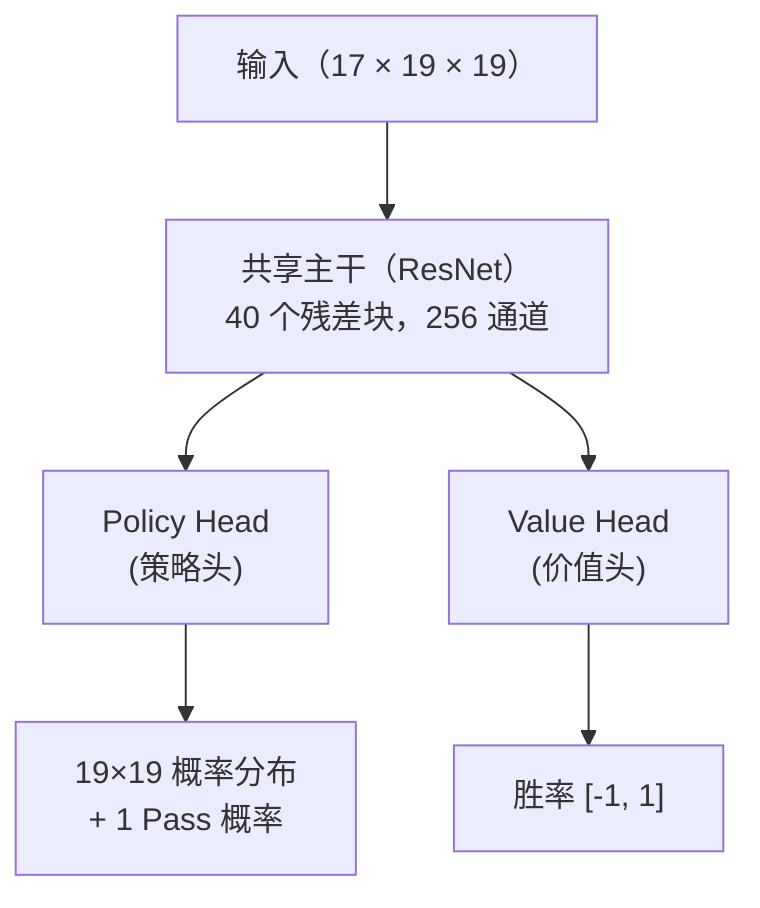
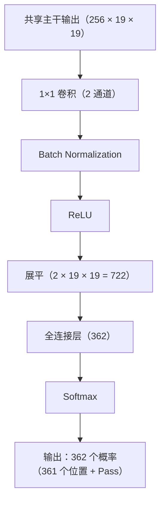
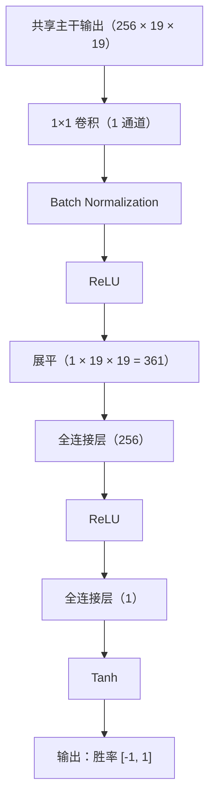
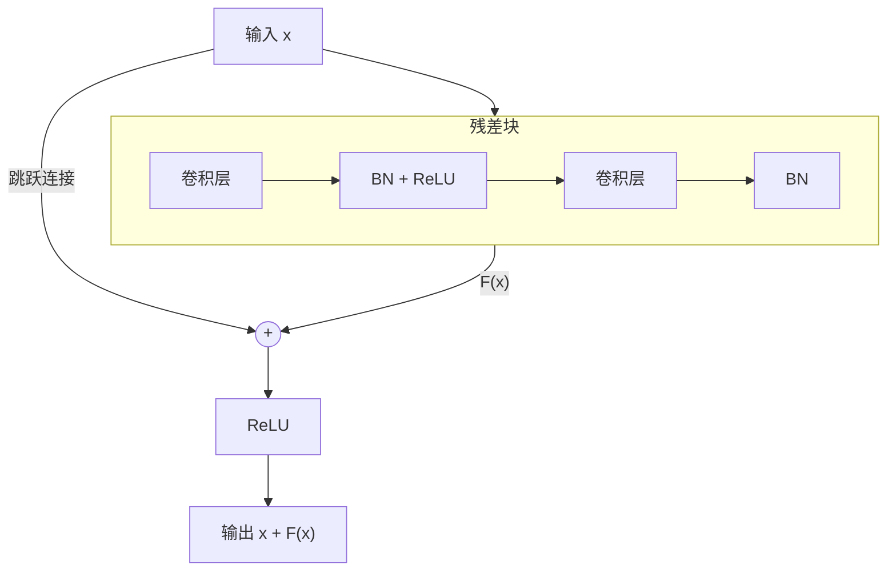

# 双头网络与残差网络

AlphaGo Zero 最重要的架构创新之一，是使用**双头网络**（Dual-Head Network）取代原版 AlphaGo 的双网络设计。这个看似简单的改变，却带来了显著的效能提升和更优雅的学习过程。

本文将深入解析这个架构的设计原理、数学基础，以及为什么它如此有效。

---

## 双头网络设计

### 整体架构

AlphaGo Zero 的神经网络可以分为三个部分：



让我们逐一解析每个部分。

### 共享主干（Shared Backbone）

共享主干是一个深层的**残差网络（ResNet）**，负责从棋盘状态中提取特征。

#### 架构细节

| 组件 | 规格 |
|------|------|
| 输入层 | 3×3 卷积，256 通道 |
| 残差块 | 40 个（或 20 个精简版） |
| 每个残差块 | 2 层 3×3 卷积，256 通道 |
| 激活函数 | ReLU |
| 正规化 | Batch Normalization |

#### 数学表示

设输入为 x（维度 17 x 19 x 19），共享主干的输出为：

```
f(x) = ResNet_40(Conv_3x3(x))
```

其中 f(x)（维度 256 x 19 x 19）是高维特征表示。

### Policy Head（策略头）

Policy Head 负责预测每个位置的落子概率。

#### 架构细节



#### 数学表示

```
π = Softmax(FC(Flatten(ReLU(BN(Conv_1x1(f(x)))))))
```

输出 π 是一个 362 维向量，满足所有元素非负且和为 1。

### Value Head（价值头）

Value Head 负责预测当前局面的胜率。

#### 架构细节



#### 数学表示

```
v = Tanh(FC_1(ReLU(FC_2(Flatten(ReLU(BN(Conv_1x1(f(x)))))))))
```

输出 v 在 [-1, 1] 范围内：
- v = 1：当前方必胜
- v = -1：当前方必败
- v = 0：势均力敌

---

## 为什么要共享主干？

### 直觉理解

「下一步应该下哪里」（Policy）和「谁会赢」（Value）这两个问题，其实需要理解相同的棋盘模式：

- **棋形**：哪些形状是好的，哪些是坏的
- **势力**：哪边更大，哪些地方还有空间
- **死活**：哪些棋已经活了，哪些还在打劫
- **战斗**：哪里有攻杀，局部胜负如何

如果用两个独立的网络，这些特征需要学习两次。共享主干让这些底层特征只需学习一次，两个任务都能使用。

### 多任务学习视角

从机器学习的角度，这是一种**多任务学习（Multi-task Learning）**：

```
L = L_policy + L_value
```

两个任务共享底层表示，这带来几个好处：

#### 1. 正则化效果

共享参数相当于隐式的正则化。如果一个特征只对 Policy 有用而对 Value 无用（或反之），它更难被过度放大。

有效参数量小于两个独立网络的参数量。

#### 2. 数据效率

每一局棋同时产生 Policy 标签（MCTS 搜索概率）和 Value 标签（最终胜负）。共享主干让两个标签都用于训练共享特征，提高了数据利用效率。

#### 3. 梯度信号丰富

两个任务的梯度都会流向共享主干：

```
∂L/∂θ_shared = ∂L_policy/∂θ_shared + ∂L_value/∂θ_shared
```

这提供了更丰富的监督信号，让共享特征更加稳健。

### 实验证据

DeepMind 的消融实验显示，双头网络的表现显著优于分离的双网络：

| 配置 | ELO 评分 | 相对差距 |
|------|----------|----------|
| 分离的 Policy + Value 网络 | 基准 | - |
| 双头网络（共享主干） | +300 ELO | ~65% 胜率差距 |

300 ELO 的差距意味着双头网络对分离网络有约 65% 的胜率。这是一个显著的提升。

---

## 残差网络原理

### 深度网络的困境

在 ResNet 发明之前，深层神经网络面临一个悖论：

> 理论上，更深的网络应该至少和浅层网络一样好（最差情况下，额外的层可以学习恒等映射）。但实际上，更深的网络往往表现更差。

这就是**退化问题（Degradation Problem）**：

- 训练误差随深度增加而增加（不是过拟合，是优化困难）
- 梯度在反向传播时逐渐消失（Vanishing Gradient）
- 深层的参数几乎无法被有效更新

### 残差块的设计

何恺明等人在 2015 年提出了一个简洁而优雅的解决方案：**残差连接（Skip Connection）**。



#### 数学表示

传统网络：学习目标映射 H(x)

```
y = H(x)
```

残差网络：学习**残差映射** F(x) = H(x) - x

```
y = F(x) + x
```

### 为什么残差连接有效？

#### 1. 梯度高速公路

考虑反向传播的梯度：

```
∂L/∂x = ∂L/∂y × ∂y/∂x = ∂L/∂y × (1 + ∂F(x)/∂x)
```

关键在于那个 **+1**。即使 ∂F(x)/∂x 很小或为零，梯度仍然可以通过 +1 直接传回去。

这就像修了一条「梯度高速公路」，让梯度可以畅通无阻地从输出层传回输入层。

#### 2. 恒等映射更容易学习

如果最优解接近恒等映射（H(x) 约等于 x），那么：
- 传统网络：需要学习 H(x) = x，可能很难
- 残差网络：只需学习 F(x) 约等于 0，相对容易

将权重初始化为零或接近零，残差块就自然趋向恒等映射。

#### 3. 集成效应

深层 ResNet 可以视为许多浅层网络的**隐式集成**。如果有 n 个残差块，信息可以通过 2^n 种不同的路径流动。

这种集成效应增加了模型的稳健性。

### ResNet 在 ImageNet 上的突破

ResNet 在 2015 年 ImageNet 竞赛中取得了惊人的成绩：

| 深度 | Top-5 错误率 |
|------|-------------|
| VGG-19（无残差） | 7.3% |
| ResNet-34 | 5.7% |
| ResNet-152 | 4.5% |
| 人类水平 | ~5.1% |

**152 层**的 ResNet 不仅可以训练，还比 19 层的 VGG 好得多。这证明了残差连接确实解决了深度网络的训练问题。

---

## AlphaGo Zero 的 40 层 ResNet

### 为什么选择 40 层？

DeepMind 测试了不同深度的 ResNet：

| 残差块数量 | 总层数 | ELO 评分 |
|------------|--------|----------|
| 5 | 11 | 基准 |
| 10 | 21 | +200 |
| 20 | 41 | +400 |
| 40 | 81 | +500 |

更深的网络确实更强，但边际效益递减。AlphaGo Zero 使用 20 或 40 个残差块：

- **AlphaGo Zero（论文版）**：40 个残差块，256 通道
- **精简版**：20 个残差块，256 通道

40 层的配置在棋力和训练成本之间取得了良好的平衡。

### 具体配置

AlphaGo Zero 的 ResNet 配置如下：

```
输入：17 × 19 × 19
↓
卷积层：3×3, 256 通道, BN, ReLU
↓
残差块 ×40：
  ├─ 卷积层：3×3, 256 通道, BN, ReLU
  ├─ 卷积层：3×3, 256 通道, BN
  └─ 跳跃连接 + ReLU
↓
Policy Head / Value Head
```

#### 参数量估计

| 组件 | 参数量（约） |
|------|-------------|
| 输入卷积 | 17 × 3 × 3 × 256 ≈ 39K |
| 每个残差块 | 2 × 256 × 3 × 3 × 256 ≈ 1.2M |
| 40 个残差块 | 40 × 1.2M ≈ 47M |
| Policy Head | ~1M |
| Value Head | ~0.2M |
| **总计** | **~48M** |

约 4800 万参数，以现代标准来看是中等规模的神经网络。

### Batch Normalization 的作用

每个卷积层之后都有 **Batch Normalization（BN）**，这对训练稳定性至关重要：

#### 1. 正规化激活值

BN 将每一层的激活值正规化到均值为 0、方差为 1：

```
x_hat = (x - μ_B) / sqrt(σ_B² + ε)
y = γ × x_hat + β
```

其中 γ 和 β 是可学习的参数。

#### 2. 缓解内部协变量偏移

深层网络中，每一层的输入分布会随着前面层的参数更新而改变。BN 让每一层的输入分布保持稳定，加速训练收敛。

#### 3. 正则化效果

BN 在训练时使用 mini-batch 的统计量，引入了随机性，有轻微的正则化效果。

---

## 与其他架构的比较

### vs. 原版 AlphaGo 的 CNN

| 特性 | AlphaGo 原版 | AlphaGo Zero |
|------|-------------|--------------|
| 架构类型 | 标准 CNN | ResNet |
| 深度 | 13 层 | 41-81 层 |
| 残差连接 | 无 | 有 |
| 网络数量 | 2（分离） | 1（共享） |
| BN | 无 | 有 |

### vs. VGG 风格网络

VGG 是 2014 年 ImageNet 亚军的架构，使用堆叠的 3×3 卷积：

| 特性 | VGG | ResNet |
|------|-----|--------|
| 最大可训练深度 | ~19 层 | 152+ 层 |
| 梯度流动 | 逐层递减 | 有高速公路 |
| 训练难度 | 深层困难 | 深层可训练 |

### vs. Inception / GoogLeNet

Inception 使用多尺度卷积并行：

| 特性 | Inception | ResNet |
|------|-----------|--------|
| 特点 | 多尺度特征 | 深度堆叠 |
| 复杂度 | 较高 | 简洁 |
| 围棋适用性 | 一般 | 优秀 |

ResNet 的简洁设计更适合围棋这种需要深层推理的任务。

### vs. Transformer

2017 年提出的 Transformer 架构在 NLP 领域取得了巨大成功。有人尝试将 Transformer 应用于围棋：

| 特性 | ResNet | Transformer |
|------|--------|-------------|
| 归纳偏置 | 局部性（卷积） | 全局注意力 |
| 位置编码 | 隐式（卷积） | 显式 |
| 围棋表现 | 优秀 | 可行但不优于 ResNet |
| 计算效率 | 较高 | 较低（O(n²)） |

对于围棋这种有明显空间结构的问题，CNN/ResNet 的归纳偏置更加合适。

---

## 设计选择的深入分析

### 为什么用 3×3 卷积？

AlphaGo Zero 全程使用 3×3 卷积，而非更大的卷积核：

1. **参数效率**：两个 3×3 卷积的感受野等于一个 5×5，但参数量更少（18 vs 25）
2. **更深的网络**：相同参数量下，可以堆叠更多层
3. **更多非线性**：每层之间有 ReLU，增加表达能力

### 为什么用 256 通道？

256 通道是一个经验性的选择：

- **太少**（如 64）：表达能力不足，无法捕捉复杂模式
- **太多**（如 512）：参数量翻倍，训练成本大增，但棋力提升有限

后来的 KataGo 实验显示，通道数可以根据训练资源调整：
- 低资源：128 通道，20 块
- 高资源：256 通道，40 块
- 更高资源：384 通道，60 块

### 为什么 Policy Head 用 Softmax、Value Head 用 Tanh？

#### Policy Head：Softmax

落子是一个**分类问题**——361 个位置（加 Pass）中选择一个。Softmax 输出满足：
- 所有概率非负：π_i >= 0
- 概率和为 1：Σπ_i = 1

这与概率分布的定义一致。

#### Value Head：Tanh

胜率是一个**回归问题**——预测一个连续值。Tanh 输出范围是 [-1, 1]：
- 有界：不会产生极端值
- 对称：胜和负对称处理
- 可微：方便梯度计算

使用 Tanh 而非无界输出（如线性层）可以防止训练不稳定。

---

## 训练细节

### 损失函数

AlphaGo Zero 的总损失是三项之和：

```
L = L_policy + L_value + L_reg
```

#### Policy Loss

使用**交叉熵损失**，让网络输出逼近 MCTS 搜索概率：

```
L_policy = -Σ π_MCTS(a) × log(π_net(a))
```

其中：
- π_MCTS(a) 是 MCTS 对动作 a 的搜索概率
- π_net(a) 是网络输出的概率

#### Value Loss

使用**均方误差（MSE）**，让网络输出逼近实际胜负：

```
L_value = (v_net - z)²
```

其中：
- v_net 是网络预测的胜率
- z 是实际比赛结果（+1 或 -1）

#### Regularization Loss

使用 **L2 正则化**防止过拟合：

```
L_reg = c × ||θ||²
```

其中 c 是正则化系数，θ 是网络参数。

### 优化器配置

| 参数 | 值 |
|------|-----|
| 优化器 | SGD + Momentum |
| 动量 | 0.9 |
| 初始学习率 | 0.01 |
| 学习率衰减 | 每 X 步减半 |
| Batch Size | 32 × 2048 = 64K（分布式）|
| L2 正则化系数 | 1e-4 |

### 数据增强

围棋棋盘有 8 重对称性（4 次旋转 × 2 次翻转）。训练时，每个局面可以产生 8 个等价的训练样本。

这让有效训练数据增加 8 倍，且不需要额外的自我对弈。

---

## 实现考量

### 内存优化

40 层 ResNet 的训练需要大量内存：
- **前向传播**：需要存储每层的激活值（用于反向传播）
- **反向传播**：需要存储梯度

优化策略：
1. **梯度检查点（Gradient Checkpointing）**：只存储部分激活值，需要时重新计算
2. **混合精度训练**：使用 FP16 减少内存占用
3. **分布式训练**：将 batch 分散到多个 GPU/TPU

### 推理优化

推理时不需要 BN 的 mini-batch 统计量，可以使用训练时累积的移动平均：

```
x_hat = (x - μ_moving) / sqrt(σ_moving² + ε)
```

这让推理速度更快且结果确定性。

### 量化与压缩

部署时可以进一步压缩网络：
- **权重量化**：FP32 → INT8，内存减少 4 倍
- **剪枝**：移除小权重连接
- **知识蒸馏**：用大网络训练小网络

---

## 动画对应

本文涉及的核心概念与动画编号：

| 编号 | 概念 | 物理/数学对应 |
|------|------|--------------|
| 🎬 E3 | 双头网络 | 多任务学习 |
| 🎬 D12 | 残差连接 | 梯度高速公路 |
| 🎬 D8 | 卷积神经网络 | 局部感受野 |
| 🎬 D10 | Batch Normalization | 分布正规化 |

---

## 延伸阅读

- **上一篇**：[AlphaGo Zero 概述](../alphago-zero) — 为什么不需要人类棋谱
- **下一篇**：[从零训练的过程](../training-from-scratch) — Day 0-3 的详细演进
- **技术深入**：[CNN 与围棋的结合](../cnn-and-go) — 为什么 CNN 适合棋盘

---

## 参考资料

1. Silver, D., et al. (2017). "Mastering the game of Go without human knowledge." *Nature*, 550, 354-359.
2. He, K., et al. (2016). "Deep Residual Learning for Image Recognition." *CVPR 2016*.
3. Ioffe, S., & Szegedy, C. (2015). "Batch Normalization: Accelerating Deep Network Training by Reducing Internal Covariate Shift." *ICML 2015*.
4. Caruana, R. (1997). "Multitask Learning." *Machine Learning*, 28(1), 41-75.
5. Veit, A., et al. (2016). "Residual Networks Behave Like Ensembles of Relatively Shallow Networks." *NeurIPS 2016*.
