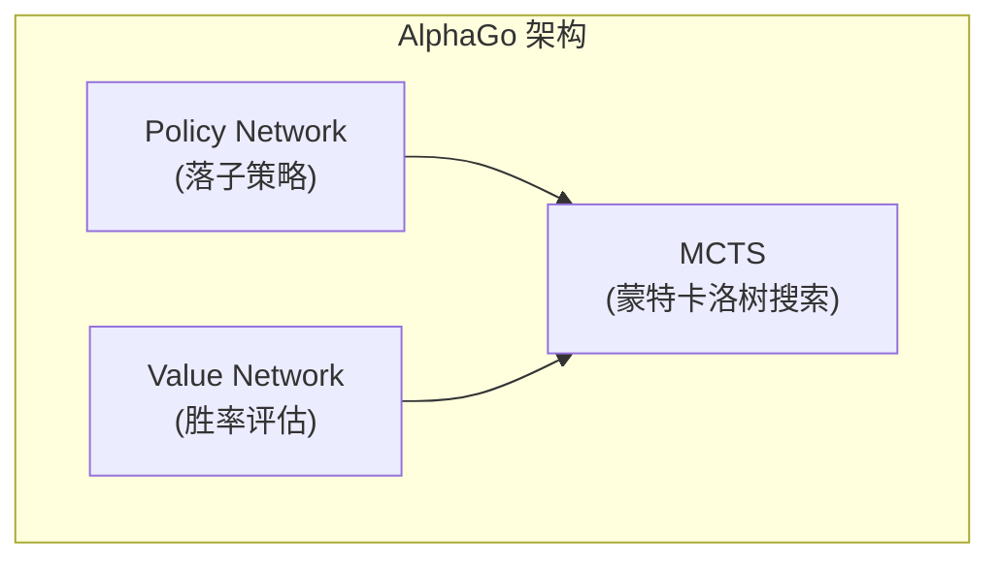
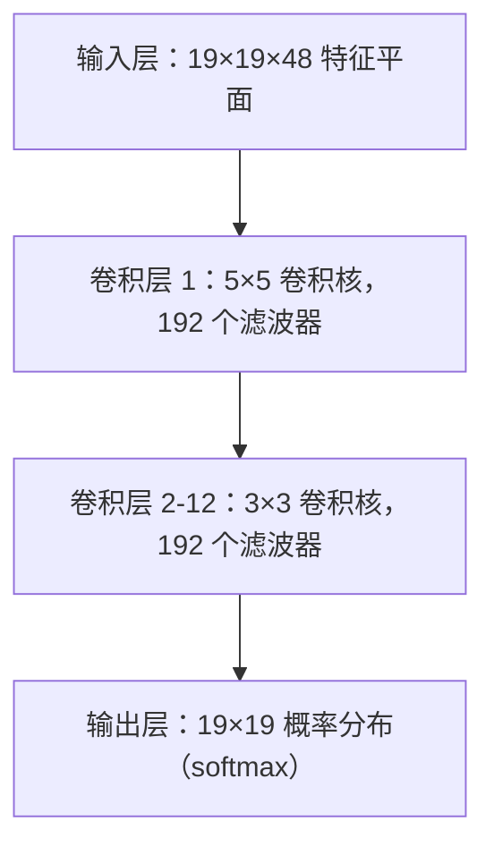
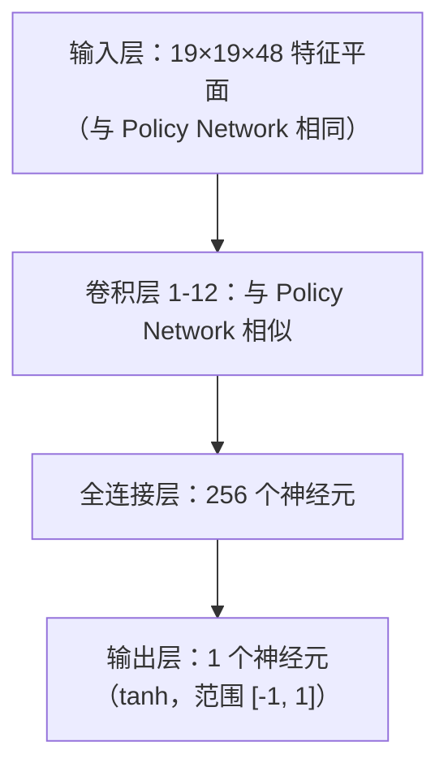
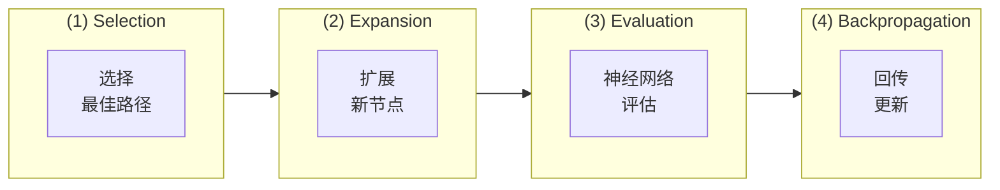
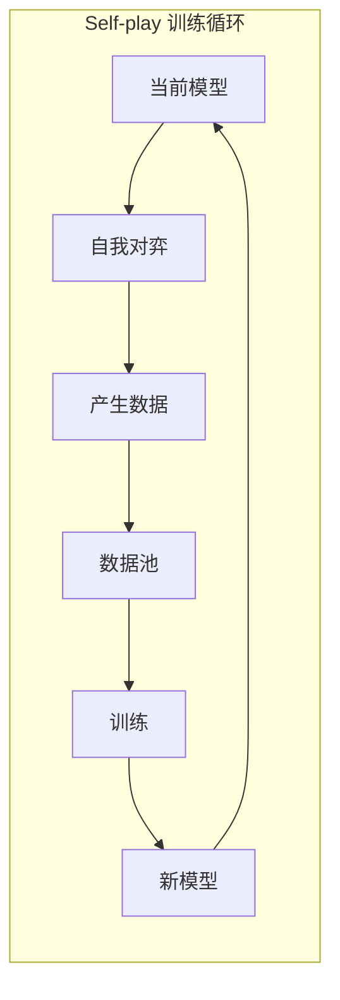
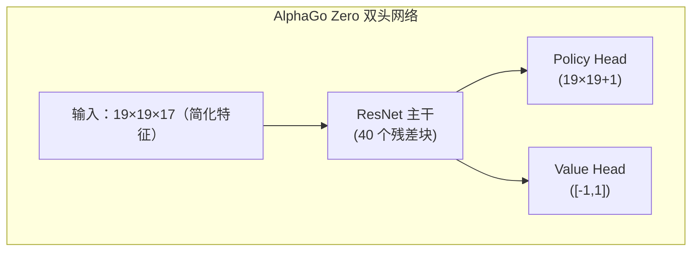

# AlphaGo 论文解读

本文深入解析 DeepMind 发表于 Nature 的经典论文《Mastering the game of Go with deep neural networks and tree search》，以及后续的 AlphaGo Zero 和 AlphaZero 论文。

## AlphaGo 的历史意义

围棋长期被视为人工智能的「圣杯」挑战。与国际象棋不同，围棋的搜索空间极其庞大：

| 游戏 | 平均分支因子 | 平均游戏长度 | 状态空间 |
|------|-------------|-------------|----------|
| 国际象棋 | ~35 | ~80 | ~10^47 |
| 围棋 | ~250 | ~150 | ~10^170 |

传统的暴力搜索方法在围棋上完全不可行。2016 年 AlphaGo 击败李世乭，证明了深度学习与强化学习结合的强大威力。

### 里程碑事件

- **2015 年 10 月**：AlphaGo Fan 以 5:0 击败欧洲冠军樊麾（职业二段）
- **2016 年 3 月**：AlphaGo Lee 以 4:1 击败世界冠军李世乭（职业九段）
- **2017 年 5 月**：AlphaGo Master 以 3:0 击败世界排名第一的柯洁
- **2017 年 10 月**：AlphaGo Zero 发表，纯自我对弈训练，超越所有前代版本

## 核心技术架构

AlphaGo 的核心创新在于结合三个关键技术：



### Policy Network（策略网络）

Policy Network 负责预测每个位置的落子概率，用于指导搜索方向。

#### 网络架构



#### 输入特征

AlphaGo 使用 48 个特征平面作为输入：

| 特征 | 平面数 | 描述 |
|------|--------|------|
| 棋子颜色 | 3 | 黑子、白子、空点 |
| 气数 | 8 | 1气、2气、...、8气以上 |
| 叫吃后气数 | 8 | 吃子后会有多少气 |
| 提子数 | 8 | 该位置可提多少子 |
| 打劫 | 1 | 是否为劫争位置 |
| 落子合法性 | 1 | 该位置是否可落子 |
| 连续 1-8 手前的位置 | 8 | 前几手的落子位置 |
| 轮到哪方下 | 1 | 当前轮到黑或白 |

#### 训练方式

Policy Network 的训练分为两阶段：

**第一阶段：监督学习 (SL Policy Network)**
- 使用 KGS 围棋服务器的 3000 万局棋谱
- 目标：预测人类棋手的下一手
- 达到 57% 的预测准确率

**第二阶段：强化学习 (RL Policy Network)**
- 从 SL Policy Network 开始
- 与先前版本的自己对弈
- 使用 REINFORCE 算法优化

```python
# 简化的 Policy Gradient 更新
# reward: +1 胜利, -1 失败
loss = -log(policy[action]) * reward
```

### Value Network（价值网络）

Value Network 评估当前局面的胜率，用于减少搜索深度。

#### 网络架构



#### 训练方式

Value Network 使用 RL Policy Network 自我对弈产生的 3000 万局面训练：

- 从每局棋中随机取样一个局面
- 用最终胜负作为标签
- 使用 MSE 损失函数

```python
# Value Network 训练
value_prediction = value_network(position)
loss = (value_prediction - game_outcome) ** 2
```

**为什么每局只取一个样本？**

如果取多个样本，同一局棋的相邻局面会高度相关，导致过拟合。随机取样能确保训练数据的多样性。

## 蒙特卡洛树搜索 (MCTS)

MCTS 是 AlphaGo 的决策核心，结合神经网络来高效搜索最佳着法。

### MCTS 四步骤



### 选择公式 (PUCT)

AlphaGo 使用 PUCT (Predictor + UCT) 公式选择要探索的分支：

```
a = argmax[Q(s,a) + u(s,a)]

u(s,a) = c_puct * P(s,a) * sqrt(N(s)) / (1 + N(s,a))
```

其中：
- **Q(s,a)**：动作 a 的平均价值（exploitation）
- **P(s,a)**：Policy Network 预测的先验概率
- **N(s)**：父节点的访问次数
- **N(s,a)**：该动作的访问次数
- **c_puct**：探索常数，平衡 exploration 与 exploitation

### 搜索过程详解

1. **Selection**：从根节点开始，使用 PUCT 公式选择动作，直到达到叶节点
2. **Expansion**：在叶节点展开新的子节点，用 Policy Network 初始化先验概率
3. **Evaluation**：结合 Value Network 评估和快速走子模拟 (Rollout) 来评估价值
4. **Backpropagation**：将评估值沿路径回传，更新 Q 值和 N 值

### Rollout（快速走子）

AlphaGo（非 Zero 版）还使用一个小型快速策略网络进行模拟：

```
叶节点 → 快速随机走子至终局 → 计算胜负
```

最终评估值结合 Value Network 和 Rollout：

```
V = λ * v_network + (1-λ) * v_rollout
```

AlphaGo 使用 λ = 0.5，给予两者相等权重。

## Self-play 训练方法

Self-play 是 AlphaGo 的核心训练策略，让 AI 通过与自己对弈来持续提升。

### 训练循环



### 为什么 Self-play 有效？

1. **无限数据**：不受人类棋谱数量限制
2. **自适应难度**：对手强度与自己同步提升
3. **探索创新**：不受人类固有思维模式限制
4. **目标明确**：直接优化胜率，而非模仿人类

## AlphaGo Zero 的改进

2017 年发表的 AlphaGo Zero 带来了革命性的改进：

### 主要差异

| 特性 | AlphaGo | AlphaGo Zero |
|------|---------|--------------|
| 初始训练 | 人类棋谱监督学习 | 完全从零开始 |
| 网络架构 | 分离的 Policy/Value | 单一双头网络 |
| 网络结构 | 普通 CNN | ResNet |
| 特征工程 | 48 个手工特征 | 17 个简单特征 |
| Rollout | 需要 | 不需要 |
| 训练时间 | 数月 | 3 天超越人类 |

### 架构简化



### 简化的输入特征

AlphaGo Zero 仅使用 17 个特征平面：

- 8 个平面：自己最近 8 手的棋子位置
- 8 个平面：对手最近 8 手的棋子位置
- 1 个平面：当前轮到哪方（全 0 或全 1）

### 训练改进

1. **纯 Self-play**：不使用任何人类数据
2. **直接使用 MCTS 概率作为训练目标**：而非二元的胜负
3. **没有 Rollout**：完全依赖 Value Network
4. **单一网络训练**：Policy 和 Value 共享参数，互相增强

## AlphaZero 的通用化

2017 年底发表的 AlphaZero 将相同架构应用于围棋、国际象棋和将棋：

### 关键特点

- **零领域知识**：除了游戏规则外，不使用任何领域特定知识
- **统一架构**：同一套算法适用于不同棋类
- **更快训练**：
  - 围棋：8 小时超越 AlphaGo Lee
  - 国际象棋：4 小时超越 Stockfish
  - 将棋：2 小时超越 Elmo

### 与 AlphaGo Zero 的差异

| 特性 | AlphaGo Zero | AlphaZero |
|------|-------------|-----------|
| 目标游戏 | 仅围棋 | 围棋、国际象棋、将棋 |
| 对称性利用 | 利用围棋 8 重对称 | 不假设对称性 |
| 超参数调整 | 针对围棋优化 | 通用设置 |
| 训练方式 | 最佳模型自我对弈 | 最新模型自我对弈 |

## 实现重点

如果你想实现类似系统，以下是关键考量：

### 计算资源

AlphaGo 的训练需要庞大的计算资源：

- **AlphaGo Lee**：176 GPU + 48 TPU
- **AlphaGo Zero**：4 TPU（训练）+ 1 TPU（自我对弈）
- **AlphaZero**：5000 TPU（训练）

### 关键超参数

```python
# MCTS 相关
num_simulations = 800     # 每手搜索模拟次数
c_puct = 1.5              # 探索常数
temperature = 1.0         # 选择动作的温度参数

# 训练相关
batch_size = 2048
learning_rate = 0.01      # 含衰减
l2_regularization = 1e-4
```

### 常见问题

1. **训练不稳定**：使用较小的学习率，增加 batch size
2. **过拟合**：确保训练数据多样性，使用正则化
3. **搜索效率**：优化 GPU 批量推理，并行化 MCTS

## 延伸阅读

- [原始论文：Mastering the game of Go with deep neural networks and tree search](https://www.nature.com/articles/nature16961)
- [AlphaGo Zero 论文：Mastering the game of Go without human knowledge](https://www.nature.com/articles/nature24270)
- [AlphaZero 论文：A general reinforcement learning algorithm that masters chess, shogi, and Go through self-play](https://www.science.org/doi/10.1126/science.aar6404)

理解 AlphaGo 的技术后，接下来让我们看看 [KataGo 如何在此基础上做出改进](./katago-paper.md)。
