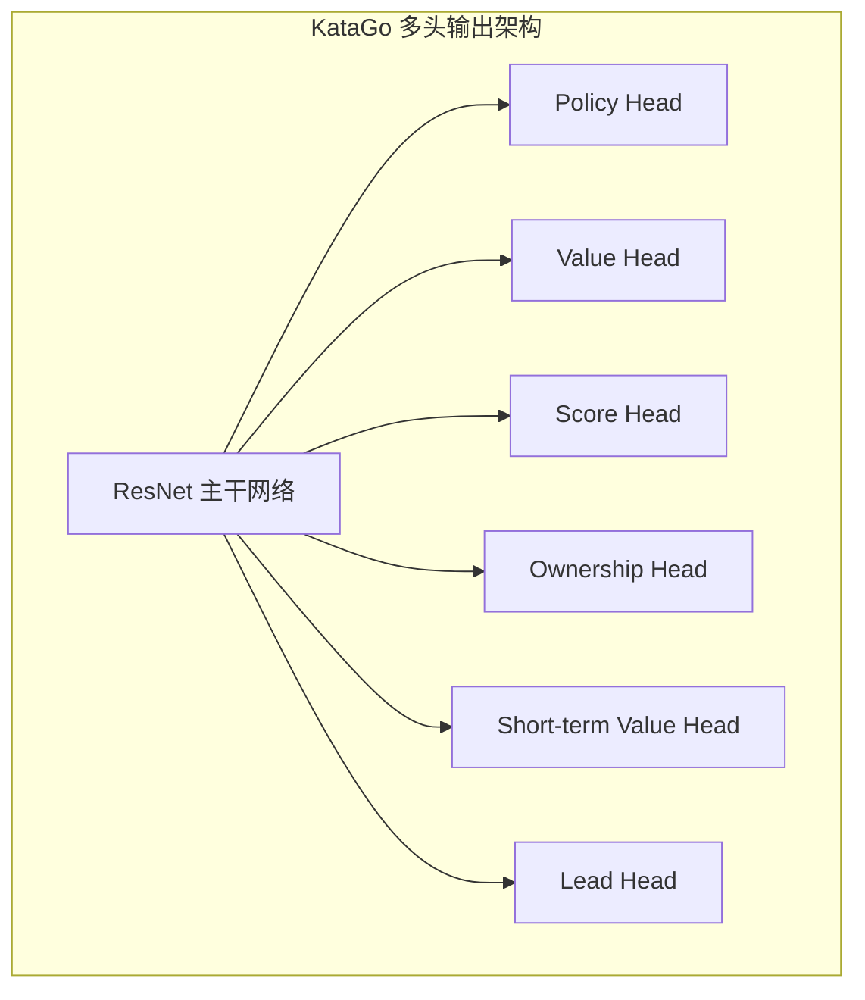
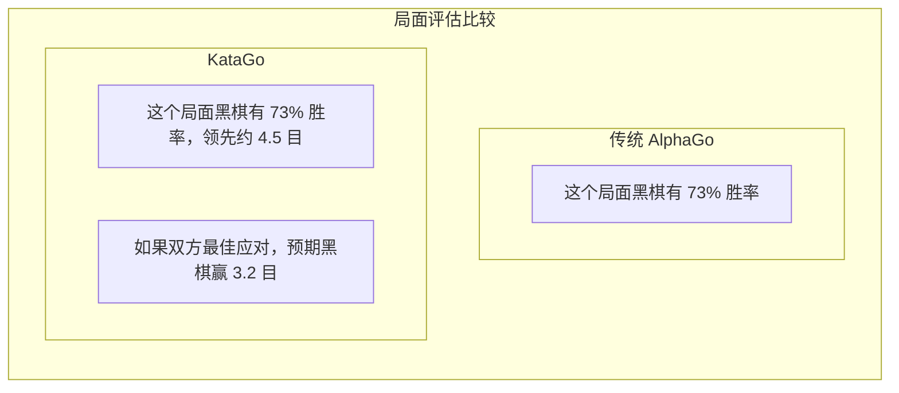

# KataGo 论文解读

KataGo 是由 David Wu 开发的开源围棋 AI，其论文《Accelerating Self-Play Learning in Go》发表于 2019 年。KataGo 以更少的计算资源达到超越 ELF OpenGo 的棋力，是目前最强大的开源围棋 AI。

## KataGo 的创新点

KataGo 并非在神经网络架构上做出革命性改变，而是在训练方法和辅助任务上进行系统性优化，实现了显著的效率提升。

### 核心创新总览

| 创新点 | 效果 |
|--------|------|
| 辅助训练目标 | 加速学习，提供更多监督信号 |
| 全局池化结构 | 更好地捕捉全局信息 |
| 支持多种规则 | 单一模型适应不同比赛规则 |
| Playout Cap 随机化 | 提高训练效率 |
| 改进的数据增强 | 增加训练数据多样性 |

## 更高效的训练方法

### 辅助训练目标（Auxiliary Training Targets）

传统的 AlphaGo Zero 只有两个训练目标：
1. Policy：预测 MCTS 的落子概率分布
2. Value：预测游戏胜负

KataGo 添加了多个辅助训练目标，提供更丰富的学习信号：



#### 各输出头说明

| 输出头 | 维度 | 预测目标 |
|--------|------|----------|
| **Policy** | 19×19+1 | 每个位置的落子概率（含 Pass） |
| **Value** | 3 | 胜/负/和的概率 |
| **Score** | 连续值 | 预测最终目数差 |
| **Ownership** | 19×19 | 每个点最终归属（黑/白领地） |
| **Short-term Value** | 1 | 短期内的预期胜率 |
| **Lead** | 1 | 当前领先多少目 |

### 为什么辅助目标有效？

1. **更密集的监督信号**：Value 只提供一个数值，而 Ownership 提供 361 个监督点
2. **减少过拟合**：多任务学习有正则化效果
3. **加速收敛**：辅助任务帮助网络更快学习有用的特征表示
4. **提供更好的梯度**：避免梯度消失问题

### Playout Cap 随机化

AlphaGo Zero 每手棋固定进行 800 次 MCTS 模拟。KataGo 引入随机化：

```python
# 传统方式
num_playouts = 800  # 固定

# KataGo 方式
playout_cap = random.choice([
    100, 200, 300, 400, 500, 600, 700, 800
])
```

**好处**：
- 训练数据更加多样化
- 模型学会在不同搜索深度下做出合理判断
- 实际对弈时即使搜索量较少也能表现良好

### 数据增强改进

传统方法利用围棋的 8 重对称性（4 次旋转 × 2 次镜像）进行数据增强。KataGo 进一步改进：

- **随机对称变换**：每次采样时随机选择对称变换
- **历史状态随机化**：随机选择历史盘面的表示方式
- **颜色随机化**：随机交换黑白视角

## 支持多种围棋规则

这是 KataGo 的重要特色之一。不同的围棋规则会影响战略决策：

### 主要规则差异

| 规则体系 | 计分方式 | 贴目 | 打劫规则 | 自杀 |
|---------|---------|------|---------|------|
| 中国规则 | 数子法 | 7.5 目 | 简单劫 | 禁止 |
| 日本规则 | 数目法 | 6.5 目 | 超级劫 | 禁止 |
| 韩国规则 | 数目法 | 6.5 目 | 超级劫 | 禁止 |
| 应氏规则 | 数子法 | 8 点 | 特殊劫规 | 禁止 |
| Tromp-Taylor | 数子法 | 可调 | 超级劫 | 允许 |
| AGA 规则 | 数子/数目 | 7.5 目 | 超级劫 | 禁止 |
| 新西兰规则 | 数子法 | 7 目 | 简单劫 | 允许 |

### 技术实现

KataGo 将规则信息编码为输入特征：

```python
# 规则相关输入特征示例
rule_features = {
    'komi': 7.5,           # 贴目值
    'scoring_rule': 'area', # 数子/数目
    'ko_rule': 'simple',    # 劫争规则
    'suicide_allowed': False,
    'tax_rule': 'none',     # 是否有「眼」税
    # ...
}
```

网络学会根据不同规则调整策略。例如：
- 数目法下更注重实地控制
- 允许自杀时可用于特殊战术
- 不同贴目会影响布局选择

## 同时预测胜率和目数

这是 KataGo 最实用的功能之一，对于围棋教学和分析极有价值。

### Value vs Score



### 实际应用价值

1. **更精确的局面判断**：
   - 胜率 80% 但只领先 1 目 → 还有变数
   - 胜率 80% 且领先 20 目 → 大局已定

2. **教学辅助**：
   - 让学生理解一手棋「亏了多少目」
   - 比较不同下法的目数差异

3. **让子棋分析**：
   - 准确评估让子是否适当
   - 判断该下进攻还是防守

### Score Distribution

KataGo 不只预测单一目数，而是预测完整的目数分布：

```
目数分布示例：
├─ 黑胜 10 目以上：15%
├─ 黑胜 5-10 目：25%
├─ 黑胜 0-5 目：20%
├─ 白胜 0-5 目：18%
├─ 白胜 5-10 目：15%
└─ 白胜 10 目以上：7%

预期值：黑棋 +3.2 目
标准差：±8.5 目
```

这种分布信息能更好地反映局面的复杂程度和不确定性。

## Ownership Map（领地图）

Ownership 预测每个点在终局时归属黑方还是白方：

```
                  Ownership Map
    A B C D E F G H J K L M N O P Q R S T
19  ○ ○ ○ ○ ○ ○ · · · · · · · ● ● ● ● ● ●
18  ○ ○ ○ ○ ○ ○ · · · · · · · ● ● ● ● ● ●
17  ○ ○ ○ ○ ○ · · · · · · · · · ● ● ● ● ●
16  ○ ○ ○ ╋ · · · · · ╋ · · · · · ╋ ● ● ●
...

图例：○ = 白方领地  ● = 黑方领地  · = 未定
```

### 应用场景

- **局面分析**：一眼看出双方势力范围
- **死活判断**：判断某块棋是否还有救
- **收官计算**：评估各处官子的价值
- **教学示范**：可视化展示领地概念

## 与 AlphaGo 的差异比较

| 方面 | AlphaGo Zero | KataGo |
|------|-------------|--------|
| **训练目标** | Policy + Value | 多重辅助目标 |
| **输出信息** | 胜率 | 胜率 + 目数 + 领地 |
| **规则支持** | 单一规则 | 多种规则 |
| **网络结构** | 纯卷积 ResNet | 加入全局池化 |
| **搜索量** | 固定 | 随机化 |
| **训练效率** | 基准 | 约 50 倍效率提升 |
| **开源程度** | 论文描述 | 完整开源 |

### 训练效率比较

```
达到 ELF OpenGo 水平所需资源：

ELF OpenGo:
- 2000 GPU
- 2 周训练

KataGo:
- 1 GPU（或几十 GPU 加速）
- 数天到数周

效率提升：约 50-100 倍
```

## 网络架构细节

### 全局池化（Global Pooling）

传统 CNN 只能看到局部信息，KataGo 加入全局池化层捕捉全局特征：

```python
class GlobalPoolingBlock(nn.Module):
    def forward(self, x):
        # x: [batch, channels, 19, 19]

        # 全局平均池化
        global_avg = x.mean(dim=[2, 3])  # [batch, channels]

        # 全局最大池化
        global_max = x.max(dim=2)[0].max(dim=1)[0]  # [batch, channels]

        # 合并全局特征
        global_features = torch.cat([global_avg, global_max], dim=1)

        # 处理全局特征
        global_features = dense_layer(global_features)  # [batch, C]

        # 广播回空间维度并与常规路径结合
        global_features = global_features.view(batch, -1, 1, 1)
        global_features = global_features.expand(-1, -1, 19, 19)

        return torch.cat([x, global_features], dim=1)
```

**好处**：
- 能感知全局形势（如谁在领先）
- 更好地处理需要全局判断的局面
- 对目数预测特别有帮助

### 网络规模

KataGo 提供不同大小的模型：

| 模型 | 残差块数 | 通道数 | 参数量 | 适用场景 |
|------|---------|--------|--------|----------|
| b10c128 | 10 | 128 | ~5M | CPU 运行 |
| b15c192 | 15 | 192 | ~15M | 一般 GPU |
| b20c256 | 20 | 256 | ~35M | 中阶 GPU |
| b40c256 | 40 | 256 | ~70M | 高阶 GPU |
| b60c320 | 60 | 320 | ~150M | 顶级 GPU |

## 实际表现

### 棋力评估

KataGo 在各大测试中的表现：

- 超越所有 Leela Zero 网络
- 与职业九段对弈保持高胜率
- 在 CGOS（Computer Go Server）排名第一

### 分析功能

KataGo 的分析模式提供：

```json
{
  "moveInfos": [
    {
      "move": "Q16",
      "visits": 3420,
      "winrate": 0.573,
      "scoreLead": 2.8,
      "pv": ["Q16", "D4", "Q4", "D16"],
      "ownership": [...]
    }
  ],
  "rootInfo": {
    "winrate": 0.48,
    "scoreLead": -0.5,
    "visits": 10000
  }
}
```

## 延伸阅读

- [KataGo 论文：Accelerating Self-Play Learning in Go](https://arxiv.org/abs/1902.10565)
- [KataGo GitHub 项目](https://github.com/lightvector/KataGo)
- [KataGo 训练日志与分析](https://katagotraining.org/)

了解 KataGo 的技术特点后，让我们看看[其他围棋 AI 的发展](./zen.md)，以便对整个产业有更全面的认识。
