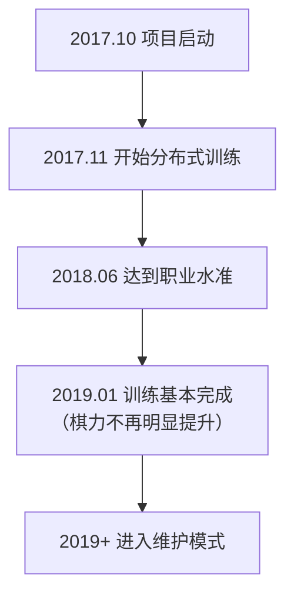

# 其他围棋 AI 介绍

除了 AlphaGo 和 KataGo，围棋 AI 领域还有许多重要的项目。本文将介绍主要的商业 AI 和开源 AI，帮助你了解整个生态系统。

## 商业围棋 AI

### 天顶（Zen）

**开发者**：尾岛阳�的（Yoji Ojima）/ 日本
**首次发表**：2009 年
**授权方式**：商业授权

天顶是 AlphaGo 之前最强的围棋程序之一，在传统 MCTS 时代就已达到职业水准。

#### 发展历程

| 时间 | 版本 | 里程碑 |
|------|------|--------|
| 2009 | Zen 1.0 | 首次发布 |
| 2011 | Zen 4 | 达到业余六段水准 |
| 2012 | Zen 5 | 让四子击败武宫正树九段 |
| 2016 | Zen 7 | 采用深度学习技术 |
| 2017+ | Deep Zen Go | 结合 AlphaGo 架构 |

#### 技术特点

- **混合架构**：结合传统启发式与深度学习
- **商业优化**：针对消费级硬件优化
- **稳定性高**：经过多年商业使用验证
- **支持多平台**：Windows、macOS 皆可运行

#### 产品形式

- **Tengen（天顶之碁）**：桌面软件，售价约 10,000 日元
- **网络对弈**：曾在 KGS 以 Zen19 账号活动

---

### 绝艺（Fine Art）

**开发者**：腾讯 AI Lab / 中国
**首次发表**：2016 年
**授权方式**：非公开

绝艺是腾讯开发的围棋 AI，在中国围棋界有重要影响力。

#### 发展历程

| 时间 | 事件 |
|------|------|
| 2016 年 11 月 | 首次亮相，在野狐围棋网对弈 |
| 2017 年 3 月 | UEC 杯电脑围棋大赛冠军 |
| 2017 年 | 被中国国家围棋队采用为训练工具 |
| 2018 年 | 世界人工智能围棋大赛冠军 |
| 持续至今 | 持续作为国家队训练辅助 |

#### 技术特点

- **大规模训练**：使用腾讯云计算资源
- **与人类顶尖棋手合作**：获得大量专业指导
- **实战经验丰富**：在野狐围棋累积大量对局
- **教学功能集成**：提供复盘分析功能

#### 影响力

绝艺对中国职业围棋的影响深远：

- 成为国家队标准训练工具
- 改变了职业棋手的备战方式
- 推动了 AI 辅助训练的普及

---

### 星阵（Golaxy）

**开发者**：中国深客科技 / 清华大学团队
**首次发表**：2018 年
**授权方式**：商业授权

星阵以「最像人类的 AI」为设计目标，在棋风上更接近人类棋手。

#### 技术特点

- **人类化棋风**：刻意训练成更像人类的下法
- **可调整难度**：能模拟不同段位的对手
- **教学导向**：设计时考虑教学应用
- **让子棋专精**：在让子棋方面有特别优化

#### 产品应用

- **弈客围棋**：集成于弈客 App
- **教学平台**：用于在线围棋教学
- **段位测试**：提供标准化段位评估

---

### 其他商业 AI

| 名称 | 开发者 | 特点 |
|------|--------|------|
| **石子旋风** | 林在范（台湾） | 曾获 UEC 杯冠军 |
| **CGI** | 交通大学（台湾） | 学术研究导向 |
| **Dolbaram** | 韩国 NHN | 集成于韩国围棋平台 |
| **AQ** | 日本 AQ 团队 | 开源后转商业 |

## 开源围棋 AI

### Leela Zero

**开发者**：Gian-Carlo Pascutto / 比利时
**首次发表**：2017 年
**授权方式**：GPL-3.0
**GitHub**：https://github.com/leela-zero/leela-zero

Leela Zero 是首个成功复制 AlphaGo Zero 的开源项目，由社区分布式训练。

#### 发展历程



#### 技术特点

- **忠实复现**：严格按照 AlphaGo Zero 论文实现
- **分布式训练**：全球志愿者贡献 GPU 算力
- **完全透明**：所有训练数据和模型公开
- **标准 GTP**：兼容所有 GTP 围棋软件

#### 训练统计

| 项目 | 数值 |
|------|------|
| 总自我对弈局数 | 约 1800 万局 |
| 训练迭代次数 | 约 270 次 |
| 参与贡献者 | 数千人 |
| 训练时长 | 约 1.5 年 |

#### 使用方式

```bash
# 安装
brew install leela-zero  # macOS

# 运行
leelaz --gtp --weights best-network.gz

# GTP 指令
genmove black
play white D4
```

#### 现状

虽然 Leela Zero 已不再活跃训练，但：
- 代码仍是学习 AlphaGo Zero 的绝佳资源
- 训练好的模型仍可使用
- 社区仍在维护基本功能

---

### ELF OpenGo

**开发者**：Facebook AI Research (FAIR)
**首次发表**：2018 年
**授权方式**：BSD
**GitHub**：https://github.com/pytorch/ELF

ELF OpenGo 是 Facebook 开发的围棋 AI，展示了大规模分布式训练的能力。

#### 技术特点

- **ELF 框架**：基于 Facebook 的 ELF（Extensive, Lightweight, and Flexible）游戏研究平台
- **大规模训练**：使用 2000 GPU 进行训练
- **PyTorch 实现**：使用 Facebook 自家的深度学习框架
- **研究导向**：主要目的是研究而非实用

#### 表现

- 在 KGS 达到顶级水准
- 与职业九段对弈有稳定胜率
- 论文发表于顶级会议

#### 现状

- 项目已不再活跃维护
- 代码和模型仍可下载
- 主要价值在于学术参考

---

### SAI（Sensible Artificial Intelligence）

**开发者**：SAI 团队 / 欧洲
**首次发表**：2019 年
**授权方式**：MIT
**GitHub**：https://github.com/sai-dev/sai

SAI 是基于 Leela Zero 的改进版本，专注于实验性功能。

#### 技术特点

- **改进的训练方法**：实验各种训练优化
- **支持更多规则**：比 Leela Zero 支持更多围棋规则
- **实验性功能**：测试新的网络架构和训练技巧

#### 现状

- 仍有小规模社区维护
- 主要用于实验和学习

---

### PhoenixGo

**开发者**：腾讯微信团队
**首次发表**：2018 年
**授权方式**：BSD-3
**GitHub**：https://github.com/Tencent/PhoenixGo

PhoenixGo 是腾讯开源的围棋 AI，曾获得 2018 年世界人工智能围棋大赛冠军。

#### 技术特点

- **商业级品质**：源自腾讯内部项目
- **TensorFlow 实现**：使用主流框架
- **多平台支持**：Linux、Windows、macOS
- **分布式支持**：可在多机多卡环境运行

#### 使用方式

```bash
# 编译
bazel build //src:mcts_main

# 运行
./mcts_main --gtp --config_path=config.conf
```

---

### MiniGo

**开发者**：Google Brain
**首次发表**：2018 年
**授权方式**：Apache-2.0
**GitHub**：https://github.com/tensorflow/minigo

MiniGo 是 Google 开源的教育性质围棋 AI，旨在让更多人理解 AlphaGo 的原理。

#### 技术特点

- **教育导向**：代码清晰易读
- **TensorFlow 实现**：Google 官方示例
- **完整文档**：有详细的技术说明
- **Colab 支持**：可在 Google Colab 直接运行

#### 适用场景

- 学习 AlphaGo Zero 架构
- 理解强化学习在游戏中的应用
- 作为自己项目的起点

## 各 AI 特点比较

### 棋力比较（大致估计）

| AI | 棋力水准 | 备注 |
|----|---------|------|
| KataGo | 顶级超人 | 持续训练中 |
| 绝艺 | 顶级超人 | 非公开 |
| Leela Zero | 超人 | 已停止训练 |
| ELF OpenGo | 超人 | 已停止训练 |
| PhoenixGo | 准超人 | 已停止训练 |
| 天顶 | 职业水准 | 商业产品 |
| 星阵 | 职业水准 | 可调整难度 |

### 功能比较

| 功能 | KataGo | Leela Zero | PhoenixGo | 天顶 |
|------|--------|------------|-----------|------|
| 开源 | ✓ | ✓ | ✓ | ✗ |
| 目数预测 | ✓ | ✗ | ✗ | △ |
| 多规则支持 | ✓ | ✗ | ✗ | ✗ |
| Analysis API | ✓ | ✗ | ✗ | ✗ |
| CPU 模式 | ✓ | ✓ | ✓ | ✓ |
| 持续更新 | ✓ | ✗ | ✗ | △ |

### 适用场景建议

| 需求 | 推荐选择 | 原因 |
|------|---------|------|
| 一般对弈/分析 | KataGo | 最强且功能最全 |
| 学习 AlphaGo | Leela Zero / MiniGo | 代码清晰 |
| 商业应用 | 天顶 / 自训练 KataGo | 授权明确 |
| 教学辅助 | KataGo / 星阵 | 有丰富分析功能 |
| 研究实验 | KataGo / SAI | 可修改训练 |

## 未来发展趋势

### 技术趋势

1. **更高效的训练方法**
   - 如 KataGo 展示的效率提升
   - 更少资源达到更高棋力

2. **更好的可解释性**
   - 解释 AI 为什么下这手棋
   - 帮助人类理解 AI 的思考

3. **与人类风格结合**
   - 训练出更像特定棋手风格的 AI
   - 用于教学和研究

4. **跨游戏通用性**
   - 如 AlphaZero 所展示
   - 单一框架适用多种游戏

### 应用趋势

1. **普及化**
   - 更多围棋爱好者使用 AI 分析
   - 手机等设备也能运行

2. **专业化**
   - 职业棋手深度依赖 AI 训练
   - AI 辅助形成标准化

3. **商业化**
   - 更多 AI 辅助围棋产品
   - 教学、分析、陪练等服务

## 总结

围棋 AI 生态系统丰富多元：

- **想要最强棋力和最全功能**：选择 KataGo
- **想要学习 AI 原理**：研究 Leela Zero 或 MiniGo 代码
- **商业应用需求**：评估天顶或自行训练模型
- **特殊需求**：根据具体情况选择或组合使用

接下来，让我们进入实战环节，学习如何[安装和使用 KataGo](/docs/for-engineers/katago-source/)！
