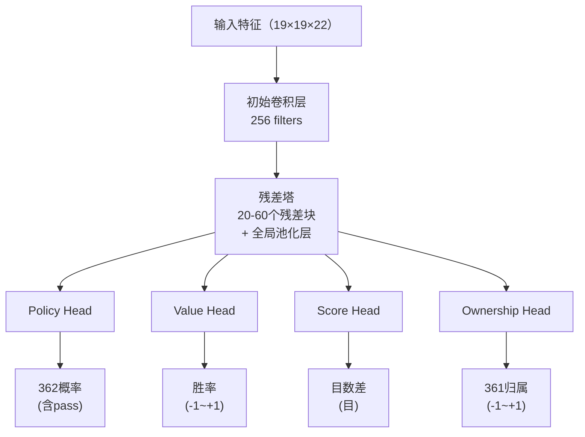
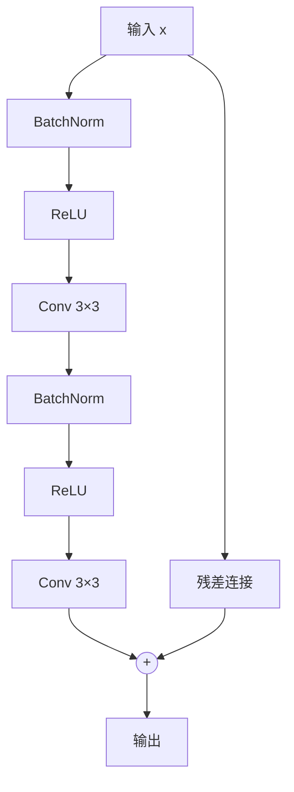

# 神经网络架构详解

本文深入解析 KataGo 神经网络的完整架构，从输入特征编码到多头输出设计。

---

## 架构总览

KataGo 使用**单一神经网络、多头输出**的设计：



---

## 输入特征编码

### 特征平面总览

KataGo 使用 **22 个特征平面**（19×19×22），每个平面是一个 19×19 的矩阵：

| 平面 | 内容 | 说明 |
|------|------|------|
| 0 | 己方棋子 | 1 = 有己方棋子，0 = 无 |
| 1 | 对方棋子 | 1 = 有对方棋子，0 = 无 |
| 2 | 空点 | 1 = 空点，0 = 有棋子 |
| 3-10 | 历史状态 | 过去 8 步的棋盘变化 |
| 11 | 劫禁点 | 1 = 此处为劫禁，0 = 可下 |
| 12-17 | 气数编码 | 1气、2气、3气...的棋串 |
| 18-21 | 规则编码 | 中国/日本规则、komi 等 |

### 历史状态堆叠

为了让神经网络理解局面的**动态变化**，KataGo 会堆叠过去 8 步的棋盘状态：

```python
# 历史状态编码（概念）
def encode_history(game_history, current_player):
    features = []

    for t in range(8):  # 过去 8 步
        if t < len(game_history):
            board = game_history[-(t+1)]
            # 编码该时间点的己方/对方棋子
            features.append(encode_board(board, current_player))
        else:
            # 历史不足，填零
            features.append(np.zeros((19, 19)))

    return np.stack(features, axis=0)
```

### 规则编码

KataGo 支持多种规则，通过特征平面告知神经网络：

```python
# 规则编码（概念）
def encode_rules(rules, komi):
    rule_features = np.zeros((4, 19, 19))

    # 规则类型（one-hot）
    if rules == "chinese":
        rule_features[0] = 1.0
    elif rules == "japanese":
        rule_features[1] = 1.0

    # Komi 归一化
    normalized_komi = komi / 15.0  # 归一化到 [-1, 1]
    rule_features[2] = normalized_komi

    # 当前玩家
    rule_features[3] = 1.0 if current_player == BLACK else 0.0

    return rule_features
```

---

## 主干网络：残差塔

### 残差块结构

KataGo 使用 **Pre-activation ResNet** 结构：



### 代码示例

```python
class ResidualBlock(nn.Module):
    def __init__(self, channels):
        super().__init__()
        self.bn1 = nn.BatchNorm2d(channels)
        self.conv1 = nn.Conv2d(channels, channels, 3, padding=1)
        self.bn2 = nn.BatchNorm2d(channels)
        self.conv2 = nn.Conv2d(channels, channels, 3, padding=1)

    def forward(self, x):
        residual = x

        out = self.bn1(x)
        out = F.relu(out)
        out = self.conv1(out)

        out = self.bn2(out)
        out = F.relu(out)
        out = self.conv2(out)

        return out + residual  # 残差连接
```

### 全局池化层

KataGo 的关键创新之一：在残差块中加入**全局池化**，让网络能看到全局信息：

```python
class GlobalPoolingBlock(nn.Module):
    def __init__(self, channels):
        super().__init__()
        self.conv = nn.Conv2d(channels, channels, 3, padding=1)
        self.fc = nn.Linear(channels, channels)

    def forward(self, x):
        # 局部路径
        local = self.conv(x)

        # 全局路径
        global_pool = x.mean(dim=[2, 3])  # 全局平均池化
        global_fc = self.fc(global_pool)
        global_broadcast = global_fc.unsqueeze(2).unsqueeze(3)
        global_broadcast = global_broadcast.expand(-1, -1, 19, 19)

        # 融合
        return local + global_broadcast
```

**为什么需要全局池化？**

传统卷积只看局部（3×3 感受野），即使堆叠很多层，对全局信息的感知仍有限。全局池化让网络能直接"看到"：
- 整盘棋的子数差异
- 全局的势力分布
- 整体的形势判断

---

## 输出头设计

### Policy Head（策略头）

输出每个位置的落子概率：

```python
class PolicyHead(nn.Module):
    def __init__(self, in_channels):
        super().__init__()
        self.conv = nn.Conv2d(in_channels, 2, 1)  # 1×1 卷积
        self.bn = nn.BatchNorm2d(2)
        self.fc = nn.Linear(2 * 19 * 19, 362)  # 361 + pass

    def forward(self, x):
        out = F.relu(self.bn(self.conv(x)))
        out = out.view(out.size(0), -1)
        out = self.fc(out)
        return F.softmax(out, dim=1)  # 概率分布
```

**输出格式**：362 维向量
- 索引 0-360：棋盘上 361 个位置的落子概率
- 索引 361：pass 的概率

### Value Head（价值头）

输出当前局面的胜率：

```python
class ValueHead(nn.Module):
    def __init__(self, in_channels):
        super().__init__()
        self.conv = nn.Conv2d(in_channels, 1, 1)
        self.bn = nn.BatchNorm2d(1)
        self.fc1 = nn.Linear(19 * 19, 256)
        self.fc2 = nn.Linear(256, 1)

    def forward(self, x):
        out = F.relu(self.bn(self.conv(x)))
        out = out.view(out.size(0), -1)
        out = F.relu(self.fc1(out))
        out = torch.tanh(self.fc2(out))  # 输出 -1 到 +1
        return out
```

**输出格式**：单一数值 [-1, +1]
- +1：己方必胜
- -1：对方必胜
- 0：均势

### Score Head（目数头）

KataGo 独有，预测最终目数差：

```python
class ScoreHead(nn.Module):
    def __init__(self, in_channels):
        super().__init__()
        self.conv = nn.Conv2d(in_channels, 1, 1)
        self.bn = nn.BatchNorm2d(1)
        self.fc1 = nn.Linear(19 * 19, 256)
        self.fc2 = nn.Linear(256, 1)

    def forward(self, x):
        out = F.relu(self.bn(self.conv(x)))
        out = out.view(out.size(0), -1)
        out = F.relu(self.fc1(out))
        out = self.fc2(out)  # 无限制输出
        return out
```

**输出格式**：单一数值（目数）
- 正数：己方领先
- 负数：对方领先

### Ownership Head（领地头）

预测每个点最终归属：

```python
class OwnershipHead(nn.Module):
    def __init__(self, in_channels):
        super().__init__()
        self.conv1 = nn.Conv2d(in_channels, 32, 1)
        self.bn = nn.BatchNorm2d(32)
        self.conv2 = nn.Conv2d(32, 1, 1)

    def forward(self, x):
        out = F.relu(self.bn(self.conv1(x)))
        out = torch.tanh(self.conv2(out))  # 每点 -1 到 +1
        return out.view(out.size(0), -1)  # 展平为 361
```

**输出格式**：361 维向量，每个值在 [-1, +1]
- +1：该点属于己方领地
- -1：该点属于对方领地
- 0：中立或争议区域

---

## 与 AlphaZero 的差异

| 方面 | AlphaZero | KataGo |
|------|-----------|--------|
| **输出头** | 2 个（Policy + Value） | **4 个**（+ Score + Ownership） |
| **全局池化** | 无 | **有** |
| **输入特征** | 17 平面 | **22 平面**（含规则编码） |
| **残差块** | 标准 ResNet | **Pre-activation + 全局池化** |
| **多规则支持** | 无 | **有**（通过特征编码） |

---

## 模型规模

KataGo 提供不同规模的模型：

| 模型 | 残差块数 | 通道数 | 参数量 | 适用场景 |
|------|---------|--------|--------|---------|
| b10c128 | 10 | 128 | ~5M | CPU、快速测试 |
| b18c384 | 18 | 384 | ~75M | 一般 GPU |
| b40c256 | 40 | 256 | ~95M | 高端 GPU |
| b60c320 | 60 | 320 | ~200M | 顶级 GPU |

**命名规则**：`b{残差块数}c{通道数}`

---

## 完整网络实现

```python
class KataGoNetwork(nn.Module):
    def __init__(self, num_blocks=18, channels=384):
        super().__init__()

        # 初始卷积
        self.initial_conv = nn.Conv2d(22, channels, 3, padding=1)
        self.initial_bn = nn.BatchNorm2d(channels)

        # 残差塔
        self.residual_blocks = nn.ModuleList([
            ResidualBlock(channels) for _ in range(num_blocks)
        ])

        # 全局池化块（每隔几个残差块插入一个）
        self.global_pooling_blocks = nn.ModuleList([
            GlobalPoolingBlock(channels) for _ in range(num_blocks // 6)
        ])

        # 输出头
        self.policy_head = PolicyHead(channels)
        self.value_head = ValueHead(channels)
        self.score_head = ScoreHead(channels)
        self.ownership_head = OwnershipHead(channels)

    def forward(self, x):
        # 初始卷积
        out = F.relu(self.initial_bn(self.initial_conv(x)))

        # 残差塔
        gp_idx = 0
        for i, block in enumerate(self.residual_blocks):
            out = block(out)

            # 每 6 个残差块后插入全局池化
            if (i + 1) % 6 == 0 and gp_idx < len(self.global_pooling_blocks):
                out = self.global_pooling_blocks[gp_idx](out)
                gp_idx += 1

        # 输出头
        policy = self.policy_head(out)
        value = self.value_head(out)
        score = self.score_head(out)
        ownership = self.ownership_head(out)

        return {
            'policy': policy,
            'value': value,
            'score': score,
            'ownership': ownership
        }
```

---

## 延伸阅读

- [MCTS 实现细节](../mcts-implementation) — 搜索与神经网络的结合
- [KataGo 训练机制解析](../training) — 网络如何训练
- [关键论文导读](../papers) — 原始论文的数学推导
