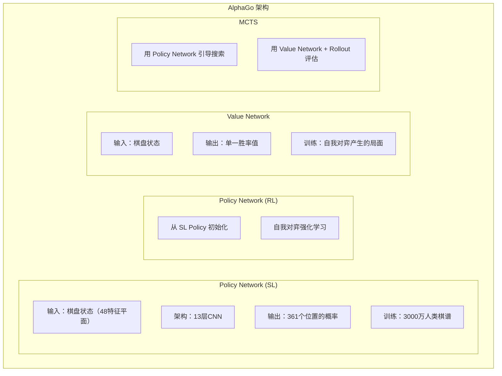
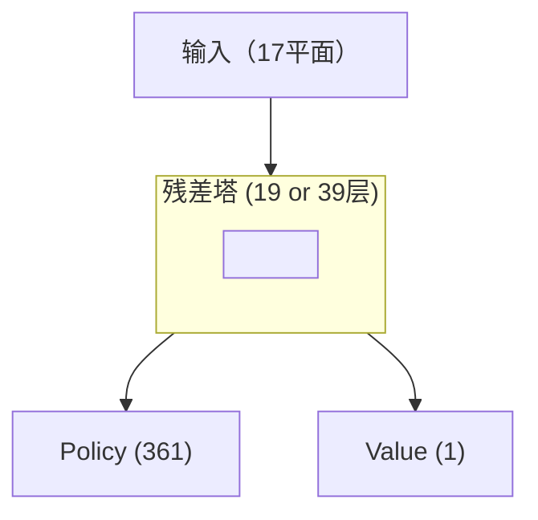
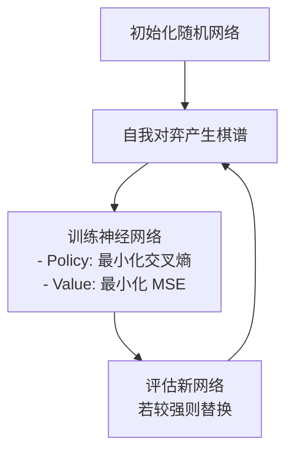

# 关键论文导读

本文整理围棋 AI 发展史上最重要的论文，提供快速理解的摘要与技术要点。

---

## 论文总览

### 时间轴

```
2006  Coulom - MCTS 首次应用于围棋
2016  Silver et al. - AlphaGo（Nature）
2017  Silver et al. - AlphaGo Zero（Nature）
2017  Silver et al. - AlphaZero
2019  Wu - KataGo
2020+ 各种改进与应用
```

### 阅读建议

| 目标 | 建议论文 |
|------|---------|
| 了解基础 | AlphaGo (2016) |
| 理解自我对弈 | AlphaGo Zero (2017) |
| 了解通用方法 | AlphaZero (2017) |
| 实现参考 | KataGo (2019) |

---

## 1. MCTS 的诞生（2006）

### 论文信息

```
标题：Efficient Selectivity and Backup Operators in Monte-Carlo Tree Search
作者：Rémi Coulom
发表：Computers and Games 2006
```

### 核心贡献

首次将蒙特卡洛方法系统性地应用于围棋：

```
之前：纯随机模拟，没有树结构
之后：构建搜索树 + UCB 选择 + 回传统计
```

### 关键概念

#### UCB1 公式

```
选择分数 = 平均胜率 + C × √(ln(N) / n)

其中：
- N：父节点访问次数
- n：子节点访问次数
- C：探索常数
```

#### MCTS 四步骤

```
1. Selection：用 UCB 选择节点
2. Expansion：展开新节点
3. Simulation：随机模拟到终局
4. Backpropagation：回传胜负
```

### 影响

- 让围棋 AI 达到业余段位水平
- 成为后续所有围棋 AI 的基础
- UCB 概念影响了 PUCT 的发展

---

## 2. AlphaGo（2016）

### 论文信息

```
标题：Mastering the game of Go with deep neural networks and tree search
作者：Silver, D., Huang, A., Maddison, C.J., et al.
发表：Nature, 2016
DOI：10.1038/nature16961
```

### 核心贡献

**首次结合深度学习与 MCTS**，击败人类世界冠军。

### 系统架构



### 技术要点

#### 1. 监督学习 Policy Network

```python
# 输入特征（48 个平面）
- 己方棋子位置
- 对方棋子位置
- 气的数量
- 提子后的状态
- 合法手位置
- 最近几手的位置
...
```

#### 2. 强化学习改进

```
SL Policy → 自我对弈 → RL Policy

RL Policy 比 SL Policy 强约 80% 胜率
```

#### 3. Value Network 训练

```
防止过拟合的关键：
- 从每盘棋只取一个位置
- 避免相似局面重复出现
```

#### 4. MCTS 整合

```
叶节点评估 = 0.5 × Value Network + 0.5 × Rollout

Rollout 使用快速 Policy Network（准确率较低但速度快）
```

### 关键数据

| 项目 | 数值 |
|------|------|
| SL Policy 准确率 | 57% |
| RL Policy 对 SL Policy 胜率 | 80% |
| 训练 GPU | 176 |
| 对局 GPU | 48 TPU |

---

## 3. AlphaGo Zero（2017）

### 论文信息

```
标题：Mastering the game of Go without human knowledge
作者：Silver, D., Schrittwieser, J., Simonyan, K., et al.
发表：Nature, 2017
DOI：10.1038/nature24270
```

### 核心贡献

**完全不需要人类棋谱**，从零开始自我学习。

### 与 AlphaGo 的差异

| 方面 | AlphaGo | AlphaGo Zero |
|------|---------|--------------|
| 人类棋谱 | 需要 | **不需要** |
| 网络数量 | 4 个 | **1 个双头** |
| 输入特征 | 48 平面 | **17 平面** |
| Rollout | 使用 | **不使用** |
| 残差网络 | 无 | **有** |
| 训练时间 | 数月 | **3 天** |

### 关键创新

#### 1. 单一双头网络



#### 2. 简化输入特征

```python
# 只需要 17 个特征平面
features = [
    current_player_stones,      # 己方棋子
    opponent_stones,            # 对方棋子
    history_1_player,           # 历史状态 1
    history_1_opponent,
    ...                         # 历史状态 2-7
    color_to_play               # 轮到谁
]
```

#### 3. 纯 Value Network 评估

```
不再使用 Rollout
叶节点评估 = Value Network 输出

更简洁、更快速
```

#### 4. 训练流程



### 学习曲线

```
训练时间    Elo
─────────────────
3 小时      初学者
24 小时     超越 AlphaGo Lee
72 小时     超越 AlphaGo Master
```

---

## 4. AlphaZero（2017）

### 论文信息

```
标题：Mastering Chess and Shogi by Self-Play with a General Reinforcement Learning Algorithm
作者：Silver, D., Hubert, T., Schrittwieser, J., et al.
发表：arXiv:1712.01815 (后发表于 Science, 2018)
```

### 核心贡献

**通用化**：同一算法应用于围棋、国际象棋、将棋。

### 通用架构

```
输入编码（游戏特定）→ 残差网络（通用）→ 双头输出（通用）
```

### 跨游戏适应

| 游戏 | 输入平面 | 动作空间 | 训练时间 |
|------|---------|---------|---------|
| 围棋 | 17 | 362 | 40 天 |
| 国际象棋 | 119 | 4672 | 9 小时 |
| 将棋 | 362 | 11259 | 12 小时 |

### MCTS 改进

#### PUCT 公式

```
选择分数 = Q(s,a) + c(s) × P(s,a) × √N(s) / (1 + N(s,a))

c(s) = log((1 + N(s) + c_base) / c_base) + c_init
```

#### 探索噪声

```python
# 根节点加入 Dirichlet 噪声
P(s,a) = (1 - ε) × p_a + ε × η_a

η ~ Dir(α)
α = 0.03（围棋）, 0.3（国际象棋）, 0.15（将棋）
```

---

## 5. KataGo（2019）

### 论文信息

```
标题：Accelerating Self-Play Learning in Go
作者：David J. Wu
发表：arXiv:1902.10565
```

### 核心贡献

**50 倍效率提升**，让个人开发者也能训练强大的围棋 AI。

### 关键创新

#### 1. 辅助训练目标

```
总损失 = Policy Loss + Value Loss +
         Score Loss + Ownership Loss + ...

辅助目标让网络更快收敛
```

#### 2. 全局特征

```python
# 全局池化层
global_features = global_avg_pool(conv_features)
# 与局部特征结合
combined = concat(conv_features, broadcast(global_features))
```

#### 3. Playout Cap 随机化

```
传统：每次搜索固定 N 次
KataGo：N 从某个分布随机取样

让网络学会在各种搜索深度下都表现良好
```

#### 4. 渐进式棋盘大小

```python
if training_step < 1000000:
    board_size = random.choice([9, 13, 19])
else:
    board_size = 19
```

### 效率比较

| 指标 | AlphaZero | KataGo |
|------|-----------|--------|
| 达到超人水平的 GPU 天 | 5000 | **100** |
| 效率提升 | 基准 | **50 倍** |

---

## 6. 延伸论文

### MuZero（2020）

```
标题：Mastering Atari, Go, Chess and Shogi by Planning with a Learned Model
贡献：学习环境动态模型，不需要游戏规则
```

### EfficientZero（2021）

```
标题：Mastering Atari Games with Limited Data
贡献：样本效率大幅提升
```

### Gumbel AlphaZero（2022）

```
标题：Policy Improvement by Planning with Gumbel
贡献：改进的策略改进方法
```

---

## 论文阅读建议

### 入门顺序

```
1. AlphaGo (2016) - 理解基本架构
2. AlphaGo Zero (2017) - 理解自我对弈
3. KataGo (2019) - 理解实现细节
```

### 进阶顺序

```
4. AlphaZero (2017) - 通用化
5. MuZero (2020) - 学习世界模型
6. MCTS 原始论文 - 理解基础
```

### 阅读技巧

1. **先看摘要和结论**：快速掌握核心贡献
2. **看图表**：理解整体架构
3. **看方法部分**：理解技术细节
4. **看附录**：找实现细节和超参数

---

## 资源链接

### 论文 PDF

| 论文 | 链接 |
|------|------|
| AlphaGo | [Nature](https://www.nature.com/articles/nature16961) |
| AlphaGo Zero | [Nature](https://www.nature.com/articles/nature24270) |
| AlphaZero | [Science](https://www.science.org/doi/10.1126/science.aar6404) |
| KataGo | [arXiv](https://arxiv.org/abs/1902.10565) |

### 开源实现

| 项目 | 链接 |
|------|------|
| KataGo | [GitHub](https://github.com/lightvector/KataGo) |
| Leela Zero | [GitHub](https://github.com/leela-zero/leela-zero) |
| MiniGo | [GitHub](https://github.com/tensorflow/minigo) |

---

## 延伸阅读

- [神经网络架构详解](../neural-network) — 深入理解网络设计
- [MCTS 实现细节](../mcts-implementation) — 搜索算法实现
- [KataGo 训练机制解析](../training) — 训练流程详解
