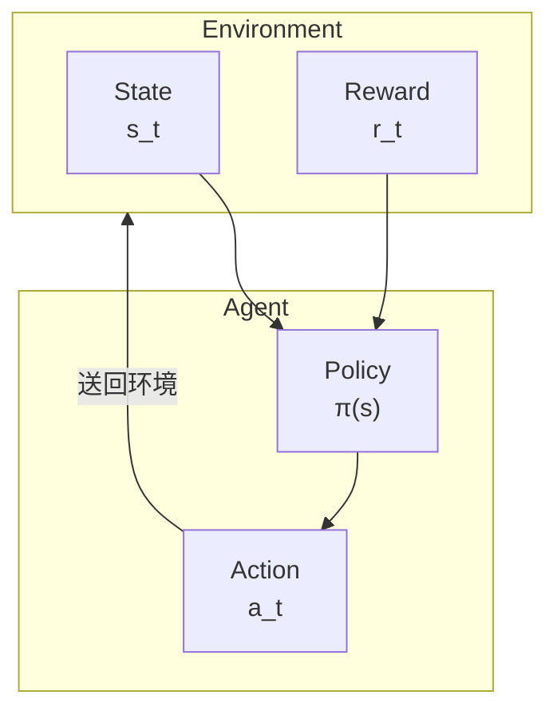

# 强化学习入门

在前面的文章中，我们介绍了 AlphaGo 如何使用监督学习从人类棋谱中学习。但监督学习有一个根本性的限制：**它只能模仿人类，无法超越人类**。

要让 AI 超越人类，我们需要一种不同的学习方法——**强化学习（Reinforcement Learning, RL）**。

这篇文章将带你从零开始理解强化学习的核心概念，为后续的自我对弈和 MCTS 整合打下基础。

---

## 什么是强化学习？

### 与其他学习方法的比较

机器学习主要有三种范式：

| 范式 | 学习方式 | 例子 |
|------|---------|------|
| **监督学习** | 从标记数据学习 | 图片分类、下一步预测 |
| **非监督学习** | 从未标记数据发现结构 | 聚类、降维 |
| **强化学习** | 从互动经验中学习 | 下棋、玩游戏、机器人控制 |

强化学习的独特之处在于：**没有人告诉你正确答案是什么，你必须透过尝试和错误自己发现**。

### 一个直观的例子

想象你在教一只小狗学习新把戏：

1. 狗做了某个动作（可能是随机的）
2. 如果动作正确，你给它零食（正面奖励）
3. 如果动作错误，你不给零食或轻声说「不对」（负面或零奖励）
4. 经过多次尝试，狗学会了哪些动作会带来奖励

这就是强化学习的本质：**透过奖励信号学习如何行动**。

### 强化学习在围棋中的应用

在围棋中：
- 每一手棋都是一个「动作」
- 对局结束时，胜负就是「奖励」
- AI 需要学习：哪些下法最终会导致胜利？

但这里有一个巨大的挑战：**奖励延迟**。一盘棋可能下 200 手以上，但只有最后才知道胜负。在第 50 手时下的一步棋，如何知道它对最终结果有多少贡献？

这就是强化学习最核心的问题之一，我们称之为**信用分配问题（Credit Assignment Problem）**。

---

## 核心概念

### Agent（智能体）与 Environment（环境）

强化学习的基本架构包含两个主角：



**Agent（智能体）**：
- 做出决策的主体
- 在围棋中，就是下棋的 AI
- 拥有一个「策略」(Policy)，决定在什么状态下采取什么动作

**Environment（环境）**：
- Agent 互动的对象
- 在围棋中，就是棋盘 + 对手
- 接收 Agent 的动作，返回新的状态和奖励

### State（状态）

**状态 s** 是对环境的完整描述。在围棋中：
- 状态包含：当前棋盘局面、轮到谁下、打劫状态等
- 状态空间极其庞大：约 $10^{170}$ 种可能的状态

状态必须具备**马可夫性质**：未来只取决于当前状态，与历史无关。

### Action（动作）

**动作 a** 是 Agent 可以采取的行为。在围棋中：
- 每个空点都是一个可能的动作
- 加上「虚手」（pass），共有 $19 \times 19 + 1 = 362$ 种动作
- 但实际上很多位置是非法的（如自杀、打劫）

### Reward（奖励）

**奖励 r** 是环境对动作的反馈。在围棋中：
- 胜利：$+1$
- 失败：$-1$
- 对局中：$0$（这是最具挑战性的地方！）

奖励信号的稀疏性是围棋强化学习的主要困难之一。

### Policy（策略）

**策略 π** 是 Agent 的行为准则，告诉它在每个状态下应该怎么做。

策略可以是：
- **确定性策略**：$a = \pi(s)$，每个状态对应唯一的动作
- **随机性策略**：$a \sim \pi(a|s)$，给出动作的概率分布

在 AlphaGo 中，Policy Network 就是一个随机性策略，输出每个位置的落子概率。

---

## 马可夫决策过程（MDP）

### MDP 的定义

**马可夫决策过程（Markov Decision Process, MDP）** 是强化学习的数学框架。

一个 MDP 由五元组 $(S, A, P, R, \gamma)$ 定义：

| 符号 | 意义 | 围棋中的对应 |
|------|------|-------------|
| $S$ | 状态空间 | 所有可能的棋盘局面 |
| $A$ | 动作空间 | 所有合法的落子位置 |
| $P(s'|s,a)$ | 转移概率 | 下一手后的局面变化 |
| $R(s,a,s')$ | 奖励函数 | 胜负结果 |
| $\gamma$ | 折扣因子 | 未来奖励的重要性 |

### 马可夫性质

MDP 的核心假设是**马可夫性质（Markov Property）**：

$$P(s_{t+1}|s_t, a_t, s_{t-1}, a_{t-1}, \ldots, s_0) = P(s_{t+1}|s_t, a_t)$$

用白话说：**未来只取决于现在，与过去无关**。

围棋符合这个性质吗？

表面上看，是的——只要知道当前棋盘状态，就知道所有合法走法。但实际上，围棋有**打劫规则**，需要记住前一步的状态。AlphaGo 透过将前 8 步的棋盘编码进输入特征来处理这个问题。

### 围棋是确定性 MDP

围棋有一个特殊的性质：**转移是确定性的**。

在棋类游戏中，当你下一手棋，棋盘状态的变化是完全确定的（不像骰子游戏有随机性）。所以：

$$P(s'|s,a) = \begin{cases} 1 & \text{如果 } s' \text{ 是执行 } a \text{ 后的状态} \\ 0 & \text{否则} \end{cases}$$

但别忘了，围棋是**双人游戏**，对手的下法会带来「不确定性」。这让问题变成了**对抗性 MDP**。

### 奖励设计

奖励函数的设计对强化学习至关重要。在围棋中，最自然的设计是：

$$R(s_T) = \begin{cases} +1 & \text{如果 AI 获胜} \\ -1 & \text{如果 AI 失败} \end{cases}$$

其中 $T$ 是对局结束的时间步。

这种**稀疏奖励**带来了巨大的挑战：
- 一盘棋可能有 200-300 步
- 只有最后一步才知道胜负
- 如何判断中间某一步的好坏？

有些研究尝试设计**密集奖励**，例如：
- 吃子奖励
- 领地估计奖励
- 形势判断奖励

但 AlphaGo 的成功表明：**即使只用终局胜负作为奖励，透过足够的自我对弈，AI 也能学会精妙的中盘战术**。

---

## 价值函数

### 为什么需要价值函数？

强化学习的目标是最大化**累积奖励**。但奖励是延迟的，我们需要一种方法来评估「现在的状态有多好」。

这就是**价值函数（Value Function）** 的作用。

### 状态价值函数 V(s)

**状态价值函数** $V^\pi(s)$ 定义为：从状态 $s$ 开始，遵循策略 $\pi$，预期能获得的累积奖励。

$$V^\pi(s) = \mathbb{E}_\pi \left[ \sum_{t=0}^{\infty} \gamma^t r_{t+1} \mid s_0 = s \right]$$

其中：
- $\mathbb{E}_\pi$ 表示在策略 $\pi$ 下的期望值
- $\gamma \in [0, 1]$ 是**折扣因子**，让近期奖励比远期奖励更重要
- $r_{t+1}$ 是时间步 $t+1$ 获得的奖励

在围棋中，$V(s)$ 可以解读为：**从当前局面开始，AI 获胜的概率**。AlphaGo 的 Value Network 就是学习这个函数。

### 动作价值函数 Q(s,a)

**动作价值函数** $Q^\pi(s,a)$ 更进一步，评估在状态 $s$ 下采取动作 $a$ 的价值：

$$Q^\pi(s,a) = \mathbb{E}_\pi \left[ \sum_{t=0}^{\infty} \gamma^t r_{t+1} \mid s_0 = s, a_0 = a \right]$$

$Q(s,a)$ 可以解读为：**在当前局面下这步棋，最终获胜的概率**。

### V 与 Q 的关系

这两个函数有紧密的关系：

$$V^\pi(s) = \sum_a \pi(a|s) Q^\pi(s,a)$$

也就是说，状态价值 = 所有可能动作的加权平均，权重由策略决定。

如果我们知道最佳策略 $\pi^*$：

$$V^*(s) = \max_a Q^*(s,a)$$

最佳状态价值 = 最佳动作的 Q 值。

### 贝尔曼方程

价值函数满足一个优美的递归关系——**贝尔曼方程（Bellman Equation）**：

$$V^\pi(s) = \sum_a \pi(a|s) \sum_{s'} P(s'|s,a) \left[ R(s,a,s') + \gamma V^\pi(s') \right]$$

用白话说：**当前状态的价值 = 即时奖励 + 折扣后的下一状态价值**。

这个方程是动态规划和许多强化学习算法的理论基础。

### AlphaGo 的 Value Network

在 AlphaGo 中，Value Network 学习的是 $V(s)$——评估当前局面的胜率。

```
输入：棋盘状态 s（19×19×17 的特征张量）
输出：胜率估计 V(s) ∈ [-1, 1]（使用 tanh 激活）
```

Value Network 的训练目标是预测最终结果：

$$L = \mathbb{E} \left[ (V_\theta(s) - z)^2 \right]$$

其中 $z \in \{-1, +1\}$ 是对局的实际结果。

---

## 策略梯度方法

### 从价值到策略

传统的强化学习方法（如 Q-Learning）是「基于价值」的：先学习价值函数，再从中导出策略。

但在围棋这样动作空间巨大的问题中，直接学习策略可能更有效。这就是**策略梯度（Policy Gradient）** 方法的思路。

### 策略的参数化

我们用神经网络来表示策略：

$$\pi_\theta(a|s)$$

其中 $\theta$ 是网络参数。网络输入状态 $s$，输出每个动作的概率。

在 AlphaGo 中，这就是 Policy Network：
- 输入：棋盘状态
- 输出：361 个位置的落子概率（加上 pass）

### 策略梯度定理

我们想找到最佳参数 $\theta^*$，使得期望累积奖励最大化：

$$J(\theta) = \mathbb{E}_{\pi_\theta} \left[ \sum_t r_t \right]$$

**策略梯度定理**告诉我们如何计算 $J$ 对 $\theta$ 的梯度：

$$\nabla_\theta J(\theta) = \mathbb{E}_{\pi_\theta} \left[ \sum_t \nabla_\theta \log \pi_\theta(a_t|s_t) \cdot G_t \right]$$

其中 $G_t = \sum_{k=t}^{T} \gamma^{k-t} r_k$ 是从时间 $t$ 开始的累积奖励。

### 直观理解

这个公式可以这样理解：

1. **$\nabla_\theta \log \pi_\theta(a_t|s_t)$**：如何调整参数让动作 $a_t$ 的概率增加
2. **$G_t$**：这个动作带来的总回报

所以：
- 如果 $G_t > 0$（好的结果），增加这个动作的概率
- 如果 $G_t < 0$（坏的结果），减少这个动作的概率

这就是**信用分配**的一种解决方案！

### REINFORCE 算法

**REINFORCE** 是最简单的策略梯度算法：

```
算法：REINFORCE

1. 初始化策略网络参数 θ

2. 重复：
   a. 用当前策略 π_θ 完成一局对弈，收集轨迹：
      τ = (s_0, a_0, r_1, s_1, a_1, r_2, ..., s_T)

   b. 计算每步的累积回报：
      G_t = r_{t+1} + γ·r_{t+2} + γ²·r_{t+3} + ...

   c. 计算策略梯度：
      ∇J = (1/T) Σ_t ∇_θ log π_θ(a_t|s_t) · G_t

   d. 更新参数：
      θ ← θ + α · ∇J
```

在围棋中，这意味着：
1. 让 AI 自己下一盘棋
2. 如果最终获胜（$G = +1$），增加所有下过的棋的概率
3. 如果最终失败（$G = -1$），减少所有下过的棋的概率
4. 重复这个过程数百万次

### 基准线（Baseline）

REINFORCE 的一个问题是**方差很大**。想象一盘赢的棋，里面可能也有一些不好的棋，但它们的概率都会被增加。

解决方案是引入**基准线（baseline）**：

$$\nabla_\theta J = \mathbb{E} \left[ \sum_t \nabla_\theta \log \pi_\theta(a_t|s_t) \cdot (G_t - b(s_t)) \right]$$

常见的选择是让 $b(s_t) = V(s_t)$，这就是**优势函数（Advantage Function）**：

$$A(s_t, a_t) = G_t - V(s_t)$$

优势函数衡量：「这个动作比平均好多少？」

- $A > 0$：这个动作比预期好，增加其概率
- $A < 0$：这个动作比预期差，减少其概率

AlphaGo 使用 Value Network 来计算基准线，这就是为什么需要同时训练 Policy Network 和 Value Network。

---

## 探索与利用

### 困境

强化学习面临一个经典的两难：**探索与利用（Exploration vs. Exploitation）**。

- **利用（Exploitation）**：根据目前所知，选择看起来最好的动作
- **探索（Exploration）**：尝试不确定的动作，可能发现更好的策略

纯粹的利用会陷入局部最优；纯粹的探索则浪费时间在明显的坏棋上。

### 围棋中的挑战

在围棋中，这个问题特别严重：

1. **动作空间巨大**：361 种可能的落子
2. **奖励稀疏**：只有终局才知道好坏
3. **长期影响**：一步棋的影响可能要几十手后才显现

### ε-Greedy 策略

最简单的探索方法：

$$\pi(a|s) = \begin{cases} 1 - \varepsilon + \frac{\varepsilon}{|A|} & \text{如果 } a = \arg\max Q(s,a) \\ \frac{\varepsilon}{|A|} & \text{否则} \end{cases}$$

以 $1-\varepsilon$ 的概率选择最佳动作，以 $\varepsilon$ 的概率随机选择。

但这对围棋来说太粗糙了——随机选一个位置下棋，大多数时候都是坏棋。

### Softmax 探索

更好的方法是使用 **softmax 分布**：

$$\pi(a|s) = \frac{\exp(Q(s,a)/\tau)}{\sum_{a'} \exp(Q(s,a')/\tau)}$$

其中 $\tau$ 是**温度参数**：
- $\tau \to 0$：接近贪婪策略（纯利用）
- $\tau \to \infty$：接近均匀随机（纯探索）
- $\tau = 1$：平衡探索与利用

AlphaGo 在自我对弈训练中使用类似的技术来增加多样性。

### UCB 与 PUCT

在 MCTS 中，探索与利用由 **UCB（Upper Confidence Bound）** 公式处理。AlphaGo 使用的是其变体 **PUCT**：

$$\text{score}(s,a) = Q(s,a) + c_{\text{puct}} \cdot P(s,a) \cdot \frac{\sqrt{N(s)}}{1 + N(s,a)}$$

这个公式在 [PUCT 公式详解](../puct-formula) 中会详细解释。

### 本质探索（Intrinsic Exploration）

AlphaGo 还有一种隐式的探索机制：**自我对弈本身就是探索**。

由于神经网络输出的是概率分布而非确定性动作，每次自我对弈都会产生不同的棋局。这自然带来了：

- **战术多样性**：同样的局面可能尝试不同的下法
- **风格演化**：随着训练，AI 可能「发现」人类从未尝试过的定式
- **自我修正**：如果某种下法总是输，概率会逐渐降低

---

## 围棋强化学习的特殊性

### 与其他领域的比较

围棋强化学习有一些独特的特性：

| 特性 | 围棋 | 机器人控制 | 电子游戏 |
|------|------|-----------|----------|
| 状态空间 | 离散、极大 | 连续 | 离散、中等 |
| 动作空间 | 离散、大 | 连续 | 离散、小 |
| 转移 | 确定性 | 随机 | 确定性或随机 |
| 奖励 | 极稀疏 | 可设计 | 中等密集 |
| 环境模型 | 已知（规则） | 未知 | 部分已知 |
| 对抗性 | 完美信息博弈 | 通常无 | 可能有 |

### 确定性转移

围棋的规则是完全已知的。当你下一手棋，下一个状态是确定的。这意味着：

- **可以精确模拟**：不需要学习环境模型
- **可以完美回溯**：MCTS 可以精确搜索
- **无需处理环境随机性**：简化了很多问题

### 完美信息

围棋是**完美信息博弈**——双方都能看到完整的棋盘。这与扑克（隐藏信息）不同，让问题在某些方面更简单：

- 不需要处理对手的隐藏信息
- 可以使用 Minimax 框架
- 状态表示更直接

### 自对弈的可能

因为规则已知且确定，AI 可以**与自己对弈**而不需要真实对手。这带来了：

- **无限的训练数据**：随时可以产生新的对局
- **稳定的对手水平**：对手就是自己，水平相当
- **渐进式提升**：随着自己变强，对手也变强

这正是 AlphaGo 成功的关键，我们将在下一篇 [自我对弈](../self-play) 中详细讨论。

### 长期信用分配

围棋的奖励极其稀疏（只有终局胜负），而一局棋可能有 200-300 步。这带来了严峻的**信用分配问题**：

第 50 手的一步好棋，到第 250 手获胜时，如何正确分配功劳？

AlphaGo 的解决方案是结合多种技术：
1. **Value Network**：评估中间局面的胜率，提供即时反馈
2. **MCTS**：搜索验证每步棋的好坏
3. **大量对弈**：透过统计学习信用分配

### 对称性

围棋棋盘有 8 重对称性（4 个旋转 × 2 个映射）。AlphaGo 利用这一点进行**数据增强**：

- 每个训练局面可以产生 8 个变体
- 大幅增加有效训练数据
- 确保网络学习到对称性不变的特征

---

## 算法比较

### 价值基础 vs 策略基础

| 方法 | 优点 | 缺点 | 适合场景 |
|------|------|------|---------|
| **价值基础** (Q-Learning) | 样本效率高 | 大动作空间难处理 | 动作空间小 |
| **策略基础** (REINFORCE) | 能处理大动作空间 | 方差大、样本效率低 | 动作空间大 |
| **Actor-Critic** | 平衡两者 | 需要同时训练两个网络 | 一般性强 |

### AlphaGo 的选择

AlphaGo 使用的是 **Actor-Critic** 架构的变体：

- **Policy Network**（Actor）：直接输出动作概率
- **Value Network**（Critic）：评估状态价值

但它没有使用传统的 Actor-Critic 更新方式，而是：

1. **监督学习**：先从人类棋谱学习初始 Policy Network
2. **策略梯度**：透过自我对弈强化 Policy Network
3. **回归学习**：用自我对弈数据训练 Value Network
4. **MCTS 整合**：在实际对弈中结合两个网络

这种混合方法结合了多种技术的优点，是 AlphaGo 成功的关键之一。

---

## 实作考量

### 训练稳定性

策略梯度方法有时会不稳定。常见的技术包括：

**梯度裁剪（Gradient Clipping）**：
```python
# 限制梯度的范数
max_grad_norm = 0.5
torch.nn.utils.clip_grad_norm_(policy_net.parameters(), max_grad_norm)
```

**学习率衰减**：
```python
# 随着训练进行降低学习率
scheduler = torch.optim.lr_scheduler.StepLR(optimizer, step_size=100, gamma=0.9)
```

**PPO/TRPO 等进阶算法**：
限制每次更新的策略变化，防止灾难性遗忘。

### 内存管理

围棋对局很长，需要存储大量轨迹。常见策略：

**经验回放（Experience Replay）**：
```python
# 储存过去的经验
replay_buffer = ReplayBuffer(max_size=1000000)

# 随机抽样训练
batch = replay_buffer.sample(batch_size=256)
```

**优先经验回放**：
优先重播那些「意外」的经验（TD 误差大的）。

### 并行化

强化学习可以高度并行化：

- **多线程对弈**：同时进行多局对弈
- **分散式训练**：多台机器同时训练
- **非同步更新**：A3C 等算法

AlphaGo 的训练使用了数百个 GPU 和 TPU，同时进行数千局自我对弈。

---

## 动画对应

本文涉及的核心概念与动画编号：

| 编号 | 概念 | 物理/数学对应 |
|------|------|--------------|
| 🎬 H1 | Agent-Environment 互动 | 马可夫链 |
| 🎬 H4 | 策略梯度 | 随机优化 |
| 🎬 H6 | 探索与利用 | 多臂赌博机 |

---

## 总结

强化学习是 AlphaGo 超越人类的关键技术。我们学习了：

1. **基本框架**：Agent、Environment、State、Action、Reward
2. **MDP**：马可夫决策过程，强化学习的数学基础
3. **价值函数**：$V(s)$ 和 $Q(s,a)$，评估状态和动作的好坏
4. **策略梯度**：直接优化策略的方法，REINFORCE 算法
5. **探索与利用**：学习过程中的核心权衡
6. **围棋特性**：确定性、完美信息、稀疏奖励的挑战与机遇

下一篇，我们将深入探讨 AlphaGo 如何利用**自我对弈**来实现超越人类的棋力。

---

## 延伸阅读

- **下一篇**：[自我对弈](../self-play) — 为什么 AI 能透过与自己下棋变强
- **相关**：[Value Network 详解](../value-network) — 价值函数的神经网络实现
- **进阶**：[PUCT 公式详解](../puct-formula) — 探索与利用的数学公式

---

## 参考资料

1. Sutton, R. S., & Barto, A. G. (2018). *Reinforcement Learning: An Introduction* (2nd ed.). MIT Press.
2. Silver, D. (2015). ["Lectures on Reinforcement Learning"](https://www.davidsilver.uk/teaching/). University College London.
3. Schulman, J., et al. (2017). "Proximal Policy Optimization Algorithms." *arXiv preprint*.
4. Williams, R. J. (1992). "Simple statistical gradient-following algorithms for connectionist reinforcement learning." *Machine Learning*, 8(3-4), 229-256.
5. Silver, D., et al. (2016). "Mastering the game of Go with deep neural networks and tree search." *Nature*, 529, 484-489.
