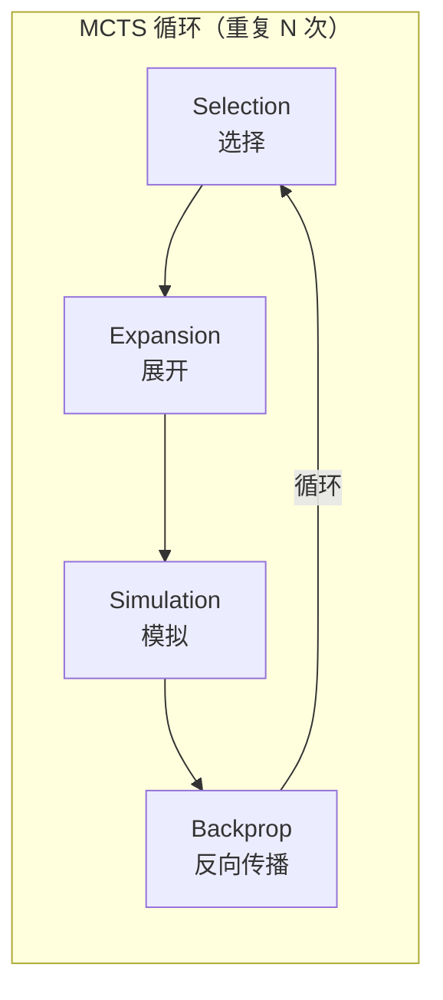
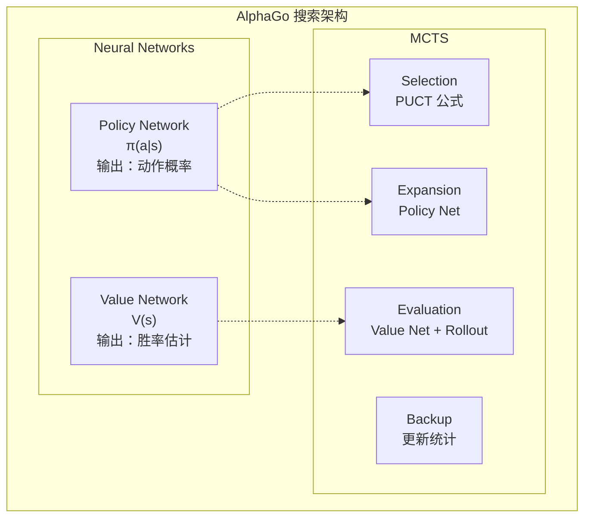

import { MCTSTree } from '@site/src/components/D3Charts';

# MCTS 与神经网络的结合

前面的文章中，我们分别介绍了神经网络（Policy Network 和 Value Network）以及强化学习的概念。现在，让我们探讨 AlphaGo 的核心创新——**如何将蒙特卡洛树搜索（MCTS）与神经网络完美结合**。

这个结合是 AlphaGo 成功的关键：神经网络提供「直觉」，MCTS 提供「推理」，两者相辅相成。

---

## 传统 MCTS 回顾

### 什么是 MCTS？

**蒙特卡洛树搜索（Monte Carlo Tree Search, MCTS）** 是一种基于随机采样的搜索算法，特别适合用于游戏 AI。

MCTS 的核心思想是：**与其穷举所有可能的走法，不如随机模拟大量对局，用统计来估计每个走法的好坏**。

### 四个阶段

传统的 MCTS 包含四个阶段，不断重复：



让我们详细了解每个阶段：

### 1. Selection（选择）

从根节点开始，沿着树向下，选择「最有希望」的子节点，直到到达叶节点。

选择的标准是 **UCB1（Upper Confidence Bound）** 公式：

$$\text{UCB1}(s, a) = \bar{X}_{s,a} + c \sqrt{\frac{\ln N_s}{N_{s,a}}}$$

其中：
- $\bar{X}_{s,a}$：从节点 $(s, a)$ 出发的平均回报（**利用项**）
- $\sqrt{\frac{\ln N_s}{N_{s,a}}}$：探索加成（**探索项**）
- $N_s$：父节点的访问次数
- $N_{s,a}$：子节点的访问次数
- $c$：平衡探索与利用的常数

这个公式的智慧在于：
- 访问次数少的节点会得到更高的探索加成
- 随着访问次数增加，选择会越来越偏向实际价值高的节点

### 2. Expansion（展开）

到达叶节点后，选择一个未被探索的动作，创建新的子节点。

```
展开前：                    展开后：
     ○ (根)                      ○ (根)
    /│\                         /│\
   ○ ○ ○                       ○ ○ ○
  /│              →           /│
 ○ ○                         ○ ○
   ↑                            \
   叶节点                         ● (新节点)
```

### 3. Simulation（模拟/Rollout）

从新节点开始，用某种策略（通常是随机或简单启发式）快速完成对局，得到结果。

这就是「蒙特卡洛」名称的来源——**用随机模拟来估计结果**。

传统 MCTS 的 rollout 策略可能是：
- **纯随机**：均匀随机选择合法走法
- **轻量级启发式**：用简单规则过滤明显的坏棋

### 4. Backpropagation（反向传播）

将模拟的结果（胜/负）沿着路径回传，更新每个节点的统计信息：

```
更新内容：
- 访问次数：N(s, a) ← N(s, a) + 1
- 累积价值：W(s, a) ← W(s, a) + z
- 平均价值：Q(s, a) = W(s, a) / N(s, a)
```

其中 $z$ 是模拟结果（+1 或 -1）。

### 传统 MCTS 的限制

传统 MCTS 在围棋上的表现有限，主要问题是：

1. **Rollout 品质差**：随机模拟经常产生不合理的对局
2. **需要大量模拟**：每步棋可能需要数万次模拟
3. **评估不准确**：单纯靠胜负统计，信息利用效率低
4. **无法利用模式**：每次都重新搜索，不累积经验

这些问题在 AlphaGo 中被神经网络优雅地解决了。

---

## 神经网络如何改进 MCTS

### 整体架构

AlphaGo 将两个神经网络整合进 MCTS：



### Policy Network 的角色

**Policy Network 在 Expansion 阶段发挥作用**。

传统 MCTS 在展开时，所有未探索的动作被视为同等重要。但 Policy Network 提供了**先验概率（prior probability）**：

$$P(s, a) = \pi_\theta(a|s)$$

这让 MCTS 优先探索那些「看起来更好」的走法，大幅提高搜索效率。

例如，在一个局面中：
- 「天元」可能只有 0.01% 的概率
- 「角部定式」可能有 15% 的概率
- 「大场」可能有 10% 的概率

MCTS 会优先探索高概率的走法，而不是浪费时间在明显不好的选择上。

### Value Network 的角色

**Value Network 在 Evaluation 阶段发挥作用**。

传统 MCTS 需要完成整局模拟才能得到评估。但 Value Network 可以直接评估任何局面的胜率：

$$v(s) = V_\phi(s)$$

这就像请一位大师评估局面，而不是让两个初学者下完整局再看结果。

AlphaGo 原版混合使用 Value Network 和 Rollout：

$$V(s_L) = (1 - \lambda) \cdot v_\theta(s_L) + \lambda \cdot z_L$$

其中：
- $v_\theta(s_L)$：Value Network 的评估
- $z_L$：Rollout 的结果
- $\lambda$：混合系数（AlphaGo 使用 $\lambda = 0.5$）

### 搜索树可视化

让我们可视化一个 MCTS 搜索树：

<MCTSTree width={700} height={450} showPUCT={true} interactive={true} />

在这个可视化中，你可以看到：
- 节点大小反映访问次数
- 蓝色路径是 MCTS 选择的最佳路径
- 每个节点显示访问次数 N 和平均价值 Q

---

## 搜索过程详解

### 完整流程

让我们跟踪一次完整的 MCTS 模拟：

```
算法：AlphaGo MCTS 单次模拟

输入：根节点 s_root，Policy Network π，Value Network V

1. Selection（选择）
   s = s_root
   路径 = []

   while s 不是叶节点:
       # 使用 PUCT 公式选择动作
       a* = argmax_a [Q(s,a) + U(s,a)]

       其中 U(s,a) = c_puct · P(s,a) · √N(s) / (1 + N(s,a))

       路径.append((s, a*))
       s = 执行动作 a* 后的状态

2. Expansion（展开）
   如果 s 不是终局状态:
       # 用 Policy Network 计算先验概率
       P(s, ·) = π(·|s)

       # 为所有合法动作创建子节点
       for a in 合法动作:
           创建子节点 (s, a)
           设置 P(s,a), N(s,a)=0, W(s,a)=0

3. Evaluation（评估）
   # 混合 Value Network 和 Rollout
   v = V(s)                          # Value Network 评估
   z = rollout(s)                    # Rollout 结果
   value = (1-λ)·v + λ·z             # 混合

   # AlphaGo Zero 简化为只用 Value Network
   # value = V(s)

4. Backpropagation（反向传播）
   for (s', a') in 反向(路径):
       N(s', a') += 1
       W(s', a') += value
       Q(s', a') = W(s', a') / N(s', a')
       value = -value                 # 切换视角
```

### 选择阶段详解

选择阶段使用 **PUCT 公式**（将在下一篇详细讨论）：

$$a^* = \arg\max_a \left[ Q(s,a) + c_{\text{puct}} \cdot P(s,a) \cdot \frac{\sqrt{N(s)}}{1 + N(s,a)} \right]$$

这个公式平衡了：
- **Q(s,a)**：已知的平均价值（利用）
- **U(s,a)**：探索加成，结合先验概率和访问次数（探索）

### 展开阶段详解

当到达叶节点时，使用 Policy Network 初始化新节点：

```python
def expand(state, policy_network):
    # 获取所有合法动作的概率
    action_probs = policy_network(state)

    # 过滤非法动作并重新归一化
    legal_actions = get_legal_actions(state)
    legal_probs = action_probs[legal_actions]
    legal_probs = legal_probs / legal_probs.sum()

    # 创建子节点
    for action, prob in zip(legal_actions, legal_probs):
        child = create_node(
            state=apply_action(state, action),
            prior=prob,
            visit_count=0,
            value_sum=0
        )
        add_child(current_node, action, child)
```

### 评估阶段详解

AlphaGo 原版混合使用两种评估：

**Value Network 评估**：
- 直接输入局面，输出胜率
- 计算快速（一次神经网络推理）
- 提供全局视角的评估

**Rollout 评估**：
- 用快速策略（Fast Rollout Policy）完成对局
- 计算较慢但提供完整的对局结果
- 可以发现一些神经网络可能忽略的战术

```python
def evaluate(state, value_network, rollout_policy, lambda_mix=0.5):
    # Value Network 评估
    v = value_network(state)

    # Rollout 评估
    current = state
    while not is_terminal(current):
        action = rollout_policy(current)
        current = apply_action(current, action)
    z = get_result(current)

    # 混合
    return (1 - lambda_mix) * v + lambda_mix * z
```

AlphaGo Zero 移除了 Rollout，只使用 Value Network。这简化了系统并提高了效率。

### 反向传播详解

将评估结果沿路径回传，更新统计：

```python
def backpropagate(path, value):
    for state, action in reversed(path):
        # 更新访问次数
        state.visit_count[action] += 1
        # 更新价值总和
        state.value_sum[action] += value
        # 更新平均价值
        state.Q[action] = state.value_sum[action] / state.visit_count[action]
        # 切换视角（对手的好处是我的坏处）
        value = -value
```

注意 `value = -value` 这一步：围棋是零和游戏，一方的胜利就是另一方的失败。

---

## 计算资源分配

### 搜索次数

AlphaGo 在每步棋上执行大量的 MCTS 模拟：

| 版本 | 每步模拟次数 | 思考时间 |
|------|-------------|---------|
| AlphaGo Fan | ~100,000 | 分钟级 |
| AlphaGo Lee | ~100,000 | 分钟级 |
| AlphaGo Zero (训练) | 1,600 | 秒级 |
| AlphaGo Zero (比赛) | ~1,600 | 秒级 |

AlphaGo Zero 用更少的模拟达到更强的棋力，这是神经网络品质提升的结果。

### 时间分配策略

不同局面可能需要不同的思考时间：

```python
def allocate_time(game_state, remaining_time):
    # 基本分配
    num_moves_remaining = estimate_remaining_moves(game_state)
    base_time = remaining_time / num_moves_remaining

    # 调整因素
    complexity = estimate_complexity(game_state)
    importance = estimate_importance(game_state)

    # 复杂或重要的局面给更多时间
    allocated_time = base_time * complexity * importance

    # 确保不超时
    return min(allocated_time, remaining_time * 0.3)
```

在实际比赛中，AlphaGo 会在关键局面（如接近胜负分界的时刻）投入更多思考时间。

### 并行搜索

MCTS 天然适合并行化：

**虚拟损失（Virtual Loss）** 技术：

```
当一个线程正在探索路径 P 时：
1. 暂时假装这条路径已经输了（virtual loss）
2. 其他线程会倾向探索其他路径
3. 当结果回来时，更新真实统计并移除虚拟损失
```

这确保了多个线程不会重复探索相同的路径。

```python
def parallel_mcts_simulation(root, num_threads=8):
    virtual_losses = {}

    def simulate(thread_id):
        # 选择阶段（带虚拟损失）
        path = []
        node = root
        while not node.is_leaf():
            action = select_with_virtual_loss(node, virtual_losses)
            add_virtual_loss(node, action, virtual_losses)
            path.append((node, action))
            node = node.children[action]

        # 展开和评估
        value = expand_and_evaluate(node)

        # 反向传播并移除虚拟损失
        backpropagate(path, value)
        remove_virtual_losses(path, virtual_losses)

    # 并行执行多个模拟
    threads = [Thread(target=simulate, args=(i,)) for i in range(num_threads)]
    for t in threads:
        t.start()
    for t in threads:
        t.join()
```

### GPU 批次处理

神经网络推理在 GPU 上最有效率的方式是批次处理。AlphaGo 使用**批次评估**：

```
不使用批次：
  模拟 1 → 评估 1 → 模拟 2 → 评估 2 → ...
  GPU 利用率低

使用批次：
  收集 32 个待评估的局面
  → 一次性送入 GPU 评估
  → 返回 32 个结果
  GPU 利用率高
```

这需要更复杂的调度，但大幅提高了吞吐量。

---

## 温度与最终选择

### 训练时的温度

在自我对弈训练时，AlphaGo 使用**温度**来控制探索：

$$\pi(a) = \frac{N(s,a)^{1/\tau}}{\sum_{a'} N(s,a')^{1/\tau}}$$

其中 $\tau$ 是温度参数。

- $\tau = 1$：概率正比于访问次数（保持多样性）
- $\tau \to 0$：选择访问次数最多的动作（确定性选择）

AlphaGo Zero 的策略：
- **前 30 手**：$\tau = 1$，保持开局多样性
- **之后**：$\tau \to 0$，选择最佳走法

### 比赛时的选择

在实际比赛中，选择通常是确定性的：

```python
def select_move(root, temperature=0):
    if temperature == 0:
        # 选择访问次数最多的动作
        return argmax(root.visit_counts)
    else:
        # 按温度调整的概率分布采样
        probs = root.visit_counts ** (1 / temperature)
        probs = probs / probs.sum()
        return np.random.choice(actions, p=probs)
```

### 考虑胜率

有时也会考虑平均价值而非仅访问次数：

```python
def select_move_with_value(root, temperature=0):
    # 混合访问次数和价值
    scores = root.visit_counts * (1 + root.Q_values)
    scores = scores / scores.sum()

    if temperature == 0:
        return argmax(scores)
    else:
        probs = scores ** (1 / temperature)
        probs = probs / probs.sum()
        return np.random.choice(actions, p=probs)
```

---

## 与纯神经网络的比较

### 为什么需要搜索？

一个自然的问题是：**既然神经网络已经可以预测好的走法，为什么还需要搜索？**

答案是：**搜索可以修正神经网络的错误并发现更好的走法**。

| 方法 | 优点 | 缺点 |
|------|------|------|
| 纯神经网络 | 快速、直觉 | 可能有盲点 |
| 纯 MCTS | 可以深入分析 | 慢、需要评估 |
| 神经网络 + MCTS | 结合两者优点 | 计算量大 |

### 实验证据

DeepMind 的实验显示：

```
纯 Policy Network：约 3000 Elo
Policy + 少量 MCTS：约 3500 Elo
Policy + Value + MCTS：约 4500 Elo
```

搜索提供了显著的棋力提升。

### 搜索的作用

搜索在以下情况特别有价值：

1. **战术计算**：读出复杂的攻杀
2. **修正偏见**：纠正神经网络的系统性错误
3. **处理罕见局面**：神经网络训练时可能没见过
4. **验证直觉**：确认「好看」的棋确实是好棋

---

## AlphaGo 各版本的差异

### AlphaGo Fan/Lee

```
架构：
- SL Policy Network（监督学习）
- RL Policy Network（强化学习）
- Value Network
- Fast Rollout Policy

搜索时：
- 用 SL Policy Network 的先验概率
- 混合 Value Network 和 Rollout 评估
```

### AlphaGo Master

```
架构：
- 更大的神经网络
- 更多的训练数据
- 改进的特征

搜索时：
- 类似 AlphaGo Lee
- 更强的网络 = 更少的搜索需求
```

### AlphaGo Zero

```
架构：
- 单一双头 ResNet
- 从零开始训练
- 无 Rollout

搜索时：
- 策略头提供先验概率
- 价值头直接评估
- 更简洁、更强
```

### 演进总结

```
AlphaGo Fan (2015)
    │
    │ + 更大网络、更多训练
    ▼
AlphaGo Lee (2016)
    │
    │ + 更多自我对弈
    ▼
AlphaGo Master (2017)
    │
    │ + 移除人类数据、统一网络、移除 Rollout
    ▼
AlphaGo Zero (2017)
    │
    │ + 泛化到其他游戏
    ▼
AlphaZero (2018)
```

---

## 实现考量

### 内存管理

MCTS 树可以变得很大：

```
假设：
- 每步平均 200 个合法动作
- 搜索深度 10
- 完全展开：200^10 ≈ 10^23 个节点（不可能）

实际做法：
- 只展开被访问的节点
- 定期清理很少访问的节点
- 重用上一步的搜索树
```

### 树的重用

当对手下棋后，可以重用部分搜索树：

```python
def reuse_tree(root, opponent_move):
    if opponent_move in root.children:
        new_root = root.children[opponent_move]
        # 清理不需要的其他分支
        for action in root.children:
            if action != opponent_move:
                delete_subtree(root.children[action])
        return new_root
    else:
        # 对手下了意外的棋，需要重新开始
        return create_new_root()
```

### 神经网络缓存

同一局面可能被多次评估，使用缓存避免重复计算：

```python
class NeuralNetworkCache:
    def __init__(self, max_size=100000):
        self.cache = LRUCache(max_size)

    def evaluate(self, state, network):
        state_hash = hash(state)
        if state_hash in self.cache:
            return self.cache[state_hash]
        else:
            result = network(state)
            self.cache[state_hash] = result
            return result
```

### 对称性利用

围棋有 8 重对称性，可以用来增强搜索：

```python
def evaluate_with_symmetry(state, network):
    # 生成所有对称变换
    symmetries = generate_symmetries(state)  # 8 个版本

    # 评估所有版本
    values = [network(s) for s in symmetries]

    # 平均（更稳定）
    return np.mean(values)
```

---

## 搜索深度与广度

### 动态调整

MCTS 自动平衡深度与广度：

- **广度**：由 Policy Network 的先验概率控制
- **深度**：由 Value Network 的准确度决定

当神经网络很好时：
- 高置信的走法会被深入探索
- 低置信的走法被快速排除
- 搜索自然聚焦在重要的分支

### 与传统搜索的比较

| 方法 | 深度控制 | 广度控制 |
|------|---------|---------|
| Minimax | 固定深度 | Alpha-Beta 剪枝 |
| 传统 MCTS | 由模拟决定 | UCB1 |
| AlphaGo MCTS | Policy + Value 引导 | PUCT + Policy |

AlphaGo 的搜索更「智能」——它知道哪些地方值得深入，哪些可以快速略过。

---

## 动画对应

本文涉及的核心概念与动画编号：

| 编号 | 概念 | 物理/数学对应 |
|------|------|--------------|
| 🎬 C5 | MCTS 四阶段 | 树搜索 |

---

## 总结

MCTS 与神经网络的结合是 AlphaGo 的核心创新。我们学习了：

1. **传统 MCTS**：Selection、Expansion、Simulation、Backpropagation
2. **神经网络改进**：Policy Network 引导展开、Value Network 替代 Rollout
3. **搜索过程**：PUCT 选择、批次评估、反向传播
4. **资源分配**：模拟次数、时间管理、并行搜索
5. **温度选择**：训练与比赛的不同策略
6. **实现细节**：内存管理、树重用、缓存

下一篇，我们将深入探讨 PUCT 公式的数学细节。

---

## 延伸阅读

- **下一篇**：[PUCT 公式详解](../puct-formula) — MCTS 选择的数学原理
- **上一篇**：[自我对弈](../self-play) — 自我对弈的机制与效果
- **相关**：[Policy Network 详解](../policy-network) — 策略网络的架构

---

## 参考资料

1. Silver, D., et al. (2016). "Mastering the game of Go with deep neural networks and tree search." *Nature*, 529, 484-489.
2. Silver, D., et al. (2017). "Mastering the game of Go without human knowledge." *Nature*, 550, 354-359.
3. Coulom, R. (2006). "Efficient Selectivity and Backup Operators in Monte-Carlo Tree Search." *Computers and Games*.
4. Kocsis, L., & Szepesvári, C. (2006). "Bandit based Monte-Carlo Planning." *ECML*.
5. Browne, C., et al. (2012). "A Survey of Monte Carlo Tree Search Methods." *IEEE TCIAIG*.
6. Rosin, C. D. (2011). "Multi-armed bandits with episode context." *Annals of Mathematics and Artificial Intelligence*.
