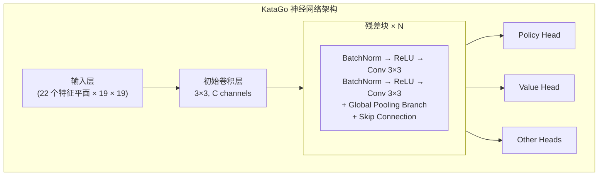
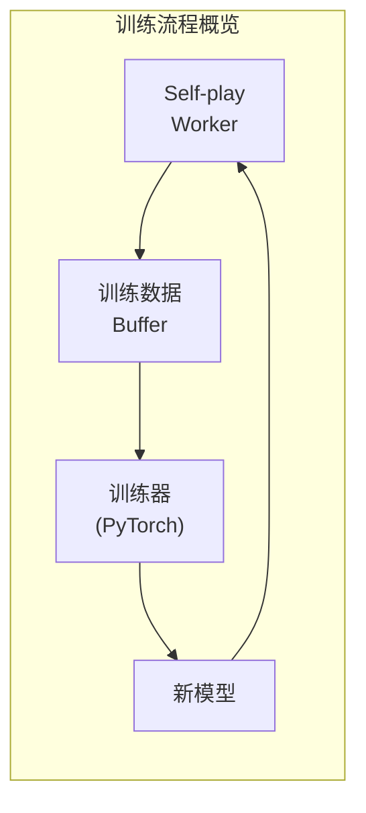

# KataGo 源代码架构

本文深入解析 KataGo 的源代码结构，帮助你理解其内部实现。无论你是想贡献代码、修改功能，还是将其技术应用到自己的项目，这里都是必读的参考资料。

## 项目目录结构

```
KataGo/
├── cpp/                    # C++ 核心代码
│   ├── main.cpp           # 主程序入口
│   ├── command/           # 各种执行模式
│   ├── core/              # 核心工具类
│   ├── game/              # 围棋规则与棋盘
│   ├── search/            # MCTS 搜索引擎
│   ├── neuralnet/         # 神经网络接口
│   ├── dataio/            # 数据 I/O
│   ├── configs/           # 配置文件示例
│   └── tests/             # 单元测试
├── python/                 # Python 训练代码
│   ├── train.py           # 训练主程序
│   ├── model.py           # 模型定义
│   ├── data_processing_pytorch.py
│   └── configs/           # 训练配置
├── docs/                   # 文档
└── scripts/               # 辅助脚本
```

### cpp/ 目录详解

```
cpp/
├── main.cpp                # 程序入口，解析命令行参数
├── command/
│   ├── gtp.cpp            # GTP 协议实现
│   ├── analysis.cpp       # Analysis Engine 实现
│   ├── benchmark.cpp      # 基准测试
│   ├── genconfig.cpp      # 配置文件生成
│   └── selfplay.cpp       # 自我对弈
├── core/
│   ├── global.h           # 全局常量与设置
│   ├── hash.h             # Zobrist 哈希
│   ├── rand.h             # 随机数生成
│   ├── logger.h           # 日志系统
│   ├── config_parser.h    # 配置文件解析
│   └── threadsafe*.h      # 线程安全工具
├── game/
│   ├── board.h/cpp        # 棋盘表示与基本操作
│   ├── rules.h/cpp        # 围棋规则
│   ├── boardhistory.h/cpp # 棋局历史
│   └── graphhash.h/cpp    # 局面哈希
├── search/
│   ├── search.h/cpp       # 搜索引擎主类
│   ├── searchnode.h/cpp   # 搜索树节点
│   ├── searchparams.h     # 搜索参数
│   ├── mutexpool.h        # 锁池
│   ├── searchresults.h    # 搜索结果
│   └── asyncbot.h/cpp     # 异步机器人
├── neuralnet/
│   ├── nninputs.h/cpp     # 神经网络输入特征
│   ├── nneval.h/cpp       # 神经网络评估
│   ├── nninterface.h      # 后端抽象接口
│   ├── cudabackend.cpp    # CUDA 后端
│   ├── openclbackend.cpp  # OpenCL 后端
│   ├── eigenbackend.cpp   # Eigen(CPU) 后端
│   └── modelversion.h     # 模型版本管理
└── dataio/
    ├── sgf.h/cpp          # SGF 文件处理
    ├── numpywrite.h/cpp   # NumPy 格式输出
    └── trainingwrite.h/cpp # 训练数据写入
```

## 神经网络架构

### 网络结构概览



### 输入特征（nninputs.cpp）

KataGo 使用 22 个特征平面作为输入：

```cpp
// 主要输入特征类别
enum {
  // 棋盘状态
  INPUT_FEATURE_STONE_OUR,      // 我方棋子
  INPUT_FEATURE_STONE_OPP,      // 对方棋子

  // 气数相关（1-8气）
  INPUT_FEATURE_LIBERTIES_1,
  INPUT_FEATURE_LIBERTIES_2,
  // ...
  INPUT_FEATURE_LIBERTIES_8_OR_MORE,

  // 历史状态
  INPUT_FEATURE_LAST_MOVE,      // 上一手位置
  INPUT_FEATURE_SECOND_LAST_MOVE,

  // 规则相关
  INPUT_FEATURE_KOMI,           // 贴目
  INPUT_FEATURE_RULES,          // 规则编码
  // ...
};
```

### 全局池化分支

KataGo 的创新之一是在残差块中加入全局池化：

```cpp
// 简化的全局池化实现概念
class GlobalPoolingResBlock {
public:
  void forward(Tensor& x) {
    // 标准残差路径
    Tensor regular_out = regular_conv_path(x);

    // 全局池化路径
    Tensor global_mean = global_avg_pool(x);  // [batch, C]
    Tensor global_max = global_max_pool(x);    // [batch, C]
    Tensor global_features = concat(global_mean, global_max);

    // 处理全局特征
    global_features = dense_layer(global_features);  // [batch, C]

    // 广播回空间维度并与常规路径结合
    Tensor global_broadcast = broadcast_to_spatial(global_features);
    x = regular_out + global_broadcast;
  }
};
```

### 输出头

```cpp
// Policy Head：预测落子概率
class PolicyHead {
  // 输出：19×19+1（含 pass）
  // 使用 softmax 归一化
};

// Value Head：预测胜负
class ValueHead {
  // 输出：3（胜/负/和概率）
  // 使用 softmax 归一化
};

// Score Head：预测目数
class ScoreHead {
  // 输出：连续值（预期目数差）
};

// Ownership Head：预测领地
class OwnershipHead {
  // 输出：19×19（每点归属，tanh）
};
```

## 搜索引擎实现

### MCTS 核心类

```cpp
// search/search.h
class Search {
public:
  // 执行搜索
  void runWholeSearch(Player pla);

  // 获取最佳着法
  Loc getBestMove();

  // 获取分析结果
  AnalysisData getAnalysisData();

private:
  SearchParams params;          // 搜索参数
  SearchNode* rootNode;         // 根节点
  NNEvaluator* nnEval;         // 神经网络评估器
  std::mutex* mutexPool;       // 锁池
};
```

### 搜索节点结构

```cpp
// search/searchnode.h
struct SearchNode {
  // 节点统计
  std::atomic<int64_t> visits;           // 访问次数
  std::atomic<double> valueSumWeight;    // 价值累积权重
  std::atomic<double> valueSum;          // 价值累积和

  // 子节点
  std::atomic<int> numChildren;
  SearchChildPointer* children;          // 子节点指针数组

  // 神经网络输出缓存
  std::shared_ptr<NNOutput> nnOutput;
};

struct SearchChildPointer {
  Loc moveLoc;                           // 着点
  std::atomic<SearchNode*> node;         // 子节点指针
  std::atomic<int64_t> edgeVisits;       // 边访问次数
};
```

### PUCT 选择算法

```cpp
// 选择要探索的子节点
int Search::selectChildToDescend(SearchNode* node, Player pla) {
  int bestIdx = -1;
  double bestValue = -1e100;

  for (int i = 0; i < node->numChildren; i++) {
    SearchChildPointer& child = node->children[i];

    // 计算 Q 值（exploitation）
    double q = getChildQ(child);

    // 计算 U 值（exploration）
    double prior = getPrior(node, child.moveLoc);
    double parentVisits = node->visits.load();
    double childVisits = child.edgeVisits.load();

    double u = params.cpuctExploration * prior *
               sqrt(parentVisits) / (1.0 + childVisits);

    // PUCT 公式
    double value = q + u;

    if (value > bestValue) {
      bestValue = value;
      bestIdx = i;
    }
  }

  return bestIdx;
}
```

### 并行搜索实现

```cpp
void Search::runWholeSearch(Player pla) {
  // 启动多个搜索线程
  std::vector<std::thread> threads;
  for (int i = 0; i < params.numSearchThreads; i++) {
    threads.emplace_back([this, pla]() {
      runSingleSearchThread(pla);
    });
  }

  // 等待所有线程完成
  for (auto& t : threads) {
    t.join();
  }
}

void Search::runSingleSearchThread(Player pla) {
  while (!shouldStop()) {
    // 选择路径
    std::vector<SearchNode*> path;
    SearchNode* leaf = selectAndDescend(rootNode, path);

    // 扩展节点
    expandNode(leaf);

    // 神经网络评估
    NNOutput output = nnEval->evaluate(leaf->board);

    // 回传更新
    backpropagateValue(path, output.value);
  }
}
```

### 虚拟损失（Virtual Loss）

用于并行搜索时避免多线程选择相同路径：

```cpp
void Search::applyVirtualLoss(SearchNode* node) {
  // 暂时减少此节点的评估值
  // 使其他线程倾向于选择不同路径
  node->virtualLoss.fetch_add(1);
}

void Search::removeVirtualLoss(SearchNode* node) {
  node->virtualLoss.fetch_sub(1);
}
```

## 训练流程概述

### 训练数据生成



### 自我对弈（cpp/command/selfplay.cpp）

```cpp
// Self-play 主循环
void runSelfPlayLoop() {
  while (true) {
    // 加载最新模型
    loadLatestModel();

    // 进行一局对弈
    GameData gameData = playSingleGame();

    // 保存训练数据
    writeTrainingData(gameData);
  }
}

GameData playSingleGame() {
  Board board;
  BoardHistory history;
  GameData gameData;

  while (!history.isGameOver()) {
    // 使用 MCTS 选择着法
    Search search(board, history, params);
    search.runWholeSearch(history.currentPla);

    // 获取 MCTS 结果作为训练目标
    MoveData moveData;
    moveData.policyTarget = search.getPolicyDistribution();
    moveData.valueTarget = search.getValue();

    // 执行着法
    Loc move = search.sampleMove();
    board.playMove(move, history.currentPla);

    gameData.moves.push_back(moveData);
  }

  // 回填最终结果
  gameData.finalScore = history.finalScore();
  return gameData;
}
```

### 训练数据格式

```cpp
// dataio/trainingwrite.h
struct TrainingRow {
  // 输入特征
  float inputFeatures[NUM_FEATURES][BOARD_SIZE][BOARD_SIZE];

  // 训练目标
  float policyTarget[BOARD_SIZE * BOARD_SIZE + 1];  // 含 pass
  float valueTarget[3];                              // 胜/负/和
  float scoreTarget;                                 // 目数
  float ownershipTarget[BOARD_SIZE][BOARD_SIZE];    // 领地

  // 元数据
  int turn;
  int rules;
  float komi;
};
```

### Python 训练程序（python/train.py）

```python
# 训练主循环（简化）
def train():
    model = KataGoModel(config)
    optimizer = torch.optim.SGD(model.parameters(), lr=config.lr)

    for epoch in range(config.num_epochs):
        for batch in data_loader:
            # 前向传播
            policy_pred, value_pred, score_pred, ownership_pred = model(batch.input)

            # 计算损失
            policy_loss = cross_entropy(policy_pred, batch.policy_target)
            value_loss = cross_entropy(value_pred, batch.value_target)
            score_loss = mse_loss(score_pred, batch.score_target)
            ownership_loss = mse_loss(ownership_pred, batch.ownership_target)

            # 总损失（加权和）
            total_loss = (
                policy_loss +
                config.value_weight * value_loss +
                config.score_weight * score_loss +
                config.ownership_weight * ownership_loss
            )

            # 反向传播
            optimizer.zero_grad()
            total_loss.backward()
            optimizer.step()

        # 保存 checkpoint
        save_checkpoint(model, epoch)
```

### 模型定义（python/model.py）

```python
class KataGoModel(nn.Module):
    def __init__(self, config):
        super().__init__()

        # 初始卷积
        self.initial_conv = nn.Conv2d(
            config.input_channels,
            config.trunk_channels,
            kernel_size=3, padding=1
        )

        # 残差块
        self.blocks = nn.ModuleList([
            ResBlock(config.trunk_channels, use_global_pooling=True)
            for _ in range(config.num_blocks)
        ])

        # 输出头
        self.policy_head = PolicyHead(config)
        self.value_head = ValueHead(config)
        self.score_head = ScoreHead(config)
        self.ownership_head = OwnershipHead(config)

    def forward(self, x):
        # 主干网络
        x = self.initial_conv(x)
        for block in self.blocks:
            x = block(x)

        # 各输出头
        policy = self.policy_head(x)
        value = self.value_head(x)
        score = self.score_head(x)
        ownership = self.ownership_head(x)

        return policy, value, score, ownership
```

## 关键数据结构

### Board（game/board.h）

```cpp
class Board {
public:
  // 棋盘状态
  Color stones[MAX_BOARD_AREA];    // 每个点的颜色
  Chain chains[MAX_BOARD_AREA];    // 棋串信息

  // 劫争
  Loc koLoc;

  // 执行着法
  void playMove(Loc loc, Color pla);

  // 合法性检查
  bool isLegal(Loc loc, Color pla) const;

  // 气数计算
  int getLiberties(Loc loc) const;
};

struct Chain {
  int liberties;                   // 气数
  int numStones;                   // 棋子数
  Loc head;                        // 链表头
};
```

### BoardHistory（game/boardhistory.h）

```cpp
class BoardHistory {
public:
  std::vector<Board> boards;       // 历史棋盘状态
  std::vector<Move> moves;         // 着法历史
  Rules rules;                     // 规则
  Player currentPla;               // 当前轮到谁

  // 游戏状态
  bool isGameOver() const;
  float finalScore() const;
};
```

### NNOutput（neuralnet/nneval.h）

```cpp
struct NNOutput {
  // Policy
  float policyProbs[MAX_BOARD_AREA + 1];  // 含 pass

  // Value
  float whiteWinProb;
  float whiteLossProb;
  float noResultProb;

  // Score
  float whiteScoreMean;
  float whiteScoreStdev;

  // Ownership
  float ownership[MAX_BOARD_AREA];  // -1 到 1
};
```

## 开发与调试

### 编译测试版本

```bash
cd cpp
mkdir build_debug && cd build_debug
cmake .. -DCMAKE_BUILD_TYPE=Debug -DUSE_BACKEND=OPENCL
make -j$(nproc)
```

### 运行单元测试

```bash
./katago runtests
```

### 常用调试方法

```cpp
// 1. 使用日志
#include "core/logger.h"
Logger::log("Debug message", value);

// 2. 使用 kata-debug-print GTP 指令
// 输出详细的搜索信息

// 3. 编译时启用 sanitizers
cmake .. -DCMAKE_CXX_FLAGS="-fsanitize=address"
```

### 性能分析

```bash
# 使用 perf（Linux）
perf record ./katago benchmark -model model.bin.gz
perf report

# 使用 Instruments（macOS）
instruments -t "Time Profiler" ./katago benchmark -model model.bin.gz
```

## 延伸阅读

- [KataGo GitHub](https://github.com/lightvector/KataGo)
- [KataGo 论文](https://arxiv.org/abs/1902.10565)
- [KataGo Discord](https://discord.gg/bqkZAz3) - 与开发者交流
- [KataGo Training](https://katagotraining.org/) - 查看训练进度

理解了 KataGo 的源代码架构后，你已经具备了深入研究或贡献开源项目的能力。如果想要进一步了解，建议直接阅读 KataGo 的 GitHub 源代码，并参与社区讨论。
