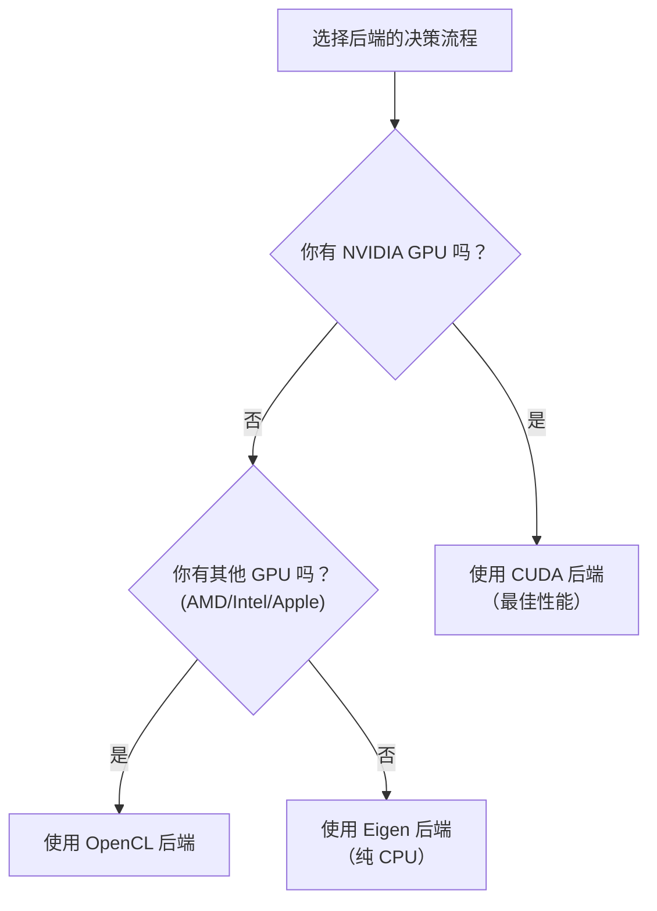

# KataGo 安装与设置

本文将详细介绍如何在各平台上安装 KataGo，包括系统需求、安装步骤、模型选择和配置文件说明。

## 系统需求

### 硬件需求

#### GPU（推荐）

| GPU 类型 | 支持状态 | 建议后端 |
|---------|---------|---------|
| NVIDIA（CUDA） | 最佳支持 | CUDA |
| NVIDIA（无 CUDA） | 良好支持 | OpenCL |
| AMD | 良好支持 | OpenCL |
| Intel 集显 | 基本支持 | OpenCL |
| Apple Silicon | 良好支持 | Metal / OpenCL |

#### CPU 模式

如果没有合适的 GPU，可以使用 Eigen 后端纯 CPU 运行：
- 性能较低（约 10-30 playouts/sec）
- 适合学习、测试和低强度使用
- 需要 AVX2 指令集支持（大多数现代 CPU 都支持）

### 软件需求

| 操作系统 | 版本要求 |
|---------|---------|
| **Linux** | Ubuntu 18.04+, CentOS 7+ 或其他现代发行版 |
| **macOS** | 10.14+ (Mojave 或更新) |
| **Windows** | Windows 10 或更新 |

### 后端选择指南



## macOS 安装

### 方法 1：Homebrew（推荐）

最简单的安装方式，自动处理所有依赖。

```bash
# 安装 KataGo
brew install katago

# 确认安装成功
katago version
```

Homebrew 版本默认使用 OpenCL 后端，在 Intel Mac 和 Apple Silicon 上都能运行。

### 方法 2：从源代码编译

适合需要自定义选项或最新功能的用户。

#### 安装依赖

```bash
# 安装 CMake 和编译工具
brew install cmake

# 如果使用 OpenCL
# macOS 已内置 OpenCL 支持，无需额外安装
```

#### 编译步骤

```bash
# 克隆源代码
git clone https://github.com/lightvector/KataGo.git
cd KataGo/cpp

# 创建编译目录
mkdir build && cd build

# 设置编译选项（OpenCL 后端）
cmake .. -DUSE_BACKEND=OPENCL

# 编译
make -j$(sysctl -n hw.ncpu)

# 编译完成后，可执行文件位于 build/katago
./katago version
```

#### Apple Silicon 特别说明

在 M1/M2/M3 Mac 上，建议使用 OpenCL 或 Metal 后端：

```bash
# OpenCL 后端（推荐，兼容性较好）
cmake .. -DUSE_BACKEND=OPENCL

# Metal 后端（实验性，可能有更好性能）
cmake .. -DUSE_BACKEND=METAL
```

## Linux 安装

### 方法 1：预编译版本（推荐）

从 GitHub Releases 下载预编译版本：

```bash
# 下载 OpenCL 版本（适用于大多数情况）
wget https://github.com/lightvector/KataGo/releases/download/v1.15.3/katago-v1.15.3-opencl-linux-x64.zip

# 或下载 CUDA 版本（NVIDIA GPU）
wget https://github.com/lightvector/KataGo/releases/download/v1.15.3/katago-v1.15.3-cuda11.1-linux-x64.zip

# 解压缩
unzip katago-v1.15.3-*.zip

# 赋予执行权限
chmod +x katago

# 确认安装
./katago version
```

### 方法 2：从源代码编译

#### CUDA 后端（NVIDIA GPU）

```bash
# 安装依赖
sudo apt update
sudo apt install cmake g++ libzip-dev

# 安装 CUDA（如果尚未安装）
# 请参考 NVIDIA 官方指南：https://developer.nvidia.com/cuda-downloads

# 克隆并编译
git clone https://github.com/lightvector/KataGo.git
cd KataGo/cpp
mkdir build && cd build

# 设置 CUDA 后端
cmake .. -DUSE_BACKEND=CUDA

# 编译
make -j$(nproc)
```

#### OpenCL 后端（通用 GPU）

```bash
# 安装依赖
sudo apt update
sudo apt install cmake g++ libzip-dev ocl-icd-opencl-dev

# 安装 OpenCL 驱动
# NVIDIA: 随 CUDA 安装
# AMD: sudo apt install mesa-opencl-icd
# Intel: sudo apt install intel-opencl-icd

# 克隆并编译
git clone https://github.com/lightvector/KataGo.git
cd KataGo/cpp
mkdir build && cd build

cmake .. -DUSE_BACKEND=OPENCL
make -j$(nproc)
```

#### Eigen 后端（纯 CPU）

```bash
# 安装依赖
sudo apt update
sudo apt install cmake g++ libzip-dev libeigen3-dev

# 克隆并编译
git clone https://github.com/lightvector/KataGo.git
cd KataGo/cpp
mkdir build && cd build

cmake .. -DUSE_BACKEND=EIGEN
make -j$(nproc)
```

## Windows 安装

### 方法 1：预编译版本（推荐）

1. 前往 [KataGo Releases](https://github.com/lightvector/KataGo/releases)
2. 下载适合的版本：
   - `katago-v1.15.3-cuda11.1-windows-x64.zip`（NVIDIA GPU + CUDA）
   - `katago-v1.15.3-opencl-windows-x64.zip`（其他 GPU）
   - `katago-v1.15.3-eigen-windows-x64.zip`（纯 CPU）
3. 解压缩到指定目录
4. 在命令提示符中测试：

```cmd
cd C:\path\to\katago
katago.exe version
```

### 方法 2：从源代码编译

#### 准备环境

1. 安装 [Visual Studio 2019/2022](https://visualstudio.microsoft.com/)（含 C++ 工具）
2. 安装 [CMake](https://cmake.org/download/)
3. 如果使用 CUDA，安装 [CUDA Toolkit](https://developer.nvidia.com/cuda-toolkit)

#### 编译步骤

```cmd
# 在 Developer Command Prompt 中执行

git clone https://github.com/lightvector/KataGo.git
cd KataGo\cpp
mkdir build
cd build

# CUDA 后端
cmake .. -G "Visual Studio 17 2022" -A x64 -DUSE_BACKEND=CUDA

# 或 OpenCL 后端
cmake .. -G "Visual Studio 17 2022" -A x64 -DUSE_BACKEND=OPENCL

# 编译
cmake --build . --config Release
```

## 模型下载与选择

KataGo 需要神经网络模型文件才能运行。官方提供多种大小的模型。

### 下载位置

官方模型下载页面：https://katagotraining.org/

或直接从训练服务器下载：

```bash
# 较小模型（适合测试和弱硬件）
curl -L -o kata-b18c384.bin.gz \
  "https://media.katagotraining.org/uploaded/networks/models/kata1/kata1-b18c384nbt-s9996604416-d4316597426.bin.gz"

# 中型模型（推荐，平衡性能和速度）
curl -L -o kata-b40c256.bin.gz \
  "https://media.katagotraining.org/uploaded/networks/models/kata1/kata1-b40c256-s11840935168-d2898845681.bin.gz"

# 大型模型（最强棋力，需要强力 GPU）
curl -L -o kata-b60c320.bin.gz \
  "https://media.katagotraining.org/uploaded/networks/models/kata1/kata1-b60c320-s11318001920-d2792783831.bin.gz"
```

### 模型比较

| 模型 | 网络大小 | 文件大小 | 棋力 | 适用场景 |
|------|---------|---------|------|---------|
| b10c128 | 10 blocks, 128 channels | ~20 MB | 业余高段 | CPU、弱 GPU、快速测试 |
| b18c384 | 18 blocks, 384 channels | ~140 MB | 职业水准 | 一般 GPU、日常分析 |
| b40c256 | 40 blocks, 256 channels | ~250 MB | 超人水准 | 中高端 GPU、深度分析 |
| b60c320 | 60 blocks, 320 channels | ~500 MB | 顶级超人 | 高端 GPU、顶级分析 |

### 选择建议

```
你的 GPU 是？
├─ RTX 3080/4080/4090 → b60c320 或 b40c256
├─ RTX 3060/3070 → b40c256 或 b18c384
├─ GTX 1660/2060 → b18c384
├─ 入门级 GPU → b18c384 或 b10c128
└─ 纯 CPU → b10c128
```

## 基本配置文件说明

KataGo 使用 `.cfg` 格式的配置文件。官方提供示例配置文件在 `cpp/configs/` 目录下。

### 重要配置文件

| 文件 | 用途 |
|------|------|
| `gtp_example.cfg` | GTP 模式的示例配置 |
| `analysis_example.cfg` | Analysis Engine 的示例配置 |
| `default_gtp.cfg` | GTP 模式的默认配置 |

### 核心配置项目

```ini
# =============
# 神经网络设置
# =============

# 神经网络模型文件路径
# 可使用相对路径或绝对路径
# model = /path/to/model.bin.gz

# =============
# 搜索设置
# =============

# 每手棋的最大搜索访问数
# 增加此值会提高棋力但减慢速度
maxVisits = 500

# 每手棋的最大思考时间（秒）
# 0 表示无限制（由 maxVisits 控制）
maxTime = 0

# 每次移动使用的线程数
numSearchThreads = 6

# =============
# 规则设置
# =============

# 围棋规则
# chinese = 中国规则
# japanese = 日本规则
# korean = 韩国规则
# tromp-taylor = Tromp-Taylor 规则
# aga = AGA 规则
rules = chinese

# 贴目
komi = 7.5

# =============
# GPU 设置
# =============

# 使用的 GPU 编号（从 0 开始）
# 多 GPU 可用逗号分隔：0,1,2
# -1 表示自动选择
nnDeviceIdxs = 0

# 每个 GPU 线程的批量大小
# 较大的批量可提高 GPU 利用率
numNNServerThreadsPerModel = 1

# =============
# 高级设置
# =============

# MCTS 探索常数
# 较大值增加探索，较小值增加利用
cpuctExploration = 1.0

# 根节点的 Dirichlet 噪音
# 用于增加探索多样性
rootNoiseEnabled = true
rootDirichletNoisePruneFactor = 0.25
```

### GTP 模式配置示例

创建 `my_gtp_config.cfg`：

```ini
# 模型路径
# model 通常在命令行指定，这里可以省略

# 搜索设置
maxVisits = 1000
numSearchThreads = 4

# 规则
rules = chinese
komi = 7.5

# GPU 设置
nnDeviceIdxs = 0

# 日志
logDir = ./logs
logToStderr = false
```

### Analysis Engine 配置示例

创建 `my_analysis_config.cfg`：

```ini
# 搜索设置
maxVisits = 500
numSearchThreads = 8

# 报告设置
# 每次分析报告的最大变化数
maxMoves = 10

# 规则（可在 API 调用时覆盖）
rules = chinese
komi = 7.5

# GPU 设置
nnDeviceIdxs = 0
numNNServerThreadsPerModel = 2

# 分析功能
reportAnalysisWinratesAs = BLACK

# 所有权地图
# 启用后可获得每个点的归属预测
analysisOwnership = true
```

## 首次运行

### 测试 GTP 模式

```bash
# 运行 GTP 模式
katago gtp -model /path/to/model.bin.gz -config /path/to/config.cfg

# 如果没有 config，KataGo 会使用默认值
katago gtp -model /path/to/model.bin.gz
```

成功启动后，输入 GTP 指令测试：

```
name
= KataGo

version
= 1.15.3

boardsize 19
=

genmove black
= Q16

quit
=
```

### 测试 Analysis Engine

```bash
# 运行 Analysis Engine
katago analysis -model /path/to/model.bin.gz -config /path/to/config.cfg
```

输入 JSON 查询：

```json
{"id":"test1","initialStones":[],"moves":[],"rules":"chinese","komi":7.5,"boardXSize":19,"boardYSize":19,"analyzeTurns":[0]}
```

### 基准测试

测试你的硬件性能：

```bash
# 运行基准测试
katago benchmark -model /path/to/model.bin.gz

# 指定配置文件
katago benchmark -model /path/to/model.bin.gz -config /path/to/config.cfg
```

基准测试会输出：
- 每秒搜索访问数（visits/sec）
- 神经网络推理速度
- 建议的线程设置

## 常见问题排解

### GPU 相关

**问题：找不到 GPU**

```bash
# 检查 OpenCL 设备
clinfo

# 或列出 KataGo 看到的设备
katago gpuinfo
```

**问题：CUDA 初始化失败**

- 确认 CUDA 版本与 KataGo 编译版本相符
- 更新 GPU 驱动程序
- 检查 CUDA_PATH 环境变量

### 内存相关

**问题：内存不足**

```ini
# 减少 GPU 内存使用
nnMaxBatchSize = 8  # 默认可能是 16 或更高
nnCacheSizePowerOfTwo = 20  # 减少缓存大小
```

### 性能相关

**问题：速度太慢**

1. 确认使用 GPU 而非 CPU
2. 减少 `numSearchThreads`
3. 使用较小的模型
4. 检查是否有其他程序占用 GPU

## 下一步

设置完成后，请继续阅读：
- [常用指令](./commands.md) - 学习如何使用 KataGo
- [源代码架构](./architecture.md) - 了解内部实现
