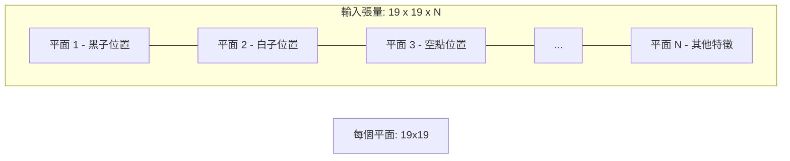

# 輸入特徵設計

神經網絡只能處理數字。要令佢理解圍棋，我哋需要一種方法將棋盤「翻譯」成數字。

呢個翻譯過程，就係**輸入特徵設計**。

AlphaGo 使用咗 48 個特徵平面，AlphaGo Zero 簡化為 17 個，KataGo 則優化為 22 個。呢篇文章會詳細解析呢啲設計選擇背後嘅考量。

---

## 咩係特徵平面？

### 基本概念

一個**特徵平面**係一個 19×19 嘅矩陣，每個元素代表棋盤上對應位置嘅某種屬性。

例如，「黑子位置」呢個特徵平面：

```
棋盤狀態：               特徵平面（黑子）：
  A B C D E               A B C D E
1 . . . . .            1  0 0 0 0 0
2 . ● . . .            2  0 1 0 0 0
3 . . ○ . .    →       3  0 0 0 0 0
4 . . . ● .            4  0 0 0 1 0
5 . . . . .            5  0 0 0 0 0
```

- 有黑子嘅位置 = 1
- 冇黑子嘅位置 = 0

### 多個特徵平面

神經網絡需要多種資訊，所以我哋堆疊多個特徵平面：



呢個類似於彩色圖片有 R、G、B 三個通道。圍棋「圖片」有 N 個通道。

---

## AlphaGo 嘅 48 個特徵平面

### 完整列表

AlphaGo 使用 48 個特徵平面，分為幾大類：

#### 1. 棋子位置（3 個平面）

| 平面 | 名稱 | 說明 |
|------|------|------|
| 1 | 黑子 | 有黑子 = 1，否則 = 0 |
| 2 | 白子 | 有白子 = 1，否則 = 0 |
| 3 | 空點 | 空點 = 1，否則 = 0 |

#### 2. 歷史記錄（16 個平面）

| 平面 | 名稱 | 說明 |
|------|------|------|
| 4-11 | 黑子歷史 | 黑子喺 1-8 手前嘅位置 |
| 12-19 | 白子歷史 | 白子喺 1-8 手前嘅位置 |

點解需要歷史？
- **劫爭判斷**：需要知道係咪可以立即提回
- **走棋意圖**：最近幾手棋透露咗雙方嘅計劃
- **時序資訊**：CNN 本身唔處理時間，歷史平面補足呢一點

#### 3. 氣數特徵（8 個平面）

| 平面 | 名稱 | 說明 |
|------|------|------|
| 20-23 | 1-4 氣（我方） | 我方棋串有 1/2/3/4 氣 = 1 |
| 24-27 | 1-4 氣（對方） | 對方棋串有 1/2/3/4 氣 = 1 |

氣數係圍棋入面最重要嘅戰術概念：
- **1 氣**：被叫吃，即將被提走
- **2 氣**：危險狀態
- **3 氣**：需要注意
- **4+ 氣**：暫時安全

#### 4. 叫吃特徵（8 個平面）

| 平面 | 名稱 | 說明 |
|------|------|------|
| 28-31 | 叫吃位置（我方） | 落呢度可以叫吃對方 1/2/3/4 顆棋 |
| 32-35 | 叫吃位置（對方） | 落呢度可以叫吃我方 1/2/3/4 顆棋 |

叫吃係圍棋入面最常見嘅戰術：
- 叫吃多顆棋 = 更大嘅威脅
- 唔同大小嘅叫吃需要唔同嘅應對

#### 5. 征子特徵（8 個平面）

| 平面 | 名稱 | 說明 |
|------|------|------|
| 36-39 | 征子相關（我方） | 同我方征子有關嘅位置 |
| 40-43 | 征子相關（對方） | 同對方征子有關嘅位置 |

征子（Ladder）係圍棋入面著名嘅戰術：
- 沿對角線追逐對方棋子
- 需要判斷「征子有利」定係「征子不利」
- 呢個需要全局視野，係傳統電腦圍棋嘅難題

#### 6. 合法性特徵（1 個平面）

| 平面 | 名稱 | 說明 |
|------|------|------|
| 44 | 合法位置 | 可以合法落子 = 1 |

呢個防止網絡輸出非法着法：
- 已有棋子嘅位置唔可以落
- 禁入點（自殺且唔提子）唔可以落
- 劫立即提回唔可以落

#### 7. 邊角特徵（4 個平面）

| 平面 | 名稱 | 說明 |
|------|------|------|
| 45 | 距離邊線 1 | 喺第 1 線 = 1 |
| 46 | 距離邊線 2 | 喺第 2 線 = 1 |
| 47 | 距離邊線 3 | 喺第 3 線 = 1 |
| 48 | 距離邊線 4+ | 喺第 4 線或更內側 = 1 |

邊角喺圍棋入面有特殊意義：
- **第 1 線**：死亡線，棋子容易被圍殺
- **第 2 線**：活棋線，但效率低
- **第 3 線**：實地線，穩健
- **第 4 線**：外勢線，追求影響力

### 點解需要咁多特徵？

DeepMind 嘅設計理念係**提供盡可能多嘅資訊**，等網絡自己決定邊啲有用：

```
原始棋盤 → 48 個特徵平面 → 神經網絡 → 決策

特徵工程師嘅工作：將圍棋知識編碼成特徵
神經網絡嘅工作：學識組合呢啲特徵
```

呢個係一種「將波傳畀神經網絡」嘅策略——人類負責特徵設計，網絡負責學習組合。

---

## AlphaGo Zero 嘅簡化：17 個特徵平面

### 革命性嘅改變

AlphaGo Zero 大幅簡化咗輸入特徵：

| 版本 | 特徵平面數 | 使用人類知識 |
|------|-----------|-------------|
| AlphaGo | 48 | 大量（氣數、征子等） |
| AlphaGo Zero | 17 | 幾乎冇 |

### 17 個平面嘅組成

#### 1. 棋子位置歷史（16 個平面）

| 平面 | 名稱 | 說明 |
|------|------|------|
| 1-8 | 黑子 T-0 到 T-7 | 黑子喺當前同過去 7 步嘅位置 |
| 9-16 | 白子 T-0 到 T-7 | 白子喺當前同過去 7 步嘅位置 |

#### 2. 顏色（1 個平面）

| 平面 | 名稱 | 說明 |
|------|------|------|
| 17 | 輪到邊個 | 輪到黑棋 = 全 1，輪到白棋 = 全 0 |

### 點解可以咁簡化？

AlphaGo Zero 嘅核心洞見：

> **如果俾足夠嘅計算資源同訓練時間，神經網絡可以自己學識呢啲特徵**

「氣數」、「叫吃」、「征子」呢啲概念，人類花咗幾千年先發展出嚟。但 AlphaGo Zero 證明，神經網絡可以喺幾日內自己學識——甚至可能學到比人類更好嘅表示。

### 效果比較

令人驚訝嘅係，使用更少特徵嘅 AlphaGo Zero 反而更強：

| 版本 | 特徵數 | 訓練時間 | 最終棋力 |
|------|--------|---------|---------|
| AlphaGo Master | 48 | 數月 | 約 5185 Elo |
| AlphaGo Zero | 17 | 40 日 | 約 5185 Elo |
| AlphaGo Zero (3 日) | 17 | 3 日 | 超越人類 |

更少嘅人類知識，反而帶嚟更強嘅性能。

### 點解人類知識反而係負擔？

#### 1. 人類知識可能有錯

人類總結嘅圍棋規則係經驗性嘅，可能唔係最優嘅。例如：
- 「金角銀邊草肚皮」——但某啲局面下中央更重要
- 「征子不利唔好行」——但有時可以主動棄子

#### 2. 特徵編碼限制咗表示

當我哋將「氣數」編碼為 1-4 氣四個平面嘅時候，我哋隱含假設「氣數」係重要嘅分類方式。但也許有更好嘅分類方式，而呢種編碼阻止咗網絡發現佢。

#### 3. 表示瓶頸

48 個平面佔用更多計算資源。如果其中一啲特徵係冗餘嘅，呢啲資源就嘥咗。

---

## KataGo 嘅優化：22 個特徵平面

### 實用主義嘅平衡

KataGo 喺 AlphaGo Zero 嘅基礎上，加入咗少量精選嘅人類知識：

| 項目 | AlphaGo Zero | KataGo |
|------|-------------|--------|
| 歷史平面 | 16 | 5 |
| 棋子位置 | 係 | 係 |
| 輪到邊個 | 係 | 係 |
| 劫爭狀態 | 唔係 | 係 |
| 規則變體 | 唔係 | 係（貼目、自殺規則等） |
| **總計** | 17 | 22 |

### KataGo 嘅特徵列表

#### 基本特徵（5 個）

| 平面 | 名稱 | 說明 |
|------|------|------|
| 1 | 黑子 | 當前黑子位置 |
| 2 | 白子 | 當前白子位置 |
| 3 | 空點 | 當前空點位置 |
| 4 | 輪到邊個（1） | 始終為 1 嘅常數平面 |
| 5 | 輪到邊個（2） | 輪到黑 = 1，輪到白 = 0 |

#### 歷史特徵（5 個）

| 平面 | 名稱 | 說明 |
|------|------|------|
| 6 | 上一手位置 | 對方上一步落嘅位置 |
| 7 | 上二手位置 | 我方上一步落嘅位置 |
| 8 | 上三手位置 | 對方上二步落嘅位置 |
| 9 | 上四手位置 | 我方上二步落嘅位置 |
| 10 | 上五手位置 | 對方上三步落嘅位置 |

#### 劫爭特徵（3 個）

| 平面 | 名稱 | 說明 |
|------|------|------|
| 11 | 劫禁點 | 當前唔可以落嘅劫禁點 |
| 12 | 潛在劫點（我方） | 我方落呢度會產生劫 |
| 13 | 潛在劫點（對方） | 對方落呢度會產生劫 |

#### 規則特徵（9 個）

| 平面 | 名稱 | 說明 |
|------|------|------|
| 14-22 | 規則編碼 | 貼目、自殺規則、超級劫等 |

### 點解加入呢啲特徵？

KataGo 嘅作者 lightvector 解釋：

#### 1. 劫爭太重要

劫爭係圍棋入面最複雜嘅概念之一。純粹由原始棋盤狀態學習劫嘅規則，需要大量樣本。明確標示劫禁點可以加速學習。

#### 2. 規則多樣性

圍棋有多種規則：
- **貼目**：中國規則 7.5 目，日本規則 6.5 目
- **自殺規則**：部分規則允許自殺
- **超級劫**：處理長循環嘅唔同方式

喺輸入入面明確編碼規則，令一個網絡能夠處理所有變體。

#### 3. 訓練效率

加入少量人類知識可以大幅加速訓練。KataGo 用 50 GPU 天達到嘅棋力，AlphaGo Zero 用 5000+ TPU 天先達到。

---

## 特徵設計嘅哲學

### 三種方法

| 方法 | 代表 | 特徵數 | 人類知識 | 計算需求 |
|------|------|--------|---------|---------|
| 大量人類知識 | AlphaGo | 48 | 好多 | 中等 |
| 最少人類知識 | AlphaGo Zero | 17 | 幾乎冇 | 好高 |
| 適度人類知識 | KataGo | 22 | 少量精選 | 較低 |

### 取捨考量

#### 資源有限時

如果計算資源有限（大多數研究者嘅情況），加入一啲人類知識係明智嘅：
- 加速訓練收斂
- 減少所需嘅訓練資料
- 避免重新發明輪子

#### 追求極限時

如果計算資源充足，減少人類知識可能達到更高棋力：
- 避免人類偏見
- 發現人類未知嘅策略
- 真正嘅「由零開始」

### 啟示

AlphaGo 系列嘅演進話畀我哋聽：

1. **特徵工程仍然重要**——但形式改變咗
2. **端到端學習係趨勢**——等網絡自己學識特徵
3. **冇唯一正確答案**——取決於資源同目標

---

## 實作範例

### 特徵提取（AlphaGo 風格）

```python
import numpy as np

def extract_features_alphago(board, history, current_player):
    """
    提取 AlphaGo 風格嘅 48 個特徵平面

    board: 19×19 嘅棋盤，0=空，1=黑，2=白
    history: 最近 8 手嘅歷史
    current_player: 1=黑，2=白
    """
    features = np.zeros((48, 19, 19))

    # 1-3: 棋子位置
    features[0] = (board == 1)  # 黑子
    features[1] = (board == 2)  # 白子
    features[2] = (board == 0)  # 空點

    # 4-19: 歷史位置
    for i, hist_board in enumerate(history[:8]):
        features[3 + i] = (hist_board == 1)      # 黑子歷史
        features[11 + i] = (hist_board == 2)     # 白子歷史

    # 20-27: 氣數特徵
    liberties = compute_liberties(board)
    for i, lib_count in enumerate([1, 2, 3, 4]):
        my_color = current_player
        opp_color = 3 - current_player
        features[19 + i] = (liberties == lib_count) & (board == my_color)
        features[23 + i] = (liberties == lib_count) & (board == opp_color)

    # 28-35: 叫吃特徵
    capture_counts = compute_captures(board)
    for i, cap_count in enumerate([1, 2, 3, 4]):
        features[27 + i] = (capture_counts[current_player] == cap_count)
        features[31 + i] = (capture_counts[3-current_player] == cap_count)

    # 36-43: 征子特徵（簡化）
    ladder_status = compute_ladder(board)
    # ... 省略詳細實現 ...

    # 44: 合法位置
    features[43] = compute_legal_moves(board, current_player)

    # 45-48: 邊角距離
    for i in range(19):
        for j in range(19):
            dist = min(i, j, 18-i, 18-j)
            if dist == 0:
                features[44, i, j] = 1
            elif dist == 1:
                features[45, i, j] = 1
            elif dist == 2:
                features[46, i, j] = 1
            else:
                features[47, i, j] = 1

    return features
```

### 特徵提取（AlphaGo Zero 風格）

```python
def extract_features_zero(board_history, current_player):
    """
    提取 AlphaGo Zero 風格嘅 17 個特徵平面

    board_history: 最近 8 步嘅棋盤狀態列表
    current_player: 1=黑，2=白
    """
    features = np.zeros((17, 19, 19))

    # 1-8: 黑子喺 T-0 到 T-7 嘅位置
    for i, board in enumerate(board_history[:8]):
        features[i] = (board == 1)

    # 9-16: 白子喺 T-0 到 T-7 嘅位置
    for i, board in enumerate(board_history[:8]):
        features[8 + i] = (board == 2)

    # 17: 輪到邊個
    if current_player == 1:  # 黑棋
        features[16] = np.ones((19, 19))
    else:
        features[16] = np.zeros((19, 19))

    return features
```

### 效能比較

```python
import time

# 模擬 1000 次特徵提取
board = np.random.randint(0, 3, (19, 19))
history = [np.random.randint(0, 3, (19, 19)) for _ in range(8)]

# AlphaGo 風格（有複雜計算）
start = time.time()
for _ in range(1000):
    features = extract_features_alphago(board, history, 1)
alphago_time = time.time() - start

# AlphaGo Zero 風格（簡單）
start = time.time()
for _ in range(1000):
    features = extract_features_zero(history, 1)
zero_time = time.time() - start

print(f"AlphaGo 風格: {alphago_time:.2f}s")
print(f"AlphaGo Zero 風格: {zero_time:.2f}s")
# 典型結果：AlphaGo 風格慢 5-10 倍
```

---

## 視覺化特徵平面

### 實際局面範例

```
實際棋盤:
   A B C D E F G H J K L M N O P Q R S T
19 . . . . . . . . . . . . . . . . . . .
18 . . . . . . . . . . . . . . . . . . .
17 . . . ● . . . . . . . . . . . ○ . . .
16 . . . . . . . . . . . . . . . . . . .
15 . . . . . . . . . . . . . . . . . . .
...

特徵平面 1（黑子）:
   A B C D E F G H J K L M N O P Q R S T
19 0 0 0 0 0 0 0 0 0 0 0 0 0 0 0 0 0 0 0
18 0 0 0 0 0 0 0 0 0 0 0 0 0 0 0 0 0 0 0
17 0 0 0 1 0 0 0 0 0 0 0 0 0 0 0 0 0 0 0
16 0 0 0 0 0 0 0 0 0 0 0 0 0 0 0 0 0 0 0
...

特徵平面 2（白子）:
   A B C D E F G H J K L M N O P Q R S T
19 0 0 0 0 0 0 0 0 0 0 0 0 0 0 0 0 0 0 0
18 0 0 0 0 0 0 0 0 0 0 0 0 0 0 0 0 0 0 0
17 0 0 0 0 0 0 0 0 0 0 0 0 0 0 0 1 0 0 0
16 0 0 0 0 0 0 0 0 0 0 0 0 0 0 0 0 0 0 0
...
```

### 特徵平面嘅啟發

觀察唔同特徵平面可以理解模型「睇到」咩：

| 特徵 | 直觀含義 | 模型可能學到嘅 |
|------|---------|---------------|
| 黑子/白子位置 | 邊個喺邊度 | 棋形、連接性 |
| 歷史 | 最近發生咩 | 走棋意圖、戰鬥方向 |
| 氣數 | 邊個危險 | 攻擊/防守目標 |
| 叫吃 | 戰術機會 | 局部戰術 |
| 邊角距離 | 位置重要性 | 開局選點、邊角定式 |

---

## 動畫對應

本文涉及嘅核心概念同動畫編號：

| 編號 | 概念 | 物理/數學對應 |
|------|------|--------------|
| A8 | 特徵編碼 | 張量表示 |
| A10 | 輸入正規化 | 特徵工程 |
| D1 | 卷積輸入 | 多通道圖像 |
| E3 | Zero 嘅簡化 | 最小表示 |

---

## 延伸閱讀

- **上一篇**：[Value Network 詳解](../value-network) — 點樣評估局面價值
- **下一篇**：[CNN 與圍棋的結合](../cnn-and-go) — 卷積神經網絡點樣處理棋盤
- **相關主題**：[棋盤狀態表示](../board-representation) — 更底層嘅資料結構

---

## 關鍵要點

1. **特徵平面係棋盤嘅數字化表示**：每個平面係 19×19 嘅矩陣
2. **AlphaGo 使用 48 個平面**：包含大量人類圍棋知識
3. **AlphaGo Zero 簡化為 17 個**：證明網絡可以自己學識特徵
4. **KataGo 優化為 22 個**：平衡效率同性能
5. **特徵設計係權衡**：人類知識 vs 計算資源

輸入特徵設計係連接「人類理解嘅圍棋」同「機器可處理嘅數字」嘅橋樑。

---

## 參考資料

1. Silver, D., et al. (2016). "Mastering the game of Go with deep neural networks and tree search." *Nature*, 529, 484-489.
2. Silver, D., et al. (2017). "Mastering the game of Go without human knowledge." *Nature*, 551, 354-359.
3. Wu, D. (2019). "Accelerating Self-Play Learning in Go." *arXiv:1902.10565*.
4. KataGo Documentation: [https://github.com/lightvector/KataGo](https://github.com/lightvector/KataGo)
