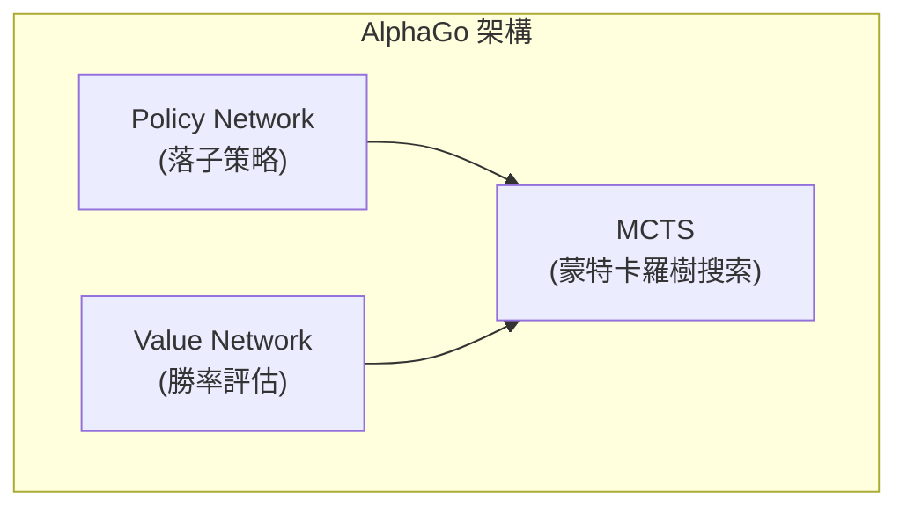
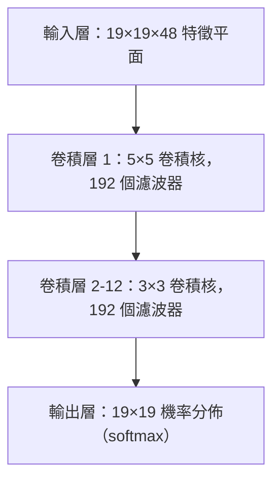
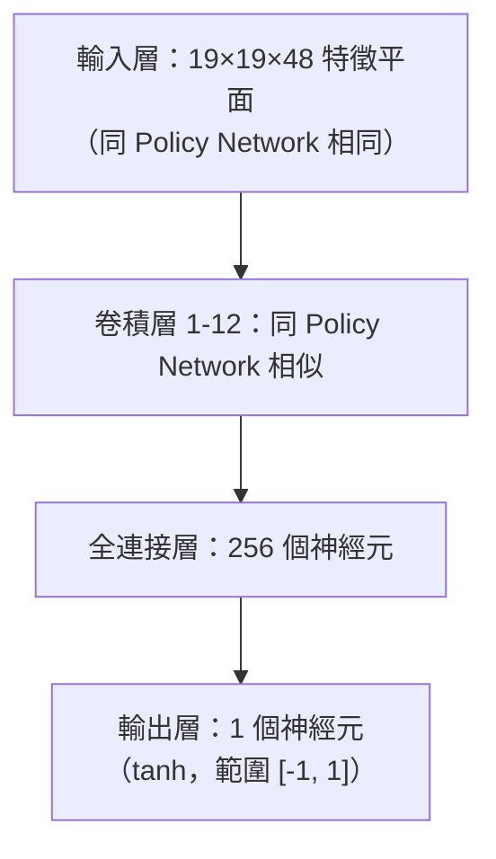
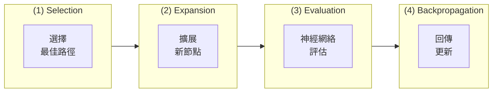
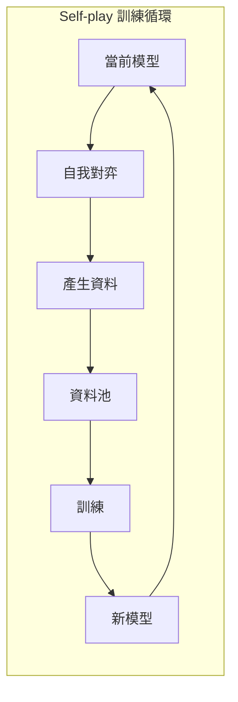
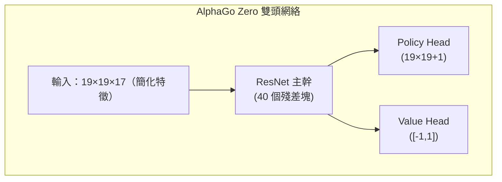

# AlphaGo 論文解讀

本文深入解析 DeepMind 發表於 Nature 嘅經典論文《Mastering the game of Go with deep neural networks and tree search》，以及後續嘅 AlphaGo Zero 同 AlphaZero 論文。

## AlphaGo 嘅歷史意義

圍棋長期被視為人工智能嘅「聖杯」挑戰。同西洋棋唔同，圍棋嘅搜索空間極其龐大：

| 遊戲 | 平均分支因子 | 平均遊戲長度 | 狀態空間 |
|------|-------------|-------------|----------|
| 西洋棋 | ~35 | ~80 | ~10^47 |
| 圍棋 | ~250 | ~150 | ~10^170 |

傳統嘅暴力搜索方法喺圍棋上完全唔可行。2016 年 AlphaGo 擊敗李世乭，證明咗深度學習同強化學習結合嘅強大威力。

### 里程碑事件

- **2015 年 10 月**：AlphaGo Fan 以 5:0 擊敗歐洲冠軍樊麾（職業二段）
- **2016 年 3 月**：AlphaGo Lee 以 4:1 擊敗世界冠軍李世乭（職業九段）
- **2017 年 5 月**：AlphaGo Master 以 3:0 擊敗世界排名第一嘅柯潔
- **2017 年 10 月**：AlphaGo Zero 發表，純自我對弈訓練，超越所有前代版本

## 核心技術架構

AlphaGo 嘅核心創新在於結合三個關鍵技術：



### Policy Network（策略網絡）

Policy Network 負責預測每個位置嘅落子機率，用嚟指導搜索方向。

#### 網絡架構



#### 輸入特徵

AlphaGo 使用 48 個特徵平面作為輸入：

| 特徵 | 平面數 | 描述 |
|------|--------|------|
| 棋子顏色 | 3 | 黑子、白子、空點 |
| 氣數 | 8 | 1氣、2氣、...、8氣以上 |
| 叫吃後氣數 | 8 | 食子之後會有幾多氣 |
| 提子數 | 8 | 嗰個位置可提幾多子 |
| 打劫 | 1 | 係咪劫爭位置 |
| 落子合法性 | 1 | 嗰個位置可唔可以落子 |
| 連續 1-8 手前嘅位置 | 8 | 前幾手嘅落子位置 |
| 輪到邊方落 | 1 | 當前輪到黑或白 |

#### 訓練方式

Policy Network 嘅訓練分為兩階段：

**第一階段：監督學習 (SL Policy Network)**
- 使用 KGS 圍棋伺服器嘅 3000 萬局棋譜
- 目標：預測人類棋手嘅下一手
- 達到 57% 嘅預測準確率

**第二階段：強化學習 (RL Policy Network)**
- 由 SL Policy Network 開始
- 同之前版本嘅自己對弈
- 使用 REINFORCE 演算法優化

```python
# 簡化嘅 Policy Gradient 更新
# reward: +1 勝利, -1 失敗
loss = -log(policy[action]) * reward
```

### Value Network（價值網絡）

Value Network 評估當前局面嘅勝率，用嚟減少搜索深度。

#### 網絡架構



#### 訓練方式

Value Network 使用 RL Policy Network 自我對弈產生嘅 3000 萬局面訓練：

- 由每局棋入面隨機取樣一個局面
- 用最終勝負作為標籤
- 使用 MSE 損失函數

```python
# Value Network 訓練
value_prediction = value_network(position)
loss = (value_prediction - game_outcome) ** 2
```

**點解每局淨係攞一個樣本？**

如果攞多個樣本，同一局棋嘅相鄰局面會高度相關，導致過擬合。隨機取樣可以確保訓練資料嘅多樣性。

## 蒙特卡羅樹搜索 (MCTS)

MCTS 係 AlphaGo 嘅決策核心，結合神經網絡嚟高效搜索最佳著法。

### MCTS 四步驟



### 選擇公式 (PUCT)

AlphaGo 使用 PUCT (Predictor + UCT) 公式選擇要探索嘅分支：

```
a = argmax[Q(s,a) + u(s,a)]

u(s,a) = c_puct * P(s,a) * sqrt(N(s)) / (1 + N(s,a))
```

其中：
- **Q(s,a)**：動作 a 嘅平均價值（exploitation）
- **P(s,a)**：Policy Network 預測嘅先驗機率
- **N(s)**：父節點嘅訪問次數
- **N(s,a)**：嗰個動作嘅訪問次數
- **c_puct**：探索常數，平衡 exploration 同 exploitation

### 搜索過程詳解

1. **Selection**：由根節點開始，使用 PUCT 公式選擇動作，直到達到葉節點
2. **Expansion**：喺葉節點展開新嘅子節點，用 Policy Network 初始化先驗機率
3. **Evaluation**：結合 Value Network 評估同快速走子模擬 (Rollout) 嚟評估價值
4. **Backpropagation**：將評估值沿路徑回傳，更新 Q 值同 N 值

### Rollout（快速走子）

AlphaGo（非 Zero 版）仲使用一個細型快速策略網絡進行模擬：

```
葉節點 → 快速隨機走子至終局 → 計算勝負
```

最終評估值結合 Value Network 同 Rollout：

```
V = λ * v_network + (1-λ) * v_rollout
```

AlphaGo 使用 λ = 0.5，畀兩者相等權重。

## Self-play 訓練方法

Self-play 係 AlphaGo 嘅核心訓練策略，令 AI 透過同自己對弈嚟持續提升。

### 訓練循環



### 點解 Self-play 有效？

1. **無限資料**：唔受人類棋譜數量限制
2. **自適應難度**：對手強度同自己同步提升
3. **探索創新**：唔受人類固有思維模式限制
4. **目標明確**：直接優化勝率，而唔係模仿人類

## AlphaGo Zero 嘅改進

2017 年發表嘅 AlphaGo Zero 帶嚟咗革命性嘅改進：

### 主要差異

| 特性 | AlphaGo | AlphaGo Zero |
|------|---------|--------------|
| 初始訓練 | 人類棋譜監督學習 | 完全由零開始 |
| 網絡架構 | 分離嘅 Policy/Value | 單一雙頭網絡 |
| 網絡結構 | 普通 CNN | ResNet |
| 特徵工程 | 48 個手工特徵 | 17 個簡單特徵 |
| Rollout | 需要 | 唔需要 |
| 訓練時間 | 幾個月 | 3 日超越人類 |

### 架構簡化



### 簡化嘅輸入特徵

AlphaGo Zero 淨係使用 17 個特徵平面：

- 8 個平面：自己最近 8 手嘅棋子位置
- 8 個平面：對手最近 8 手嘅棋子位置
- 1 個平面：當前輪到邊方（全 0 或全 1）

### 訓練改進

1. **純 Self-play**：唔使用任何人類資料
2. **直接使用 MCTS 機率作為訓練目標**：而唔係二元嘅勝負
3. **冇 Rollout**：完全依賴 Value Network
4. **單一網絡訓練**：Policy 同 Value 共享參數，互相增強

## AlphaZero 嘅通用化

2017 年尾發表嘅 AlphaZero 將相同架構應用於圍棋、西洋棋同將棋：

### 關鍵特點

- **零領域知識**：除咗遊戲規則之外，唔使用任何領域特定知識
- **統一架構**：同一套演算法適用於唔同棋類
- **更快訓練**：
  - 圍棋：8 小時超越 AlphaGo Lee
  - 西洋棋：4 小時超越 Stockfish
  - 將棋：2 小時超越 Elmo

### 同 AlphaGo Zero 嘅差異

| 特性 | AlphaGo Zero | AlphaZero |
|------|-------------|-----------|
| 目標遊戲 | 淨係圍棋 | 圍棋、西洋棋、將棋 |
| 對稱性利用 | 利用圍棋 8 重對稱 | 唔假設對稱性 |
| 超參數調整 | 針對圍棋優化 | 通用設定 |
| 訓練方式 | 最佳模型自我對弈 | 最新模型自我對弈 |

## 實作重點

如果你想實作類似系統，以下係關鍵考量：

### 計算資源

AlphaGo 嘅訓練需要龐大嘅計算資源：

- **AlphaGo Lee**：176 GPU + 48 TPU
- **AlphaGo Zero**：4 TPU（訓練）+ 1 TPU（自我對弈）
- **AlphaZero**：5000 TPU（訓練）

### 關鍵超參數

```python
# MCTS 相關
num_simulations = 800     # 每手搜索模擬次數
c_puct = 1.5              # 探索常數
temperature = 1.0         # 選擇動作嘅溫度參數

# 訓練相關
batch_size = 2048
learning_rate = 0.01      # 含衰減
l2_regularization = 1e-4
```

### 常見問題

1. **訓練唔穩定**：使用較細嘅學習率，增加 batch size
2. **過擬合**：確保訓練資料多樣性，使用正規化
3. **搜索效率**：優化 GPU 批次推理，並行化 MCTS

## 延伸閱讀

- [原始論文：Mastering the game of Go with deep neural networks and tree search](https://www.nature.com/articles/nature16961)
- [AlphaGo Zero 論文：Mastering the game of Go without human knowledge](https://www.nature.com/articles/nature24270)
- [AlphaZero 論文：A general reinforcement learning algorithm that masters chess, shogi, and Go through self-play](https://www.science.org/doi/10.1126/science.aar6404)

理解 AlphaGo 嘅技術之後，接住等我哋睇吓 [KataGo 點樣喺呢個基礎上做出改進](./katago-paper.md)。

