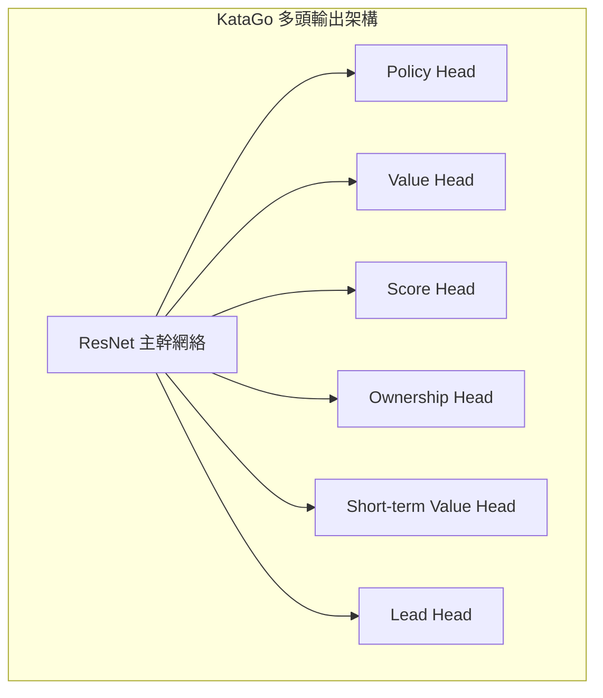
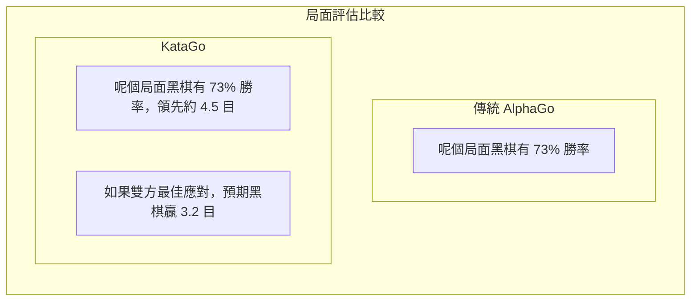

# KataGo 論文解讀

KataGo 係由 David Wu 開發嘅開源圍棋 AI，佢嘅論文《Accelerating Self-Play Learning in Go》發表於 2019 年。KataGo 以更少嘅計算資源達到超越 ELF OpenGo 嘅棋力，係目前最強大嘅開源圍棋 AI。

## KataGo 嘅創新點

KataGo 並唔係喺神經網絡架構上做出革命性改變，而係喺訓練方法同輔助任務上進行系統性優化，實現咗顯著嘅效率提升。

### 核心創新總覽

| 創新點 | 效果 |
|--------|------|
| 輔助訓練目標 | 加速學習，提供更多監督信號 |
| 全局池化結構 | 更好咁捕捉全局資訊 |
| 支援多種規則 | 單一模型適應唔同比賽規則 |
| Playout Cap 隨機化 | 提高訓練效率 |
| 改進嘅資料增強 | 增加訓練資料多樣性 |

## 更高效嘅訓練方法

### 輔助訓練目標（Auxiliary Training Targets）

傳統嘅 AlphaGo Zero 淨係得兩個訓練目標：
1. Policy：預測 MCTS 嘅落子機率分佈
2. Value：預測遊戲勝負

KataGo 加入咗多個輔助訓練目標，提供更豐富嘅學習信號：



#### 各輸出頭說明

| 輸出頭 | 維度 | 預測目標 |
|--------|------|----------|
| **Policy** | 19×19+1 | 每個位置嘅落子機率（含 Pass） |
| **Value** | 3 | 勝/負/和嘅機率 |
| **Score** | 連續值 | 預測最終目數差 |
| **Ownership** | 19×19 | 每個點最終歸屬（黑/白領地） |
| **Short-term Value** | 1 | 短期內嘅預期勝率 |
| **Lead** | 1 | 當前領先幾多目 |

### 點解輔助目標有效？

1. **更密集嘅監督信號**：Value 淨係提供一個數值，而 Ownership 提供 361 個監督點
2. **減少過擬合**：多任務學習有正規化效果
3. **加速收斂**：輔助任務幫助網絡更快學習有用嘅特徵表示
4. **提供更好嘅梯度**：避免梯度消失問題

### Playout Cap 隨機化

AlphaGo Zero 每手棋固定進行 800 次 MCTS 模擬。KataGo 引入隨機化：

```python
# 傳統方式
num_playouts = 800  # 固定

# KataGo 方式
playout_cap = random.choice([
    100, 200, 300, 400, 500, 600, 700, 800
])
```

**好處**：
- 訓練資料更加多樣化
- 模型學識喺唔同搜索深度之下做出合理判斷
- 實際對弈嗰陣即使搜索量較少都可以表現良好

### 資料增強改進

傳統方法利用圍棋嘅 8 重對稱性（4 次旋轉 × 2 次鏡像）進行資料增強。KataGo 進一步改進：

- **隨機對稱變換**：每次取樣嗰陣隨機選擇對稱變換
- **歷史狀態隨機化**：隨機選擇歷史盤面嘅表示方式
- **顏色隨機化**：隨機交換黑白視角

## 支援多種圍棋規則

呢個係 KataGo 嘅重要特色之一。唔同嘅圍棋規則會影響戰略決策：

### 主要規則差異

| 規則體系 | 計分方式 | 貼目 | 打劫規則 | 自殺 |
|---------|---------|------|---------|------|
| 中國規則 | 數子法 | 7.5 目 | 簡單劫 | 禁止 |
| 日本規則 | 數目法 | 6.5 目 | 超級劫 | 禁止 |
| 韓國規則 | 數目法 | 6.5 目 | 超級劫 | 禁止 |
| 應氏規則 | 數子法 | 8 點 | 特殊劫規 | 禁止 |
| Tromp-Taylor | 數子法 | 可調 | 超級劫 | 允許 |
| AGA 規則 | 數子/數目 | 7.5 目 | 超級劫 | 禁止 |
| 紐西蘭規則 | 數子法 | 7 目 | 簡單劫 | 允許 |

### 技術實現

KataGo 將規則資訊編碼為輸入特徵：

```python
# 規則相關輸入特徵示例
rule_features = {
    'komi': 7.5,           # 貼目值
    'scoring_rule': 'area', # 數子/數目
    'ko_rule': 'simple',    # 劫爭規則
    'suicide_allowed': False,
    'tax_rule': 'none',     # 係咪有「眼」稅
    # ...
}
```

網絡學識根據唔同規則調整策略。例如：
- 數目法之下更注重實地控制
- 允許自殺嗰陣可用於特殊戰術
- 唔同貼目會影響佈局選擇

## 同時預測勝率同目數

呢個係 KataGo 最實用嘅功能之一，對於圍棋教學同分析極有價值。

### Value vs Score



### 實際應用價值

1. **更精確嘅局面判斷**：
   - 勝率 80% 但淨係領先 1 目 → 仲有變數
   - 勝率 80% 同時領先 20 目 → 大局已定

2. **教學輔助**：
   - 等學生理解一手棋「蝕咗幾多目」
   - 比較唔同下法嘅目數差異

3. **讓子棋分析**：
   - 準確評估讓子係咪適當
   - 判斷應該落進攻定係防守

### Score Distribution

KataGo 唔止預測單一目數，而係預測完整嘅目數分佈：

```
目數分佈示例：
├─ 黑勝 10 目以上：15%
├─ 黑勝 5-10 目：25%
├─ 黑勝 0-5 目：20%
├─ 白勝 0-5 目：18%
├─ 白勝 5-10 目：15%
└─ 白勝 10 目以上：7%

預期值：黑棋 +3.2 目
標準差：±8.5 目
```

呢種分佈資訊可以更好咁反映局面嘅複雜程度同唔確定性。

## Ownership Map（領地圖）

Ownership 預測每個點喺終局嗰陣歸屬黑方定白方：

```
                  Ownership Map
    A B C D E F G H J K L M N O P Q R S T
19  ○ ○ ○ ○ ○ ○ · · · · · · · ● ● ● ● ● ●
18  ○ ○ ○ ○ ○ ○ · · · · · · · ● ● ● ● ● ●
17  ○ ○ ○ ○ ○ · · · · · · · · · ● ● ● ● ●
16  ○ ○ ○ ╋ · · · · · ╋ · · · · · ╋ ● ● ●
...

圖例：○ = 白方領地  ● = 黑方領地  · = 未定
```

### 應用場景

- **局面分析**：一眼睇到雙方勢力範圍
- **死活判斷**：判斷某塊棋係咪仲有得救
- **收官計算**：評估各處官子嘅價值
- **教學示範**：視覺化展示領地概念

## 同 AlphaGo 嘅差異比較

| 面向 | AlphaGo Zero | KataGo |
|------|-------------|--------|
| **訓練目標** | Policy + Value | 多重輔助目標 |
| **輸出資訊** | 勝率 | 勝率 + 目數 + 領地 |
| **規則支援** | 單一規則 | 多種規則 |
| **網絡結構** | 純卷積 ResNet | 加入全局池化 |
| **搜索量** | 固定 | 隨機化 |
| **訓練效率** | 基準 | 約 50 倍效率提升 |
| **開源程度** | 論文描述 | 完整開源 |

### 訓練效率比較

```
達到 ELF OpenGo 水平所需資源：

ELF OpenGo:
- 2000 GPU
- 2 星期訓練

KataGo:
- 1 GPU（或幾十 GPU 加速）
- 幾日到幾星期

效率提升：約 50-100 倍
```

## 網絡架構細節

### 全局池化（Global Pooling）

傳統 CNN 淨係睇到局部資訊，KataGo 加入全局池化層捕捉全局特徵：

```python
class GlobalPoolingBlock(nn.Module):
    def forward(self, x):
        # x: [batch, channels, 19, 19]

        # 全局平均池化
        global_avg = x.mean(dim=[2, 3])  # [batch, channels]

        # 全局最大池化
        global_max = x.max(dim=2)[0].max(dim=1)[0]  # [batch, channels]

        # 合併全局特徵
        global_features = torch.cat([global_avg, global_max], dim=1)

        # 將全局特徵廣播返空間維度
        global_features = global_features.view(batch, -1, 1, 1)
        global_features = global_features.expand(-1, -1, 19, 19)

        return torch.cat([x, global_features], dim=1)
```

**好處**：
- 可以感知全局形勢（如邊個領先）
- 更好咁處理需要全局判斷嘅局面
- 對目數預測特別有幫助

### 網絡規模

KataGo 提供唔同大細嘅模型：

| 模型 | 殘差塊數 | 通道數 | 參數量 | 適用場景 |
|------|---------|--------|--------|----------|
| b10c128 | 10 | 128 | ~5M | CPU 運行 |
| b15c192 | 15 | 192 | ~15M | 一般 GPU |
| b20c256 | 20 | 256 | ~35M | 中階 GPU |
| b40c256 | 40 | 256 | ~70M | 高階 GPU |
| b60c320 | 60 | 320 | ~150M | 頂級 GPU |

## 實際表現

### 棋力評估

KataGo 喺各大測試入面嘅表現：

- 超越所有 Leela Zero 網絡
- 同職業九段對弈保持高勝率
- 喺 CGOS（Computer Go Server）排名第一

### 分析功能

KataGo 嘅分析模式提供：

```json
{
  "moveInfos": [
    {
      "move": "Q16",
      "visits": 3420,
      "winrate": 0.573,
      "scoreLead": 2.8,
      "pv": ["Q16", "D4", "Q4", "D16"],
      "ownership": [...]
    }
  ],
  "rootInfo": {
    "winrate": 0.48,
    "scoreLead": -0.5,
    "visits": 10000
  }
}
```

## 延伸閱讀

- [KataGo 論文：Accelerating Self-Play Learning in Go](https://arxiv.org/abs/1902.10565)
- [KataGo GitHub 專案](https://github.com/lightvector/KataGo)
- [KataGo 訓練日誌同分析](https://katagotraining.org/)

了解 KataGo 嘅技術特點之後，等我哋睇吓[其他圍棋 AI 嘅發展](./zen.md)，以便對成個產業有更全面嘅認識。

