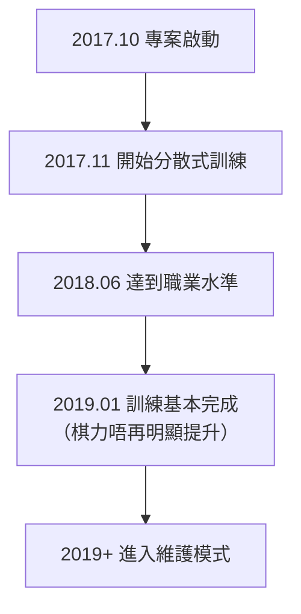

# 其他圍棋 AI 介紹

除咗 AlphaGo 同 KataGo，圍棋 AI 領域仲有好多重要嘅專案。本文將會介紹主要嘅商業 AI 同開源 AI，幫你了解成個生態系統。

## 商業圍棋 AI

### 天頂（Zen）

**開發者**：尾島陽兒（Yoji Ojima）/ 日本
**首次發表**：2009 年
**授權方式**：商業授權

天頂係 AlphaGo 之前最強嘅圍棋程式之一，喺傳統 MCTS 時代就已經達到職業水準。

#### 發展歷程

| 時間 | 版本 | 里程碑 |
|------|------|--------|
| 2009 | Zen 1.0 | 首次發布 |
| 2011 | Zen 4 | 達到業餘六段水準 |
| 2012 | Zen 5 | 讓四子擊敗武宮正樹九段 |
| 2016 | Zen 7 | 採用深度學習技術 |
| 2017+ | Deep Zen Go | 結合 AlphaGo 架構 |

#### 技術特點

- **混合架構**：結合傳統啟發式同深度學習
- **商業優化**：針對消費級硬件優化
- **穩定性高**：經過多年商業使用驗證
- **支援多平台**：Windows、macOS 都可以運行

#### 產品形式

- **Tengen（天頂之碁）**：桌面軟件，售價約 10,000 日圓
- **網絡對弈**：曾經喺 KGS 以 Zen19 帳號活動

---

### 絕藝（Fine Art）

**開發者**：騰訊 AI Lab / 中國
**首次發表**：2016 年
**授權方式**：非公開

絕藝係騰訊開發嘅圍棋 AI，喺中國圍棋界有重要影響力。

#### 發展歷程

| 時間 | 事件 |
|------|------|
| 2016 年 11 月 | 首次亮相，喺野狐圍棋網對弈 |
| 2017 年 3 月 | UEC 杯電腦圍棋大賽冠軍 |
| 2017 年 | 被中國國家圍棋隊採用為訓練工具 |
| 2018 年 | 世界人工智能圍棋大賽冠軍 |
| 持續至今 | 持續作為國家隊訓練輔助 |

#### 技術特點

- **大規模訓練**：使用騰訊雲端運算資源
- **同人類頂尖棋手合作**：獲得大量專業指導
- **實戰經驗豐富**：喺野狐圍棋累積大量對局
- **教學功能整合**：提供復盤分析功能

#### 影響力

絕藝對中國職業圍棋嘅影響深遠：

- 成為國家隊標準訓練工具
- 改變咗職業棋手嘅備戰方式
- 推動咗 AI 輔助訓練嘅普及

---

### 星陣（Golaxy）

**開發者**：中國深客科技 / 清華大學團隊
**首次發表**：2018 年
**授權方式**：商業授權

星陣以「最似人類嘅 AI」為設計目標，喺棋風上更接近人類棋手。

#### 技術特點

- **人類化棋風**：刻意訓練成更似人類嘅下法
- **可調整難度**：可以模擬唔同段位嘅對手
- **教學導向**：設計嗰陣有考慮教學應用
- **讓子棋專精**：喺讓子棋方面有特別優化

#### 產品應用

- **弈客圍棋**：整合喺弈客 App 入面
- **教學平台**：用於網上圍棋教學
- **段位測試**：提供標準化段位評估

---

### 其他商業 AI

| 名稱 | 開發者 | 特點 |
|------|--------|------|
| **石子旋風** | 林在範（台灣） | 曾獲 UEC 杯冠軍 |
| **CGI** | 交通大學（台灣） | 學術研究導向 |
| **Dolbaram** | 韓國 NHN | 整合喺韓國圍棋平台 |
| **AQ** | 日本 AQ 團隊 | 開源後轉商業 |

## 開源圍棋 AI

### Leela Zero

**開發者**：Gian-Carlo Pascutto / 比利時
**首次發表**：2017 年
**授權方式**：GPL-3.0
**GitHub**：https://github.com/leela-zero/leela-zero

Leela Zero 係首個成功複製 AlphaGo Zero 嘅開源專案，由社群分散式訓練。

#### 發展歷程



#### 技術特點

- **忠實復現**：嚴格按照 AlphaGo Zero 論文實作
- **分散式訓練**：全球志願者貢獻 GPU 運算
- **完全透明**：所有訓練資料同模型公開
- **標準 GTP**：相容所有 GTP 圍棋軟件

#### 訓練統計

| 項目 | 數值 |
|------|------|
| 總自我對弈局數 | 約 1800 萬局 |
| 訓練迭代次數 | 約 270 次 |
| 參與貢獻者 | 幾千人 |
| 訓練時長 | 約 1.5 年 |

#### 使用方式

```bash
# 安裝
brew install leela-zero  # macOS

# 運行
leelaz --gtp --weights best-network.gz

# GTP 指令
genmove black
play white D4
```

#### 現狀

雖然 Leela Zero 已經唔再活躍訓練，但：
- 程式碼仍然係學習 AlphaGo Zero 嘅絕佳資源
- 訓練好嘅模型仍然可以使用
- 社群仲喺維護基本功能

---

### ELF OpenGo

**開發者**：Facebook AI Research (FAIR)
**首次發表**：2018 年
**授權方式**：BSD
**GitHub**：https://github.com/pytorch/ELF

ELF OpenGo 係 Facebook 開發嘅圍棋 AI，展示咗大規模分散式訓練嘅能力。

#### 技術特點

- **ELF 框架**：基於 Facebook 嘅 ELF（Extensive, Lightweight, and Flexible）遊戲研究平台
- **大規模訓練**：使用 2000 GPU 進行訓練
- **PyTorch 實作**：使用 Facebook 自家嘅深度學習框架
- **研究導向**：主要目的係研究而唔係實用

#### 表現

- 喺 KGS 達到頂級水準
- 同職業九段對弈有穩定勝率
- 論文發表於頂級會議

#### 現狀

- 專案已經唔再活躍維護
- 程式碼同模型仍然可以下載
- 主要價值在於學術參考

---

### SAI（Sensible Artificial Intelligence）

**開發者**：SAI 團隊 / 歐洲
**首次發表**：2019 年
**授權方式**：MIT
**GitHub**：https://github.com/sai-dev/sai

SAI 係基於 Leela Zero 嘅改進版本，專注於實驗性功能。

#### 技術特點

- **改進嘅訓練方法**：實驗各種訓練優化
- **支援更多規則**：比 Leela Zero 支援更多圍棋規則
- **實驗性功能**：測試新嘅網絡架構同訓練技巧

#### 現狀

- 仲有細規模社群維護
- 主要用於實驗同學習

---

### PhoenixGo

**開發者**：騰訊微信團隊
**首次發表**：2018 年
**授權方式**：BSD-3
**GitHub**：https://github.com/Tencent/PhoenixGo

PhoenixGo 係騰訊開源嘅圍棋 AI，曾經獲得 2018 年世界人工智能圍棋大賽冠軍。

#### 技術特點

- **商業級品質**：源自騰訊內部專案
- **TensorFlow 實作**：使用主流框架
- **多平台支援**：Linux、Windows、macOS
- **分散式支援**：可以喺多機多卡環境運行

#### 使用方式

```bash
# 編譯
bazel build //src:mcts_main

# 運行
./mcts_main --gtp --config_path=config.conf
```

---

### MiniGo

**開發者**：Google Brain
**首次發表**：2018 年
**授權方式**：Apache-2.0
**GitHub**：https://github.com/tensorflow/minigo

MiniGo 係 Google 開源嘅教育性質圍棋 AI，目的係等更多人理解 AlphaGo 嘅原理。

#### 技術特點

- **教育導向**：程式碼清晰易讀
- **TensorFlow 實作**：Google 官方範例
- **完整文件**：有詳細嘅技術說明
- **Colab 支援**：可以喺 Google Colab 直接運行

#### 適用場景

- 學習 AlphaGo Zero 架構
- 理解強化學習喺遊戲入面嘅應用
- 作為自己專案嘅起點

## 各 AI 特點比較

### 棋力比較（約略估計）

| AI | 棋力水準 | 備註 |
|----|---------|------|
| KataGo | 頂級超人 | 持續訓練中 |
| 絕藝 | 頂級超人 | 非公開 |
| Leela Zero | 超人 | 已停止訓練 |
| ELF OpenGo | 超人 | 已停止訓練 |
| PhoenixGo | 準超人 | 已停止訓練 |
| 天頂 | 職業水準 | 商業產品 |
| 星陣 | 職業水準 | 可調整難度 |

### 功能比較

| 功能 | KataGo | Leela Zero | PhoenixGo | 天頂 |
|------|--------|------------|-----------|------|
| 開源 | ✓ | ✓ | ✓ | ✗ |
| 目數預測 | ✓ | ✗ | ✗ | △ |
| 多規則支援 | ✓ | ✗ | ✗ | ✗ |
| Analysis API | ✓ | ✗ | ✗ | ✗ |
| CPU 模式 | ✓ | ✓ | ✓ | ✓ |
| 持續更新 | ✓ | ✗ | ✗ | △ |

### 適用場景建議

| 需求 | 推薦選擇 | 原因 |
|------|---------|------|
| 一般對弈/分析 | KataGo | 最強同時功能最全 |
| 學習 AlphaGo | Leela Zero / MiniGo | 程式碼清晰 |
| 商業應用 | 天頂 / 自訓練 KataGo | 授權明確 |
| 教學輔助 | KataGo / 星陣 | 有豐富分析功能 |
| 研究實驗 | KataGo / SAI | 可修改訓練 |

## 未來發展趨勢

### 技術趨勢

1. **更高效嘅訓練方法**
   - 好似 KataGo 展示嘅效率提升
   - 更少資源達到更高棋力

2. **更好嘅可解釋性**
   - 解釋 AI 點解落呢手棋
   - 幫人類理解 AI 嘅思考

3. **同人類風格結合**
   - 訓練出更似特定棋手風格嘅 AI
   - 用於教學同研究

4. **跨遊戲通用性**
   - 好似 AlphaZero 所展示
   - 單一框架適用多種遊戲

### 應用趨勢

1. **普及化**
   - 更多圍棋愛好者使用 AI 分析
   - 手機等設備都可以運行

2. **專業化**
   - 職業棋手深度依賴 AI 訓練
   - AI 輔助形成標準化

3. **商業化**
   - 更多 AI 輔助圍棋產品
   - 教學、分析、陪練等服務

## 總結

圍棋 AI 生態系統豐富多元：

- **想要最強棋力同最全功能**：揀 KataGo
- **想學習 AI 原理**：研究 Leela Zero 或 MiniGo 程式碼
- **商業應用需求**：評估天頂或自行訓練模型
- **特殊需求**：根據具體情況揀或組合使用

接住，等我哋進入實戰環節，學習點樣[安裝同使用 KataGo](/docs/for-engineers/katago-source/)！

