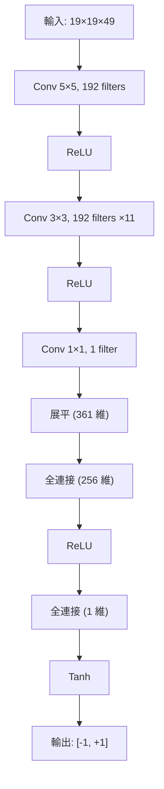
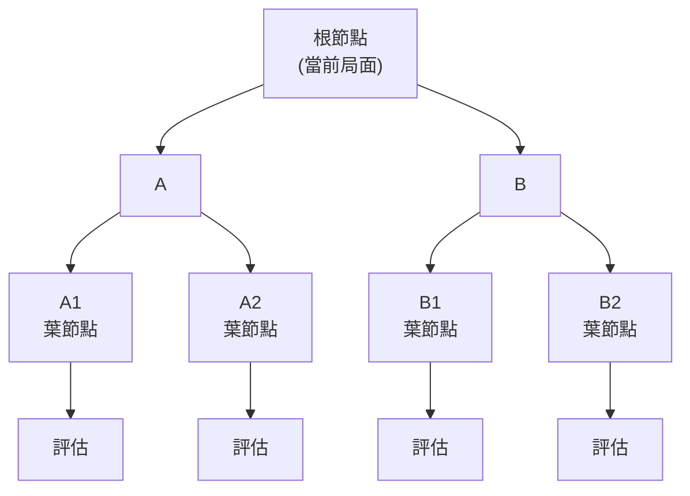
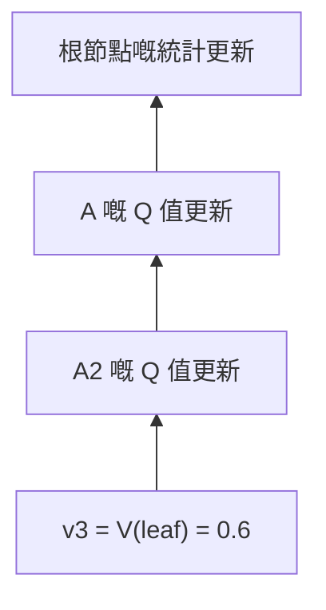
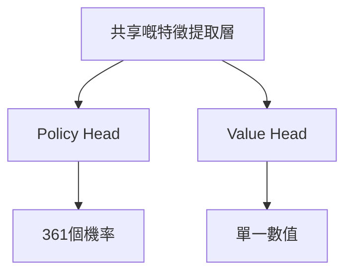

# Value Network 詳解

如果話 Policy Network 話畀 AlphaGo 聽「下一步應該落邊度」，咁 Value Network 回答嘅係一個更根本嘅問題：

> **「呢盤棋，我會唔會贏？」**

---

## 咩係 Value Network？

### 核心功能

Value Network 係一個深度卷積神經網絡，佢嘅任務係：

> **俾定當前棋盤狀態，預測最終嘅勝率**

用數學表示：

```
v = f_θ(s)
```

其中：
- `s`：當前棋盤狀態
- `f_θ`：Value Network（θ 係網絡參數）
- `v`：一個介於 -1 到 +1 之間嘅數值

### 輸出嘅含義

| 輸出值 | 含義 |
|--------|------|
| +1 | 當前玩家必勝 |
| +0.5 | 當前玩家大約 75% 勝率 |
| 0 | 雙方勝率相等 |
| -0.5 | 當前玩家大約 25% 勝率 |
| -1 | 當前玩家必敗 |

### 點解需要單一數值？

#### 比較唔同選擇

喺落棋嘅時候，我哋經常需要喺多個選項入面做選擇。Value Network 令呢個比較變得簡單：

```
選項 A 嘅局面價值：0.3
選項 B 嘅局面價值：0.5
選項 C 嘅局面價值：0.2

→ 揀 B（最高嘅價值）
```

如果冇單一數值，我哋點樣比較「食咗對方一塊棋」同「圍住一大塊空」邊個更好？

#### 取代大量模擬

喺傳統嘅蒙地卡羅樹搜索入面，評估一個局面需要進行 **隨機模擬（rollout）**：

1. 由當前局面開始
2. 雙方隨機落棋直到遊戲結束
3. 記錄勝負
4. 重複數千次，計算勝率

呢個好慢。Value Network 可以**一次前向傳播**就俾出評估，速度快幾個數量級。

| 方法 | 評估時間 | 精度 |
|------|---------|------|
| 1000 次隨機模擬 | ~2000 毫秒 | 較低 |
| 15000 次隨機模擬 | ~30000 毫秒 | 中等 |
| Value Network | ~3 毫秒 | 高（等價於 15000 次模擬） |

---

## 網絡架構

### 同 Policy Network 嘅相似性

Value Network 嘅架構同 Policy Network 好相似，都係深度卷積神經網絡：

```
輸入層 → 卷積層 ×12 → 全連接層 → 輸出
   ↓         ↓           ↓         ↓
19×19×48   19×19×192    256維     單一數值
```

### 輸入層

同 Policy Network 相同，輸入係 **19×19×49** 嘅特徵張量：

- **19×19**：棋盤大小
- **49**：48 個特徵平面 + 1 個表示當前輪到邊個嘅平面

多出嘅 1 個平面好重要：Value Network 需要知道係邊個嘅回合，因為同一局面對黑棋同白棋嘅價值係相反嘅。

### 卷積層

同 Policy Network 相同：
- **12 層卷積層**
- **192 個濾波器**
- **3×3 卷積核**（第一層 5×5）
- **ReLU 激活函數**

### 輸出層嘅差異

呢個係 Value Network 同 Policy Network 嘅關鍵差異：

#### Policy Network 輸出
```
19×19×192 → 1×1 卷積 → 19×19×1 → 展平 → 361維 → Softmax → 概率分布
```

#### Value Network 輸出
```
19×19×192 → 1×1 卷積 → 19×19×1 → 展平 → 361維 → 全連接256 → ReLU → 全連接1 → Tanh → 單一數值
```

### Tanh 激活函數

Value Network 嘅最後一層使用 **Tanh**（雙曲正切）函數：

```
Tanh(x) = (e^x - e^(-x)) / (e^x + e^(-x))
```

Tanh 嘅輸出範圍係 **(-1, +1)**，啱啱對應勝負。

#### 點解用 Tanh 而唔係 Sigmoid？

Sigmoid 嘅輸出範圍係 (0, 1)，都可以表示勝率。但 Tanh 有幾個優點：

1. **對稱性**：以 0 為中心，輸出可正可負
2. **梯度更好**：喺 0 附近梯度接近 1
3. **語意清晰**：正值贏、負值輸、零係和局

### 完整架構圖



### 參數數量

| 層 | 計算 | 參數數量 |
|---|------|---------|
| 卷積層 | 同 Policy Network | ~3.9M |
| 全連接層 1 | 361×256 + 256 | 92,672 |
| 全連接層 2 | 256×1 + 1 | 257 |
| **總計** | | **~4.0M** |

大約 400 萬個參數，比 Policy Network 略多。

---

## 訓練嘅挑戰

### 過擬合問題

Value Network 嘅訓練比 Policy Network 困難得多。主要問題係**過擬合**。

#### 咩係過擬合？

過擬合係指模型「記住」咗訓練資料，而唔係學識泛化。表現為：
- 訓練集上表現好好
- 測試集上表現好差

#### 點解 Value Network 容易過擬合？

考慮一盤棋嘅資料：

```
局面 1 → 局面 2 → 局面 3 → ... → 局面 200 → 結果：黑勝
```

如果直接用呢啲資料訓練：
- 呢 200 個局面有好強嘅相關性
- 佢哋嚟自同一盤棋，有相同嘅結果
- 模型可能學識「認出」呢盤棋，而唔係理解局面

DeepMind 發現：如果用相同嘅人類棋譜訓練 Policy 同 Value Network，Value Network 會嚴重過擬合。

### 解決方案：自我對弈資料

DeepMind 嘅解決方案係用**自我對弈**生成新嘅訓練資料：

```
1. 用訓練好嘅 RL Policy Network 自我對弈
2. 由每盤棋入面只攞一個局面（避免相關性）
3. 呢個局面嘅標籤係該盤棋嘅最終結果
4. 生成 3000 萬個咁樣嘅樣本
```

#### 點解呢個可以解決過擬合？

1. **資料量大**：3000 萬個獨立嘅局面
2. **冇相關性**：每盤棋只攞一個局面
3. **分布唔同**：自我對弈嘅局面分布唔同於人類棋譜

### 訓練資料嘅產生

```python
# 偽代碼
training_data = []

for game_id in range(30_000_000):
    # 自我對弈一盤
    states, result = self_play(rl_policy_network)

    # 隨機選取一個局面
    random_index = random.randint(0, len(states) - 1)
    state = states[random_index]

    # 記錄局面同結果
    training_data.append((state, result))
```

---

## 訓練目標同方法

### 均方誤差損失

Value Network 使用**均方誤差（MSE）**作為損失函數：

```
L(θ) = (1/n) × Σ (v_θ(s) - z)²
```

其中：
- `v_θ(s)`：模型預測嘅價值
- `z`：實際結果（+1 或 -1）

#### 點解用 MSE 而唔係交叉熵？

- **交叉熵**適合分類問題（離散嘅標籤）
- **MSE** 適合回歸問題（連續嘅數值）

雖然結果只有 +1 或 -1，但模型預測嘅係連續值（-1 到 +1 之間嘅任何數）。MSE 令模型學識預測接近 +1 或 -1 嘅值。

### 訓練過程

```python
# 偽代碼
for epoch in range(num_epochs):
    for batch in dataloader:
        states, outcomes = batch

        # 前向傳播
        values = network(states)  # (batch, 1)

        # 計算損失（MSE）
        loss = mse_loss(values, outcomes)

        # 反向傳播
        loss.backward()
        optimizer.step()
```

訓練細節：
- **優化器**：SGD with momentum
- **學習率**：0.003
- **批次大小**：32
- **訓練時間**：大約 1 星期（50 GPUs）

---

## 準確度分析

### 同隨機模擬嘅比較

DeepMind 喺論文入面進行咗詳細嘅比較：

| 評估方法 | 預測誤差 |
|---------|---------|
| 1000 次隨機模擬 | 較高 |
| 15000 次隨機模擬 | 中等 |
| Value Network | 同 15000 次模擬相當 |

呢個意味住一次 Value Network 評估 ≈ 15000 次隨機模擬，但速度快大約 1000 倍。

### 各階段嘅準確度

Value Network 嘅準確度取決於遊戲進程：

| 階段 | 剩餘手數 | 預測難度 | 準確度 |
|------|---------|---------|--------|
| 開局 | ~300 | 好難 | 較低 |
| 中盤 | ~150 | 困難 | 中等 |
| 收官 | ~50 | 較易 | 較高 |
| 終局 | ~10 | 簡單 | 好高 |

呢個喺直覺上係合理嘅：越接近遊戲結束，結果越確定。

### 輸出分布

一個訓練良好嘅 Value Network 嘅輸出分布：

```
        頻率
          |
          |    *
          |   * *
          |  *   *
          | *     *
          |*       *
          +----+----+---- 輸出值
         -1    0   +1

大多數輸出集中喺 -1 同 +1 附近
（因為大多數局面有明確嘅勝負傾向）
```

### 唔確定嘅局面

當 Value Network 輸出接近 0 嘅時候，表示局面非常複雜，勝負難料。呢啲局面通常係：
- 大型戰鬥入面
- 雙方勢均力敵
- 存在多個可能嘅變化

喺 MCTS 入面，呢啲節點會獲得更多嘅搜索資源（因為不確定性高）。

---

## 喺 MCTS 入面嘅作用

### 葉節點評估

Value Network 喺 MCTS 嘅 **Evaluation** 階段發揮關鍵作用：



當 MCTS 到達一個葉節點嘅時候，需要評估呢個局面嘅價值。有兩種方法：

1. **隨機模擬（Rollout）**：由葉節點隨機落到遊戲結束
2. **Value Network 評估**：直接用神經網絡預測

AlphaGo 結合咗兩者：

```
V(leaf) = (1-λ) × V_network(leaf) + λ × V_rollout(leaf)
```

其中 λ = 0.5，即係各佔一半權重。

#### 點解要結合？

- **Value Network** 更準確，但可能有系統性偏差
- **隨機模擬** 較唔準確，但提供獨立嘅估計
- 結合兩者可以互補

### AlphaGo Zero 嘅簡化

之後嘅 AlphaGo Zero 完全棄用咗隨機模擬：

```
V(leaf) = V_network(leaf)
```

呢個大大簡化咗系統，同時棋力更強。呢個證明咗 Value Network 足夠可靠，唔需要隨機模擬嘅「保險」。

### 回溯更新

評估完葉節點之後，呢個值會沿路徑回溯更新：



每個節點維護嘅 Q 值係所有經過佢嘅葉節點評估嘅平均：

```
Q(s, a) = (1/N(s,a)) × Σ V(leaf)
```

---

## 視覺化分析

### 價值曲面

想像一個簡化嘅 3×3 棋盤。Value Network 學到嘅係一個「價值曲面」：

**價值矩陣範例（黑子位置 vs 白子位置）**

| 黑\白 | 1 | 2 | 3 |
|:---:|:---:|:---:|:---:|
| **1** | +0.3 | -0.1 | +0.2 |
| **2** | -0.2 | +0.5 | -0.3 |
| **3** | +0.1 | -0.2 | +0.4 |

呢個曲面話畀我哋聽每個位置組合嘅價值。正值有利於黑棋，負值有利於白棋。

### 訓練過程入面嘅演變

隨住訓練進行，Value Network 嘅預測逐漸變得更準確：

**預測誤差隨訓練步數變化**

| 訓練步數 | 預測誤差 |
|:---:|:---:|
| 0 | 1.0 |
| 100K | 0.5 |
| 500K | 0.1 |
| 1M | ~0.1（趨於穩定） |

誤差會快速下降，然後趨於穩定。

### 困難局面嘅識別

Value Network 可以幫助識別困難局面：

| 輸出 | 含義 | 應對策略 |
|------|------|---------|
| 接近 +1 | 大優 | 穩健下法 |
| 接近 -1 | 大劣 | 尋找翻盤機會 |
| 接近 0 | 複雜局面 | 需要深入計算 |

AlphaGo 會喺接近 0 嘅局面投入更多思考時間。

---

## 實作要點

### PyTorch 實現

```python
import torch
import torch.nn as nn
import torch.nn.functional as F

class ValueNetwork(nn.Module):
    def __init__(self, input_channels=49, num_filters=192, num_layers=12):
        super().__init__()

        # 第一卷積層（5×5）
        self.conv1 = nn.Conv2d(input_channels, num_filters,
                               kernel_size=5, padding=2)

        # 中間卷積層（3×3）×11
        self.conv_layers = nn.ModuleList([
            nn.Conv2d(num_filters, num_filters,
                     kernel_size=3, padding=1)
            for _ in range(num_layers - 1)
        ])

        # 輸出卷積層
        self.conv_out = nn.Conv2d(num_filters, 1, kernel_size=1)

        # 全連接層
        self.fc1 = nn.Linear(361, 256)
        self.fc2 = nn.Linear(256, 1)

    def forward(self, x):
        # x: (batch, 49, 19, 19)

        # 卷積層
        x = F.relu(self.conv1(x))
        for conv in self.conv_layers:
            x = F.relu(conv(x))
        x = self.conv_out(x)

        # 展平
        x = x.view(x.size(0), -1)  # (batch, 361)

        # 全連接層
        x = F.relu(self.fc1(x))
        x = torch.tanh(self.fc2(x))

        return x.squeeze(-1)  # (batch,)
```

### 訓練循環

```python
def train_value_network(model, optimizer, states, outcomes):
    """
    states: (batch, 49, 19, 19) - 棋盤特徵
    outcomes: (batch,) - 遊戲結果 (+1 或 -1)
    """
    # 前向傳播
    values = model(states)  # (batch,)

    # MSE 損失
    loss = F.mse_loss(values, outcomes)

    # 反向傳播
    optimizer.zero_grad()
    loss.backward()
    optimizer.step()

    # 計算準確率（預測正確嘅勝負）
    predictions = (values > 0).float() * 2 - 1  # 轉換為 +1/-1
    accuracy = (predictions == outcomes).float().mean()

    return loss.item(), accuracy.item()
```

### 避免過擬合嘅技巧

```python
# 1. 資料增強（8重對稱性）
def augment(state, outcome):
    augmented = []
    for rotation in [0, 90, 180, 270]:
        s = rotate(state, rotation)
        augmented.append((s, outcome))
        augmented.append((flip(s), outcome))
    return augmented

# 2. Dropout
class ValueNetworkWithDropout(ValueNetwork):
    def __init__(self, *args, dropout_rate=0.5, **kwargs):
        super().__init__(*args, **kwargs)
        self.dropout = nn.Dropout(dropout_rate)

    def forward(self, x):
        # ... 卷積層 ...
        x = self.dropout(x)  # 喺全連接層前 dropout
        # ... 全連接層 ...

# 3. 早停（Early Stopping）
best_val_loss = float('inf')
patience = 10
counter = 0

for epoch in range(max_epochs):
    train_loss = train_one_epoch()
    val_loss = evaluate()

    if val_loss < best_val_loss:
        best_val_loss = val_loss
        save_model()
        counter = 0
    else:
        counter += 1
        if counter >= patience:
            print("Early stopping!")
            break
```

---

## 同 Policy Network 嘅協作

### 互補關係

Policy Network 同 Value Network 喺 AlphaGo 入面互補：

| 網絡 | 回答嘅問題 | 輸出 | MCTS 角色 |
|------|-----------|------|----------|
| Policy | 下一步落邊度？ | 概率分布 | 引導搜索方向 |
| Value | 呢盤棋會唔會贏？ | 單一數值 | 評估葉節點 |

### 統一嘅雙頭網絡

喺 AlphaGo Zero 入面，呢兩個網絡被合併成一個**雙頭網絡**：



呢種設計嘅優點：
- **參數共享**：減少計算量
- **特徵共享**：Policy 同 Value 使用相同嘅特徵
- **訓練更穩定**：兩個目標互相正則化

詳見 [雙頭網絡與殘差網絡](../dual-head-resnet)。

---

## 動畫對應

本文涉及嘅核心概念同動畫編號：

| 編號 | 概念 | 物理/數學對應 |
|------|------|--------------|
| E2 | Value Network | 勢能面 |
| D4 | 價值函數 | 期望報酬 |
| C6 | 葉節點評估 | 函數逼近 |
| H3 | 時序差分 | 引導學習 |

---

## 延伸閱讀

- **上一篇**：[Policy Network 詳解](../policy-network) — 策略網絡點樣選擇着法
- **下一篇**：[輸入特徵設計](../input-features) — 48 個特徵平面詳解
- **進階主題**：[MCTS 與神經網絡的結合](../mcts-neural-combo) — 完整嘅搜索流程

---

## 關鍵要點

1. **Value Network 預測勝率**：輸出 -1 到 +1 之間嘅單一數值
2. **Tanh 輸出**：確保輸出喺正確嘅範圍內
3. **MSE 損失**：將預測值逼近實際結果
4. **過擬合挑戰**：需要用自我對弈資料嚟避免
5. **取代隨機模擬**：一次評估 ≈ 15000 次模擬

Value Network 係 AlphaGo 嘅「判斷力」——佢令 AI 能夠評估任何局面嘅好壞，而唔需要窮盡所有可能。

---

## 參考資料

1. Silver, D., et al. (2016). "Mastering the game of Go with deep neural networks and tree search." *Nature*, 529, 484-489.
2. Silver, D., et al. (2017). "Mastering the game of Go without human knowledge." *Nature*, 551, 354-359.
3. Sutton, R. S., & Barto, A. G. (2018). *Reinforcement Learning: An Introduction*. MIT Press.
4. Tesauro, G. (1995). "Temporal difference learning and TD-Gammon." *Communications of the ACM*, 38(3), 58-68.
