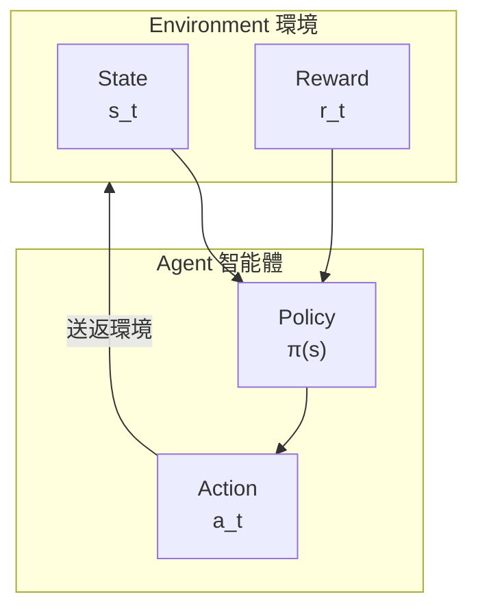

# 強化學習入門

喺前面嘅文章入面，我哋介紹咗 AlphaGo 點樣使用監督學習由人類棋譜入面學習。但監督學習有一個根本性嘅限制：**佢只能模仿人類，冇辦法超越人類**。

要令 AI 超越人類，我哋需要一種唔同嘅學習方法——**強化學習（Reinforcement Learning, RL）**。

呢篇文章會帶你由零開始理解強化學習嘅核心概念，為之後嘅自我對弈同 MCTS 整合打好基礎。

---

## 咩係強化學習？

### 同其他學習方法嘅比較

機器學習主要有三種範式：

| 範式 | 學習方式 | 例子 |
|------|---------|------|
| **監督學習** | 由標記資料學習 | 圖片分類、下一步預測 |
| **非監督學習** | 由未標記資料發現結構 | 聚類、降維 |
| **強化學習** | 由互動經驗中學習 | 落棋、玩遊戲、機械人控制 |

強化學習嘅獨特之處在於：**冇人話你知正確答案係咩，你必須透過嘗試同錯誤自己發現**。

### 一個直觀嘅例子

想像你喺教一隻小狗學習新把戲：

1. 狗做咗某個動作（可能係隨機嘅）
2. 如果動作正確，你畀佢零食（正面獎勵）
3. 如果動作錯誤，你唔畀零食或者輕聲講「唔啱」（負面或零獎勵）
4. 經過多次嘗試，狗學識咗邊啲動作會帶嚟獎勵

呢個就係強化學習嘅本質：**透過獎勵信號學習點樣行動**。

### 強化學習喺圍棋入面嘅應用

喺圍棋入面：
- 每一手棋都係一個「動作」
- 對局結束嘅時候，勝負就係「獎勵」
- AI 需要學習：邊啲下法最終會導致勝利？

但呢度有一個巨大嘅挑戰：**獎勵延遲**。一盤棋可能落 200 手以上，但只有最後先知道勝負。喺第 50 手嘅時候落嘅一步棋，點知佢對最終結果有幾多貢獻？

呢個就係強化學習最核心嘅問題之一，我哋叫佢做**信用分配問題（Credit Assignment Problem）**。

---

## 核心概念

### Agent（智能體）與 Environment（環境）

強化學習嘅基本架構包含兩個主角：



**Agent（智能體）**：
- 做出決策嘅主體
- 喺圍棋入面，就係落棋嘅 AI
- 擁有一個「策略」(Policy)，決定喺咩狀態下採取咩動作

**Environment（環境）**：
- Agent 互動嘅對象
- 喺圍棋入面，就係棋盤 + 對手
- 接收 Agent 嘅動作，返回新嘅狀態同獎勵

### State（狀態）

**狀態 s** 係對環境嘅完整描述。喺圍棋入面：
- 狀態包含：當前棋盤局面、輪到邊個落、打劫狀態等
- 狀態空間極之龐大：大約 $10^{170}$ 種可能嘅狀態

狀態必須具備**馬可夫性質**：未來只取決於當前狀態，同歷史無關。

### Action（動作）

**動作 a** 係 Agent 可以採取嘅行為。喺圍棋入面：
- 每個空點都係一個可能嘅動作
- 加上「虛手」（pass），共有 $19 \times 19 + 1 = 362$ 種動作
- 但實際上好多位置係非法嘅（好似自殺、打劫）

### Reward（獎勵）

**獎勵 r** 係環境對動作嘅反饋。喺圍棋入面：
- 勝利：$+1$
- 失敗：$-1$
- 對局中：$0$（呢個係最具挑戰性嘅地方！）

獎勵信號嘅稀疏性係圍棋強化學習嘅主要困難之一。

### Policy（策略）

**策略 π** 係 Agent 嘅行為準則，話佢知喺每個狀態下應該點做。

策略可以係：
- **確定性策略**：$a = \pi(s)$，每個狀態對應唯一嘅動作
- **隨機性策略**：$a \sim \pi(a|s)$，畀出動作嘅機率分佈

喺 AlphaGo 入面，Policy Network 就係一個隨機性策略，輸出每個位置嘅落子機率。

---

## 馬可夫決策過程（MDP）

### MDP 嘅定義

**馬可夫決策過程（Markov Decision Process, MDP）** 係強化學習嘅數學框架。

一個 MDP 由五元組 $(S, A, P, R, \gamma)$ 定義：

| 符號 | 意義 | 圍棋入面嘅對應 |
|------|------|-------------|
| $S$ | 狀態空間 | 所有可能嘅棋盤局面 |
| $A$ | 動作空間 | 所有合法嘅落子位置 |
| $P(s'|s,a)$ | 轉移機率 | 下一手之後嘅局面變化 |
| $R(s,a,s')$ | 獎勵函數 | 勝負結果 |
| $\gamma$ | 折扣因子 | 未來獎勵嘅重要性 |

### 馬可夫性質

MDP 嘅核心假設係**馬可夫性質（Markov Property）**：

$$P(s_{t+1}|s_t, a_t, s_{t-1}, a_{t-1}, \ldots, s_0) = P(s_{t+1}|s_t, a_t)$$

用白話講：**未來只取決於而家，同過去無關**。

圍棋符合呢個性質咩？

表面上睇，係嘅——只要知道當前棋盤狀態，就知道所有合法走法。但實際上，圍棋有**打劫規則**，需要記住前一步嘅狀態。AlphaGo 透過將前 8 步嘅棋盤編碼入輸入特徵嚟處理呢個問題。

### 圍棋係確定性 MDP

圍棋有一個特殊嘅性質：**轉移係確定性嘅**。

喺棋類遊戲入面，當你落一手棋，棋盤狀態嘅變化係完全確定嘅（唔似骰子遊戲有隨機性）。所以：

$$P(s'|s,a) = \begin{cases} 1 & \text{如果 } s' \text{ 係執行 } a \text{ 後嘅狀態} \\ 0 & \text{否則} \end{cases}$$

但唔好唔記得，圍棋係**雙人遊戲**，對手嘅下法會帶嚟「不確定性」。呢個令問題變成咗**對抗性 MDP**。

### 獎勵設計

獎勵函數嘅設計對強化學習至關重要。喺圍棋入面，最自然嘅設計係：

$$R(s_T) = \begin{cases} +1 & \text{如果 AI 獲勝} \\ -1 & \text{如果 AI 失敗} \end{cases}$$

其中 $T$ 係對局結束嘅時間步。

呢種**稀疏獎勵**帶嚟咗巨大嘅挑戰：
- 一盤棋可能有 200-300 步
- 只有最後一步先知道勝負
- 點樣判斷中間某一步嘅好壞？

有啲研究嘗試設計**密集獎勵**，例如：
- 食子獎勵
- 領地估計獎勵
- 形勢判斷獎勵

但 AlphaGo 嘅成功表明：**即使只用終局勝負作為獎勵，透過足夠嘅自我對弈，AI 都可以學識精妙嘅中盤戰術**。

---

## 價值函數

### 點解需要價值函數？

強化學習嘅目標係最大化**累積獎勵**。但獎勵係延遲嘅，我哋需要一種方法嚟評估「而家嘅狀態有幾好」。

呢個就係**價值函數（Value Function）** 嘅作用。

### 狀態價值函數 V(s)

**狀態價值函數** $V^\pi(s)$ 定義為：由狀態 $s$ 開始，遵循策略 $\pi$，預期能夠獲得嘅累積獎勵。

$$V^\pi(s) = \mathbb{E}_\pi \left[ \sum_{t=0}^{\infty} \gamma^t r_{t+1} \mid s_0 = s \right]$$

其中：
- $\mathbb{E}_\pi$ 表示喺策略 $\pi$ 下嘅期望值
- $\gamma \in [0, 1]$ 係**折扣因子**，令近期獎勵比遠期獎勵更加重要
- $r_{t+1}$ 係時間步 $t+1$ 獲得嘅獎勵

喺圍棋入面，$V(s)$ 可以解讀為：**由當前局面開始，AI 獲勝嘅機率**。AlphaGo 嘅 Value Network 就係學習呢個函數。

### 動作價值函數 Q(s,a)

**動作價值函數** $Q^\pi(s,a)$ 更加進一步，評估喺狀態 $s$ 下採取動作 $a$ 嘅價值：

$$Q^\pi(s,a) = \mathbb{E}_\pi \left[ \sum_{t=0}^{\infty} \gamma^t r_{t+1} \mid s_0 = s, a_0 = a \right]$$

$Q(s,a)$ 可以解讀為：**喺當前局面落呢步棋，最終獲勝嘅機率**。

### V 同 Q 嘅關係

呢兩個函數有緊密嘅關係：

$$V^\pi(s) = \sum_a \pi(a|s) Q^\pi(s,a)$$

即係話，狀態價值 = 所有可能動作嘅加權平均，權重由策略決定。

如果我哋知道最佳策略 $\pi^*$：

$$V^*(s) = \max_a Q^*(s,a)$$

最佳狀態價值 = 最佳動作嘅 Q 值。

### 貝爾曼方程

價值函數滿足一個優美嘅遞迴關係——**貝爾曼方程（Bellman Equation）**：

$$V^\pi(s) = \sum_a \pi(a|s) \sum_{s'} P(s'|s,a) \left[ R(s,a,s') + \gamma V^\pi(s') \right]$$

用白話講：**當前狀態嘅價值 = 即時獎勵 + 折扣後嘅下一狀態價值**。

呢條方程係動態規劃同好多強化學習演算法嘅理論基礎。

### AlphaGo 嘅 Value Network

喺 AlphaGo 入面，Value Network 學習嘅係 $V(s)$——評估當前局面嘅勝率。

```
輸入：棋盤狀態 s（19×19×17 嘅特徵張量）
輸出：勝率估計 V(s) ∈ [-1, 1]（使用 tanh 激活）
```

Value Network 嘅訓練目標係預測最終結果：

$$L = \mathbb{E} \left[ (V_\theta(s) - z)^2 \right]$$

其中 $z \in \{-1, +1\}$ 係對局嘅實際結果。

---

## 策略梯度方法

### 由價值到策略

傳統嘅強化學習方法（好似 Q-Learning）係「基於價值」嘅：先學習價值函數，再由入面導出策略。

但喺圍棋呢種動作空間巨大嘅問題入面，直接學習策略可能更加有效。呢個就係**策略梯度（Policy Gradient）** 方法嘅思路。

### 策略嘅參數化

我哋用神經網絡嚟表示策略：

$$\pi_\theta(a|s)$$

其中 $\theta$ 係網絡參數。網絡輸入狀態 $s$，輸出每個動作嘅機率。

喺 AlphaGo 入面，呢個就係 Policy Network：
- 輸入：棋盤狀態
- 輸出：361 個位置嘅落子機率（加上 pass）

### 策略梯度定理

我哋想搵到最佳參數 $\theta^*$，令到期望累積獎勵最大化：

$$J(\theta) = \mathbb{E}_{\pi_\theta} \left[ \sum_t r_t \right]$$

**策略梯度定理**話我哋知點樣計算 $J$ 對 $\theta$ 嘅梯度：

$$\nabla_\theta J(\theta) = \mathbb{E}_{\pi_\theta} \left[ \sum_t \nabla_\theta \log \pi_\theta(a_t|s_t) \cdot G_t \right]$$

其中 $G_t = \sum_{k=t}^{T} \gamma^{k-t} r_k$ 係由時間 $t$ 開始嘅累積獎勵。

### 直觀理解

呢條公式可以咁樣理解：

1. **$\nabla_\theta \log \pi_\theta(a_t|s_t)$**：點樣調整參數令動作 $a_t$ 嘅機率增加
2. **$G_t$**：呢個動作帶嚟嘅總回報

所以：
- 如果 $G_t > 0$（好嘅結果），增加呢個動作嘅機率
- 如果 $G_t < 0$（差嘅結果），減少呢個動作嘅機率

呢個就係**信用分配**嘅一種解決方案！

### REINFORCE 演算法

**REINFORCE** 係最簡單嘅策略梯度演算法：

```
演算法：REINFORCE

1. 初始化策略網絡參數 θ

2. 重複：
   a. 用當前策略 π_θ 完成一局對弈，收集軌跡：
      τ = (s_0, a_0, r_1, s_1, a_1, r_2, ..., s_T)

   b. 計算每步嘅累積回報：
      G_t = r_{t+1} + γ·r_{t+2} + γ²·r_{t+3} + ...

   c. 計算策略梯度：
      ∇J = (1/T) Σ_t ∇_θ log π_θ(a_t|s_t) · G_t

   d. 更新參數：
      θ ← θ + α · ∇J
```

喺圍棋入面，呢個意味住：
1. 令 AI 自己落一盤棋
2. 如果最終獲勝（$G = +1$），增加所有落過嘅棋嘅機率
3. 如果最終失敗（$G = -1$），減少所有落過嘅棋嘅機率
4. 重複呢個過程數百萬次

### 基準線（Baseline）

REINFORCE 嘅一個問題係**方差好大**。想像一盤贏嘅棋，入面可能都有啲唔好嘅棋，但佢哋嘅機率都會被增加。

解決方案係引入**基準線（baseline）**：

$$\nabla_\theta J = \mathbb{E} \left[ \sum_t \nabla_\theta \log \pi_\theta(a_t|s_t) \cdot (G_t - b(s_t)) \right]$$

常見嘅選擇係令 $b(s_t) = V(s_t)$，呢個就係**優勢函數（Advantage Function）**：

$$A(s_t, a_t) = G_t - V(s_t)$$

優勢函數衡量：「呢個動作比平均好幾多？」

- $A > 0$：呢個動作比預期好，增加佢嘅機率
- $A < 0$：呢個動作比預期差，減少佢嘅機率

AlphaGo 使用 Value Network 嚟計算基準線，呢個就係點解需要同時訓練 Policy Network 同 Value Network。

---

## 探索與利用

### 困境

強化學習面臨一個經典嘅兩難：**探索與利用（Exploration vs. Exploitation）**。

- **利用（Exploitation）**：根據目前所知，揀睇起嚟最好嘅動作
- **探索（Exploration）**：嘗試唔肯定嘅動作，可能發現更好嘅策略

純粹嘅利用會陷入局部最優；純粹嘅探索就浪費時間喺明顯嘅壞棋上面。

### 圍棋入面嘅挑戰

喺圍棋入面，呢個問題特別嚴重：

1. **動作空間巨大**：361 種可能嘅落子
2. **獎勵稀疏**：只有終局先知道好壞
3. **長期影響**：一步棋嘅影響可能要幾十手之後先顯現

### ε-Greedy 策略

最簡單嘅探索方法：

$$\pi(a|s) = \begin{cases} 1 - \varepsilon + \frac{\varepsilon}{|A|} & \text{如果 } a = \arg\max Q(s,a) \\ \frac{\varepsilon}{|A|} & \text{否則} \end{cases}$$

以 $1-\varepsilon$ 嘅機率揀最佳動作，以 $\varepsilon$ 嘅機率隨機揀。

但呢個對圍棋嚟講太粗糙咗——隨機揀一個位置落棋，大多數時候都係壞棋。

### Softmax 探索

更好嘅方法係使用 **softmax 分佈**：

$$\pi(a|s) = \frac{\exp(Q(s,a)/\tau)}{\sum_{a'} \exp(Q(s,a')/\tau)}$$

其中 $\tau$ 係**溫度參數**：
- $\tau \to 0$：接近貪婪策略（純利用）
- $\tau \to \infty$：接近均勻隨機（純探索）
- $\tau = 1$：平衡探索與利用

AlphaGo 喺自我對弈訓練入面使用類似嘅技術嚟增加多樣性。

### UCB 同 PUCT

喺 MCTS 入面，探索與利用由 **UCB（Upper Confidence Bound）** 公式處理。AlphaGo 使用嘅係佢嘅變體 **PUCT**：

$$\text{score}(s,a) = Q(s,a) + c_{\text{puct}} \cdot P(s,a) \cdot \frac{\sqrt{N(s)}}{1 + N(s,a)}$$

呢條公式喺 [PUCT 公式詳解](../puct-formula) 入面會詳細解釋。

### 本質探索（Intrinsic Exploration）

AlphaGo 仲有一種隱式嘅探索機制：**自我對弈本身就係探索**。

由於神經網絡輸出嘅係機率分佈而唔係確定性動作，每次自我對弈都會產生唔同嘅棋局。呢個自然帶嚟咗：

- **戰術多樣性**：同一個局面可能嘗試唔同嘅下法
- **風格演化**：隨住訓練，AI 可能「發現」人類從未嘗試過嘅定式
- **自我修正**：如果某種下法總係輸，機率會逐漸降低

---

## 圍棋強化學習嘅特殊性

### 同其他領域嘅比較

圍棋強化學習有一啲獨特嘅特性：

| 特性 | 圍棋 | 機械人控制 | 電子遊戲 |
|------|------|-----------|----------|
| 狀態空間 | 離散、極大 | 連續 | 離散、中等 |
| 動作空間 | 離散、大 | 連續 | 離散、細 |
| 轉移 | 確定性 | 隨機 | 確定性或隨機 |
| 獎勵 | 極稀疏 | 可設計 | 中等密集 |
| 環境模型 | 已知（規則） | 未知 | 部分已知 |
| 對抗性 | 完美資訊博弈 | 通常冇 | 可能有 |

### 確定性轉移

圍棋嘅規則係完全已知嘅。當你落一手棋，下一個狀態係確定嘅。呢個意味住：

- **可以精確模擬**：唔使學習環境模型
- **可以完美回溯**：MCTS 可以精確搜索
- **唔使處理環境隨機性**：簡化咗好多問題

### 完美資訊

圍棋係**完美資訊博弈**——雙方都可以睇到完整嘅棋盤。呢個同撲克（隱藏資訊）唔同，令問題喺某啲方面更加簡單：

- 唔使處理對手嘅隱藏資訊
- 可以使用 Minimax 框架
- 狀態表示更加直接

### 自對弈嘅可能

因為規則已知同時確定，AI 可以**同自己對弈**而唔使真實對手。呢個帶嚟咗：

- **無限嘅訓練資料**：隨時可以產生新嘅對局
- **穩定嘅對手水平**：對手就係自己，水平相當
- **漸進式提升**：隨住自己變強，對手都變強

呢個正正係 AlphaGo 成功嘅關鍵，我哋會喺下一篇 [自我對弈](../self-play) 入面詳細討論。

### 長期信用分配

圍棋嘅獎勵極之稀疏（只有終局勝負），而一局棋可能有 200-300 步。呢個帶嚟咗嚴峻嘅**信用分配問題**：

第 50 手嘅一步好棋，到第 250 手獲勝嘅時候，點樣正確分配功勞？

AlphaGo 嘅解決方案係結合多種技術：
1. **Value Network**：評估中間局面嘅勝率，提供即時反饋
2. **MCTS**：搜索驗證每步棋嘅好壞
3. **大量對弈**：透過統計學習信用分配

### 對稱性

圍棋棋盤有 8 重對稱性（4 個旋轉 × 2 個映射）。AlphaGo 利用呢點進行**資料增強**：

- 每個訓練局面可以產生 8 個變體
- 大幅增加有效訓練資料
- 確保網絡學習到對稱性不變嘅特徵

---

## 演算法比較

### 價值基礎 vs 策略基礎

| 方法 | 優點 | 缺點 | 適合場景 |
|------|------|------|---------|
| **價值基礎** (Q-Learning) | 樣本效率高 | 大動作空間難處理 | 動作空間細 |
| **策略基礎** (REINFORCE) | 可以處理大動作空間 | 方差大、樣本效率低 | 動作空間大 |
| **Actor-Critic** | 平衡兩者 | 需要同時訓練兩個網絡 | 一般性強 |

### AlphaGo 嘅選擇

AlphaGo 使用嘅係 **Actor-Critic** 架構嘅變體：

- **Policy Network**（Actor）：直接輸出動作機率
- **Value Network**（Critic）：評估狀態價值

但佢冇用傳統嘅 Actor-Critic 更新方式，而係：

1. **監督學習**：先由人類棋譜學習初始 Policy Network
2. **策略梯度**：透過自我對弈強化 Policy Network
3. **回歸學習**：用自我對弈資料訓練 Value Network
4. **MCTS 整合**：喺實際對弈入面結合兩個網絡

呢種混合方法結合咗多種技術嘅優點，係 AlphaGo 成功嘅關鍵之一。

---

## 實作考量

### 訓練穩定性

策略梯度方法有時會唔穩定。常見嘅技術包括：

**梯度裁剪（Gradient Clipping）**：
```python
# 限制梯度嘅範數
max_grad_norm = 0.5
torch.nn.utils.clip_grad_norm_(policy_net.parameters(), max_grad_norm)
```

**學習率衰減**：
```python
# 隨住訓練進行降低學習率
scheduler = torch.optim.lr_scheduler.StepLR(optimizer, step_size=100, gamma=0.9)
```

**PPO/TRPO 等進階演算法**：
限制每次更新嘅策略變化，防止災難性遺忘。

### 記憶體管理

圍棋對局好長，需要儲存大量軌跡。常見策略：

**經驗回放（Experience Replay）**：
```python
# 儲存過去嘅經驗
replay_buffer = ReplayBuffer(max_size=1000000)

# 隨機抽樣訓練
batch = replay_buffer.sample(batch_size=256)
```

**優先經驗回放**：
優先重播嗰啲「意外」嘅經驗（TD 誤差大嘅）。

### 並行化

強化學習可以高度並行化：

- **多線程對弈**：同時進行多局對弈
- **分散式訓練**：多台機器同時訓練
- **非同步更新**：A3C 等演算法

AlphaGo 嘅訓練使用咗數百個 GPU 同 TPU，同時進行數千局自我對弈。

---

## 動畫對應

本文涉及嘅核心概念與動畫編號：

| 編號 | 概念 | 物理/數學對應 |
|------|------|--------------|
| 🎬 H1 | Agent-Environment 互動 | 馬可夫鏈 |
| 🎬 H4 | 策略梯度 | 隨機優化 |
| 🎬 H6 | 探索與利用 | 多臂賭博機 |

---

## 總結

強化學習係 AlphaGo 超越人類嘅關鍵技術。我哋學習咗：

1. **基本框架**：Agent、Environment、State、Action、Reward
2. **MDP**：馬可夫決策過程，強化學習嘅數學基礎
3. **價值函數**：$V(s)$ 同 $Q(s,a)$，評估狀態同動作嘅好壞
4. **策略梯度**：直接優化策略嘅方法，REINFORCE 演算法
5. **探索與利用**：學習過程入面嘅核心權衡
6. **圍棋特性**：確定性、完美資訊、稀疏獎勵嘅挑戰同機遇

下一篇，我哋會深入探討 AlphaGo 點樣利用**自我對弈**嚟實現超越人類嘅棋力。

---

## 延伸閱讀

- **下一篇**：[自我對弈](../self-play) — 點解 AI 可以透過同自己落棋變強
- **相關**：[Value Network 詳解](../value-network) — 價值函數嘅神經網絡實現
- **進階**：[PUCT 公式詳解](../puct-formula) — 探索與利用嘅數學公式

---

## 參考資料

1. Sutton, R. S., & Barto, A. G. (2018). *Reinforcement Learning: An Introduction* (2nd ed.). MIT Press.
2. Silver, D. (2015). ["Lectures on Reinforcement Learning"](https://www.davidsilver.uk/teaching/). University College London.
3. Schulman, J., et al. (2017). "Proximal Policy Optimization Algorithms." *arXiv preprint*.
4. Williams, R. J. (1992). "Simple statistical gradient-following algorithms for connectionist reinforcement learning." *Machine Learning*, 8(3-4), 229-256.
5. Silver, D., et al. (2016). "Mastering the game of Go with deep neural networks and tree search." *Nature*, 529, 484-489.
