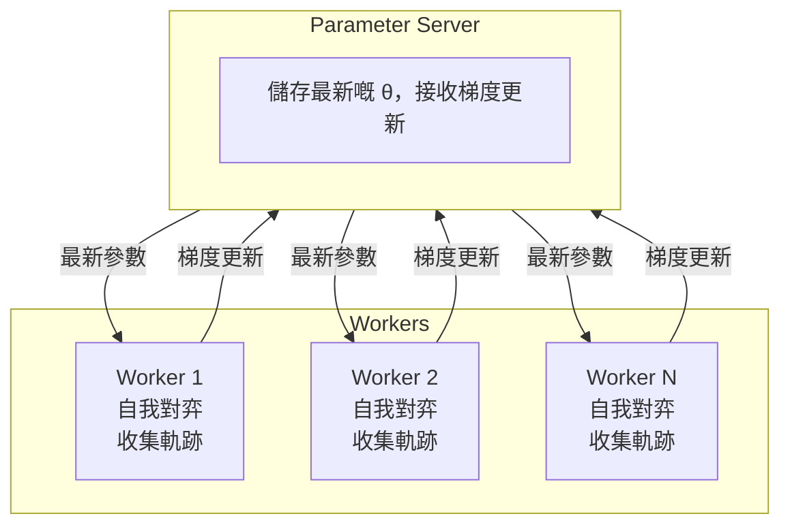

import { EloChart } from '@site/src/components/D3Charts';

# 自我對弈

喺前一篇文章入面，我哋介紹咗強化學習嘅基本概念。而家，等我哋嚟探討 AlphaGo 成功嘅關鍵之一——**自我對弈（Self-Play）**。

呢個係一個睇落矛盾嘅概念：**AI 點可以透過同自己落棋變得更強？**

答案既深刻又優雅，涉及博弈論、演化動力學、以及學習嘅本質。

---

## 點解自我對弈有效？

### 直覺解釋

想像你係一位圍棋初學者，喺一個荒島上面獨自練習：

1. 你落咗一盤棋，自己同時扮演黑白雙方
2. 對局結束之後，你分析邊啲棋落得好、邊啲落得差
3. 下一盤棋嘅時候，你嘗試避免之前嘅錯誤
4. 你重複呢個過程數百萬次

直覺上，呢個似乎有問題：
- 如果你嘅水平好差，黑白雙方都落差棋，可以學到咩？
- 會唔會陷入「錯誤嘅平衡」——雙方都落錯棋但可以互相抵消？

但實際上，自我對弈能夠產生持續嘅進步。原因如下：

### 漸進式發現弱點

關鍵洞見係：**即使雙方都係同一個 AI，每盤棋嘅結果仍然包含資訊**。

```
局面 A：AI 揀咗走法 X，最終獲勝
局面 A：AI 揀咗走法 Y，最終失敗

→ 結論：喺局面 A 入面，X 比 Y 好
```

透過統計大量對局，AI 能夠學習到每個局面下邊啲選擇更加優。呢個就係**策略梯度**嘅本質：好嘅選擇會被強化，差嘅選擇會被抑制。

### 對抗性學習

自我對弈有一個特殊嘅性質：**訓練對手會自動適應你嘅水平**。

```
訓練週期 1：AI 發現咗一個有效嘅戰術 T
訓練週期 2：作為對手嘅 AI 學識咗點樣防守 T
訓練週期 3：原版 AI 被迫尋找更好嘅戰術 T'
```

呢個形成咗一個**軍備競賽（Arms Race）**，雙方不斷發現同克服彼此嘅弱點。

### 同人類棋譜嘅比較

| 訓練方式 | 優點 | 缺點 |
|---------|------|------|
| **人類棋譜** | 學習人類智慧嘅結晶 | 受限於人類水平 |
| **自我對弈** | 冇上限嘅提升潛力 | 可能陷入局部最優 |
| **兩者結合** | 快速起步 + 持續提升 | 最佳策略 |

AlphaGo 原版先用人類棋譜做監督學習，再用自我對弈做強化學習。AlphaGo Zero 就證明咗只用自我對弈都可以達到超人水平。

---

## 博弈論視角

### 納許均衡

喺博弈論入面，**納許均衡（Nash Equilibrium）** 係一種穩定狀態：喺呢個狀態下，冇任何玩家有動機單方面改變策略。

對於圍棋呢種**零和、完美資訊博弈**，納許均衡有特殊嘅意義：

$$\pi^* = \arg\max_\pi \min_{\pi'} V(\pi, \pi')$$

其中 $V(\pi, \pi')$ 係當策略 $\pi$ 對上策略 $\pi'$ 嘅時候嘅預期價值。

呢個就係著名嘅 **Minimax 原則**：最佳策略係嗰個能夠喺最壞情況下表現最好嘅策略。

### 自我對弈與納許均衡

理論上，如果自我對弈能夠收斂，佢應該收斂到納許均衡。對於圍棋呢種確定性博弈，納許均衡就係**完美下法**。

但圍棋嘅狀態空間太大咗（$10^{170}$），我哋冇可能搵到真正嘅納許均衡。自我對弈實際上係喺**近似**呢個均衡。

### 虛擬對弈（Fictitious Play）

自我對弈同博弈論入面嘅**虛擬對弈**概念相關：

1. 每個玩家觀察對手嘅歷史策略
2. 計算對手策略嘅平均分佈
3. 揀對抗呢個平均分佈嘅最佳回應

喺某啲條件下，虛擬對弈可以證明會收斂到納許均衡。

AlphaGo 嘅自我對弈可以睇做係呢個概念嘅神經網絡實現。

---

## 自我對弈嘅機制

### 基本流程

AlphaGo 嘅自我對弈流程：

```
演算法：Self-Play Training

初始化：Policy Network π_θ（可以由監督學習或者隨機初始化開始）

重複以下步驟直到收斂：

1. 產生對弈資料
   對於 i = 1 到 N（並行進行）：
     a. 用當前策略 π_θ 進行一局自我對弈
     b. 收集軌跡：τ_i = (s_0, a_0, r_1, s_1, a_1, ...)
     c. 記錄最終結果 z_i ∈ {-1, +1}

2. 更新策略
   a. 計算策略梯度：
      ∇J = (1/N) Σ_i Σ_t ∇_θ log π_θ(a_t|s_t) · z_i
   b. 更新參數：θ ← θ + α · ∇J

3. 更新價值網絡
   a. 用 (s, z) 對訓練 Value Network
   b. 最小化：L = E[(V_φ(s) - z)²]

4. 可選：評估並保存檢查點
   a. 令新策略對抗舊版本
   b. 如果贏率 > 55%，更新對手池
```

### 訓練資料嘅產生

每局自我對弈產生一個**軌跡（trajectory）**：

$$\tau = (s_0, a_0, s_1, a_1, \ldots, s_T, z)$$

其中：
- $s_t$：時間步 $t$ 嘅棋盤狀態
- $a_t$：時間步 $t$ 揀嘅動作
- $z$：最終結果（+1 勝利，-1 失敗）

一局 200 手嘅對弈就產生咗 200 個訓練樣本。每日進行數十萬局自我對弈，訓練資料量係驚人嘅。

### 策略更新

使用策略梯度更新 Policy Network：

$$\theta \leftarrow \theta + \alpha \cdot \nabla_\theta \mathbb{E}\left[\sum_t \log \pi_\theta(a_t|s_t) \cdot z\right]$$

呢個更新嘅效果：
- 如果最終獲勝（$z = +1$），增加所有落子嘅機率
- 如果最終失敗（$z = -1$），減少所有落子嘅機率

呢個睇落好粗糙——贏棋嘅時候可能都有啲差棋，輸棋嘅時候可能都有啲好棋。但透過大量對局嘅統計，呢啲「雜訊」會被平均走，真正嘅好棋會被識別出嚟。

### 價值網絡訓練

Value Network 使用**回歸（regression）** 訓練：

$$\phi \leftarrow \phi - \beta \cdot \nabla_\phi \mathbb{E}\left[(V_\phi(s) - z)^2\right]$$

呢個令 Value Network 學識預測：由當前局面開始，最終獲勝嘅機率係幾多？

Value Network 嘅作用係：
1. 喺 MCTS 入面提供葉節點評估
2. 作為策略梯度嘅基準線（baseline）
3. 直接用於局面評估

---

## 隨機化嘅重要性

### 避免確定性循環

如果自我對弈係完全確定性嘅，可能會陷入循環：

```
策略 A 總係落固定嘅開局
策略 A 對上策略 A 總係產生相同嘅棋局
只有一局棋被反覆學習
AI 冇辦法探索其他可能性
```

呢個就係點解**隨機性**喺自我對弈入面至關重要。

### 隨機化嘅來源

AlphaGo 喺自我對弈入面引入隨機性嘅方式：

**1. 策略網絡本身係隨機嘅**

Policy Network 輸出嘅係機率分佈，而唔係確定性選擇：

$$a \sim \pi_\theta(a|s)$$

同一個局面，每次可能揀唔同嘅落子。

**2. 溫度參數**

喺訓練嘅時候使用較高嘅溫度（temperature）嚟增加多樣性：

$$\pi_\tau(a|s) = \frac{\pi_\theta(a|s)^{1/\tau}}{\sum_{a'} \pi_\theta(a'|s)^{1/\tau}}$$

- $\tau > 1$：更加隨機，更多探索
- $\tau < 1$：更加確定，更多利用
- $\tau = 1$：原始分佈

**3. 狄利克雷噪音（Dirichlet Noise）**

AlphaGo Zero 喺自我對弈嘅時候，喺根節點嘅先驗機率上面加入狄利克雷噪音：

$$P(s, a) = (1 - \varepsilon) \cdot \pi_\theta(a|s) + \varepsilon \cdot \eta_a$$

其中 $\eta \sim \text{Dir}(\alpha)$，$\varepsilon = 0.25$，$\alpha = 0.03$（針對圍棋嘅 361 個動作）。

呢個確保咗即使係非常低機率嘅走法，都有機會被探索。

### 對弈池（Population）方法

另一種增加多樣性嘅方法係維護一個**對弈池**：

```
對弈池 = [π_1, π_2, π_3, ..., π_k]（唔同版本嘅策略）

每局對弈：
1. 由池入面隨機揀一個對手
2. 同該對手進行對弈
3. 用結果更新當前策略
4. 定期將改進咗嘅策略加入池入面
```

呢種方法嘅好處：
- **多樣性**：唔同風格嘅對手
- **穩定性**：避免對特定對手過擬合
- **魯棒性**：學識應對各種策略

AlphaGo 原版同 AlphaGo Zero 都使用咗類似嘅技術。

---

## 棋力成長曲線

### Elo 評分系統

為咗追蹤 AI 棋力嘅變化，AlphaGo 使用咗 **Elo 評分系統**。

Elo 系統嘅基本原理：

$$P(\text{A 勝}) = \frac{1}{1 + 10^{(R_B - R_A)/400}}$$

其中 $R_A$ 同 $R_B$ 係雙方嘅 Elo 分數。

- 分差 200：強者預期贏 75%
- 分差 400：強者預期贏 90%
- 分差 800：強者預期贏 99%

### AlphaGo 嘅棋力成長

等我哋視覺化 AlphaGo 各版本嘅棋力成長：

<EloChart mode="zero" width={700} height={400} showMilestones={true} />

### 成長速度分析

由曲線可以觀察到幾個有趣嘅現象：

**1. 初期快速增長**

喺訓練嘅最初幾個鐘頭，AI 學識咗基本規則同簡單戰術。呢個係**低掛果實**階段——有太多明顯嘅錯誤可以修正。

**2. 中期穩定增長**

隨住基本錯誤被消除，AI 開始學習更加精妙嘅戰術同定式。增長速度變慢，但仍然穩定。

**3. 後期增長放緩**

當 AI 已經好強嘅時候，進一步提升變得困難。可能需要發現全新嘅策略，而唔只係修正錯誤。

### 超越人類嘅時刻

AlphaGo 訓練曲線入面嘅關鍵里程碑：

| 里程碑 | 相當於 | 達成時間 |
|--------|--------|---------|
| 超越業餘強豪 | Elo ~2700 | 大約 3 個鐘頭 |
| 超越 Fan Hui | Elo ~3500 | 大約 36 個鐘頭 |
| 超越 Lee Sedol | Elo ~4500 | 大約 60 個鐘頭 |
| 超越原版 AlphaGo | Elo ~5000 | 大約 72 個鐘頭 |

呢啲數字（嚟自 AlphaGo Zero）令人震驚：**AI 喺 3 日之內由零開始超越咗人類數千年嘅圍棋智慧**。

---

## 收斂性分析

### 自我對弈會收斂咩？

呢個係一個重要嘅理論問題。簡短嘅答案係：**喺某啲條件下會，但圍棋太複雜咗，我哋冇辦法嚴格證明**。

### 理論保證

對於較簡單嘅遊戲（好似井字棋），可以證明：

1. **存在性**：存在納許均衡（Minimax 定理）
2. **收斂性**：某啲演算法（好似虛擬對弈）會收斂到納許均衡

對於圍棋，我哋冇嚴格嘅收斂保證，但實驗證據顯示：
- 棋力持續提升
- 冇出現明顯嘅振盪或者退化
- 最終棋力超越所有已知人類

### 可能嘅失敗模式

自我對弈可能遇到嘅問題：

**1. 策略循環（Strategy Cycling）**

```
策略 A 打敗策略 B
策略 B 打敗策略 C
策略 C 打敗策略 A
```

呢個喺某啲遊戲入面確實會發生（好似剪刀石頭布）。但圍棋有足夠嘅複雜性，呢種純粹嘅循環似乎唔會發生。

**2. 過擬合到自己**

AI 可能學識咗只針對自己風格嘅策略，而冇辦法應對其他風格嘅對手。呢個就係點解 AlphaGo 會同唔同版本嘅自己對弈，以及最終同人類棋手測試。

**3. 局部最優**

AI 可能陷入局部最優——一種「都唔錯但唔係最好」嘅策略。隨機化同大量對弈有助於避免呢個問題。

### 實際觀察

由 AlphaGo 嘅訓練過程觀察到：

1. **持續進步**：Elo 分數隨住訓練持續上升
2. **冇退化**：冇出現棋力突然下降嘅情況
3. **風格演化**：AI 嘅落棋風格隨住訓練逐漸變化
4. **發現新定式**：AI 發現咗人類從未使用過嘅開局同戰術

呢啲觀察表明，雖然我哋冇理論保證，但自我對弈喺實踐入面確實有效。

---

## 實作細節

### 並行自我對弈

為咗加速訓練，AlphaGo 使用大規模並行自我對弈：



**關鍵設計決策**：

- **同步 vs 非同步**：AlphaGo 使用非同步更新，Worker 唔使等待彼此
- **更新頻率**：每完成 N 局對弈就更新一次參數
- **對手選擇**：隨機揀最近幾個版本入面嘅一個作為對手

### 檢查點策略

定期保存模型檢查點，用於：

1. **對弈池**：維護唔同版本嘅對手
2. **評估**：追蹤棋力變化
3. **故障恢復**：訓練中斷嘅時候可以恢復

```python
# 偽代碼
def training_loop():
    for iteration in range(num_iterations):
        # 產生對弈資料
        trajectories = parallel_self_play(current_policy, num_games=1000)

        # 更新策略
        update_policy(trajectories)

        # 定期評估同保存
        if iteration % 100 == 0:
            elo = evaluate_against_pool(current_policy)
            save_checkpoint(current_policy, elo)

            if elo > best_elo:
                add_to_pool(current_policy)
                best_elo = elo
```

### 訓練資源需求

AlphaGo 嘅訓練規模令人印象深刻：

| 版本 | 硬件 | 訓練時間 | 自我對弈局數 |
|------|------|---------|-------------|
| AlphaGo Fan | 176 GPU | 幾個月 | ~30M |
| AlphaGo Lee | 48 TPU | 幾個星期 | ~30M |
| AlphaGo Zero | 4 TPU | 3 日 | ~5M |
| AlphaGo Zero (40日版) | 4 TPU | 40 日 | ~30M |

注意 AlphaGo Zero 用更少嘅硬件同更短嘅時間達到咗更強嘅棋力——呢個係算法效率嘅提升。

### 超參數設置

一啲關鍵嘅超參數：

```python
# 自我對弈設置
NUM_PARALLEL_GAMES = 5000      # 同時進行嘅對弈數
GAMES_PER_ITERATION = 25000    # 每次迭代嘅對弈數
MCTS_SIMULATIONS = 1600        # 每步棋嘅 MCTS 模擬次數

# 訓練設置
BATCH_SIZE = 2048              # 訓練批次大小
LEARNING_RATE = 0.01           # 初始學習率
L2_REGULARIZATION = 1e-4       # 權重衰減

# 探索設置
TEMPERATURE = 1.0              # 開局 30 手嘅溫度
DIRICHLET_ALPHA = 0.03         # 狄利克雷噪音參數
EXPLORATION_FRACTION = 0.25    # 噪音比例
```

呢啲超參數係經過大量實驗調整嘅，對訓練效果有顯著影響。

---

## 自我對弈嘅變體

### AlphaGo 原版

AlphaGo 原版嘅訓練流程：

```
1. 監督學習 (SL)：由人類棋譜學習
   → 產生 SL Policy Network (π_SL)

2. 強化學習 (RL)：自我對弈
   初始化 π_RL = π_SL
   對手池 = [π_SL]

   重複：
     a. π_RL 同池入面嘅策略對弈
     b. 用策略梯度更新 π_RL
     c. 如果 π_RL 變強，加入池入面

   → 產生 RL Policy Network (π_RL)

3. 價值網絡訓練：
   用 π_RL 自我對弈產生局面
   訓練 V(s) 預測勝率
```

### AlphaGo Zero

AlphaGo Zero 簡化咗呢個流程：

```
1. 純自我對弈（冇人類資料）
   初始化隨機網絡 f_θ

   重複：
     a. 用 MCTS + f_θ 進行自我對弈
     b. 同時訓練策略頭同價值頭
     c. 更新 f_θ

   → 單一網絡同時輸出策略同價值
```

關鍵改進：
- **唔使人類資料**：由零開始
- **單一網絡**：策略同價值共享特徵
- **更簡潔嘅訓練**：端到端學習

### AlphaZero

AlphaZero 進一步泛化：

```
同樣嘅算法，唔同嘅遊戲：
- 圍棋：達到超越 AlphaGo Zero 嘅水平
- 國際象棋：超越 Stockfish
- 將棋：超越 Elmo

唯一嘅遊戲特定部分：規則編碼
```

呢個證明咗自我對弈係一種**通用嘅學習範式**，唔限於圍棋。

---

## 人類由入面學到咩？

### AI 發現嘅新定式

自我對弈產生咗好多人類從未使用過嘅下法：

**1. 開局創新**

AlphaGo 偏好嘅一啲開局：
- 3-3 侵入：喺早期就侵入角部
- 高位下法：傳統上被認為「唔穩定」
- 大雪崩變化：人類認為複雜難以計算

**2. 新嘅形勢判斷**

AI 對某啲局面嘅評估同人類大相逕庭：
- 某啲睇落「薄弱」嘅棋形其實好堅實
- 某啲「厚勢」嘅價值被高估
- 對「先手」同「後手」嘅重新評估

### 對人類圍棋嘅影響

AlphaGo 之後，職業圍棋發生咗顯著變化：

1. **開局多樣化**：職業棋手開始使用 AI 發現嘅新開局
2. **訓練方式改變**：AI 成為職業棋手嘅主要訓練工具
3. **棋理重新思考**：好多傳統「棋理」被質疑同修正
4. **新嘅美學**：開始欣賞 AI 風格嘅棋

柯潔喺輸畀 AlphaGo 之後話：

> 「AlphaGo 令我重新認識圍棋。我以前以為人類理解圍棋，而家我知道我哋只係觸及皮毛。」

---

## 哲學思考

### 學習嘅本質

自我對弈提出咗關於學習嘅深刻問題：

**知識由邊度嚟？**

- 人類學習依賴於外部資訊（老師、書本、經驗）
- 自我對弈嘅 AI 只有規則，冇外部知識
- 但佢仍然能夠「發現」知識——呢啲知識係由邊度嚟嘅？

答案可能係：**知識隱含喺遊戲規則同結構入面**。圍棋嘅規則定義咗咩係好棋、咩係壞棋，自我對弈只係揭示咗呢啲隱含嘅結構。

### 創造力與發現

當 AI 落出「神之一手」（Move 37），呢個算係創造定係發現？

一種觀點係：嗰步棋一直「存在」喺圍棋嘅規則入面，AI 只係「發現」咗佢。
另一種觀點係：AI 「創造」咗呢步棋，因為冇人（包括 AI 自己）事先知道佢。

呢個問題冇標準答案，但佢挑戰咗我哋對創造力嘅傳統理解。

### 人類智慧嘅位置

如果 AI 可以由零開始，透過自我對弈超越人類數千年嘅智慧，呢個對人類意味住咩？

樂觀嘅睇法：
- AI 係人類創造嘅工具
- AI 嘅發現可以增強人類嘅理解
- 人類可以同 AI 合作，達到更高嘅水平

謹慎嘅睇法：
- 某啲領域，純粹嘅計算可能超越人類直覺
- 需要重新思考「專業技能」嘅價值
- 教育同訓練方式可能需要改變

---

## 動畫對應

本文涉及嘅核心概念與動畫編號：

| 編號 | 概念 | 物理/數學對應 |
|------|------|--------------|
| 🎬 E5 | 自我對弈循環 | 不動點迭代 |
| 🎬 E6 | 策略演化 | 進化動力學 |

---

## 總結

自我對弈係 AlphaGo 成功嘅關鍵技術之一。我哋學習咗：

1. **點解有效**：對抗性學習、漸進式發現弱點
2. **機制**：軌跡收集、策略梯度、價值網絡訓練
3. **隨機化**：溫度參數、狄利克雷噪音、對弈池
4. **棋力成長**：Elo 系統、成長曲線分析
5. **收斂性**：理論保證與實際觀察
6. **實作細節**：並行訓練、檢查點策略、超參數

下一篇，我哋會探討 AlphaGo 點樣將神經網絡同 MCTS 結合，發揮兩者嘅優勢。

---

## 延伸閱讀

- **下一篇**：[MCTS 與神經網絡嘅結合](../mcts-neural-combo) — 直覺與推理嘅完美結合
- **上一篇**：[強化學習入門](../reinforcement-intro) — 強化學習嘅基本概念
- **相關**：[AlphaGo Zero 概述](../alphago-zero) — 由零開始嘅突破

---

## 參考資料

1. Silver, D., et al. (2016). "Mastering the game of Go with deep neural networks and tree search." *Nature*, 529, 484-489.
2. Silver, D., et al. (2017). "Mastering the game of Go without human knowledge." *Nature*, 550, 354-359.
3. Silver, D., et al. (2018). "A general reinforcement learning algorithm that masters chess, shogi, and Go through self-play." *Science*, 362(6419), 1140-1144.
4. Heinrich, J., & Silver, D. (2016). "Deep Reinforcement Learning from Self-Play in Imperfect-Information Games." *arXiv preprint*.
5. Lanctot, M., et al. (2017). "A Unified Game-Theoretic Approach to Multiagent Reinforcement Learning." *NeurIPS*.
