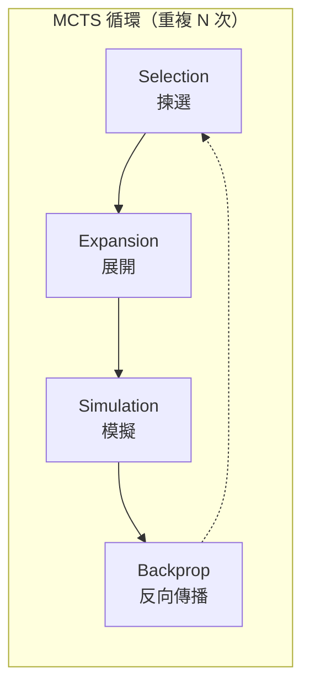
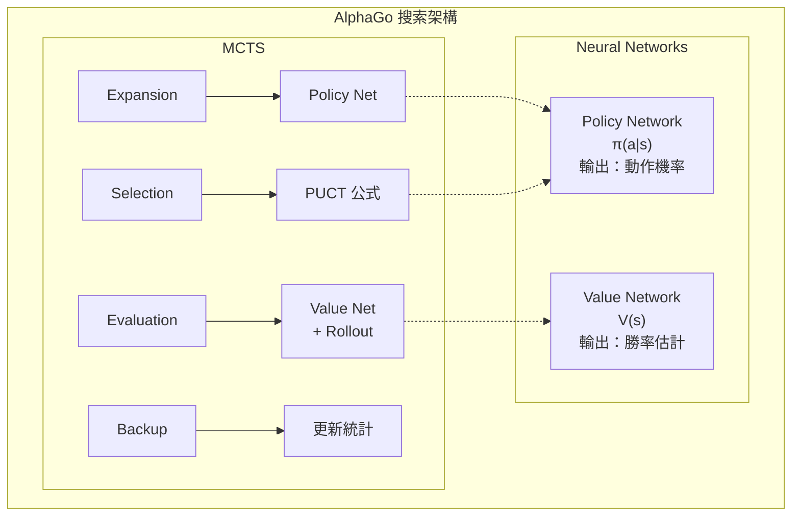
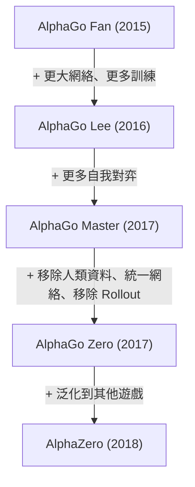

import { MCTSTree } from '@site/src/components/D3Charts';

# MCTS 與神經網絡嘅結合

喺前面嘅文章入面，我哋分別介紹咗神經網絡（Policy Network 同 Value Network）以及強化學習嘅概念。而家，等我哋探討 AlphaGo 嘅核心創新——**點樣將蒙地卡羅樹搜索（MCTS）與神經網絡完美結合**。

呢個結合係 AlphaGo 成功嘅關鍵：神經網絡提供「直覺」，MCTS 提供「推理」，兩者相輔相成。

---

## 傳統 MCTS 回顧

### 乜嘢係 MCTS？

**蒙地卡羅樹搜索（Monte Carlo Tree Search, MCTS）** 係一種基於隨機採樣嘅搜索演算法，特別適合用喺遊戲 AI。

MCTS 嘅核心諗法係：**與其窮舉所有可能嘅著法，不如隨機模擬大量對局，用統計嚟估計每個著法嘅好壞**。

### 四個階段

傳統嘅 MCTS 包含四個階段，不斷重複：



等我哋詳細了解每個階段：

### 1. Selection（揀選）

由根節點開始，沿住棵樹向下，揀「最有希望」嘅子節點，直到去到葉節點。

揀選嘅標準係 **UCB1（Upper Confidence Bound）** 公式：

$$\text{UCB1}(s, a) = \bar{X}_{s,a} + c \sqrt{\frac{\ln N_s}{N_{s,a}}}$$

其中：
- $\bar{X}_{s,a}$：由節點 $(s, a)$ 出發嘅平均回報（**利用項**）
- $\sqrt{\frac{\ln N_s}{N_{s,a}}}$：探索加成（**探索項**）
- $N_s$：父節點嘅訪問次數
- $N_{s,a}$：子節點嘅訪問次數
- $c$：平衡探索同利用嘅常數

呢條公式嘅智慧在於：
- 訪問次數少嘅節點會得到更高嘅探索加成
- 隨住訪問次數增加，揀選會越嚟越偏向實際價值高嘅節點

### 2. Expansion（展開）

去到葉節點之後，揀一個未被探索嘅動作，創建新嘅子節點。

```
展開前：                    展開後：
     ○ (根)                      ○ (根)
    /│\                         /│\
   ○ ○ ○                       ○ ○ ○
  /│              →           /│
 ○ ○                         ○ ○
   ↑                            \
   葉節點                         ● (新節點)
```

### 3. Simulation（模擬/Rollout）

由新節點開始，用某種策略（通常係隨機或者簡單啟發式）快速完成對局，攞到結果。

呢個就係「蒙地卡羅」名稱嘅來源——**用隨機模擬嚟估計結果**。

傳統 MCTS 嘅 rollout 策略可能係：
- **純隨機**：均勻隨機揀選合法著法
- **輕量級啟發式**：用簡單規則過濾明顯嘅壞棋

### 4. Backpropagation（反向傳播）

將模擬嘅結果（勝/負）沿住路徑回傳，更新每個節點嘅統計資訊：

```
更新內容：
- 訪問次數：N(s, a) ← N(s, a) + 1
- 累積價值：W(s, a) ← W(s, a) + z
- 平均價值：Q(s, a) = W(s, a) / N(s, a)
```

其中 $z$ 係模擬結果（+1 或 -1）。

### 傳統 MCTS 嘅限制

傳統 MCTS 喺圍棋上嘅表現有限，主要問題係：

1. **Rollout 質素差**：隨機模擬經常產生唔合理嘅對局
2. **需要大量模擬**：每步棋可能需要數萬次模擬
3. **評估唔準確**：淨係靠勝負統計，資訊利用效率低
4. **無法利用模式**：每次都重新搜索，唔累積經驗

呢啲問題喺 AlphaGo 入面被神經網絡優雅噉解決咗。

---

## 神經網絡點樣改進 MCTS

### 整體架構

AlphaGo 將兩個神經網絡整合落 MCTS：



### Policy Network 嘅角色

**Policy Network 喺 Expansion 階段發揮作用**。

傳統 MCTS 喺展開嗰陣，所有未探索嘅動作被視為同等重要。但 Policy Network 提供咗**先驗機率（prior probability）**：

$$P(s, a) = \pi_\theta(a|s)$$

呢個令 MCTS 優先探索嗰啲「睇落更好」嘅著法，大幅提高搜索效率。

例如，喺一個局面入面：
- 「天元」可能只有 0.01% 嘅機率
- 「角部定式」可能有 15% 嘅機率
- 「大場」可能有 10% 嘅機率

MCTS 會優先探索高機率嘅著法，而唔係嘥時間喺明顯唔好嘅選擇上面。

### Value Network 嘅角色

**Value Network 喺 Evaluation 階段發揮作用**。

傳統 MCTS 需要完成成局模擬先得到評估。但 Value Network 可以直接評估任何局面嘅勝率：

$$v(s) = V_\phi(s)$$

呢個就好似請一位大師評估局面，而唔係畀兩個初學者落完成局先睇結果。

AlphaGo 原版混合使用 Value Network 同 Rollout：

$$V(s_L) = (1 - \lambda) \cdot v_\theta(s_L) + \lambda \cdot z_L$$

其中：
- $v_\theta(s_L)$：Value Network 嘅評估
- $z_L$：Rollout 嘅結果
- $\lambda$：混合係數（AlphaGo 使用 $\lambda = 0.5$）

### 搜索樹視覺化

等我哋視覺化一棵 MCTS 搜索樹：

<MCTSTree width={700} height={450} showPUCT={true} interactive={true} />

喺呢個視覺化入面，你可以睇到：
- 節點大小反映訪問次數
- 藍色路徑係 MCTS 揀選嘅最佳路徑
- 每個節點顯示訪問次數 N 同平均價值 Q

---

## 搜索過程詳解

### 完整流程

等我哋跟蹤一次完整嘅 MCTS 模擬：

```
演算法：AlphaGo MCTS 單次模擬

輸入：根節點 s_root，Policy Network π，Value Network V

1. Selection（揀選）
   s = s_root
   路徑 = []

   while s 唔係葉節點:
       # 使用 PUCT 公式揀選動作
       a* = argmax_a [Q(s,a) + U(s,a)]

       其中 U(s,a) = c_puct · P(s,a) · √N(s) / (1 + N(s,a))

       路徑.append((s, a*))
       s = 執行動作 a* 之後嘅狀態

2. Expansion（展開）
   如果 s 唔係終局狀態:
       # 用 Policy Network 計算先驗機率
       P(s, ·) = π(·|s)

       # 為所有合法動作創建子節點
       for a in 合法動作:
           創建子節點 (s, a)
           設置 P(s,a), N(s,a)=0, W(s,a)=0

3. Evaluation（評估）
   # 混合 Value Network 同 Rollout
   v = V(s)                          # Value Network 評估
   z = rollout(s)                    # Rollout 結果
   value = (1-λ)·v + λ·z             # 混合

   # AlphaGo Zero 簡化為只用 Value Network
   # value = V(s)

4. Backpropagation（反向傳播）
   for (s', a') in 反向(路徑):
       N(s', a') += 1
       W(s', a') += value
       Q(s', a') = W(s', a') / N(s', a')
       value = -value                 # 切換視角
```

### 揀選階段詳解

揀選階段使用 **PUCT 公式**（將會喺下一篇詳細討論）：

$$a^* = \arg\max_a \left[ Q(s,a) + c_{\text{puct}} \cdot P(s,a) \cdot \frac{\sqrt{N(s)}}{1 + N(s,a)} \right]$$

呢條公式平衡咗：
- **Q(s,a)**：已知嘅平均價值（利用）
- **U(s,a)**：探索加成，結合先驗機率同訪問次數（探索）

### 展開階段詳解

當去到葉節點嗰陣，使用 Policy Network 初始化新節點：

```python
def expand(state, policy_network):
    # 攞所有合法動作嘅機率
    action_probs = policy_network(state)

    # 過濾非法動作並重新歸一化
    legal_actions = get_legal_actions(state)
    legal_probs = action_probs[legal_actions]
    legal_probs = legal_probs / legal_probs.sum()

    # 創建子節點
    for action, prob in zip(legal_actions, legal_probs):
        child = create_node(
            state=apply_action(state, action),
            prior=prob,
            visit_count=0,
            value_sum=0
        )
        add_child(current_node, action, child)
```

### 評估階段詳解

AlphaGo 原版混合使用兩種評估：

**Value Network 評估**：
- 直接輸入局面，輸出勝率
- 計算快速（一次神經網絡推理）
- 提供全局視角嘅評估

**Rollout 評估**：
- 用快速策略（Fast Rollout Policy）完成對局
- 計算較慢但提供完整嘅對局結果
- 可以發現一啲神經網絡可能忽略嘅戰術

```python
def evaluate(state, value_network, rollout_policy, lambda_mix=0.5):
    # Value Network 評估
    v = value_network(state)

    # Rollout 評估
    current = state
    while not is_terminal(current):
        action = rollout_policy(current)
        current = apply_action(current, action)
    z = get_result(current)

    # 混合
    return (1 - lambda_mix) * v + lambda_mix * z
```

AlphaGo Zero 移除咗 Rollout，只使用 Value Network。呢個簡化咗系統並提高咗效率。

### 反向傳播詳解

將評估結果沿路徑回傳，更新統計：

```python
def backpropagate(path, value):
    for state, action in reversed(path):
        # 更新訪問次數
        state.visit_count[action] += 1
        # 更新價值總和
        state.value_sum[action] += value
        # 更新平均價值
        state.Q[action] = state.value_sum[action] / state.visit_count[action]
        # 切換視角（對手嘅好處係我嘅壞處）
        value = -value
```

留意 `value = -value` 呢一步：圍棋係零和遊戲，一方嘅勝利就係另一方嘅失敗。

---

## 計算資源分配

### 搜索次數

AlphaGo 喺每步棋上面執行大量嘅 MCTS 模擬：

| 版本 | 每步模擬次數 | 思考時間 |
|------|-------------|---------|
| AlphaGo Fan | ~100,000 | 分鐘級 |
| AlphaGo Lee | ~100,000 | 分鐘級 |
| AlphaGo Zero (訓練) | 1,600 | 秒級 |
| AlphaGo Zero (比賽) | ~1,600 | 秒級 |

AlphaGo Zero 用更少嘅模擬達到更強嘅棋力，呢個係神經網絡質素提升嘅結果。

### 時間分配策略

唔同局面可能需要唔同嘅思考時間：

```python
def allocate_time(game_state, remaining_time):
    # 基本分配
    num_moves_remaining = estimate_remaining_moves(game_state)
    base_time = remaining_time / num_moves_remaining

    # 調整因素
    complexity = estimate_complexity(game_state)
    importance = estimate_importance(game_state)

    # 複雜或重要嘅局面畀更多時間
    allocated_time = base_time * complexity * importance

    # 確保唔超時
    return min(allocated_time, remaining_time * 0.3)
```

喺實際比賽入面，AlphaGo 會喺關鍵局面（好似接近勝負分界嘅時刻）投入更多思考時間。

### 並行搜索

MCTS 天生適合並行化：

**虛擬損失（Virtual Loss）** 技術：

```
當一個線程正喺探索路徑 P 嗰陣：
1. 暫時假裝呢條路徑已經輸咗（virtual loss）
2. 其他線程會傾向探索其他路徑
3. 當結果返嚟嗰陣，更新真實統計並移除虛擬損失
```

呢個確保咗多個線程唔會重複探索相同嘅路徑。

```python
def parallel_mcts_simulation(root, num_threads=8):
    virtual_losses = {}

    def simulate(thread_id):
        # 揀選階段（帶虛擬損失）
        path = []
        node = root
        while not node.is_leaf():
            action = select_with_virtual_loss(node, virtual_losses)
            add_virtual_loss(node, action, virtual_losses)
            path.append((node, action))
            node = node.children[action]

        # 展開同評估
        value = expand_and_evaluate(node)

        # 反向傳播並移除虛擬損失
        backpropagate(path, value)
        remove_virtual_losses(path, virtual_losses)

    # 並行執行多個模擬
    threads = [Thread(target=simulate, args=(i,)) for i in range(num_threads)]
    for t in threads:
        t.start()
    for t in threads:
        t.join()
```

### GPU 批次處理

神經網絡推理喺 GPU 上面最有效率嘅方式係批次處理。AlphaGo 使用**批次評估**：

```
唔使用批次：
  模擬 1 → 評估 1 → 模擬 2 → 評估 2 → ...
  GPU 利用率低

使用批次：
  收集 32 個待評估嘅局面
  → 一次過送入 GPU 評估
  → 返回 32 個結果
  GPU 利用率高
```

呢個需要更複雜嘅調度，但大幅提高咗吞吐量。

---

## 溫度與最終揀選

### 訓練時嘅溫度

喺自我對弈訓練嗰陣，AlphaGo 使用**溫度**嚟控制探索：

$$\pi(a) = \frac{N(s,a)^{1/\tau}}{\sum_{a'} N(s,a')^{1/\tau}}$$

其中 $\tau$ 係溫度參數。

- $\tau = 1$：機率正比於訪問次數（保持多樣性）
- $\tau \to 0$：揀選訪問次數最多嘅動作（確定性揀選）

AlphaGo Zero 嘅策略：
- **頭 30 手**：$\tau = 1$，保持開局多樣性
- **之後**：$\tau \to 0$，揀選最佳著法

### 比賽時嘅揀選

喺實際比賽入面，揀選通常係確定性嘅：

```python
def select_move(root, temperature=0):
    if temperature == 0:
        # 揀選訪問次數最多嘅動作
        return argmax(root.visit_counts)
    else:
        # 按溫度調整嘅機率分佈採樣
        probs = root.visit_counts ** (1 / temperature)
        probs = probs / probs.sum()
        return np.random.choice(actions, p=probs)
```

### 考慮勝率

有時都會考慮平均價值而唔係淨係訪問次數：

```python
def select_move_with_value(root, temperature=0):
    # 混合訪問次數同價值
    scores = root.visit_counts * (1 + root.Q_values)
    scores = scores / scores.sum()

    if temperature == 0:
        return argmax(scores)
    else:
        probs = scores ** (1 / temperature)
        probs = probs / probs.sum()
        return np.random.choice(actions, p=probs)
```

---

## 與純神經網絡嘅比較

### 點解需要搜索？

一個自然嘅問題係：**既然神經網絡已經可以預測好嘅著法，點解仲需要搜索？**

答案係：**搜索可以修正神經網絡嘅錯誤並發現更好嘅著法**。

| 方法 | 優點 | 缺點 |
|------|------|------|
| 純神經網絡 | 快速、直覺 | 可能有盲點 |
| 純 MCTS | 可以深入分析 | 慢、需要評估 |
| 神經網絡 + MCTS | 結合兩者優點 | 計算量大 |

### 實驗證據

DeepMind 嘅實驗顯示：

```
純 Policy Network：約 3000 Elo
Policy + 少量 MCTS：約 3500 Elo
Policy + Value + MCTS：約 4500 Elo
```

搜索提供咗顯著嘅棋力提升。

### 搜索嘅作用

搜索喺以下情況特別有價值：

1. **戰術計算**：讀出複雜嘅攻殺
2. **修正偏見**：糾正神經網絡嘅系統性錯誤
3. **處理罕見局面**：神經網絡訓練嗰陣可能未見過
4. **驗證直覺**：確認「睇落好」嘅棋確實係好棋

---

## AlphaGo 各版本嘅差異

### AlphaGo Fan/Lee

```
架構：
- SL Policy Network（監督學習）
- RL Policy Network（強化學習）
- Value Network
- Fast Rollout Policy

搜索時：
- 用 SL Policy Network 嘅先驗機率
- 混合 Value Network 同 Rollout 評估
```

### AlphaGo Master

```
架構：
- 更大嘅神經網絡
- 更多嘅訓練資料
- 改進嘅特徵

搜索時：
- 類似 AlphaGo Lee
- 更強嘅網絡 = 更少嘅搜索需求
```

### AlphaGo Zero

```
架構：
- 單一雙頭 ResNet
- 由零開始訓練
- 無 Rollout

搜索時：
- 策略頭提供先驗機率
- 價值頭直接評估
- 更簡潔、更強
```

### 演進總結



---

## 實作考量

### 記憶體管理

MCTS 樹可以變得好大：

```
假設：
- 每步平均 200 個合法動作
- 搜索深度 10
- 完全展開：200^10 ≈ 10^23 個節點（唔可能）

實際做法：
- 只展開被訪問嘅節點
- 定期清理好少訪問嘅節點
- 重用上一步嘅搜索樹
```

### 樹嘅重用

當對手落棋之後，可以重用部分搜索樹：

```python
def reuse_tree(root, opponent_move):
    if opponent_move in root.children:
        new_root = root.children[opponent_move]
        # 清理唔需要嘅其他分支
        for action in root.children:
            if action != opponent_move:
                delete_subtree(root.children[action])
        return new_root
    else:
        # 對手落咗意外嘅棋，需要重新開始
        return create_new_root()
```

### 神經網絡緩存

同一局面可能被多次評估，使用緩存避免重複計算：

```python
class NeuralNetworkCache:
    def __init__(self, max_size=100000):
        self.cache = LRUCache(max_size)

    def evaluate(self, state, network):
        state_hash = hash(state)
        if state_hash in self.cache:
            return self.cache[state_hash]
        else:
            result = network(state)
            self.cache[state_hash] = result
            return result
```

### 對稱性利用

圍棋有 8 重對稱性，可以用嚟增強搜索：

```python
def evaluate_with_symmetry(state, network):
    # 生成所有對稱變換
    symmetries = generate_symmetries(state)  # 8 個版本

    # 評估所有版本
    values = [network(s) for s in symmetries]

    # 平均（更穩定）
    return np.mean(values)
```

---

## 搜索深度與廣度

### 動態調整

MCTS 自動平衡深度與廣度：

- **廣度**：由 Policy Network 嘅先驗機率控制
- **深度**：由 Value Network 嘅準確度決定

當神經網絡好好嗰陣：
- 高置信嘅著法會被深入探索
- 低置信嘅著法被快速排除
- 搜索自然聚焦喺重要嘅分支

### 與傳統搜索嘅比較

| 方法 | 深度控制 | 廣度控制 |
|------|---------|---------|
| Minimax | 固定深度 | Alpha-Beta 剪枝 |
| 傳統 MCTS | 由模擬決定 | UCB1 |
| AlphaGo MCTS | Policy + Value 引導 | PUCT + Policy |

AlphaGo 嘅搜索更「智能」——佢知道邊啲地方值得深入，邊啲可以快速略過。

---

## 動畫對應

本文涉及嘅核心概念與動畫編號：

| 編號 | 概念 | 物理/數學對應 |
|------|------|--------------|
| 🎬 C5 | MCTS 四階段 | 樹搜索 |

---

## 總結

MCTS 與神經網絡嘅結合係 AlphaGo 嘅核心創新。我哋學習咗：

1. **傳統 MCTS**：Selection、Expansion、Simulation、Backpropagation
2. **神經網絡改進**：Policy Network 引導展開、Value Network 取代 Rollout
3. **搜索過程**：PUCT 揀選、批次評估、反向傳播
4. **資源分配**：模擬次數、時間管理、並行搜索
5. **溫度揀選**：訓練同比賽嘅唔同策略
6. **實作細節**：記憶體管理、樹重用、緩存

下一篇，我哋將會深入探討 PUCT 公式嘅數學細節。

---

## 延伸閱讀

- **下一篇**：[PUCT 公式詳解](../puct-formula) — MCTS 揀選嘅數學原理
- **上一篇**：[自我對弈](../self-play) — 自我對弈嘅機制與效果
- **相關**：[Policy Network 詳解](../policy-network) — 策略網絡嘅架構

---

## 參考資料

1. Silver, D., et al. (2016). "Mastering the game of Go with deep neural networks and tree search." *Nature*, 529, 484-489.
2. Silver, D., et al. (2017). "Mastering the game of Go without human knowledge." *Nature*, 550, 354-359.
3. Coulom, R. (2006). "Efficient Selectivity and Backup Operators in Monte-Carlo Tree Search." *Computers and Games*.
4. Kocsis, L., & Szepesvári, C. (2006). "Bandit based Monte-Carlo Planning." *ECML*.
5. Browne, C., et al. (2012). "A Survey of Monte Carlo Tree Search Methods." *IEEE TCIAIG*.
6. Rosin, C. D. (2011). "Multi-armed bandits with episode context." *Annals of Mathematics and Artificial Intelligence*.
