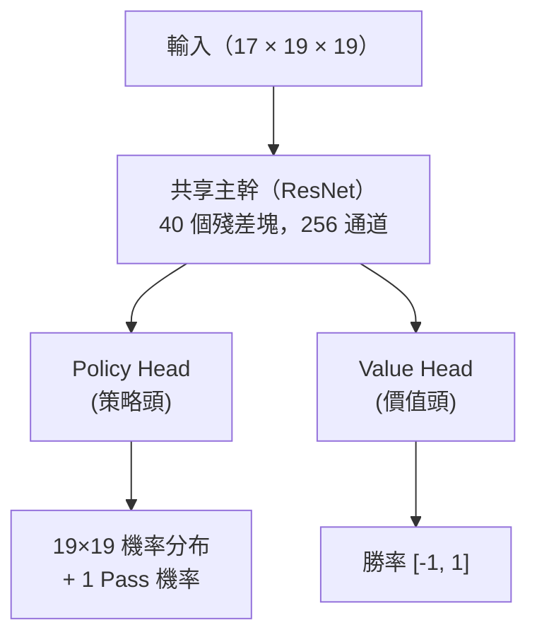
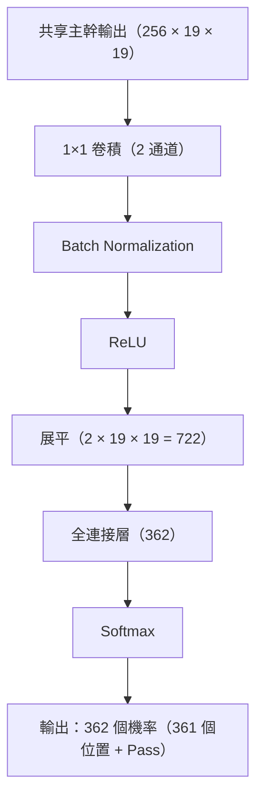
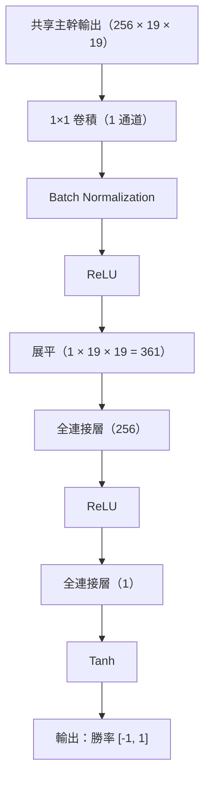
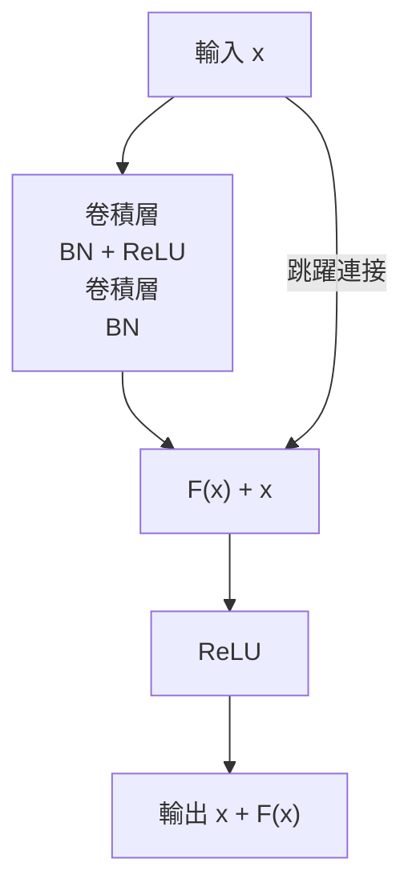
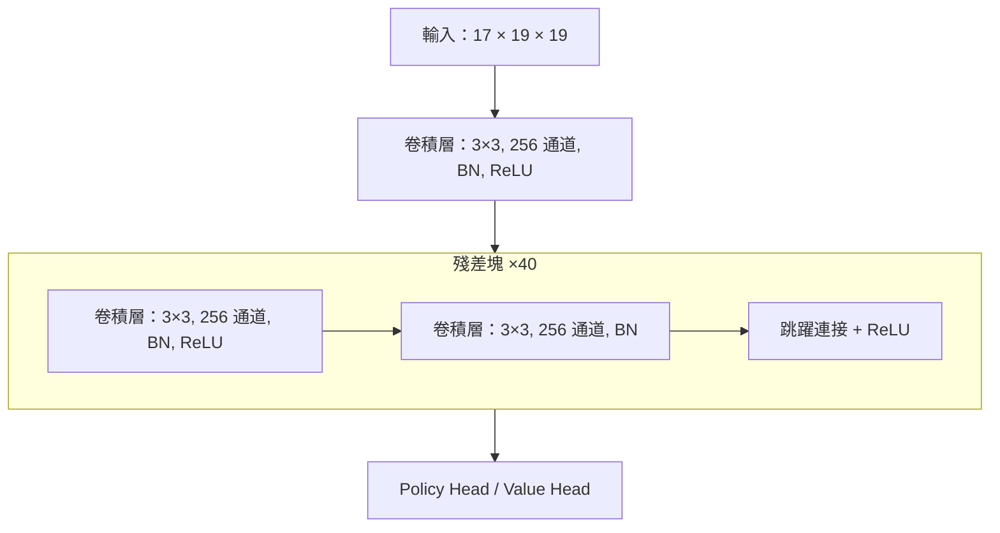

# 雙頭網絡與殘差網絡

AlphaGo Zero 最重要嘅架構創新之一，係使用**雙頭網絡**（Dual-Head Network）取代原版 AlphaGo 嘅雙網絡設計。呢個睇落簡單嘅改變，卻帶嚟咗顯著嘅效能提升同更優雅嘅學習過程。

本文將會深入解析呢個架構嘅設計原理、數學基礎，以及點解佢咁有效。

---

## 雙頭網絡設計

### 整體架構

AlphaGo Zero 嘅神經網絡可以分為三個部分：



等我哋逐一解析每個部分。

### 共享主幹（Shared Backbone）

共享主幹係一個深層嘅**殘差網絡（ResNet）**，負責由棋盤狀態入面提取特徵。

#### 架構細節

| 組件 | 規格 |
|------|------|
| 輸入層 | 3×3 卷積，256 通道 |
| 殘差塊 | 40 個（或 20 個精簡版） |
| 每個殘差塊 | 2 層 3×3 卷積，256 通道 |
| 激活函數 | ReLU |
| 正規化 | Batch Normalization |

#### 數學表示

設輸入為 x（維度 17 x 19 x 19），共享主幹嘅輸出為：

```
f(x) = ResNet_40(Conv_3x3(x))
```

其中 f(x)（維度 256 x 19 x 19）係高維特徵表示。

### Policy Head（策略頭）

Policy Head 負責預測每個位置嘅落子機率。

#### 架構細節



#### 數學表示

```
π = Softmax(FC(Flatten(ReLU(BN(Conv_1x1(f(x)))))))
```

輸出 π 係一個 362 維向量，滿足所有元素非負且和為 1。

### Value Head（價值頭）

Value Head 負責預測當前局面嘅勝率。

#### 架構細節



#### 數學表示

```
v = Tanh(FC_1(ReLU(FC_2(Flatten(ReLU(BN(Conv_1x1(f(x)))))))))
```

輸出 v 喺 [-1, 1] 範圍內：
- v = 1：當前方必勝
- v = -1：當前方必敗
- v = 0：勢均力敵

---

## 點解要共享主幹？

### 直覺理解

「下一步應該落邊度」（Policy）同「邊個會贏」（Value）呢兩個問題，其實需要理解相同嘅棋盤模式：

- **棋形**：邊啲形狀係好嘅，邊啲係差嘅
- **勢力**：邊邊更大，邊啲地方仲有空間
- **死活**：邊啲棋已經活咗，邊啲仲喺打劫
- **戰鬥**：邊度有攻殺，局部勝負點樣

如果用兩個獨立嘅網絡，呢啲特徵需要學習兩次。共享主幹令呢啲底層特徵只需學習一次，兩個任務都能使用。

### 多任務學習視角

由機器學習嘅角度，呢個係一種**多任務學習（Multi-task Learning）**：

```
L = L_policy + L_value
```

兩個任務共享底層表示，呢個帶嚟幾個好處：

#### 1. 正則化效果

共享參數相當於隱式嘅正則化。如果一個特徵只對 Policy 有用而對 Value 無用（或者相反），佢更難被過度放大。

有效參數量細過兩個獨立網絡嘅參數量。

#### 2. 資料效率

每一局棋同時產生 Policy 標籤（MCTS 搜索機率）同 Value 標籤（最終勝負）。共享主幹令兩個標籤都用於訓練共享特徵，提高咗資料利用效率。

#### 3. 梯度訊號豐富

兩個任務嘅梯度都會流向共享主幹：

```
∂L/∂θ_shared = ∂L_policy/∂θ_shared + ∂L_value/∂θ_shared
```

呢個提供咗更豐富嘅監督訊號，令共享特徵更加穩健。

### 實驗證據

DeepMind 嘅消融實驗顯示，雙頭網絡嘅表現顯著優於分離嘅雙網絡：

| 配置 | ELO 評分 | 相對差距 |
|------|----------|----------|
| 分離嘅 Policy + Value 網絡 | 基準 | - |
| 雙頭網絡（共享主幹） | +300 ELO | ~65% 勝率差距 |

300 ELO 嘅差距意味住雙頭網絡對分離網絡有約 65% 嘅勝率。呢個係一個顯著嘅提升。

---

## 殘差網絡原理

### 深度網絡嘅困境

喺 ResNet 發明之前，深層神經網絡面臨一個悖論：

> 理論上，更深嘅網絡應該至少同淺層網絡一樣好（最差情況下，額外嘅層可以學習恆等映射）。但實際上，更深嘅網絡往往表現更差。

呢個就係**退化問題（Degradation Problem）**：

- 訓練誤差隨深度增加而增加（唔係過擬合，係優化困難）
- 梯度喺反向傳播嗰陣逐漸消失（Vanishing Gradient）
- 深層嘅參數幾乎無法被有效更新

### 殘差塊嘅設計

何愷明等人喺 2015 年提出咗一個簡潔而優雅嘅解決方案：**殘差連接（Skip Connection）**。



#### 數學表示

傳統網絡：學習目標映射 H(x)

```
y = H(x)
```

殘差網絡：學習**殘差映射** F(x) = H(x) - x

```
y = F(x) + x
```

### 點解殘差連接有效？

#### 1. 梯度高速公路

考慮反向傳播嘅梯度：

```
∂L/∂x = ∂L/∂y × ∂y/∂x = ∂L/∂y × (1 + ∂F(x)/∂x)
```

關鍵在於嗰個 **+1**。即使 ∂F(x)/∂x 好細或者為零，梯度仍然可以透過 +1 直接傳返去。

呢個就好似修咗一條「梯度高速公路」，令梯度可以暢通無阻噉由輸出層傳返輸入層。

#### 2. 恆等映射更容易學習

如果最優解接近恆等映射（H(x) 約等於 x），咁：
- 傳統網絡：需要學習 H(x) = x，可能好難
- 殘差網絡：只需學習 F(x) 約等於 0，相對容易

將權重初始化為零或者接近零，殘差塊就自然趨向恆等映射。

#### 3. 集成效應

深層 ResNet 可以視為好多淺層網絡嘅**隱式集成**。如果有 n 個殘差塊，資訊可以透過 2^n 種唔同嘅路徑流動。

呢種集成效應增加咗模型嘅穩健性。

### ResNet 喺 ImageNet 上嘅突破

ResNet 喺 2015 年 ImageNet 競賽入面取得咗驚人嘅成績：

| 深度 | Top-5 錯誤率 |
|------|-------------|
| VGG-19（無殘差） | 7.3% |
| ResNet-34 | 5.7% |
| ResNet-152 | 4.5% |
| 人類水平 | ~5.1% |

**152 層**嘅 ResNet 唔淨止可以訓練，仲比 19 層嘅 VGG 好得多。呢個證明咗殘差連接確實解決咗深度網絡嘅訓練問題。

---

## AlphaGo Zero 嘅 40 層 ResNet

### 點解揀 40 層？

DeepMind 測試咗唔同深度嘅 ResNet：

| 殘差塊數量 | 總層數 | ELO 評分 |
|------------|--------|----------|
| 5 | 11 | 基準 |
| 10 | 21 | +200 |
| 20 | 41 | +400 |
| 40 | 81 | +500 |

更深嘅網絡確實更強，但邊際效益遞減。AlphaGo Zero 使用 20 或 40 個殘差塊：

- **AlphaGo Zero（論文版）**：40 個殘差塊，256 通道
- **精簡版**：20 個殘差塊，256 通道

40 層嘅配置喺棋力同訓練成本之間取得咗良好嘅平衡。

### 具體配置

AlphaGo Zero 嘅 ResNet 配置如下：



#### 參數量估計

| 組件 | 參數量（約） |
|------|-------------|
| 輸入卷積 | 17 × 3 × 3 × 256 ≈ 39K |
| 每個殘差塊 | 2 × 256 × 3 × 3 × 256 ≈ 1.2M |
| 40 個殘差塊 | 40 × 1.2M ≈ 47M |
| Policy Head | ~1M |
| Value Head | ~0.2M |
| **總計** | **~48M** |

約 4800 萬參數，以現代標準嚟講係中等規模嘅神經網絡。

### Batch Normalization 嘅作用

每個卷積層之後都有 **Batch Normalization（BN）**，呢個對訓練穩定性至關重要：

#### 1. 正規化啟動值

BN 將每一層嘅啟動值正規化到均值為 0、方差為 1：

```
x_hat = (x - μ_B) / sqrt(σ_B² + ε)
y = γ × x_hat + β
```

其中 γ 同 β 係可學習嘅參數。

#### 2. 緩解內部協變量偏移

深層網絡入面，每一層嘅輸入分布會隨住前面層嘅參數更新而改變。BN 令每一層嘅輸入分布保持穩定，加速訓練收斂。

#### 3. 正則化效果

BN 喺訓練嗰陣使用 mini-batch 嘅統計量，引入咗隨機性，有輕微嘅正則化效果。

---

## 與其他架構嘅比較

### vs. 原版 AlphaGo 嘅 CNN

| 特性 | AlphaGo 原版 | AlphaGo Zero |
|------|-------------|--------------|
| 架構類型 | 標準 CNN | ResNet |
| 深度 | 13 層 | 41-81 層 |
| 殘差連接 | 無 | 有 |
| 網絡數量 | 2（分離） | 1（共享） |
| BN | 無 | 有 |

### vs. VGG 風格網絡

VGG 係 2014 年 ImageNet 亞軍嘅架構，使用堆疊嘅 3×3 卷積：

| 特性 | VGG | ResNet |
|------|-----|--------|
| 最大可訓練深度 | ~19 層 | 152+ 層 |
| 梯度流動 | 逐層遞減 | 有高速公路 |
| 訓練難度 | 深層困難 | 深層可訓練 |

### vs. Inception / GoogLeNet

Inception 使用多尺度卷積並行：

| 特性 | Inception | ResNet |
|------|-----------|--------|
| 特點 | 多尺度特徵 | 深度堆疊 |
| 複雜度 | 較高 | 簡潔 |
| 圍棋適用性 | 一般 | 優秀 |

ResNet 嘅簡潔設計更適合圍棋呢種需要深層推理嘅任務。

### vs. Transformer

2017 年提出嘅 Transformer 架構喺 NLP 領域取得咗巨大成功。有人嘗試將 Transformer 應用於圍棋：

| 特性 | ResNet | Transformer |
|------|--------|-------------|
| 歸納偏置 | 局部性（卷積） | 全局注意力 |
| 位置編碼 | 隱式（卷積） | 顯式 |
| 圍棋表現 | 優秀 | 可行但唔優於 ResNet |
| 計算效率 | 較高 | 較低（O(n²)） |

對於圍棋呢種有明顯空間結構嘅問題，CNN/ResNet 嘅歸納偏置更加合適。

---

## 設計選擇嘅深入分析

### 點解用 3×3 卷積？

AlphaGo Zero 全程使用 3×3 卷積，而唔係更大嘅卷積核：

1. **參數效率**：兩個 3×3 卷積嘅感受野等於一個 5×5，但參數量更少（18 vs 25）
2. **更深嘅網絡**：相同參數量下，可以堆疊更多層
3. **更多非線性**：每層之間有 ReLU，增加表達能力

### 點解用 256 通道？

256 通道係一個經驗性嘅選擇：

- **太少**（如 64）：表達能力不足，無法捕捉複雜模式
- **太多**（如 512）：參數量翻倍，訓練成本大增，但棋力提升有限

後嚟嘅 KataGo 實驗顯示，通道數可以根據訓練資源調整：
- 低資源：128 通道，20 塊
- 高資源：256 通道，40 塊
- 更高資源：384 通道，60 塊

### 點解 Policy Head 用 Softmax、Value Head 用 Tanh？

#### Policy Head：Softmax

落子係一個**分類問題**——361 個位置（加 Pass）入面揀一個。Softmax 輸出滿足：
- 所有機率非負：π_i >= 0
- 機率和為 1：Σπ_i = 1

呢個同機率分布嘅定義一致。

#### Value Head：Tanh

勝率係一個**回歸問題**——預測一個連續值。Tanh 輸出範圍係 [-1, 1]：
- 有界：唔會產生極端值
- 對稱：勝同負對稱處理
- 可微：方便梯度計算

使用 Tanh 而唔係無界輸出（好似線性層）可以防止訓練唔穩定。

---

## 訓練細節

### 損失函數

AlphaGo Zero 嘅總損失係三項之和：

```
L = L_policy + L_value + L_reg
```

#### Policy Loss

使用**交叉熵損失**，令網絡輸出逼近 MCTS 搜索機率：

```
L_policy = -Σ π_MCTS(a) × log(π_net(a))
```

其中：
- π_MCTS(a) 係 MCTS 對動作 a 嘅搜索機率
- π_net(a) 係網絡輸出嘅機率

#### Value Loss

使用**均方誤差（MSE）**，令網絡輸出逼近實際勝負：

```
L_value = (v_net - z)²
```

其中：
- v_net 係網絡預測嘅勝率
- z 係實際比賽結果（+1 或 -1）

#### Regularization Loss

使用 **L2 正則化**防止過擬合：

```
L_reg = c × ||θ||²
```

其中 c 係正則化係數，θ 係網絡參數。

### 優化器配置

| 參數 | 值 |
|------|-----|
| 優化器 | SGD + Momentum |
| 動量 | 0.9 |
| 初始學習率 | 0.01 |
| 學習率衰減 | 每 X 步減半 |
| Batch Size | 32 × 2048 = 64K（分散式）|
| L2 正則化係數 | 1e-4 |

### 資料增強

圍棋棋盤有 8 重對稱性（4 次旋轉 × 2 次翻轉）。訓練嗰陣，每個局面可以產生 8 個等價嘅訓練樣本。

呢個令有效訓練資料增加 8 倍，且唔需要額外嘅自我對弈。

---

## 實作考量

### 記憶體優化

40 層 ResNet 嘅訓練需要大量記憶體：
- **前向傳播**：需要儲存每層嘅啟動值（用於反向傳播）
- **反向傳播**：需要儲存梯度

優化策略：
1. **梯度檢查點（Gradient Checkpointing）**：只儲存部分啟動值，需要嗰陣重新計算
2. **混合精度訓練**：使用 FP16 減少記憶體佔用
3. **分散式訓練**：將 batch 分散到多個 GPU/TPU

### 推理優化

推理嗰陣唔需要 BN 嘅 mini-batch 統計量，可以使用訓練嗰陣累積嘅移動平均：

```
x_hat = (x - μ_moving) / sqrt(σ_moving² + ε)
```

呢個令推理速度更快且結果確定性。

### 量化與壓縮

部署嗰陣可以進一步壓縮網絡：
- **權重量化**：FP32 → INT8，記憶體減少 4 倍
- **剪枝**：移除細權重連接
- **知識蒸餾**：用大網絡訓練細網絡

---

## 動畫對應

本文涉及嘅核心概念與動畫編號：

| 編號 | 概念 | 物理/數學對應 |
|------|------|--------------|
| 🎬 E3 | 雙頭網絡 | 多任務學習 |
| 🎬 D12 | 殘差連接 | 梯度高速公路 |
| 🎬 D8 | 卷積神經網絡 | 局部感受野 |
| 🎬 D10 | Batch Normalization | 分布正規化 |

---

## 延伸閱讀

- **上一篇**：[AlphaGo Zero 概述](../alphago-zero) — 點解唔需要人類棋譜
- **下一篇**：[由零訓練嘅過程](../training-from-scratch) — Day 0-3 嘅詳細演進
- **技術深入**：[CNN 與圍棋嘅結合](../cnn-and-go) — 點解 CNN 適合棋盤

---

## 參考資料

1. Silver, D., et al. (2017). "Mastering the game of Go without human knowledge." *Nature*, 550, 354-359.
2. He, K., et al. (2016). "Deep Residual Learning for Image Recognition." *CVPR 2016*.
3. Ioffe, S., & Szegedy, C. (2015). "Batch Normalization: Accelerating Deep Network Training by Reducing Internal Covariate Shift." *ICML 2015*.
4. Caruana, R. (1997). "Multitask Learning." *Machine Learning*, 28(1), 41-75.
5. Veit, A., et al. (2016). "Residual Networks Behave Like Ensembles of Relatively Shallow Networks." *NeurIPS 2016*.
