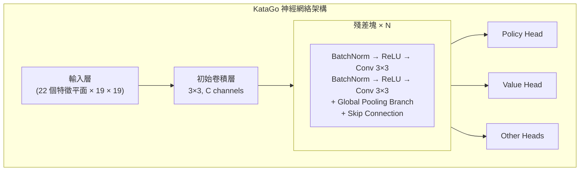
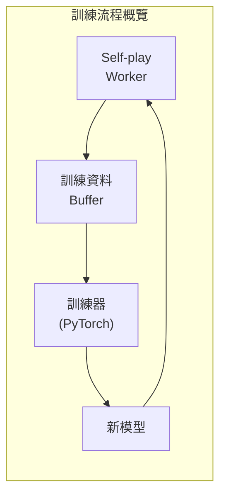

# KataGo 原始碼架構

本文深入解析 KataGo 嘅原始碼結構，幫你理解佢嘅內部實作。無論你係想貢獻程式碼、修改功能，定係將佢嘅技術應用到自己嘅專案，呢度都係必讀嘅參考資料。

## 專案目錄結構

```
KataGo/
├── cpp/                    # C++ 核心程式碼
│   ├── main.cpp           # 主程式入口
│   ├── command/           # 各種執行模式
│   ├── core/              # 核心工具類
│   ├── game/              # 圍棋規則同棋盤
│   ├── search/            # MCTS 搜索引擎
│   ├── neuralnet/         # 神經網絡介面
│   ├── dataio/            # 資料 I/O
│   ├── configs/           # 設定檔範例
│   └── tests/             # 單元測試
├── python/                 # Python 訓練程式碼
│   ├── train.py           # 訓練主程式
│   ├── model.py           # 模型定義
│   ├── data_processing_pytorch.py
│   └── configs/           # 訓練設定
├── docs/                   # 文件
└── scripts/               # 輔助腳本
```

### cpp/ 目錄詳解

```
cpp/
├── main.cpp                # 程式入口，解析命令列參數
├── command/
│   ├── gtp.cpp            # GTP 協議實作
│   ├── analysis.cpp       # Analysis Engine 實作
│   ├── benchmark.cpp      # 基準測試
│   ├── genconfig.cpp      # 設定檔生成
│   └── selfplay.cpp       # 自我對弈
├── core/
│   ├── global.h           # 全域常數同設定
│   ├── hash.h             # Zobrist 雜湊
│   ├── rand.h             # 隨機數生成
│   ├── logger.h           # 日誌系統
│   ├── config_parser.h    # 設定檔解析
│   └── threadsafe*.h      # 執行緒安全工具
├── game/
│   ├── board.h/cpp        # 棋盤表示同基本操作
│   ├── rules.h/cpp        # 圍棋規則
│   ├── boardhistory.h/cpp # 棋局歷史
│   └── graphhash.h/cpp    # 局面雜湊
├── search/
│   ├── search.h/cpp       # 搜索引擎主類
│   ├── searchnode.h/cpp   # 搜索樹節點
│   ├── searchparams.h     # 搜索參數
│   ├── mutexpool.h        # 鎖池
│   ├── searchresults.h    # 搜索結果
│   └── asyncbot.h/cpp     # 非同步機械人
├── neuralnet/
│   ├── nninputs.h/cpp     # 神經網絡輸入特徵
│   ├── nneval.h/cpp       # 神經網絡評估
│   ├── nninterface.h      # 後端抽象介面
│   ├── cudabackend.cpp    # CUDA 後端
│   ├── openclbackend.cpp  # OpenCL 後端
│   ├── eigenbackend.cpp   # Eigen(CPU) 後端
│   └── modelversion.h     # 模型版本管理
└── dataio/
    ├── sgf.h/cpp          # SGF 檔案處理
    ├── numpywrite.h/cpp   # NumPy 格式輸出
    └── trainingwrite.h/cpp # 訓練資料寫入
```

## 神經網絡架構

### 網絡結構概覽



### 輸入特徵（nninputs.cpp）

KataGo 使用 22 個特徵平面作為輸入：

```cpp
// 主要輸入特徵類別
enum {
  // 棋盤狀態
  INPUT_FEATURE_STONE_OUR,      // 我方棋子
  INPUT_FEATURE_STONE_OPP,      // 對方棋子

  // 氣數相關（1-8氣）
  INPUT_FEATURE_LIBERTIES_1,
  INPUT_FEATURE_LIBERTIES_2,
  // ...
  INPUT_FEATURE_LIBERTIES_8_OR_MORE,

  // 歷史狀態
  INPUT_FEATURE_LAST_MOVE,      // 上一手位置
  INPUT_FEATURE_SECOND_LAST_MOVE,

  // 規則相關
  INPUT_FEATURE_KOMI,           // 貼目
  INPUT_FEATURE_RULES,          // 規則編碼
  // ...
};
```

### 全局池化分支

KataGo 嘅創新之一係喺殘差塊入面加入全局池化：

```cpp
// 簡化嘅全局池化實作概念
class GlobalPoolingResBlock {
public:
  void forward(Tensor& x) {
    // 標準殘差路徑
    Tensor regular_out = regular_conv_path(x);

    // 全局池化路徑
    Tensor global_mean = global_avg_pool(x);  // [batch, C]
    Tensor global_max = global_max_pool(x);    // [batch, C]
    Tensor global_features = concat(global_mean, global_max);

    // 處理全局特徵
    global_features = dense_layer(global_features);  // [batch, C]

    // 廣播返空間維度同常規路徑結合
    Tensor global_broadcast = broadcast_to_spatial(global_features);
    x = regular_out + global_broadcast;
  }
};
```

### 輸出頭

```cpp
// Policy Head：預測落子機率
class PolicyHead {
  // 輸出：19×19+1（含 pass）
  // 使用 softmax 正規化
};

// Value Head：預測勝負
class ValueHead {
  // 輸出：3（勝/負/和機率）
  // 使用 softmax 正規化
};

// Score Head：預測目數
class ScoreHead {
  // 輸出：連續值（預期目數差）
};

// Ownership Head：預測領地
class OwnershipHead {
  // 輸出：19×19（每點歸屬，tanh）
};
```

## 搜索引擎實作

### MCTS 核心類別

```cpp
// search/search.h
class Search {
public:
  // 執行搜索
  void runWholeSearch(Player pla);

  // 攞最佳著法
  Loc getBestMove();

  // 攞分析結果
  AnalysisData getAnalysisData();

private:
  SearchParams params;          // 搜索參數
  SearchNode* rootNode;         // 根節點
  NNEvaluator* nnEval;         // 神經網絡評估器
  std::mutex* mutexPool;       // 鎖池
};
```

### 搜索節點結構

```cpp
// search/searchnode.h
struct SearchNode {
  // 節點統計
  std::atomic<int64_t> visits;           // 訪問次數
  std::atomic<double> valueSumWeight;    // 價值累積權重
  std::atomic<double> valueSum;          // 價值累積和

  // 子節點
  std::atomic<int> numChildren;
  SearchChildPointer* children;          // 子節點指標陣列

  // 神經網絡輸出快取
  std::shared_ptr<NNOutput> nnOutput;
};

struct SearchChildPointer {
  Loc moveLoc;                           // 著點
  std::atomic<SearchNode*> node;         // 子節點指標
  std::atomic<int64_t> edgeVisits;       // 邊訪問次數
};
```

### PUCT 選擇演算法

```cpp
// 選擇要探索嘅子節點
int Search::selectChildToDescend(SearchNode* node, Player pla) {
  int bestIdx = -1;
  double bestValue = -1e100;

  for (int i = 0; i < node->numChildren; i++) {
    SearchChildPointer& child = node->children[i];

    // 計算 Q 值（exploitation）
    double q = getChildQ(child);

    // 計算 U 值（exploration）
    double prior = getPrior(node, child.moveLoc);
    double parentVisits = node->visits.load();
    double childVisits = child.edgeVisits.load();

    double u = params.cpuctExploration * prior *
               sqrt(parentVisits) / (1.0 + childVisits);

    // PUCT 公式
    double value = q + u;

    if (value > bestValue) {
      bestValue = value;
      bestIdx = i;
    }
  }

  return bestIdx;
}
```

### 並行搜索實作

```cpp
void Search::runWholeSearch(Player pla) {
  // 啟動多個搜索執行緒
  std::vector<std::thread> threads;
  for (int i = 0; i < params.numSearchThreads; i++) {
    threads.emplace_back([this, pla]() {
      runSingleSearchThread(pla);
    });
  }

  // 等待所有執行緒完成
  for (auto& t : threads) {
    t.join();
  }
}

void Search::runSingleSearchThread(Player pla) {
  while (!shouldStop()) {
    // 選擇路徑
    std::vector<SearchNode*> path;
    SearchNode* leaf = selectAndDescend(rootNode, path);

    // 擴展節點
    expandNode(leaf);

    // 神經網絡評估
    NNOutput output = nnEval->evaluate(leaf->board);

    // 回傳更新
    backpropagateValue(path, output.value);
  }
}
```

### 虛擬損失（Virtual Loss）

用嚟喺並行搜索嗰陣避免多執行緒選擇相同路徑：

```cpp
void Search::applyVirtualLoss(SearchNode* node) {
  // 暫時減少呢個節點嘅評估值
  // 令其他執行緒傾向於選擇唔同路徑
  node->virtualLoss.fetch_add(1);
}

void Search::removeVirtualLoss(SearchNode* node) {
  node->virtualLoss.fetch_sub(1);
}
```

## 訓練流程概述

### 訓練資料生成



### 自我對弈（cpp/command/selfplay.cpp）

```cpp
// Self-play 主循環
void runSelfPlayLoop() {
  while (true) {
    // 載入最新模型
    loadLatestModel();

    // 進行一局對弈
    GameData gameData = playSingleGame();

    // 儲存訓練資料
    writeTrainingData(gameData);
  }
}

GameData playSingleGame() {
  Board board;
  BoardHistory history;
  GameData gameData;

  while (!history.isGameOver()) {
    // 使用 MCTS 選擇著法
    Search search(board, history, params);
    search.runWholeSearch(history.currentPla);

    // 攞 MCTS 結果作為訓練目標
    MoveData moveData;
    moveData.policyTarget = search.getPolicyDistribution();
    moveData.valueTarget = search.getValue();

    // 執行著法
    Loc move = search.sampleMove();
    board.playMove(move, history.currentPla);

    gameData.moves.push_back(moveData);
  }

  // 回填最終結果
  gameData.finalScore = history.finalScore();
  return gameData;
}
```

### 訓練資料格式

```cpp
// dataio/trainingwrite.h
struct TrainingRow {
  // 輸入特徵
  float inputFeatures[NUM_FEATURES][BOARD_SIZE][BOARD_SIZE];

  // 訓練目標
  float policyTarget[BOARD_SIZE * BOARD_SIZE + 1];  // 含 pass
  float valueTarget[3];                              // 勝/負/和
  float scoreTarget;                                 // 目數
  float ownershipTarget[BOARD_SIZE][BOARD_SIZE];    // 領地

  // 元資料
  int turn;
  int rules;
  float komi;
};
```

### Python 訓練程式（python/train.py）

```python
# 訓練主循環（簡化）
def train():
    model = KataGoModel(config)
    optimizer = torch.optim.SGD(model.parameters(), lr=config.lr)

    for epoch in range(config.num_epochs):
        for batch in data_loader:
            # 前向傳播
            policy_pred, value_pred, score_pred, ownership_pred = model(batch.input)

            # 計算損失
            policy_loss = cross_entropy(policy_pred, batch.policy_target)
            value_loss = cross_entropy(value_pred, batch.value_target)
            score_loss = mse_loss(score_pred, batch.score_target)
            ownership_loss = mse_loss(ownership_pred, batch.ownership_target)

            # 總損失（加權和）
            total_loss = (
                policy_loss +
                config.value_weight * value_loss +
                config.score_weight * score_loss +
                config.ownership_weight * ownership_loss
            )

            # 反向傳播
            optimizer.zero_grad()
            total_loss.backward()
            optimizer.step()

        # 儲存 checkpoint
        save_checkpoint(model, epoch)
```

### 模型定義（python/model.py）

```python
class KataGoModel(nn.Module):
    def __init__(self, config):
        super().__init__()

        # 初始卷積
        self.initial_conv = nn.Conv2d(
            config.input_channels,
            config.trunk_channels,
            kernel_size=3, padding=1
        )

        # 殘差塊
        self.blocks = nn.ModuleList([
            ResBlock(config.trunk_channels, use_global_pooling=True)
            for _ in range(config.num_blocks)
        ])

        # 輸出頭
        self.policy_head = PolicyHead(config)
        self.value_head = ValueHead(config)
        self.score_head = ScoreHead(config)
        self.ownership_head = OwnershipHead(config)

    def forward(self, x):
        # 主幹網絡
        x = self.initial_conv(x)
        for block in self.blocks:
            x = block(x)

        # 各輸出頭
        policy = self.policy_head(x)
        value = self.value_head(x)
        score = self.score_head(x)
        ownership = self.ownership_head(x)

        return policy, value, score, ownership
```

## 關鍵資料結構

### Board（game/board.h）

```cpp
class Board {
public:
  // 棋盤狀態
  Color stones[MAX_BOARD_AREA];    // 每個點嘅顏色
  Chain chains[MAX_BOARD_AREA];    // 棋串資訊

  // 劫爭
  Loc koLoc;

  // 執行著法
  void playMove(Loc loc, Color pla);

  // 合法性檢查
  bool isLegal(Loc loc, Color pla) const;

  // 氣數計算
  int getLiberties(Loc loc) const;
};

struct Chain {
  int liberties;                   // 氣數
  int numStones;                   // 棋子數
  Loc head;                        // 鏈結串列頭
};
```

### BoardHistory（game/boardhistory.h）

```cpp
class BoardHistory {
public:
  std::vector<Board> boards;       // 歷史棋盤狀態
  std::vector<Move> moves;         // 著法歷史
  Rules rules;                     // 規則
  Player currentPla;               // 當前輪到邊個

  // 遊戲狀態
  bool isGameOver() const;
  float finalScore() const;
};
```

### NNOutput（neuralnet/nneval.h）

```cpp
struct NNOutput {
  // Policy
  float policyProbs[MAX_BOARD_AREA + 1];  // 含 pass

  // Value
  float whiteWinProb;
  float whiteLossProb;
  float noResultProb;

  // Score
  float whiteScoreMean;
  float whiteScoreStdev;

  // Ownership
  float ownership[MAX_BOARD_AREA];  // -1 到 1
};
```

## 開發同除錯

### 編譯測試版本

```bash
cd cpp
mkdir build_debug && cd build_debug
cmake .. -DCMAKE_BUILD_TYPE=Debug -DUSE_BACKEND=OPENCL
make -j$(nproc)
```

### 執行單元測試

```bash
./katago runtests
```

### 常用除錯方法

```cpp
// 1. 使用日誌
#include "core/logger.h"
Logger::log("Debug message", value);

// 2. 使用 kata-debug-print GTP 指令
// 輸出詳細嘅搜索資訊

// 3. 編譯嗰陣啟用 sanitizers
cmake .. -DCMAKE_CXX_FLAGS="-fsanitize=address"
```

### 效能分析

```bash
# 使用 perf（Linux）
perf record ./katago benchmark -model model.bin.gz
perf report

# 使用 Instruments（macOS）
instruments -t "Time Profiler" ./katago benchmark -model model.bin.gz
```

## 延伸閱讀

- [KataGo GitHub](https://github.com/lightvector/KataGo)
- [KataGo 論文](https://arxiv.org/abs/1902.10565)
- [KataGo Discord](https://discord.gg/bqkZAz3) - 同開發者交流
- [KataGo Training](https://katagotraining.org/) - 查看訓練進度

理解咗 KataGo 嘅原始碼架構之後，你已經具備咗深入研究或貢獻開源專案嘅能力。如果想進一步了解，建議直接閱讀 KataGo 嘅 GitHub 原始碼，同埋參與社群討論。

