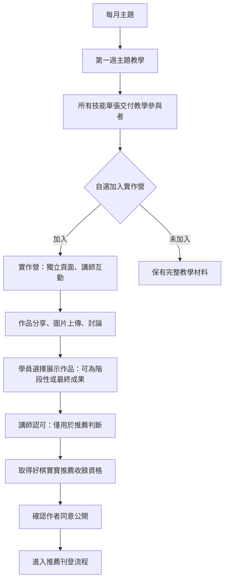
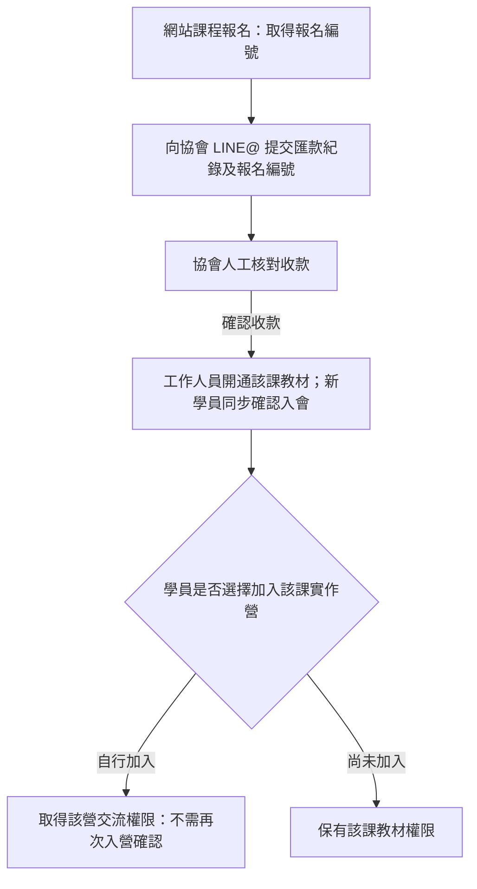

# 共學營網站重構：現況盤點與訪談紀錄

盤點日期：2026-09-15。初始盤點來源基準：Git `813271c2b`。狀態：已收到 Q1～Q20 回答；每課固定 6,000 元，包含第一週教學、全部技能單張與自選加入該課四週實作營的資格，首次同時包含入會，既有協會人員報課也同價。LINE@ 承接匯款紀錄與其他私密資料提交，教材、作品與交流在網站。學員附報名編號供協會核對匯款，由協會人工核款、開通該課教材，新學員同步取得會員資格；之後可自行加入該課實作營。網站提供 LINE 與 Email 登入，帳號歸屬、綁定及其餘範圍仍待釐清，尚未形成實作規格。

本文件依本次使用者要求，先盤點現況，再以 `grill-with-docs`（`grilling` + `domain-modeling`）逐組釐清決策。舊版 `revamp/` 文件是歷史背景，不能直接當成本次共學營定位。

## 1. 本次已確認的方向與界線

以下來源為 2026-09-15 使用者指示；尚未回答的細節不視為已確認。

| 已確認方向／界線 | 理由與尚待釐清部分 |
| --- | --- |
| 以 Astro 7 為技術目標，重新整理前端架構 | 版本方向由使用者指定；選用理由、確切版本、整合套件及遷移範圍仍需訪談。實際起點是 Docusaurus，屬跨框架遷移。 |
| 使用 OKLCH、受限制的字級、共用 spacing／typography／color／component 規範 | 使用者要解決頁面各自定義樣式造成的不一致。現有 token 機制可評估延續，具體配色與尺寸未獲本次確認。 |
| 從「協會」轉向「共學營」的產品與品牌定位 | 協會是主辦者，共學營凝聚各行各業交流 AI 應用，會員是參與必要資格。正式品牌名稱與首頁呈現仍待決定。 |
| 每課固定 6,000 元，首次包含入會與首課 | Q10～Q12 確認價格；Q13 確認包含第一週教學、全部技能單張及自選加入該課實作營，不另收實作費。原「會員免費參加」已被取代。 |
| LINE@ 提交私密資料，網站承接學習交流 | Q14／Q15 確認協會成員收款，匯款紀錄傳至協會 LINE@；教材、作品與交流在網站。報名如何連到網站登入身分仍未決。 |
| 報名編號核對、人工開通、自行入營 | Q16～Q18 確認學員附報名編號提交匯款紀錄，協會人工核款並開通該課教材，學員再自行加入該課實作營，不需第二次入營確認。Q20 確認新學員首次核款與首課開通時，同步取得會員資格。 |
| 網站提供 LINE 與 Email 登入 | Q19 指定兩種登入方式；Q21 確認同一學員兩種方式對應同一帳號，Q22 確認機構中的實際參與者各自報名與持有帳號。綁定操作、Email 驗證及機構標示仍待確認。 |
| 本階段先發展繁體中文 | Q2026-09-19 確認暫時忽略多國語系，先聚焦繁體中文；舊站資料保存為歷史資料，必要時在適合位置調閱。多國語系子網域延後，見 [ADR 0006](../../docs/adr/0006-traditional-chinese-first-and-archive-old-site-data.md)。 |
| 主題教學、實作營與推薦有不同參與條件 | Q6 確認完整教材給教學參與者，實作營由有興趣者另行加入，推薦則需講師認可；避免把聽課、實作與推薦資格混為同一件事。 |
| 營期、持續交流與推薦公開分別管理 | Q7 確認四週含第一週，結營後可交流、講師視意願回覆；Q8／Q9 確認公開主題介紹、營內限該營成員、推薦作品附作者且須品質認可與公開同意。 |
| 先盤點及訪談，不修改程式碼、不開始實作 | 避免在服務、受眾、資訊架構尚未明確前，把假設固化為頁面和功能。 |
| 不預設保留全部架構，也不預設全部重寫 | 保留與重構須依功能價值、耦合、維護成本、實際內容與搜尋需求判斷。 |
| 框架遷移與視覺／品牌改版須能分別追溯 | 使用者要求避免無法回溯的大變更。各階段順序、驗收與回退方式尚未決定。 |
| 每次只問一組相關問題，模糊答案須追問 | 關鍵決策由使用者回答；不以沉默、推測或舊版文件補足答案。 |

本次檢查清單：

- [x] 讀取專案入口、工程技能與 domain／tracker 設定。
- [x] 盤點 package、框架、目錄、頁面、元件、樣式、字型、內容與資料。
- [x] 盤點建置、檢查、部署與自動化設定。
- [x] 檢查既有 SEO／AEO／GEO 資料與產物，標明證據限制。
- [x] 新增本盤點文件；依回答建立 `CONTEXT.md`、五份 ADR 與受眾名單文件，沒有修改網站程式、套件、內容頁或部署設定。
- [ ] 完成分組訪談，記錄領域詞彙及有理由的決策。
- [ ] 整理本次必要／可延後範圍、分階段規劃與驗收條件。

這是內部工程文件；公開頁面的 Meta／Schema／YMYL 關卡不適用。本次未執行 install、build、lint、test、部署、commit 或 push，沒有宣稱這些檢查已通過。

## 2. 技術與目錄現況

### 框架、版本與工具鏈

| 項目 | 盤點結果 | 證據 |
| --- | --- | --- |
| 框架 | Docusaurus **3.9.2**，沒有 Astro 套件或 Astro 設定檔 | [package.json](../../package.json)、[pnpm-lock.yaml](../../pnpm-lock.yaml)；已安裝版本相符 |
| UI | React／React DOM **19.2.4**，D3 **7.9.0** | `package.json:17` |
| Node | 本機 **22.22.0**；package 宣告 `>=18.0`；CI 使用 **20** | `package.json:49`、[build.yml](../../.github/workflows/build.yml):47 |
| 套件管理 | pnpm lockfile；CI pnpm 9、frozen install；未見 packageManager／Node 版本檔 | `build.yml:42` |
| Markdown | MDX／React、remark-math／rehype-katex、Mermaid | [docusaurus.config.js](../../docusaurus.config.js):147 |
| 搜尋 | Docusaurus local search，啟用 docs／pages，分詞設定 zh／en | `docusaurus.config.js:158` |
| 文件落差 | `CLAUDE.md` 仍寫 Docusaurus 3.8.1、舊內容目錄與 Plausible；實際已有 GA4／Umami | [CLAUDE.md](../../CLAUDE.md)、`docusaurus.config.js:19`、`:207` |

Astro 7 已有正式發布資料：官方於 2026-09-03 發布 [Astro 7.3](https://astro.build/blog/astro-730/)。本次沒有選定 patch 版本或安裝套件。當前[安裝文件](https://docs.astro.build/en/install-and-setup/)要求 Node 22.12.0 以上，且不支援奇數主版本；現有 CI Node 20 因此需納入遷移評估。

官方另有 [Docusaurus 遷移指南](https://docs.astro.build/en/guides/migrate-to-astro/from-docusaurus/)；[v7 升級指南](https://docs.astro.build/en/guides/upgrade-to/v7/)處理的是 Astro v6 → v7，不是此專案的直接升級路徑。

### 目錄責任

| 目錄 | 實際用途 |
| --- | --- |
| `src/pages/` | 自訂 React 頁面與頁面 CSS Modules |
| `src/components/`、`src/theme/`、`src/css/` | 共用元件、Docusaurus 主題覆寫、全域 CSS 與 tokens |
| `src/data/` | 人物、活動、工具、研究、產業情報、分類與友站，7 個 JS 資料檔 |
| `docs/` | 繁中 Markdown／MDX 內容；`agents/**`、`adr/**` 排除公開收集 |
| `i18n/` | 10 個非預設語系的文件與 UI 翻譯，另有預設語系目錄 |
| `static/` | 圖片、CNAME、robots、llms 文件與 sitemap index |
| `analytics/` | GitHub Traffic 與網站 GA4／GSC 等資料、SEO 及部署腳本 |
| `revamp/`、`seo/` | 歷史改版策略與 SEO 作業規範 |
| `.github/`、`.husky/` | CI、報表工作流、hook 檔案 |
| `slack-bot/` | 獨立 Node 專案，是否納入本次範圍待定 |
| `build/`、`.docusaurus/`、`node_modules/` | 本機既有產物與依賴，不能視為目前來源重新建置的驗證結果 |

頂層沒有 `scripts/`、`plugins/`；主要營運腳本在 `analytics/scripts/` 與 `revamp/tools/`。盤點開始時沒有根 `CONTEXT.md` 或 `docs/adr/`。

## 3. 頁面、內容與使用者旅程

### 路由與內容數量

| 類型 | 現況 |
| --- | --- |
| 自訂頁面 | `/`、`/apps/`、`/research/`、`/intel/`、`/impact-report/2026/`，共 5 頁 |
| 搜尋 | `/search/`，另外依語系生成；設定排除 sitemap |
| 公開 docs 來源 | 140 篇：about 74、tech 27、alphago 21、learn 16、animations 1、intro 1 |
| 工程 docs | 4 篇 `docs/agents/` 文件，已排除網站收集 |
| 翻譯來源 | 共 646 篇：en／zh-cn／ko／ja 各 73，其餘六個翻譯語系各 59；本階段不把翻譯資料視為新站必須移植的頁面 |
| 語系與 URL | 11 語系，繁中在根路徑，其餘有語系前綴；尾斜線開啟；Arabic 為 RTL |
| 既有 sitemap | 2026-09-10 本地 build 中，每語系 145 URL，合計 1,595；這不是完整翻譯數，也不是本次新 build 結果 |

依據：[src/pages](../../src/pages)、[docs](../../docs)、[i18n](../../i18n)、`docusaurus.config.js:96`。Sidebar 由 [sidebars.js](../../sidebars.js):18 依目錄自動產生，因此現有目錄結構也影響公開資訊架構。

設定語系數、翻譯檔數與生成 URL 數是不同概念。部分語系缺少翻譯仍生成頁面，不能直接稱作「全站完整支援 11 語」。後續需決定內容維護責任與缺譯策略。

### 現在實際呈現的品牌

- [首頁原始碼](../../src/pages/index.js):17 主敘事為因圍棋結識、因 AI 一起做事；主要行動是寄信「合作提案」「先見面聊聊」，另有「認識夥伴」。這些現況也出現在[公開首頁](https://www.weiqi.kids/)的抓取內容。
- 導覽入口是夥伴、AI 工具、論文、產業情報及圍棋資源，不只是協會簡介。
- [合作頁](../../docs/about/cooperation.md):27 目前承諾免費、無會員費、無付費培訓；記錄理事長做 AI 整合、夥伴提供領域知識，並說尚未啟動定期實體棋會。這些是舊服務承諾，不能直接套用新共學營。
- [舊定位](../0-positioning/positioning.md):14 為 2026-05-14 的商界合作夥伴主軸；[舊策略](../4-strategy/strategy.md)亦有後續修訂。它們可能與新方向衝突，但本次保留歷史原檔。
- `src/data/` 記錄 37 位人物、5 項活動、10 個工具、9 篇研究、23 個產業情報。許多作品在其他子網域，官網重構是否包含外站尚未確認。
- 全域 description 仍寫 11 位夥伴，首頁已寫 37 位；這是可見的重複維護落差，不應以換字解決。

## 4. Components、CSS 與字型

### 已有設計系統

[design-tokens.css](../../src/css/design-tokens.css):14 已定義 OKLCH 語意色、5 階字級、10 個 spacing token、行高、字重、圓角與陰影，以及 dark mode 對應。

| 類型 | 舊規範現況；不是本次選定數值 |
| --- | --- |
| 字級 | h1／h2／h3／body／caption 為 2.25／1.5／1.125／1／0.875rem；註解標示 36／24／18／16／14px |
| 間距 | 0.25rem 至 4rem，採 4px base 的 10 個 token |
| 色彩 | 黑白灰、暖橙語意品牌色，另保留舊綠色及暖色 primitives |
| 字型 | 沒有全域 font-family token；主體依賴 framework 預設，局部指定系統中文字型或 monospace |
| 明暗模式 | token 有 dark 定義，但 config 指定 light、停用切換及系統偏好 |

檔案的「2026-05-28 用戶確認」註解屬舊版記錄。不能據此替本次共學營決定配色、字級或品牌調性。

[custom.css](../../src/css/custom.css):9 匯入 tokens 並對接 Infima `--ifm-*`；`:94` 起大量以 `!important` 覆蓋主題字級。這層與 Docusaurus 耦合，遷移時需重新評估。

### 一致性與重構候選

統計範圍僅 `src/**/*.css`，不含 framework、SVG、MDX inline styles 或 build：

- 15 個 CSS 檔、2,433 行：全域 2 檔／337 行；頁面 3 檔／426 行；元件 10 檔／1,670 行。
- 126 個 font-size 宣告中 118 個使用 `var()`，8 個直接寫 px，集中在 [D3Charts/styles.css](../../src/components/D3Charts/styles.css):49 起。這是引用形式統計，不等於所有呈現都已通過一致性檢驗。
- 元件與頁面仍混用舊字級別名及語意名稱；D3 的 CSS／JS 另有色彩和 SVG 字級字面值。
- `src/components/` 有 11 個目錄／25 個 JS。`HomepageLinks` 有 473 行 JS 與 600 行 CSS，混合多個首頁內容區塊。
- `AppCard`、`PaperCard`、`IntelCard` 已使用 tokens，但重複 surface、hover、border、padding 規則，適合評估共用元件基礎。
- 人物、活動、作品資料與顯示已有分離；`ProfileHero`／`ProfileWorks` 等 props 邊界值得保留評估。
- 圍棋盤、Elo、PolicyHeatmap、MCTS 等 React／D3 互動教材有使用價值，但使用 Docusaurus `BrowserOnly` 等接口，不能直接搬檔視為完成遷移。
- `HomepageFeatures` 在本次搜尋範圍未見使用，列清理候選；尚未做刪除決策。

`static/` 未見 woff／woff2／ttf／otf；src／config 未見自訂 font-face、Google Fonts 或 font preload。KaTeX 另由外部 stylesheet 提供數學排版。尚未測量瀏覽器 computed font 與字型載入。

### 需要後續實測的呈現問題

- Arabic 已設定 RTL，但自訂 CSS 有 `text-align: left`／`border-left`；需查證現有 framework 轉換及遷移後行為。
- 部分人物共用資料與圖表標籤仍為中文，不能從語系路由推定內容已翻譯。
- [MCTSTree.js](../../src/components/D3Charts/MCTSTree.js):154 起的節點以 mouseover／click 操作，未見對應鍵盤入口；部分 label／SVG 缺少可見的輔助技術關聯。
- OKLCH 不代表對比一定合格；本次未做色彩對比、瀏覽器無障礙、視覺或效能測量。

## 5. SEO／AEO／GEO 與保留證據

### 能力與問題

| 面向 | 現況及後續評估 |
| --- | --- |
| URL、canonical、hreflang | 既有本地首頁與英文 PUCT HTML 有 canonical、11 個 alternate 及 x-default；不能當作所有頁面的完整驗證 |
| Sitemap、日期 | 搜尋頁排除 sitemap；lastmod 使用文件 Git 歷史，CI 特別保留 `fetch-depth: 0`。遷移應評估保留真實更新日期的語意 |
| Schema | 集中提供 Organization／WebSite、Article／WebPage、Person、CollectionPage、FAQ；語意責任有價值，但 Head／useDoc 等接口綁定 Docusaurus |
| Schema 落差 | [ArticleSchema](../../src/components/SEO/ArticleSchema.js):37 的 URL 固定 `/docs/`，未帶語系；[DocSchema](../../src/components/SEO/DocSchema.js):58 有缺日期時固定 2024-01-01 的 fallback，需核對使用情境 |
| AI 可讀內容 | [llms.txt](../../static/llms.txt)、[llms-full.txt](../../static/llms-full.txt) 已存在，仍含協會定位、框架名稱與固定清單；存在本身不能證明 AI 引用成效 |
| 公開邊界 | `docs/about/internal/` 仍是公開文件；例如收據 SOP 為待補充且既有 HTML 無 noindex。目錄叫 internal 並不構成存取限制 |
| 語系旅程 | [Root.js](../../src/theme/Root.js):93 依瀏覽器／localStorage 強制切換語系，拼接目的 URL，未檢查目的頁；是否保留需另作決策 |

指南中的固定 Schema 數量與 `.key-answer` 等規則是本專案舊規範，不直接視為搜尋引擎或生成式服務的通用要求。後續依頁面內容、官方規範及可測量結果重新評估，不能為達配額補造 FAQ、專家或資格。

### 實際流量資料

來源：[analytics/seo-daily/2026-09-14.json](../../analytics/seo-daily/2026-09-14.json)。這是已存快照，未重新呼叫 GA4／GSC API。

- GSC 區間 **2026-09-03～2026-09-10**，範圍限定 `https://www.weiqi.kids/`：**9 次點擊／874 次曝光**；全網域與其他子網域數字不可混入。
- `/en/docs/alphago/puct-formula/` 有 **4 次點擊／332 次曝光**。人物頁、英文 KataGo basic-usage 也有點擊，應列 URL 與內容保留的優先評估對象。
- GA4 快照記錄過去 7 日 498 sessions，其中 Direct 467、Organic Search 15。樣本期短、Direct 占高，不足以推定主要參與者或共學需求。
- 28 日 `chatgpt.com` 引薦欄位為 1 session；與自訂 AI Assistant channel 的統計口徑尚未核對，不可據此推估完整 GEO 成效。
- 索引抽查包含部分語系首頁 canonical 被 Google 改選、部分 docs 入口被判定 redirect。這是歷史快照狀態，原因需後續驗證。
- GitHub Traffic workflow 收集的是 repository views／clones／paths，不是本站訪客資料，不能拿來決定刪頁。

後續內容處置需補較長期查詢／頁面趨勢、連結與引用、內容正確性、營運用途及新定位關聯。沒有點擊也不等於沒有保留價值。

## 6. Build、lint、test 與 deployment

- package scripts 全為 Docusaurus CLI；未見 lint／test／typecheck／format scripts，也未找到專案 ESLint、Prettier、TypeScript、Vitest、Playwright 設定或測試檔。
- broken links 與 broken Markdown links 設為 throw；CI frozen install 後執行全語系 build，未接入獨立設計規範、互動、視覺或 Schema 檢查。
- [.husky/pre-commit](../../.husky/pre-commit):9 有繁中 build，但當前 checkout 未設定 `core.hooksPath`、`.git/hooks` 只有 sample、package 無 prepare script；不能稱 hook 已啟用。
- [build.yml](../../.github/workflows/build.yml):8 設 PR 驗證；main push 符合 paths filter、或 main 手動執行時，將 `build/` 部署至 gh-pages。`static/CNAME` 為現有網域設定。
- [deploy.sh](../../analytics/scripts/deploy.sh):15 起另有 install／build／推送 gh-pages 路徑；此外還有 Docusaurus deploy 指令。未執行任何入口。
- [seo-brain-cron.sh](../../analytics/scripts/seo-brain-cron.sh):35 說 main push 自動部署，`:71` 又說不會部署、要求另跑 deploy.sh；與實際 workflow 有矛盾。尚未查證主機 cron 是否啟用。
- 自動化提示與 [seo-daily.mjs](../../analytics/scripts/seo-daily.mjs):22 監控清單仍包含舊框架／目錄／品牌假設。重構範圍須評估這些相依項，不能只看 src。

遷移規劃待決定：環境版本、建置產物路徑、CI 觸發範圍、搜尋／數學／Mermaid 能力、舊 URL 對應、預覽與回退方式，以及靜態部署能否滿足共學營功能。

## 7. 初步保留與重構判斷

這是依證據提出的候選，不是已核准的實作或刪頁清單。

| 處置候選 | 對象 | 判斷理由／前提 |
| --- | --- | --- |
| 優先評估保留 | 教材、互動邏輯、人物／活動／作品資料、搜尋已有點擊的 URL | 已有內容資產及部分實際需求；保留功能和資料不代表保留全部框架接口 |
| 延續機制、重審數值 | 語意 tokens、資料與展示分離、集中 SEO 責任 | 基礎已存在；具體新品牌色、字級、字型與可用性尚未確認 |
| 重構候選 | Docusaurus 耦合層、重複卡片／section 樣式、D3 例外、多處品牌事實 | 有明確耦合與不一致證據；新元件邊界需配合頁面類型決定 |
| 改寫候選 | 首頁、about、cooperation、metadata、Organization、llms | 現有承諾與新服務的關係未明，必須先訪談 |
| 合併／調整層級候選 | about/index、intro、members 與作品入口 | 導覽混合多種受眾；依新使用者旅程判斷，不能預設資源全部退出 |
| 封存／不公開／刪除候選 | 待補充的會議、據點、職務、活動、內部 SOP；未引用模板 | 尚缺實質內容或使用證據；先確認組織保存用途、連結及新定位，再選處置 |
| 獨立範圍待定 | 外部工具子網域、Slack bot、營運自動化 | 官網有相依或外連，不代表本次要重寫所有相關專案 |

## 8. 訪談決策樹

依回答逐組展開；每一組完成後再問下一組，不一次列出全部細問。

```text
改版的實際動機／共學營提供的參與體驗／原協會的角色
├─ 主要參與者、問題與核心價值
│  ├─ 參與門檻、形式、頻率、角色、收費與營運能力
│  └─ 主要行動、完整旅程與成功指標
├─ 品牌範圍與資訊架構
│  ├─ 頁面保留／改寫／合併／封存／刪除
│  └─ SEO／AEO／GEO、語系、URL、內容維護責任
├─ 視覺方向與設計系統
│  └─ 配色、字型、受限字級、spacing、元件、例外、可用性
└─ 技術與交付邊界
   ├─ Astro 7 的選用理由、整合方式、互動／內容／部署
   └─ 本次必要與可延後範圍、分階段驗收與回退
```

### 第一輪：為什麼轉向共學營，以及它實際是什麼

1. **轉型動機**：現在「協會」的定位造成什麼具體問題？請描述一種你希望接觸的人，以及他現在對組織的理解與你的期待有何落差。
2. **參與體驗**：請描述一次你已辦過、或確定辦得到的共學體驗：大家一起做什麼、如何互相學習、持續多久、結束後帶走什麼？請區分現有能力與仍在構想的部分。
3. **組織關係**：改版後，原協會還扮演什麼角色？既有會員、活動與成果，和你所說的共學營有什麼關係？

建議先用實際參與經驗界定產品，再決定網站用語。不要從「營」字推定一定是兒童、暑期、住宿或有梯次的活動，也不要從舊站推定新方案一定免費。

### 第一輪回答與已確認的模型

來源：2026-09-15 使用者對 Q1～Q3 的回答及多語系補充。此表保留第一輪時點；「會員免費參加」的費用部分已由後續 Q7～Q9 後的收費補充取代，現行規劃見本文件開頭及 ADR 0004。

| 議題 | 已確認 | 尚未確認 |
| --- | --- | --- |
| 核心方向 | 延續凝聚各行各業，交流各產業如何應用 AI；使用者以圍棋長期受 AI 影響的經驗說明其關聯 | 最優先參與者的角色、AI 程度、困境；現有定位造成的具體誤解；參與後的成果標準 |
| 節奏 | 每月一位講師主題分享，每週依分享內容在群組討論，並有實作回覆 | 分享是線上或實體、群組平台、已營運或尚在籌備、實作回覆的提交者與回覆者 |
| 主辦與資格 | 共學營由協會主辦；必須是會員才能參加；會員免費參加 | 入會資格、審核、會費與受理流程；網站是否需管理會員身分 |
| 後續招生 | 穩定後，使用者希望透過 TTQS 對外招生 | 穩定的判準、採用的訓練／招生方案、非會員參與政策、費用及本期需保留的訓練紀錄 |
| 多語系（歷史提案，已延後） | 第一輪曾提出以子網域區分語系，參考 appi.news，例如 `jp.weiqi.kids` | 本階段先發展繁體中文；翻譯、子網域、部署與轉址延後，見 ADR 0006 |

**第一輪記錄的理由與影響：** 協會持續承擔主辦與會員關係，共學營承載跨產業 AI 共學活動；參與入口須符合會員資格。每月分享與每週討論形成持續節奏，不能把整個體驗縮成一次講座報名。當時實作回覆含義未明，後續已由 Q6 補充如下；仍不能對外承諾未確認的逐人批改頻率或固定成果。

第一輪確認的領域詞彙已寫入 [CONTEXT.md](../../CONTEXT.md)，主辦與會員邊界記入 [ADR 0001](../../docs/adr/0001-association-operated-member-learning-camp.md)，子網域方向記入 [ADR 0002](../../docs/adr/0002-language-sites-on-subdomains.md)。

### 補充查證

- 現有公開來源沒有明確的入會資格、會費金額、審核規章或入會表單。`docs/about/members/index.md` 是介紹；首頁與導覽只有合作／先聊聊 email 入口。
- `docs/about/cooperation.md:40` 與 `src/pages/impact-report/2026.js:404` 有「無會員費」的舊公開承諾。第一輪時使用者尚未宣告收取會費；後續已明確指定 6,000 元入會費與新課另付費，因此舊公開文案列入本次後續改寫範圍，現階段未修改。
- [APPI 主站](https://appi.news/)與[日文站](https://jp.appi.news/)分別使用獨立 host；本次原始 HTML 抽查的語言標記為 `zh-Hant`／`ja`，canonical 各自指向本身。兩個首頁未見 hreflang 或跨語系連結，此結果僅限抽查首頁，不能推定其完整部署或語系互連方式。
- [Google 語系版本指南](https://developers.google.com/search/docs/specialty/international/localized-versions)支援跨網域的語系對應；日文標記與 `jp` 主機名稱需分開處理。網址分站不代表每語系獨立程式碼，也不自動決定地區化內容。
- [TTQS 官方計畫說明](https://ttqs.wda.gov.tw/ttqs/menu_001.php)將其定義為人才發展品質管理系統，涵蓋訓練的計畫、設計、執行、查核與成果評估；[評核服務](https://ttqs.wda.gov.tw/ttqs/menu_002_01.php)檢視辦訓體系符合指標的情形。目前只記錄使用者的後續方向，尚未確定要結合哪種對外招生或訓練計畫。

### 第二輪提問：誰參加、如何加入、如何完成一次實作

1. **主要參與者**：跨產業是來源範圍；請描述一位最希望優先服務的具體人物，包含職務、目前 AI 使用程度及最希望解決的工作問題。
2. **入會路徑**：一位尚未入會的人想參加下個月共學營，從聯絡到取得會員資格應走哪些步驟？需釐清資格、審核、費用與受理者，不能自動把現有合作 email 當成正式入會流程。
3. **實作回覆**：以一位會員完成一次實作為例，他要提供什麼、由誰回覆，到什麼程度算完成？先確認「回報實作」與「對實作提供回饋」各自的責任，再設計成果展示或會員功能。

後續再分組追問共學營營運形式與成熟度、TTQS 階段邊界、公開／會員內容、語系策略、資訊架構、視覺與技術交付。這些分支保持待決策，不由本輪未回答的部分自行補完。

### 第二輪回答：Q4／Q5

**Q4 服務對象：** 使用者提供的 44 列名單已原樣記入[共學營受眾名單](../3-analysis/2026-09-15-learning-camp-audience.md)，保留 AI 使用程度與工作問題空白。「羅揚」出現兩次，名單也包含編輯部與機構作者，因此不將列數直接當成人數或會員數。名單能描述服務組成，但優先服務的學習起點與工作問題尚未確定。

**Q5 參與旅程：** 使用者原話為「線上報名、留聯絡方式、我們提供 line@ 連結，即可進入我們網站線上討論功能」。先依原意記錄為：

```text
線上報名並留下聯絡方式
→ 主辦方提供 LINE@ 連結
→ 進入網站線上討論功能
```

此為 Q5 當時描述的旅程；後續 Q16～Q18 已補上人工核款、課程開通及學員自行入營的順序，Q19／Q20 再確認 LINE 與 Email 登入，以及首次會員資格成立時點，完整紀錄見後文。驗證服務、平台或後端仍未決定。以下依後續回答更新進度：

- Q20 已確認新參與者首次人工核款並開通首課時，同步取得協會會員資格，銜接 Q3 的會員參與門檻。
- Q15 已確認 LINE@ 承接私密資料提交，教材、作品與交流都在網站；LINE@ 使用者與網站身分的對應仍待決定。
- 網站討論的公開／會員範圍、參與身分，以及 AI 程度與工作問題是否於報名時收集。
- 後續 Q10～Q12 已確認首次 6,000 元包含入會及首課、新課及既有人員均每課 6,000 元；Q16～Q18 確認人工核款後開通該課，再由學員自行入營。會員資格成立時點已由 Q20 確認；期限及續會政策仍待釐清。

本次針對 `src`、`docs`、config 與 package 的唯讀檢查未見目前網站有報名資料提交、登入驗證或站內討論實作；現有主入口仍是 email。[夏大峯合作紀錄](../../docs/about/activities/partners/da-feng.md)提到曾開發 LINE 官方帳號功能，[敬達合作紀錄](../../docs/about/activities/partners/jing-da.md)提到舊 WordPress 與會員系統。這些線索不等於目前 Docusaurus 已串接，也不能排除系統位於其他專案；既有系統位置與可沿用程度需後續釐清。

### Q6 補充：教學、實作與推薦流程

來源：2026-09-15 使用者對「實作回覆」的完整描述。以下表格保留 Q6 時點，營期、權限與推薦的後續確認見 Q7～Q9 回答；尚未代表既有網站已實作。

| 階段／對象 | 已確認內容 | 仍未決定 |
| --- | --- | --- |
| 每月主題 | 每月設定 AI 應用主題，例如如何用 AI 完成網站開發 | 主題選擇機制、是否重開相同主題或多梯次 |
| 第一週教學 | 講師教學涵蓋所需技能單張，依學員反應決定哪些單張多講 | 時長、線上／實體、錄影及缺席補課安排 |
| 技能單張 | 每張以「問題、發生的原因、解決方法有哪些、我建議的流程」撰寫；一個主題有多張，最後全部交付參與者 | 素材格式、教材維護方式、閱讀與下載權限 |
| 自選實作營 | 有興趣者另加入該主題實作營，延續與講師的互動 | 何時加入、是否有人數／梯次限制、是否跨營參與 |
| 每營獨立頁面 | 參與者可分享作品、上傳圖片及討論 | 各角色權限、作品歸屬與共同創作、圖片規格、LINE@ 的分工 |
| 四週與成品 | 營期四週，可提早完成；完成後可分享成品 | 起算點、是否包含第一週、結營後頁面與互動安排、完成判準 |
| 講師認可與推薦 | 成品經講師認可後，可以登上好棋寶寶推薦頁 | 推薦標準、展示對象、是否作者同意、發布者與上架流程 |



此圖表示活動關係，不是四週起訖的時間軸，也不是全部人必走的流程。學員有內容即可發文、上傳與互動，不需要走展示或推薦流程；展示作品只是學員選擇呈現的階段性或最終成果，講師認可只用於推薦判斷。Q7 已確認四週包含第一週教學，因此加入實作營不表示重新起算額外四週。圖中作者公開同意已依 Q8／Q9 補入，不能把推薦最後一步當作自動發布。

**對重構範圍的影響（依需求推導）：** 網站需要承接持續的作品、圖片、討論及推薦收錄資料，需規劃寫入、保存與存取控制。Astro 7、資料服務、討論平台及部署如何分工仍待設計；這不是單靠整理文章模板即可完成的功能需求。每營獨立頁面也不代表每營有獨立網站或子網域。

詞彙已更新至 [CONTEXT.md](../../CONTEXT.md)，邊界與理由記入 [ADR 0003](../../docs/adr/0003-separate-teaching-practice-and-recommendation.md)。正式品牌、首頁區塊、配色、字級與實作工具仍未決定。

### 第三輪：一個實作營從開營到結束與推薦

以下保留第三輪提問與當時建議；使用者其後已回答 Q7，並接受 Q8／Q9 的建議，確認範圍見下一節。

1. **Q7 營期與結營後互動**：四週從哪一個時間點起算，是否包含第一週教學？結營後頁面與講師互動要維持到什麼程度？建議同一營使用固定起訖，保留結營內容供回顧，另明示講師持續回覆的期限。
2. **Q8 內容存取**：一般訪客、只參加教學而未加入該營的會員、該營參與者，分別可以看或參與哪些教材、作品和討論？建議先從公開主題介紹、營內互動限該營成員、推薦成果經作者同意公開來討論；不替使用者選定。
3. **Q9 成果與推薦**：什麼算完成實作，什麼值得推薦？講師認可後，推薦頁要展示什麼、還需由誰確認刊登？建議將完成與推薦分開，推薦以作品為主並附作者，品質判斷與作者公開意願分別確認；具體標準由使用者定義。

### Q7～Q9 回答與收費更正

| 議題 | 最新確認內容 | 尚未決定 |
| --- | --- | --- |
| Q7 標準營期 | 四週包含第一週教學；使用者稱標準服務期為一個月 | 每營實際起訖日期、標準期內講師回覆頻率 |
| Q7 結營後 | 原營成員仍可發文、上傳、交流；講師願意時可繼續回覆 | 不能由此承諾結營後的固定講師服務 |
| Q8 權限 | 接受建議：主題介紹公開，營內互動限該營成員，推薦成果經作者同意公開 | 非教學參與者能否取得教材、成員驗證與管理權限 |
| Q9 推薦 | 接受建議：以作品為主、附作者介紹；作品品質與作者公開意願分別確認 | 具體完成／推薦品質標準、確認與發布的負責人及操作方式 |
| 新收費方向 | 入會費 6,000 元，之後每次報名新課額外付費 | 是否含首課、課程計價範圍、後續金額、既有會員規則與付款後開通流程 |

**當時收費更正原話：**「加入會員費 6000 元等於一次課程的費用，之後每次報名新課是要額外付費的。」這則說明取代第一輪「會員免費參加」，不覆蓋協會主辦、會員資格必要、完整教材、自選實作營及推薦流程。當時首課是否包含尚未明確，後續 Q10～Q12 已確認包含首課，詳見下一節。

會員身分、每次新課報名與實作營成員資格需要分別對應權益；現有「報名 → LINE@ → 網站討論」流程需在收費關係清楚後補上付款／審核／開通時點。此為規劃需求，尚未選定付款服務或修改網站。理由與未決項見 [ADR 0004](../../docs/adr/0004-membership-fee-and-paid-new-courses.md)。

### 第四輪：費用對應的參與權益

以下保留第四輪提問；價格、首課包含與既有協會人員同價由 Q10～Q12 回答，單課服務範圍再由 Q13 確認，不重問已確定的價格與包含服務。

1. **Q10 首筆 6,000 元**：新會員第一次想參加課程時，6,000 元實際包含哪些權益？是否已涵蓋首課，或首課還需另付？建議用「第一次總共付多少、能參加什麼」的具體例子回答。
2. **Q11 後續新課**：一次新課的報名費涵蓋第一週教學、完整技能單張及自選實作營的哪些部分？後續金額如何決定？建議以一個月主題為例，明列費用包含的內容與服務。
3. **Q12 既有會員**：已是協會會員的人如何適用這個新收費規則，是否需要補繳入會費、首課與後續課程如何計費？建議分別列出新會員與既有會員的權益，不自行將現有會員名冊或服務對象名單當成已繳費紀錄。

### Q10～Q12 回答：固定價格與首次加入

使用者確認：「首次 6,000 元包含首課」「新課一樣是 6000 元」「收費模式都是固定的」「已是協會人員也是要繳費，就是固定都是 6000 元」。

| 情境 | 確認金額與權益 |
| --- | --- |
| 新參與者第一次報名 | 總額 6,000 元，包含會員入會與首課，不再加收另一筆首課費 |
| 已參加過課程，報下一門新課 | 每門 6,000 元 |
| 已是協會人員，報名課程 | 同樣每課 6,000 元，本次報課不另疊加入會費 |

此輪確認價格固定、首課包含及既有人員同價。當時原 Q11 的「費用涵蓋哪些服務」尚未得到明確回答，後續 Q13 已確認該課教學、全部技能單張與自選實作營資格，不擴成其他課程或所有實作營的參與權。現行收費理由與邊界已同步至 [ADR 0004](../../docs/adr/0004-membership-fee-and-paid-new-courses.md)。

### 第五輪：付款後如何取得參與權益

以下保留第五輪提問與當時建議；使用者其後已回答 Q13～Q15，確認範圍見下一節。

1. **Q13 單課包含服務**：一門課的 6,000 元是否包含第一週教學、完整技能單張，以及自選加入該主題四週實作營的資格？建議以這三項列出完整課程權益，確認是否另有實作費。
2. **Q14 收款與入營**：新參與者報名付款後，由誰確認收款、會員身分與課程資格？想加入實作營是否還要另行登記？建議把收款確認、資格開通、自選加入實作營分別說清楚，尚未選定人工或自動化方式。
3. **Q15 LINE@ 分工**：LINE@ 負責聯絡通知，或還負責取得網站討論權限？參與者之後如何再次進入自己的營頁？建議 LINE@ 用於通知與聯繫，教材、作品及討論集中網站，並提供固定的個人課程入口；尚未視為已決策。

### Q13～Q15 回答：課程包含服務與資料提交分工

使用者原話：「Q13 包含。Q14 協會成員負責收款，傳匯款紀錄給協會 Line@。Q15 Line@ 負責私密資料提交，教材、作品等等交流都是在網站上完成」。

下表保留 Q13～Q15 時點；報名編號、人工開通與自行入營後續由 Q16～Q18 確認，登入方式與首次會員資格成立時點由 Q19／Q20 確認。

| 議題 | 已確認 | 尚未決定 |
| --- | --- | --- |
| Q13 單課服務 | 每課 6,000 元包含第一週教學、全部技能單張，以及自選加入該課四週實作營的資格；不另收實作費 | 實際選擇加入該營的操作方式、是否需再確認、名額與加入期限 |
| Q14 收款 | 協會成員負責收款，參與者將匯款紀錄傳至協會 LINE@ | 如何配對報名與匯款紀錄，如何核款，會員資格成立及各課／各營權限開通時點與操作人員 |
| Q15 管道分工 | LINE@ 承接私密資料提交；教材、作品與交流在網站完成 | LINE@ 與網站使用者如何對應、網站登入方式、報名與私密資料的具體欄位 |

**理由與邊界：** 單課付費提供完整教學與可選實作，學員不需再付實作費，也不因此自動加入該營。LINE@ 用於向協會提交資料，網站用於取得教材與共同交流；規劃須避免把匯款紀錄放進營內討論，或將學習內容分散至 LINE@ 私訊。這是依已確認流程整理的設計理由，並未代填協會的定價動機或隱私政策。

尚未確認的連接步驟保持開放：傳匯款紀錄不等於款項已核對，也不等於會員成立、網站登入或課程權限已開通。沒有據此選定 LINE 登入、自動核款、銀行 API 或個人課程首頁；也不把私密資料經 LINE@ 提交擴張為網站不能保存任何必要的聯絡或帳號資料。

詞彙同步至 [CONTEXT.md](../../CONTEXT.md)，課程價格與包含服務見 [ADR 0004](../../docs/adr/0004-membership-fee-and-paid-new-courses.md)，LINE@ 與網站分工見 [ADR 0005](../../docs/adr/0005-private-submissions-in-line-learning-on-website.md)。

### 第六輪：報名、核款與實作營權限如何銜接

以下保留第六輪提問及當時建議，使用者已回答 Q16～Q18，確認範圍見下一節；沒有開始實作。

1. **Q16 對應報名**：匯款紀錄如何對到報名者與課程？建議每筆網站報名取得一個報名編號，學員傳匯款紀錄時附上，供協會核對。
2. **Q17 課程開通**：協會確認收款後，是否由工作人員手動開通該課教材權限？建議首版先由協會人工確認與開通；新會員資格生效的時點仍需依回答釐清。
3. **Q18 自選入營**：取得該課資格後，學員可自行點選加入實作營，還是需要協會再次確認？建議讓已有該課資格的學員自行選擇加入，明確記錄其意願。

### Q16～Q18 回答：核款與課程開通流程

使用者原話：「Q16 符合 Q17 人工 Q18 學員自行加入」。

下表保留 Q16～Q18 時點；流程圖另依 Q20 補入新學員同步取得會員資格的關係。

| 議題 | 已確認 | 理由與界線 |
| --- | --- | --- |
| Q16 報名核對 | 接受每筆網站報名取得報名編號，學員向 LINE@ 傳匯款紀錄時附上 | 供協會對應報名者與課程；此編號不是網站登入憑證或會員編號 |
| Q17 課程開通 | 協會人工確認收款，工作人員手動開通該課教材權限 | 配合協會收款分工；尚未指定管理介面、通知方式或新會員資格是否同時成立 |
| Q18 自行入營 | 取得該課資格的學員自行選擇加入該課實作營，不需協會再次確認 | 保留自願實作，已取得資格後不再增加一次人工入營確認；不等於可自由加入未報名的其他課程 |



此圖表示報名核款與入營關係，並依 Q20 補入首次會員資格確認；Q19 已確認網站提供 LINE 與 Email 登入，但建立帳號與報名的先後順序、兩種登入如何對應帳號仍待決定。圖中未列出的異常款項處理、名額、加入期限、退出與重新加入規則也尚未決定。課程與實作營的標準服務期、結營後交流及推薦規則延續 Q7～Q9，不因開通流程而改變。

已同步 [CONTEXT.md](../../CONTEXT.md)、[ADR 0004](../../docs/adr/0004-membership-fee-and-paid-new-courses.md)與 [ADR 0005](../../docs/adr/0005-private-submissions-in-line-learning-on-website.md)。本輪沿用既有 ADR 記錄流程細節與理由，沒有新增技術選型或開始實作。

### 第七輪：登入與首次會員資格

以下保留第七輪提問及當時建議；使用者已回答 Q19／Q20，確認範圍見下一節。

1. **Q19 登入方式**：希望學員用 LINE、電子郵件，或既有會員帳號登入網站？建議先統一一種主要登入方式，讓同一位學員的課程與作品累積在同一帳號；具體方式依使用者偏好再評估，尚未選定驗證服務。
2. **Q20 會員成立時點**：新學員首次核款並開通課程時，是否同時取得協會會員資格，或仍需另外的入會確認？若協會沒有額外的入會審核要求，建議由同一次人工處理確認入會與首課權限。

### Q19／Q20 回答：兩種登入與同步入會

使用者原話：「Q19 Line email 登入 Q20 是的」。

| 議題 | 已確認 | 理由與界線 |
| --- | --- | --- |
| Q19 網站登入 | 網站提供 LINE 與 Email 兩種登入方式 | 使用者指定兩種皆提供，更新提問時只先統一一種的建議；尚未決定兩種登入是否共用帳號、綁定方式或 Email 驗證流程 |
| Q20 入會確認 | 新學員首次人工核款並開通首課時，同時取得協會會員資格 | 同一次人工處理確認首次付款包含的入會與首課權益，銜接會員是參與前提的規則；會員期限與續會政策仍未決 |

**對規劃的影響：** 網站帳號、協會會員資格、課程報名及實作營參與仍是不同概念。提供登入入口不會直接確認收款或開通課程。兩種登入可能涉及同一學員的課程與作品歸屬，必須先確認帳號關係；不能由 Q19 直接推定自動綁定、依相同 Email 自動合併，或要求每人同時使用兩種登入。

名單包含編輯部與機構作者，也不能據此推定可多人共用一筆報名或一個帳號。個人／團隊的參與單位留待下一輪確認。

技術查證僅記錄限制：依 [LINE 官方整合文件](https://developers.line.biz/en/docs/line-login/integrate-line-login/)，取得使用者 Email 需要申請權限並請求相應授權。因此不能把選擇 LINE 登入視為已完成網站 Email 登入或帳號綁定。這是查證後的規劃界線，沒有建立 LINE channel、取得憑證或開始串接。

已同步 [CONTEXT.md](../../CONTEXT.md)、[ADR 0001](../../docs/adr/0001-association-operated-member-learning-camp.md)、[ADR 0004](../../docs/adr/0004-membership-fee-and-paid-new-courses.md)及 [ADR 0005](../../docs/adr/0005-private-submissions-in-line-learning-on-website.md)，移除首次會員資格成立時點的待決標記。

### 第八輪：登入與帳號歸屬

以下保留第八輪提問與當時建議；使用者已回答 Q21／Q22，確認範圍見下一節。

1. **Q21 兩種登入是否共用帳號**：同一位學員使用 LINE 或 Email 登入時，是否應看到相同的課程、作品與實作營資格？建議可將兩種登入綁定至同一學員帳號，經確認為同一人後綁定，不依顯示名稱或相同 Email 直接合併。
2. **Q22 個人或團隊參與**：名單中的編輯部、診所等團隊，是每位實際學員各自持有帳號並報課，還是一個團隊共用帳號與一筆報名？建議每位實際學員各自報名、持有帳號及課程資格，作品可另外標示所屬機構，讓參與與作者歸屬清楚。

### Q21／Q22 回答：帳號共用與個別報名

使用者原話：「Q21 是。Q22 各自報名。」

| 議題 | 已確認 | 理由與界線 |
| --- | --- | --- |
| Q21 帳號 | 同一位學員使用 LINE 或 Email 登入時，對應同一網站帳號，共用課程、作品與實作營資格 | 保持學習紀錄與權限歸屬連續；綁定、重複帳號處理與 Email 驗證尚未選定 |
| Q22 參與單位 | 名單中的機構／團隊由各實際參與者各自報名、各自持有帳號與課程資格 | 釐清個人參與責任；機構名稱可作為作品或作者資訊標示，但不代表團隊共用一筆報名或帳號 |

**對規劃的影響：** 報名編號、會員資格、課程與實作營權限應歸屬到個別參與者帳號。LINE 與 Email 是兩個登入入口，不是兩個獨立學員；不能依相同 Email、顯示名稱或機構名稱自動合併帳號。尚未決定 Email 採密碼、驗證碼或登入連結，也未決定機構代表人與團隊管理功能。

已同步 [CONTEXT.md](../../CONTEXT.md)、[ADR 0004](../../docs/adr/0004-membership-fee-and-paid-new-courses.md)及 [ADR 0005](../../docs/adr/0005-private-submissions-in-line-learning-on-website.md)。

### 第九輪：帳號綁定與機構標示

以下保留第九輪提問與當時建議；使用者已回答 Q23／Q24，確認範圍見下一節。

1. **Q23 登入綁定流程**：使用者同意由學員主動同意後完成 LINE 與 Email 綁定；不依相同 Email 自動合併。
2. **Q24 機構標示**：機構資訊可以顯示在個人資料與作品頁，公開與否由學員決定，並與私人收款資料分開。

### Q23／Q24 回答：綁定同意與機構資訊公開權

使用者原話：「Q23 同意 Q24 都可以，決定權在學員身上。」

| 議題 | 已確認 | 理由與界線 |
| --- | --- | --- |
| Q23 登入綁定 | 學員同意後，LINE 與 Email 綁定至同一網站帳號 | 綁定需有本人同意；Email 驗證與重複帳號處理方式仍待設計 |
| Q24 機構資訊 | 機構資訊可顯示於個人資料與作品頁，是否公開由學員決定 | 尊重學員對公開作者資訊的控制；不得把 LINE@ 私密資料或收款紀錄當成公開內容 |

這讓帳號綁定與作者公開分別取得明確同意，避免以登入方式或機構名稱自動推論身分關係與公開授權。Q25／Q26 再確認公開可撤回，Email 使用一次性登入連結；公開狀態與網站內部保存分開處理。實作介面、既有作品更新及管理者權限仍待規劃。

### Q25／Q26 回答：公開撤回與 Email 登入連結

使用者原話：「Q25 當然可以 Q26 一次性登入連結」。

| 議題 | 已確認 | 理由與界線 |
| --- | --- | --- |
| Q25 公開撤回 | 學員可以撤回機構資訊或作品的公開狀態 | 公開授權由學員控制；撤回公開不直接刪除網站內部學習紀錄 |
| Q26 Email 登入 | 使用一次性登入連結 | 減少密碼管理；連結的有效期限、重發與失效處理仍待設計 |

公開撤回、作品刪除與帳號刪除是不同操作；本輪只確認撤回對外展示，沒有決定資料刪除或保留期限。

### 第十輪：撤回公開與歷史紀錄

1. **Q27 撤回後的作品**：作品撤回公開後，是否仍保留在原實作營內？使用者回答「保留」。
2. **Q28 停止參與後的資料**：學員停止會員資格或不再報名後續課程時，過去的課程、作品與討論是否仍保留？使用者回答「保留」。

因此，作品撤回只移除公開展示，原實作營內仍保留；學員離開後既有學習紀錄仍保留，停止的是後續新增權限。保留期限、刪除請求、退出後營頁存取與管理者處理仍待決定。

### 第十一輪：停止會員後登入與持續互動

1. **Q29 停止會員後能否登入**：使用者回答「當然可以」；學員仍可登入查看自己的歷史課程與作品。
2. **Q30 課程結束後互動**：使用者回答「當然可以，課程結束後，都可以持續互動」；原參與者可持續查看、發文、上傳與交流，講師回覆仍依意願。

這代表結營與停止會員都不會把歷史內容封存成唯讀或刪除；停止的是後續新課與新權限。新課報名、實作營加入、退出與重新加入規則仍分別適用。

### 第十二輪：持續互動與內容管理

1. **Q31 課程結束後的互動範圍**：使用者回答「當然可以」；原實作營成員仍可看到彼此後續新增的文章、作品與圖片。
2. **Q32 內容管理**：使用者回答由協會管理員隱藏；管理員可處理不適當內容，隱藏不直接等於永久刪除。

因此，實作營頁面需要區分成員互動可見性與協會管理員的內容隱藏權。講師回覆仍依意願，管理員隱藏權也不等同於自動取得作品公開推薦資格。

### 第十三輪：作者編輯、撤回與管理員通知

1. **Q33 作者內容管理**：使用者確認「編輯可以、刪除改撤回」；作者可以修改自己的內容，需要移除時採撤回，不直接刪除。
2. **Q34 管理員處理通知**：使用者確認「要通知作者」；協會管理員隱藏內容後，應通知作者內容狀態。

因此，網站需區分作者編輯、作者撤回、管理員隱藏與通知作者四種操作。通知內容、申訴流程、撤回後的成員可見性及管理員是否能恢復內容仍待決定。

### 第十四輪：隱藏通知與作者申訴

1. **Q35 通知內容**：使用者接受建議；管理員隱藏時通知作者，包含原因、處理時間與被處理內容的連結。
2. **Q36 作者申訴**：使用者接受建議；作者可以提出申訴，由協會管理員重新審查。

通知與申訴讓內容管理有可追溯的處理脈絡；申訴不保證恢復，具體審查期限、審查者分工與恢復條件仍待決定。

### 對「完成」問題的修正

前一輪提問把「四週後分享成品」錯誤地延伸成需要定義完成門檻。使用者指出學員有內容就可以發文；本規劃據此修正：發文、上傳與互動不需要完成審核，成品只是學員選擇展示的階段性或最終作品，講師認可只與推薦頁有關。後續不再追問實作完成判準。

### 對「作品上架」問題的修正

後續提問又把作品發布誤解成需要上架流程。使用者澄清實作營就是討論區，學員可以自由發文與上傳作品；不需要講師或協會事前審核。協會管理員只在內容不適當時隱藏並通知作者。好棋寶寶推薦頁若保留，是獨立的精選展示，不影響討論區自由發表；本次不再追問一般作品上架者。

### 多國語系與舊站資料範圍修正

2026-09-19 使用者確認本階段忽略多國語系，先著重繁體中文。舊站不需要原樣保留在新網站；舊站內容與資料保存為歷史資料，未來在適合的位置調閱即可。此決策取代先前子網域多語系的本階段規劃，詳見 [ADR 0006](../../docs/adr/0006-traditional-chinese-first-and-archive-old-site-data.md)。

Q4 的 AI 程度與工作問題、Email 驗證方式、會員資格期限與續會政策、未報課者的完整教材可見範圍、具體完成／推薦品質標準等仍持續追蹤。視覺、技術、SEO／AEO／GEO、語系、TTQS 及本次必要／延後範圍，繼續依前置決策分組展開。

### 工程紀錄保存：ADR 檔案消失與補回

Q10～Q12 更新前，工作目錄的 `docs/adr/` 已不存在，`CONTEXT.md` 與本文件、受眾文件仍在；Git HEAD 已變為 `4939497e3`。本輪依對話中已確認的紀錄補回五份 ADR，並同步最新價格與帳號決策，未回退其他工作的 Git 變更。

唯讀檢查發現 `analytics/scripts/seo-brain-cron.sh:111` 起會在工作結束後，對有未提交變動的 `docs`、`i18n`、`src`、`analytics/seo-daily` 執行 `git checkout --` 與 `git clean -fdq`。此機制會刪除未追蹤的 `docs/adr/`，且不清理 `CONTEXT.md` 與 `revamp/`，與觀察吻合；尚無直接執行紀錄證明本次消失由它造成。

已確認決策與訪談來源同步保存在本文件，作為 ADR 缺失時的恢復依據。自動清理與多人並行工作之間的衝突列入後續工程規劃；本輪未修改腳本、停止排程或啟動實作。

### 決策紀錄方式

- 根 `CONTEXT.md`：已依第一輪回答建立，只寫精確詞彙與關係，不混入技術規格或未定假設。
- `docs/adr/NNNN-*.md`：已建立主辦／會員邊界、子網域方向、教學／實作／推薦的區別、固定收費與包含服務，以及 LINE@／網站分工；後續在有實際取捨、改變成本高且未來需要理解理由的決策確立後接續記錄。
- 本文件：保留現況、使用者已指定的界線、訪談進度與待釐清議題。
- `revamp/3-analysis/2026-09-15-learning-camp-audience.md`：保存本次使用者提供的名單與空白欄位，供後續需求訪談引用。
- 舊定位及舊策略保留歷史；新決策若取代舊選擇，明確指出差異與理由。
